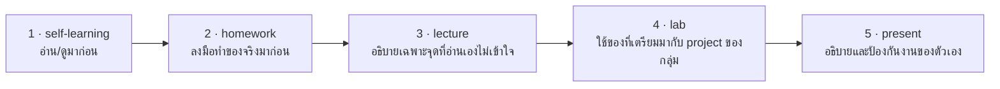

# Self-Learning: เตรียมตัวก่อนเรียนครั้งแรก

## 🎯 อ่าน/ดูจบแล้วจะได้อะไร

| สิ่งที่จะทำได้ | ใช้ในงานจริงอย่างไร |
|---|---|
| ตั้ง dev environment ให้พร้อมใช้งานได้ด้วยตัวเอง | วันแรกของงานใหม่แทบทุกที่ให้คุณ setup เครื่องเอง คนที่ทำได้เร็วเริ่มสร้างผลงานได้เร็ว |
| แยกออกว่า AI agent แต่ละแบบทำอะไรได้และทำอะไรไม่ได้ | เลือกเครื่องมือให้ตรงกับงาน แทนที่จะใช้ตัวเดียวกับทุกอย่างแล้วได้ผลไม่ดี |
| อธิบาย commit / push / branch / PR ได้ | ทุกทีมในอุตสาหกรรมทำงานผ่าน branch และ pull request — ไม่มีที่ไหนให้แก้ code บน main ตรง ๆ |
| ตอบได้ว่าตัวเองรู้ตัวช้าแค่ไหนเวลาทำผิด | เป็นคำถามที่ tech lead ใช้ประเมินสุขภาพของทีม และเป็นแกนของทั้งวิชานี้ |

---

## วัตถุประสงค์
เตรียม environment และความรู้พื้นฐานให้พร้อมก่อนเข้าห้องเรียน
อาจารย์จะไม่สอนซ้ำเนื้อหาเหล่านี้ แต่จะต่อยอดจากตรงนี้ในห้อง
ถ้าติดปัญหาตรงไหน ให้จดไว้แล้วถามในช่วงต้นคาบ

---

## สิ่งที่ต้องติดตั้ง

### 1. ติดตั้ง Tools ทั้งหมด
```bash
# ยืนยันว่าแต่ละตัวทำงานได้
node --version        # ควรได้ v22 ขึ้นไป (v24 = LTS ปัจจุบัน)
python --version      # ควรได้ 3.12 ขึ้นไป
docker --version      # ควรได้ 27 ขึ้นไป
docker compose version # ต้องเป็น Compose v2 (คำสั่งเว้นวรรค ไม่ใช่ docker-compose)
git --version         # ควรได้ 2.4x
```

- Node.js: https://nodejs.org
- Python: https://www.python.org
- Docker Desktop: https://www.docker.com/products/docker-desktop
- VS Code: https://code.visualstudio.com

> ถ้า `docker compose version` ใช้ไม่ได้แต่ `docker-compose --version` ใช้ได้
> แปลว่ายังเป็น Compose v1 ที่หมดอายุแล้ว — อัปเดต Docker Desktop ก่อน

### 2. ติดตั้ง Editor Extensions
- GitLens — ดู history ของแต่ละบรรทัด
- Docker
- Prettier (JS/TS) หรือ Ruff (Python)

### 3. เตรียม AI Coding Agent อย่างน้อย 1 ตัว
เลือกอย่างน้อยหนึ่ง แล้วทำให้มันรันได้จริงในเครื่องตัวเอง

| ประเภท | ตัวอย่าง | เหมาะกับ |
| :--- | :--- | :--- |
| **Inline completion** | GitHub Copilot ใน VS Code | เติม code ทีละบรรทัด |
| **Chat ใน editor** | Copilot Chat, Cursor | ถาม-ตอบพร้อมเห็นไฟล์ |
| **Agent ใน terminal** | Claude Code, Gemini CLI, Codex CLI | แก้หลายไฟล์ + รัน test เองได้ |

**อย่างน้อยต้องมี agent ที่รัน command ได้ 1 ตัว** เพราะครึ่งหลังของวิชา
เราจะให้ agent รัน test เองแล้วอ่านผลกลับ ซึ่ง inline completion ทำไม่ได้

### 4. สร้าง Accounts
- GitHub: https://github.com
- Vercel: https://vercel.com (sign in ด้วย GitHub)

---

## สิ่งที่ต้องศึกษา

### Git & GitHub
- [video] Git and GitHub Crash Course For Beginners — Cameron McKenzie
  (https://www.youtube.com/watch?v=l2yrJtwoC_E)
  ดู 30 นาทีแรก เน้น: clone, add, commit, push, branch, pull request

- [reading] Git Book — About Version Control
  (https://git-scm.com/book/en/v2/Getting-Started-About-Version-Control)

- [reading] Conventional Commits — รูปแบบข้อความ commit ที่เครื่องอ่านได้
  (https://www.conventionalcommits.org/en/v1.0.0/)

**จุดที่ต้องเข้าใจ:**
- clone, add, commit, push คืออะไร ต่างกันอย่างไร
- branch คืออะไร ทำไมต้องใช้
- pull request คืออะไร และทำไม PR เล็ก ๆ ถึงดีกว่า PR ใหญ่

### การทำงานกับ AI Coding Agent
- [reading] GitHub Copilot — Quickstart
  (https://docs.github.com/en/copilot/get-started/quickstart)

- [reading] AGENTS.md — ไฟล์มาตรฐานที่บอก agent ว่า repo นี้มีกติกาอะไร
  (https://agents.md/)

- [reading] Building Effective Agents — Anthropic
  (https://www.anthropic.com/engineering/building-effective-agents)
  อ่านเฉพาะหัวข้อ *Workflows vs Agents* และ *When to use agents*

- [reading] Exploring Generative AI — Birgitta Böckeler, martinfowler.com
  (https://martinfowler.com/articles/exploring-gen-ai.html)
  อ่าน memo 2–3 อันแรกก็พอ — เน้นว่าอะไรได้ผลจริงและอะไรยังไม่ได้ผล

**จุดที่ต้องเข้าใจ:**
- AI agent ทำงานเป็นวงจร (อ่าน context → เสนอ → แก้ → ตรวจ → แก้ใหม่) ไม่ใช่ตอบครั้งเดียวจบ
- ทำไม "context ที่ให้" ถึงกำหนดคุณภาพของผลลัพธ์มากกว่าคำสั่งที่พิมพ์
- AI ช่วยอะไรได้ และพลาดตรงไหนบ่อยที่สุด

---

## 🔗 เตรียมมาแล้วจะได้ใช้ตรงไหน

หน้านี้ไม่ได้จบในตัวเอง — มันคือ **input ของคาบเรียน**
อาจารย์จะไม่สอนซ้ำสิ่งที่อยู่ในหน้านี้ แต่จะเริ่มจากจุดที่หน้านี้จบ



| เตรียมมาจากหน้านี้ | ถูกใช้ต่อที่ | ถ้าไม่ได้เตรียมมา |
|---|---|---|
| เครื่องที่รัน `node` / `python` / `docker` / `git` ได้ครบ | lab ขั้นตอนที่ 2–4 — สร้าง repo, scaffold และ deploy | ต้องนั่งติดตั้งระหว่างคาบ แล้ว deploy ไม่ทันใน 1 ชั่วโมง |
| AI agent ที่ **รันคำสั่งได้เอง** 1 ตัว | lab ขั้นตอนที่ 3 — เขียน `AGENTS.md` แล้วให้ agent ใช้จริง | พิสูจน์ไม่ได้ว่า context ที่เขียนไปมีผลกับ agent จริงหรือไม่ |
| `commit` / `push` / `branch` / PR | lab ขั้นตอนที่ 2 — สร้าง `develop` branch ของกลุ่ม | ติดตั้งแต่ขั้นแรกและทำให้ทั้งกลุ่มรอ |
| GitHub และ Vercel account | lab ขั้นตอนที่ 4 — deploy ขึ้น URL จริง | ปิด Deploy Loop ไม่ได้ ซึ่งเป็นเป้าหมายเดียวของคาบนี้ |
| คำตอบของคำถาม *“กว่าจะรู้ว่าเขียนผิด ใช้เวลานานแค่ไหน”* | lecture หัวข้อ 0 — เปิดคาบด้วยคำถามนี้ทั้งห้อง | เข้าไม่ถึงแกนของทั้งวิชาตั้งแต่นาทีแรก |

---

## เช็คตัวเองก่อนเข้าห้อง

ตอบให้ได้ทุกข้อ — ไม่ต้องส่ง แต่จะถูกใช้จริงใน lab ทันที

- [ ] `node`, `python`, `docker`, `docker compose`, `git` รันได้ครบ และรู้ว่าตัวเองใช้ version อะไร
- [ ] มี AI agent ที่ **รันคำสั่งได้เอง** อย่างน้อย 1 ตัว และเคยลองใช้แล้ว
- [ ] อธิบายได้ว่า `commit` ต่างจาก `push` อย่างไร
- [ ] อธิบายได้ว่า pull request มีไว้ทำอะไร
- [ ] คิดคำตอบไว้แล้วสำหรับ: *"ครั้งล่าสุดที่เขียน code ผิด กว่าจะรู้ว่าผิดใช้เวลานานแค่ไหน"*

ข้อสุดท้ายคือคำถามที่ทั้งวิชานี้พยายามตอบ — จดคำตอบของตัวเองไว้
แล้วกลับมาเทียบอีกครั้งตอนจบ 8 สัปดาห์

**ถ้าติดปัญหาการติดตั้ง:** จด error message ไว้ แล้วยกมือถามใน 10 นาทีแรกของคาบ
อย่ารอจนถึงช่วง lab เพราะจะทำงานกับกลุ่มไม่ทัน
