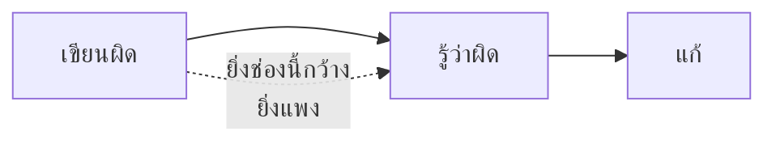
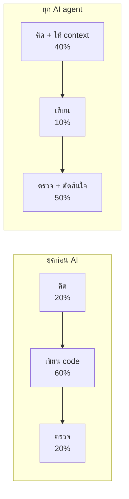
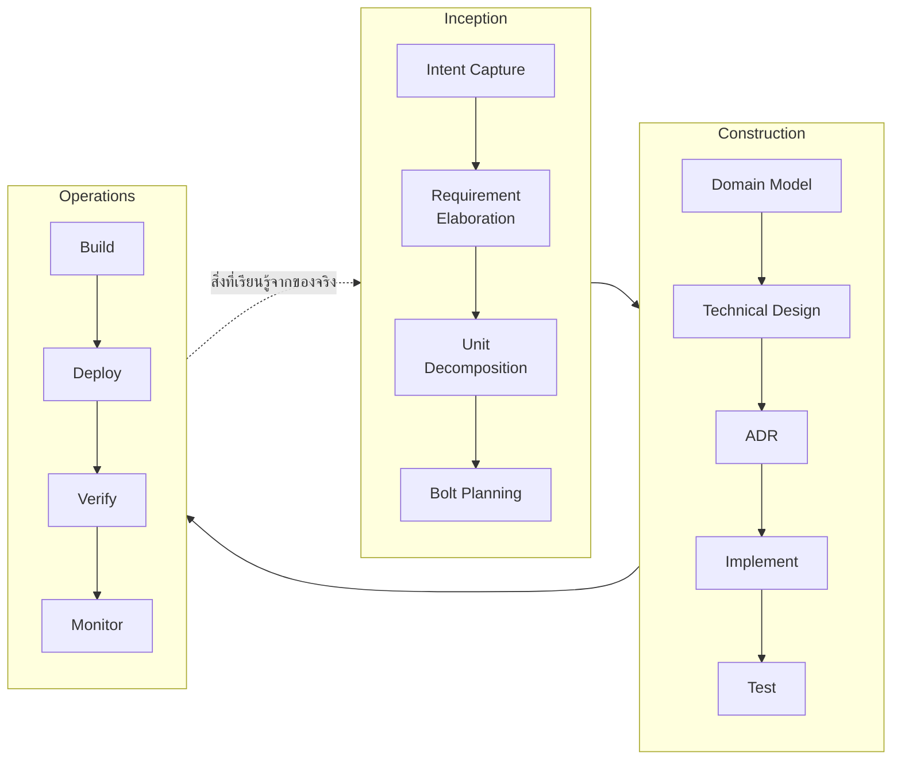
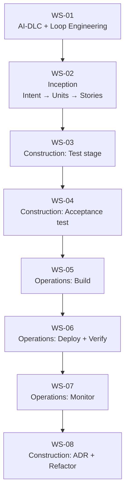
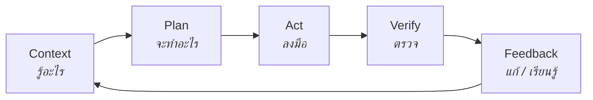
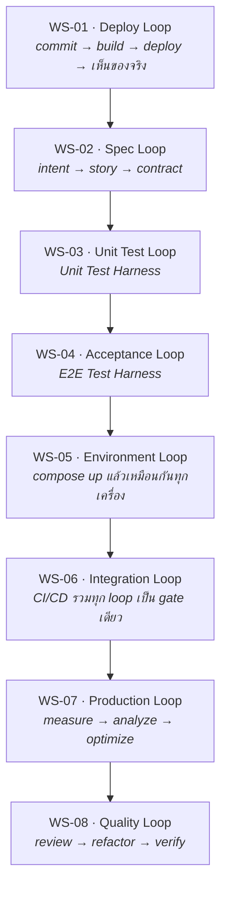
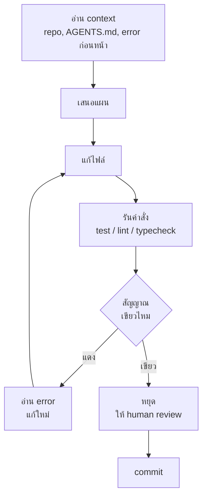
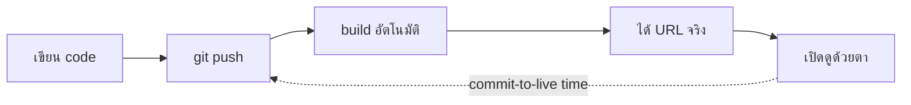
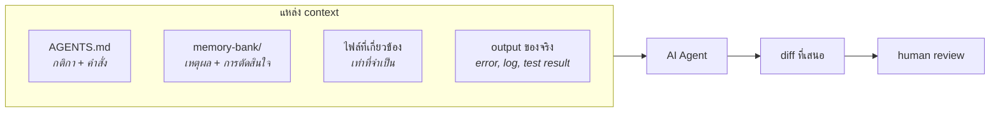
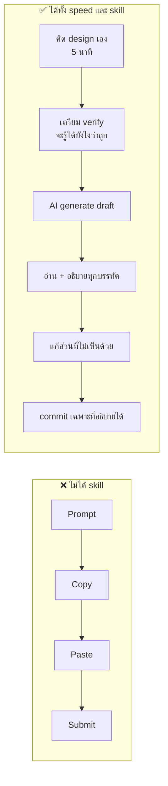

# Lecture: AI-DLC, Loop Engineering & First Deployment

**เวลารวม:** 45 นาที

*แนะนำการแบ่งเวลาสำหรับผู้สอน (หน่วย: นาที):* เปิดคาบ → 3 · หัวข้อ 1 → 12 · หัวข้อ 2 → 18 · หัวข้อ 3 → 12

## 🎯 จบคาบนี้แล้วจะทำอะไรได้

| สิ่งที่จะทำได้ | ใช้ในงานจริงอย่างไร |
|---|---|
| อธิบายได้ว่า AI-DLC ต่างจาก Agile แบบเดิมตรงไหน และคอขวดย้ายไปอยู่ที่ไหน | เข้าใจว่าทำไมองค์กรถึงเริ่มบังคับให้ PR เล็กลง และทำไมงาน review ถึงสำคัญขึ้น |
| วัด loop ด้วย latency, fidelity, coverage และบอกได้ว่าอันไหนสำคัญกว่า | ใช้ประเมินได้ทันทีว่าทีมที่เข้าไปทำงานด้วยมีระบบตรวจสอบที่เชื่อถือได้หรือไม่ |
| อธิบายได้ว่าทำไมคุณภาพของ AI agent ถูกจำกัดด้วยขั้น Verify | ตัดสินใจได้ว่าควรลงทุนเวลาไปกับอะไรก่อน เมื่อได้รับมอบหมายให้เอา AI มาใช้ในทีม |
| เขียน `AGENTS.md` ที่ทำให้ AI ทำงานตรงกับกติกาของ repo | เป็นทักษะที่หลายองค์กรเริ่มคาดหวังจากวิศวกรทุกระดับ ไม่ใช่เฉพาะ senior |

## 📖 ศัพท์ที่ต้องรู้ก่อนเริ่ม

คำที่จะโผล่ซ้ำตลอดคาบ — ถ้าติดตรงไหนให้ย้อนกลับมาดูตารางนี้

| ศัพท์ | ความหมายในบริบทของวิชานี้ |
|---|---|
| **AI-DLC** (AI-Driven Development Lifecycle) | กรอบการทำงานที่ให้ AI เป็นผู้เสนอและมนุษย์เป็นผู้ตรวจ/อนุมัติทุกขั้น แบ่งเป็น 3 phase: Inception → Construction → Operations |
| **Bolt** | หน่วยงานที่เล็กที่สุดที่ทำจนจบได้ใน AI-DLC ใช้เวลาระดับชั่วโมงถึงวัน — มาแทน Sprint 2 สัปดาห์ 1 bolt = ตั้งแต่ออกแบบจนถึง test ผ่าน |
| **Intent** | เจตนาระดับบนสุดว่าสร้างระบบนี้ไปทำไม เทียบได้กับ Epic ใน Agile |
| **Unit** (ใน AI-DLC) | ก้อน feature ที่แยกจากกันได้ เทียบได้กับ Feature — *คนละความหมาย* กับคำว่า unit ใน unit test |
| **Loop** | วงจร Context → Plan → Act → Verify → Feedback ที่วนซ้ำจนกว่าจะถูก |
| **Verify** | ขั้นตอนที่ตรวจว่าสิ่งที่เพิ่งทำไปถูกหรือผิด — เป็น test, lint, typecheck หรือแม้แต่ตาคนก็ได้ |
| **Latency / Fidelity / Coverage** | 3 ตัวชี้วัดคุณภาพของ loop: รู้ผลเร็วแค่ไหน / สัญญาณซื่อสัตย์แค่ไหน / จับความผิดพลาดได้กี่แบบ |
| **Test Harness** | โครงสร้างรอบ ๆ test ที่ทำให้ test รันซ้ำได้ผลเดิม — วิชานี้ใช้คำนี้เฉพาะ WS-03 และ WS-04 |
| **Context Engineering** | การจัดการว่าข้อมูลอะไรควรอยู่ใน context ของ AI ตอนไหน และมากแค่ไหน |
| **AGENTS.md** | ไฟล์มาตรฐานที่ root ของ repo บอก AI agent ว่า repo นี้มีคำสั่งและกติกาอะไร |
| **Staging** | สภาพแวดล้อมที่เหมือน production แต่ไม่มีผู้ใช้จริง ใช้ทดสอบก่อนปล่อยจริง |
| **Automation bias** | อคติที่คนตรวจงานน้อยลงเรื่อย ๆ เมื่อระบบอัตโนมัติตอบได้คล่องและดูน่าเชื่อถือ |

---

## ✅ ก่อนเริ่มคาบ — ต้องมีอะไรมาแล้วบ้าง

คาบนี้ต่อจาก `WS-01--before` โดยตรง และจะไม่ทวนเนื้อหาในนั้นซ้ำ
ให้ทุกคนเช็ครายการนี้กับตัวเองใน 2 นาทีแรก

- [ ] `node`, `python`, `docker`, `docker compose`, `git` รันได้ครบ
- [ ] มี AI agent ที่รันคำสั่งได้เอง 1 ตัว และเคยลองใช้แล้ว
- [ ] มี GitHub และ Vercel account พร้อมใช้
- [ ] ทำ fizzbuzz loop จาก homework แล้ว และมีตัวเลขจำนวนรอบใน `LOOP_NOTES.md`
- [ ] มีคำตอบของตัวเองสำหรับคำถาม *“กว่าจะรู้ว่าเขียนผิด ใช้เวลานานแค่ไหน”*

> ข้อไหนยังไม่ครบ **ให้ยกมือบอกตอนนี้** ไม่ใช่ตอนเข้า lab —
> ของที่ขาดจะถูกจัดคู่ให้เพื่อนช่วยระหว่างที่ lecture เดินหน้าต่อ

---

## 0. เปิดคาบ: คำถามเดียวที่ทั้งวิชานี้พยายามตอบ

ถามทั้งห้อง แล้วให้ยกมือ:

> **"ครั้งล่าสุดที่คุณเขียน code ผิด — กว่าจะรู้ว่าผิด ใช้เวลานานแค่ไหน"**

- ยกมือถ้าตอบว่า "ไม่กี่วินาที เพราะ editor ขีดแดง"
- ยกมือถ้าตอบว่า "ตอนกด run แล้วมัน error"
- ยกมือถ้าตอบว่า "ตอนเพื่อนในกลุ่มมาบอกว่าพัง"
- ยกมือถ้าตอบว่า "ตอนอาจารย์ตรวจ / ตอนลูกค้าโทรมา"

ช่องว่างระหว่างมือแรกกับมือสุดท้ายคือ **ต้นทุนที่แท้จริงของงานพัฒนาซอฟต์แวร์**
และเป็นสิ่งเดียวที่ทั้ง 8 สัปดาห์นี้พยายามลด



> 💼 **จากหน้างานจริง**
> ในอุตสาหกรรมมีกฎที่รู้กันมานาน: ต้นทุนของการแก้ bug เพิ่มขึ้นแบบทวีคูณตามระยะที่มันหลุดไป —
> จับได้ตอนเขียน = ฟรี, จับได้ตอน code review = ถูก, จับได้ตอน QA = แพง,
> จับได้ตอนลูกค้าเจอ = แพงมากและเสียความน่าเชื่อถือด้วย
> วิศวกรที่เก่งไม่ได้เขียนผิดน้อยกว่าคนอื่น — เขาแค่ **รู้เร็วกว่า**

---

## 1. AI-Driven Development Lifecycle

### ทำไม Traditional Agile ไม่พอในยุค AI

Agile ถูกออกแบบมาสำหรับ human-driven, week-long iterations จึงมี "whitespace" —
จุดที่ methodology ไม่ได้ define ชัดเจน แล้วปล่อยให้ทีมเติมเอง ผลคือ:

- Inconsistent architecture decisions ระหว่าง sprint
- Missing design documentation
- Context loss เมื่อ team member เปลี่ยน
- Quality issues จาก steps ที่ถูก skip เมื่อมี deadline

พอ AI เขียน code ได้ในหลักนาที **ต้นทุนของการ "ลงมือทำ" ลดลงมหาศาล**
แต่ต้นทุนของการ **ตัดสินใจผิดแล้วไม่รู้ตัว** เท่าเดิมหรือแพงขึ้น



คอขวดย้ายจาก "เขียนไม่ทัน" ไปเป็น **"ตรวจไม่ทัน"**
unit of work จึงย่อจาก **Sprint (2 สัปดาห์)** → **Bolt (ชั่วโมงหรือวัน)**
เพื่อให้แต่ละก้อนเล็กพอที่คนจะตรวจไหว

> 💼 **จากหน้างานจริง**
> หลายทีมที่เพิ่งรับ AI เข้ามาเจอปัญหาเดียวกัน: จำนวน PR พุ่งขึ้นเท่าตัว
> แต่ความเร็วในการส่งของ **ไม่ได้เพิ่มตาม** เพราะ PR ไปกองรออยู่ที่ reviewer
> ทีมที่แก้ได้คือทีมที่ทำ 2 อย่าง — บังคับให้ PR เล็กลง และย้ายการตรวจส่วนที่เครื่องตรวจได้
> ไปให้ CI ทำแทน เหลือให้คนตรวจเฉพาะเรื่องที่ต้องใช้วิจารณญาณ

### Core Insight: AI Proposes, Human Validates

> เหมือน Google Maps — AI วาง route ให้ทุก step แต่คนขับเป็นคนตัดสินใจว่าจะไปทางไหน
> มีสิทธิ์เบี่ยงเส้นทางได้เสมอ และเป็นคนรับผิดชอบเมื่อไปผิดที่

### 3 Phases ของ AI-DLC



| Phase | AI ทำอะไร | Human ทำอะไร |
|---|---|---|
| **Inception** | propose requirements, decompose units | validate, push back, approve |
| **Construction** | generate code, tests, ADR drafts | review, approve each stage |
| **Operations** | generate configs, runbooks | verify, monitor |

### Map กับ Course นี้



---

## 2. Loop Engineering

### นิยาม

> **Loop Engineering** = การออกแบบวงจร feedback ให้ **สั้น เชื่อถือได้ และรันซ้ำได้**
> เพื่อให้ทั้งมนุษย์และ AI agent รู้ให้เร็วที่สุดว่าสิ่งที่เพิ่งทำไปนั้นถูกหรือผิด



ทุกอย่างในวิชานี้ — test, Docker, CI/CD, k6, code review — คือความพยายามทำให้
ขั้น **Verify** เร็วขึ้น จริงขึ้น และครอบคลุมขึ้น

### วัด Loop ด้วย 3 ตัวเลข

| คุณสมบัติ | คำถาม | ตัวอย่างที่แย่ | ตัวอย่างที่ดี |
|---|---|---|---|
| **Latency** | กว่าจะรู้ผลใช้เวลาเท่าไร | รอ user แจ้ง bug 3 วันให้หลัง | unit test เขียว/แดงใน 2 วินาที |
| **Fidelity** | signal บอกความจริงแค่ไหน | test ที่ผ่านตลอดไม่ว่า code จะพังแค่ไหน | test ที่แดงทันทีเมื่อลบ business rule |
| **Coverage** | จับความผิดพลาดได้กี่แบบ | ตรวจแค่ happy path | ตรวจ error case + integration + performance |

**ข้อควรระวัง — Fidelity สำคัญกว่า Latency:**

|  | **signal ซื่อสัตย์** | **signal โกหก** |
|---|---|---|
| **เร็ว** | ✅ เป้าหมายของวิชานี้ — unit test ที่ดี | ⛔ **อันตรายที่สุด** — flaky test, test ที่เขียวตลอด |
| **ช้า** | 🟡 ยังพอไหว — manual QA, E2E ที่ดี | ⬜ เท่ากับไม่มี loop |

มุมขวาล่างอันตรายกว่ามุมซ้ายล่าง เพราะ **loop ที่เร็วแต่โกหกทำให้เรา (และ AI) มั่นใจผิด**
ไม่มี loop เลยยังรู้ตัวว่าไม่รู้ — แต่ loop ที่โกหกทำให้เชื่อว่ารู้แล้ว

> 💼 **จากหน้างานจริง**
> อาการที่บอกว่าทีมกำลังตายเพราะ fidelity: ประโยคที่ว่า *"อ๋อ อันนั้นมันแดงประจำ กด re-run เถอะ"*
> วันที่ทีมเริ่มพูดประโยคนี้ คือวันที่ test suite ทั้งชุดหมดค่าลง —
> เพราะเมื่อคนเลิกเชื่อสัญญาณ สัญญาณจริงก็จะถูกมองข้ามไปด้วย
> ทีมที่ดูแลเรื่องนี้จริงจังจะถือว่า flaky test คือ **bug ระดับ production** ต้องแก้หรือลบทันที

### Loop ทั้ง 8 ชั้นที่จะสร้างในวิชานี้



> **คำศัพท์:** *Test Harness* เป็นคำเฉพาะของฝั่ง testing — หมายถึงโครงสร้างรอบ test
> (test doubles, fixtures, factories, seed data, page objects) ที่ทำให้ test รันซ้ำได้ผลเดิม
> ในวิชานี้ใช้คำนี้เฉพาะ WS-03 และ WS-04 ส่วนสัปดาห์อื่นเราเรียกว่า *loop*

### ทำไม Loop ถึงสำคัญกว่าเดิมมากในยุค AI

AI coding agent **ทำงานเป็น loop อยู่แล้ว** ทุกตัว:



จากตรงนี้จะเห็นข้อสรุปที่เป็นหัวใจของทั้งวิชา:

> **ความสามารถของ AI agent ถูกจำกัดด้วยคุณภาพของกล่อง "รันคำสั่ง" ที่เราสร้างให้มัน**

| สิ่งที่เราให้ agent | ผลที่เกิด |
|---|---|
| ไม่มี test เลย | agent ไม่มีทางรู้ว่าทำพัง — จะรายงานว่า "เสร็จแล้ว" ทุกครั้ง |
| test อ่อน (fidelity ต่ำ) | agent จะวนแก้จนเขียว ซึ่งบางทีแปลว่าไปแก้ test ไม่ใช่แก้ code |
| test ช้า | agent วนได้น้อยรอบต่อเวลา คุณภาพตกตาม |
| test เร็ว + ซื่อสัตย์ | agent แก้เองได้หลายรอบ แล้วส่งของที่ผ่านการตรวจจริงมาให้เรา |

จาก homework: คนที่ให้ agent รัน `pytest` ได้เอง ใช้รอบน้อยกว่าและได้ code ที่ถูกกว่า
คนที่ต้อง copy error ไปวางเอง — เพราะ loop ของสองกลุ่มนี้ latency ต่างกันสิบเท่า

> 💼 **จากหน้างานจริง**
> นี่คือเหตุผลที่ทีมซึ่งลงทุนกับ test มานานหลายปี ได้ประโยชน์จาก AI มากกว่าทีมที่ไม่มี test
> — ไม่ใช่เพราะเขาใช้ AI เก่งกว่า แต่เพราะ **codebase ของเขาบอกความจริงได้เร็วกว่า**
> ทีมที่ไม่มี test แล้วเร่งใช้ AI มักได้ code เยอะขึ้นและหนี้ทางเทคนิคเยอะขึ้นพร้อมกัน

### กติกาที่ตามมา 3 ข้อ

1. **สร้าง Verify ก่อนเร่ง Act** — อย่าเพิ่งให้ AI เขียน 500 บรรทัด ถ้ายังไม่มีอะไรตรวจได้
2. **ปิด loop ให้ครบก่อนขยาย** — ทำ commit → deploy → เห็นผลให้ได้ก่อน แล้วค่อยเพิ่ม feature
3. **Human checkpoint คือส่วนหนึ่งของ loop ไม่ใช่ส่วนเกิน** — agent หยุดให้คนดูตรงไหน คือสิ่งที่เราออกแบบ

### Deploy Loop ของวันนี้



เป้าหมายของ lab: ทำให้ loop นี้ **ปิดครบและวัดเวลาได้** ก่อนออกจากห้อง
ตัวเลขที่จะจดคือ *commit-to-live time* — จาก push ถึงเห็นของบน URL ใช้เวลากี่นาที

สังเกตว่าตอนนี้ขั้น Verify ของเรายังเป็น **"เปิดดูด้วยตา"** ซึ่ง latency สูง fidelity ต่ำ
สัปดาห์ต่อ ๆ ไปเราจะแทนที่ตาคนด้วยเครื่อง ทีละชั้น โดยพยายามไม่ให้เวลารวมบานปลาย

> 💼 **จากหน้างานจริง**
> วัฒนธรรมที่แพร่หลายในอุตสาหกรรมคือ **"deploy บ่อย ๆ ทีละนิด"** ไม่ใช่ "สะสมไว้แล้วปล่อยทีเดียว"
> เหตุผลไม่ใช่เรื่องความเร็ว แต่เป็นเรื่องความเสี่ยง: ถ้า deploy มีของ 3 อย่าง แล้วพัง
> คุณรู้ทันทีว่าปัญหาอยู่ใน 3 อย่างนั้น แต่ถ้าสะสมไว้ 300 อย่าง คุณจะหาไม่เจอ
> ทีมระดับสูงหลายแห่งยัง **แยก deploy ออกจาก release** ด้วย feature flag — code ขึ้น production แล้ว
> แต่ยังปิดอยู่ เปิดให้ผู้ใช้ทีหลังเมื่อพร้อม ทำให้การ deploy กลายเป็นเรื่องน่าเบื่อ ซึ่งเป็นเรื่องดี

---

## 3. Context Engineering, Ethics & Skills

### จาก Prompt Engineering สู่ Context Engineering

การเขียน prompt เก่ง ๆ ช่วยได้ แต่ผลลัพธ์ถูกกำหนดโดย **สิ่งที่อยู่ใน context window ณ ตอนนั้น**
มากกว่าถ้อยคำที่พิมพ์เข้าไป

> **Context Engineering** = การจัดการว่า *ข้อมูลอะไร* ควรอยู่ใน context ของ AI
> *ตอนไหน* และ *มากแค่ไหน* เพื่อให้มันตัดสินใจได้ถูก



| หลัก | ความหมาย | ในวิชานี้คือ |
|---|---|---|
| **เขียนไว้ให้อ่านซ้ำได้** | อย่าเล่าเรื่องเดิมทุก session | `AGENTS.md`, `memory-bank/` |
| **ให้เท่าที่จำเป็น** | context ยาวเกินทำให้ AI หลงประเด็น | ชี้ไฟล์ที่เกี่ยว ไม่ใช่ทั้ง repo |
| **ให้ของจริง ไม่ใช่คำบรรยาย** | error log จริงดีกว่าคำว่า "มันพัง" | วาง output ของ test ตรง ๆ |
| **ตัดของเก่าที่ไม่จริงแล้ว** | context ที่ล้าสมัยทำให้ AI มั่นใจผิด | อัปเดต ADR/spec เมื่อเปลี่ยนใจ |

### AGENTS.md — Context ระดับ Repo

`AGENTS.md` เป็นไฟล์มาตรฐาน (agents.md) ที่วางไว้ที่ root ของ repo
agent ส่วนใหญ่จะอ่านให้อัตโนมัติ — เหมือน README แต่เขียนให้เครื่องอ่าน

```markdown
# AGENTS.md

## Project

ระบบจองห้องเรียนสำหรับนักศึกษา — ดู memory-bank/intent.md

## Commands

- install: `npm ci`
- dev: `npm run dev`
- test: `npm test`          ← ต้องเขียวก่อนเสนอ diff เสมอ
- lint: `npm run lint`

## Conventions

- TypeScript strict mode ห้ามใช้ `any`
- ใช้ `data-testid` สำหรับ element ที่ E2E ต้องอ้างถึง
- Commit ตาม Conventional Commits

## Rules

- ห้ามแก้ไฟล์ใน `docs/adr/` โดยไม่ถามก่อน
- ห้ามใส่ค่า secret ลงในไฟล์ใด ๆ ให้ใช้ env var เท่านั้น
- ถ้า test แดง ให้แก้ code ห้ามแก้ test เพื่อให้ผ่าน
```

> บรรทัดสุดท้ายสำคัญที่สุด — มันคือการป้องกัน agent จาก "ทางลัด" ที่ทำลาย fidelity ของ loop

> 💼 **จากหน้างานจริง**
> `AGENTS.md` ที่ดีมีลักษณะเหมือน **เอกสารรับน้องใหม่** ของทีม: บอกคำสั่งที่ใช้จริง
> บอกกติกาที่ถ้าไม่รู้จะทำผิด และบอกสิ่งที่ห้ามแตะ
> ทีมที่ทำเรื่องนี้ได้ดีมักค้นพบผลข้างเคียงที่ดี — เอกสารที่เขียนให้ AI อ่าน
> กลายเป็นเอกสารที่ **คนใหม่ในทีมอ่านแล้วเข้าใจงานได้เร็วขึ้นด้วย**
> ถ้าไฟล์นี้ล้าสมัย มันจะทำร้ายทั้งคนและ AI พร้อมกัน จึงต้องอัปเดตเหมือน code

### AI Ethics: เส้นแบ่งที่ต้องรู้

**ใช้ได้:**
- Scaffold boilerplate และ repetitive code
- อธิบาย error messages และช่วย debug
- เสนอ implementation approaches หลาย ๆ ทางให้เลือก
- Generate test cases และ documentation
- Draft artifacts ใน memory-bank

**ต้องระวัง:**
- อย่า commit code ที่อ่านไม่ออก — ถ้าอธิบายไม่ได้ ให้อ่านก่อนเสมอ
- อย่าส่ง API keys, passwords, personal data เข้า AI tools
- AI hallucinate API ที่ไม่มีจริงได้ — verify กับ official docs เสมอ
- AI-generated code มี security vulnerabilities ได้ — ต้อง review
- ระวัง **automation bias**: ยิ่ง AI ตอบคล่องเท่าไร คนยิ่งตรวจน้อยลงเท่านั้น

**กฎทองของ course นี้:**
> "ถ้า oral defense ถามแล้วตอบไม่ได้ว่า code ทำอะไร — นั่นคือ code ที่ไม่ควร commit"

> 💼 **จากหน้างานจริง**
> ในองค์กรจริง คนที่กด merge คือคนที่ **รับผิดชอบ** code นั้น ไม่ว่าใครหรืออะไรจะเป็นคนเขียน
> ข้ออ้างว่า "AI เขียนมา" ไม่มีอยู่จริงในรายงาน incident
> หลายบริษัทมีนโยบายชัดเจนว่า AI-generated code ต้องผ่าน review เหมือน code จากคน
> และห้ามวาง source code หรือข้อมูลลูกค้าลงในเครื่องมือที่ไม่ได้รับอนุมัติ — ผิดข้อนี้คือเรื่องวินัย ไม่ใช่แค่เรื่องเทคนิค

### Skills ที่ AI ทำแทนไม่ได้

| Skill | ทำไมสำคัญ |
|---|---|
| **Reading & explaining code** | oral defense วัดทักษะนี้โดยตรง |
| **Debugging systematically** | AI เสนอ fix ได้ แต่ไม่รู้ context จริงของระบบ |
| **Context engineering** | output ของ AI ดีแค่ไหนขึ้นกับ context ที่เราจัดให้ |
| **Designing the verify step** | ตัดสินใจว่าอะไรคือหลักฐานว่า "ถูก" — AI ตัดสินแทนไม่ได้ |
| **AI output verification** | AI ผิดได้ — ต้องรู้ว่าผิดตรงไหนและทำไม |
| **System thinking** | เข้าใจว่า components เชื่อมกันอย่างไร |
| **Technical communication** | present และ defend การตัดสินใจได้ |

### วิธีใช้ AI ให้ได้ทั้ง Speed และ Skill



---

## Key Takeaways

- คำถามหลักของวิชานี้: *"กว่าจะรู้ว่าผิด ใช้เวลานานแค่ไหน และเชื่อสัญญาณนั้นได้แค่ไหน"*
- AI-DLC: AI proposes → human validates ทุก checkpoint — คอขวดย้ายจาก "เขียน" ไป "ตรวจ"
- Loop Engineering วัดที่ latency, fidelity, coverage — และ **fidelity สำคัญกว่า latency**
- ความสามารถของ AI agent ถูกจำกัดด้วยคุณภาพของขั้น Verify ที่เราสร้างให้มัน
- Context Engineering (`AGENTS.md`, memory-bank) สำคัญกว่าการเขียน prompt สวย ๆ
- คนที่กด merge คือคนที่รับผิดชอบ ไม่ว่าใครจะเป็นคนเขียน
