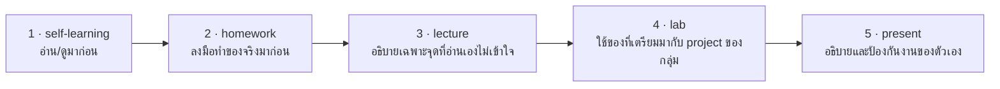
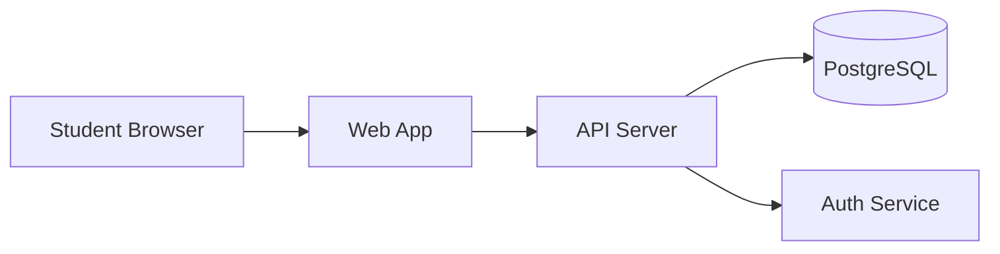

# Self-Learning: เตรียมก่อนเรียน Requirements & API Design

## 🎯 อ่าน/ดูจบแล้วจะได้อะไร

| สิ่งที่จะทำได้ | ใช้ในงานจริงอย่างไร |
|---|---|
| เลือก HTTP method และ status code ให้ตรงความหมาย | API ที่ใช้ status code มั่วทำให้ทีม frontend ต้องเขียน workaround และ bug จะซ่อนอยู่นาน |
| เขียน user story พร้อม acceptance criteria แบบ Given/When/Then | เป็นรูปแบบที่ทีม Agile ทั่วโลกใช้เขียน backlog และใช้เป็นฐานของ test |
| อ่าน OpenAPI spec รู้เรื่อง | API ขององค์กรส่วนใหญ่มี spec เป็นเอกสารกลาง — อ่านไม่ออกแปลว่าทำงานร่วมกับทีมอื่นไม่ได้ |
| เข้าใจว่าทำไม spec ที่ชัดทำให้ AI ทำงานได้ตรงกว่า prompt ยาว ๆ | ทักษะ context engineering ที่ใช้ได้กับ AI ทุกยี่ห้อ ไม่ผูกกับเครื่องมือใดเครื่องมือหนึ่ง |

---

## สิ่งที่ต้องศึกษา

### REST API Design
- [video] What is a REST API? — IBM Technology (~9 นาที)
  (https://www.youtube.com/watch?v=lsMQRaeKNDk)
- [reading] RESTful API Design Guidelines (https://restfulapi.net/)
- [reading] OpenAPI 3 Specification — Basic Structure
  (https://swagger.io/docs/specification/v3_0/about/)

**จุดที่ต้องเข้าใจ:**
- HTTP methods: GET POST PUT PATCH DELETE ใช้เมื่อไหร่
- HTTP status codes: 200, 201, 400, 401, 403, 404, 409, 422, 500
- Resource naming: `/users` vs `/getUsers`
- Request body vs Query parameters
- Idempotency: ทำไม PUT/DELETE ซ้ำได้แต่ POST ซ้ำไม่ได้

### Scrum & User Stories
- [video] Scrum Essentials in Under 10 Minutes — Scrum Alliance
  (https://www.youtube.com/watch?v=RtQ3tpq-RuE)
- [reading] The Scrum Guide 2020 (https://scrumguides.org/scrum-guide.html) — อ่านเฉพาะ Scrum Team และ Events
- [reading] Writing Good User Stories — Atlassian
  (https://www.atlassian.com/agile/project-management/user-stories)

**จุดที่ต้องเข้าใจ:**
- User story format: As a... I want... So that...
- Acceptance criteria: Given/When/Then
- Definition of Done คืออะไร

### Spec เป็น Context ให้ AI
- [reading] Effective Context Engineering for AI Agents — Anthropic
  (https://www.anthropic.com/engineering/effective-context-engineering-for-ai-agents)
  อ่านหัวข้อ *What is context engineering* และ *Right altitude* ก็พอ

**จุดที่ต้องเข้าใจ:**
- ทำไม spec ที่เขียนชัดถึงทำให้ AI generate code ได้ตรงกว่า prompt ยาว ๆ
- ทำไม context ที่ล้าสมัยอันตรายกว่าไม่มี context

---

## 🔗 เตรียมมาแล้วจะได้ใช้ตรงไหน

หน้านี้ไม่ได้จบในตัวเอง — มันคือ **input ของคาบเรียน**
อาจารย์จะไม่สอนซ้ำสิ่งที่อยู่ในหน้านี้ แต่จะเริ่มจากจุดที่หน้านี้จบ



| เตรียมมาจากหน้านี้ | ถูกใช้ต่อที่ | ถ้าไม่ได้เตรียมมา |
|---|---|---|
| หลัก REST, resource naming และ status code | lecture หัวข้อ 3 และ lab ขั้นตอนที่ 3 — เขียน `openapi.yaml` | ออกแบบ endpoint ผิดหลัก แล้วต้องรื้อ contract ทั้งชุดในสัปดาห์ถัดไป |
| รูปแบบ user story และ acceptance criteria | lecture หัวข้อ 2 และ lab ขั้นตอนที่ 1 — ทำ product backlog | เขียน AC ที่ทดสอบไม่ได้ ซึ่งจะไปพังตอนเขียน test ใน WS-03 และ WS-04 |
| แนวคิด spec เป็น context ให้ AI | lecture หัวข้อ 1 — Spec Loop | ยังใช้ AI แบบสั่งทีละคำสั่ง แทนที่จะให้มันอ่าน spec แล้วทำงานต่อเอง |
| component diagram ที่ลองวาดมาตอนวอร์มอัพ | lab ขั้นตอนที่ 2 — ขัดเกลาให้เป็นของจริงของกลุ่ม | ต้องเริ่มจากกระดาษเปล่าในห้อง เสียเวลาไปกับสิ่งที่ทำมาก่อนได้ |

---

## เช็คตัวเองก่อนเข้าห้อง

- [ ] บอกได้ว่า `POST` ควรตอบ status อะไร และต่างจาก `PUT` อย่างไร
- [ ] แยกออกว่าเมื่อไรใช้ `400` เมื่อไรใช้ `422` เมื่อไรใช้ `409`
- [ ] เขียน user story 1 อันในรูปแบบ As a / I want / So that ได้
- [ ] เขียน acceptance criteria แบบ Given / When / Then ได้
- [ ] **ลองวาด component diagram คร่าว ๆ ของ project ตัวเองไว้** — จะได้ใช้ต่อทันทีใน lab

### วอร์มอัพ: ลองวาด Component Diagram
วาดด้วย Mermaid ในไฟล์ `.md` บน GitHub (https://mermaid.js.org/)
GitHub จะ render ให้เอง — diagram จึงอยู่ใน git และ AI อ่านเป็น text ได้
(ถ้าถนัดวาดมือ ใช้ Excalidraw https://excalidraw.com ก็ได้)

ตัวอย่างที่ใช้เป็นจุดตั้งต้นได้เลย:
````markdown

````
