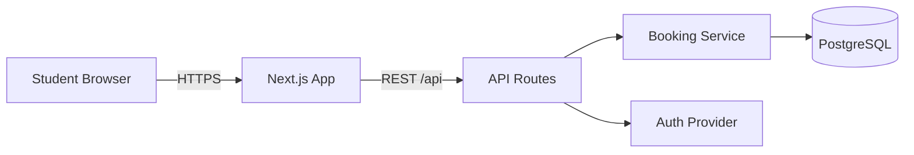
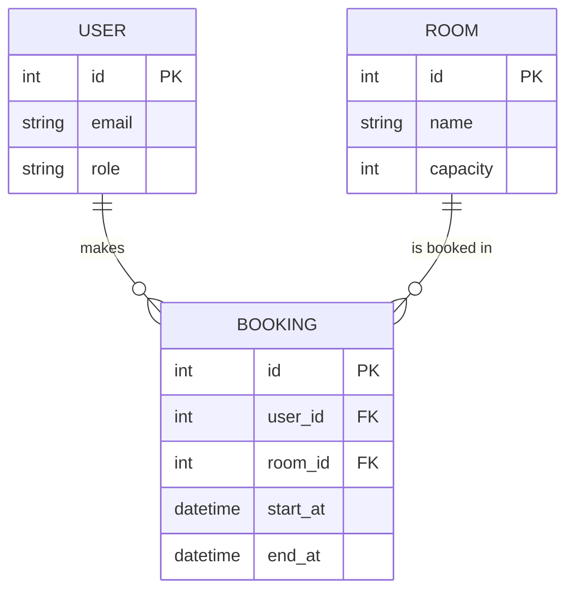

# Lab: Requirements & API Design

## เวลา: 1.5 ชั่วโมง
## เป้าหมาย
ปิด Spec Loop ให้ครบ: intent → stories + AC → architecture → OpenAPI contract ที่ validate ผ่าน

## 🎯 ทำ lab นี้แล้วได้ทักษะอะไร

| สิ่งที่จะทำได้ | ใช้ในงานจริงอย่างไร |
|---|---|
| แปลง requirement เป็น backlog ที่ตรวจสอบได้ | เป็นงานประจำของทุกคนในทีม ไม่ใช่แค่ Product Owner |
| เขียน OpenAPI spec ที่ validate ผ่านและ trace กลับหา story ได้ | ป้องกัน endpoint ที่ไม่มีใครต้องการ ซึ่งเป็น scope creep รูปแบบที่พบบ่อยที่สุด |
| คัดกรองข้อเสนอของ AI ว่าอันไหนรับ อันไหนไม่รับ พร้อมเหตุผล | ทักษะที่แยกคนใช้ AI เป็น ออกจากคนที่แค่ copy คำตอบ |
| บันทึกเจตนาและขอบเขตไว้ใน `intent.md` และ `unit-brief.md` | เมื่อทีมโตขึ้นหรือคนเปลี่ยน เอกสารเหล่านี้คือสิ่งเดียวที่บอกได้ว่าทำไมระบบถึงเป็นแบบนี้ |

---

## 📦 ของที่ต้องมีอยู่แล้วก่อนเริ่ม lab

lab นี้ **ไม่เริ่มจากศูนย์** — มันต่อยอดจากงานใน `WS-02--before` ทันที
ถ้าแถวไหนยังว่าง ให้จัดการแถวนั้นก่อนเป็นอย่างแรก แล้วค่อยไล่ขั้นตอนตามปกติ

| ต้องมี | จะถูกใช้ที่ | ถ้ายังไม่มี |
|---|---|---|
| testing framework ที่รันได้ + คำสั่ง test ใน `AGENTS.md` | เป็นเงื่อนไขใน Definition of Done ที่เขียนใน lab ขั้นตอนที่ 1 และใช้เต็มรูปแบบใน WS-03 | เขียน DoD ที่บังคับใช้ไม่ได้จริง |
| component diagram ฉบับร่าง | lab ขั้นตอนที่ 2 — ขัดเกลาเป็น diagram ที่เข้า repo | ใช้เวลา 20 นาทีของ lab ไปกับการเริ่มวาดใหม่ |
| รายการคำถามที่ spec ยังตอบไม่ได้ | lab ขั้นตอนที่ 1 — ใช้ปิดช่องว่างของ requirement ก่อนเขียน AC | เขียน backlog บนสมมติฐานที่ยังไม่มีใครยืนยัน |

**แผนสำรองเมื่อของไม่ครบ:** จับคู่กับเพื่อนที่ทำมาแล้ว ใช้เครื่องของเขาเดินต่อ
แล้วตามเก็บงานของตัวเองหลังคาบ — สิ่งที่ห้ามทำคือให้ทั้งกลุ่มหยุดรอคนเดียว

---

## ขั้นตอนที่ 1 — Product Backlog (25 นาที)

### สร้าง GitHub Issues เป็น Backlog
1. ไปที่ repo > Issues > Labels
2. สร้าง labels: `user-story`, `bug`, `enhancement`, `tech-debt`
3. ไปที่ Projects > New Project > Board

### เขียน User Stories ≥ 8 items

ใช้ template นี้สำหรับแต่ละ issue:
```markdown
## User Story
As a [role], I want to [action], so that [benefit].

## Acceptance Criteria
- Given [context], when [action], then [outcome].
- Given [context], when [action], then [outcome].

## Definition of Done
- [ ] Feature ทำงานได้ตาม acceptance criteria
- [ ] มี unit test ครอบคลุม business rule ของ story นี้
- [ ] มี E2E test สำหรับ AC อย่างน้อย 1 ข้อ (จะทำจริงใน WS-04)
- [ ] Code ผ่าน review จากสมาชิกในกลุ่ม
- [ ] Deploy ขึ้น staging แล้วเปิดใช้ได้จริง
```

### ใช้ AI หา Edge Cases (ไม่ใช่ให้ AI เขียน story แทน)
เขียน stories เองก่อน แล้วค่อยถาม:
```
Here are my user stories for [domain]:
[วาง stories]

What edge cases, error scenarios, or missing requirements
should I consider? List at least 5 specific cases.
For each, tell me what could go wrong in production if I ignore it.
```

Review ทุก suggestion แล้วแบ่งเป็น 3 กอง:
- **รับ** → สร้าง issue เพิ่ม
- **ไม่รับ** → เขียนเหตุผลสั้น ๆ ไว้ใน issue เดิม
- **ยังไม่ตัดสิน** → ใส่ label `tech-debt` ไว้ก่อน

> ข้อสำคัญ: กอง "ไม่รับ" คือส่วนที่แสดงว่าคุณคิดเอง ไม่ใช่รับทุกอย่างที่ AI พูด
> ตอน present จะถูกถามเรื่องนี้

---

## ขั้นตอนที่ 2 — Architecture Diagrams (20 นาที)

### Component Diagram
เขียนด้วย Mermaid ในไฟล์ `docs/architecture.md` — GitHub render ให้เอง
ข้อดีคือ diagram อยู่ใน git diff ได้ และ AI อ่านเป็น text ได้

````markdown

````

ต้องมีอย่างน้อย:
- Browser (Frontend)
- API Server (Backend)
- Database
- Auth
- ลูกศรพร้อม label ว่า protocol อะไร / เรียกอะไร

> ถ้าถนัดวาดด้วยมือ ใช้ [Excalidraw](https://excalidraw.com) แล้ว export PNG ไปที่
> `docs/architecture.png` ก็ได้ แต่ Mermaid จะมีประโยชน์กว่าเพราะ AI อ่านได้

### ER Diagram
เขียนด้วย Mermaid `erDiagram` ในไฟล์ `docs/erd.md`
หรือใช้ [dbdiagram.io](https://dbdiagram.io) แล้ว export PNG ไปที่ `docs/erd.png`

````markdown

````

แต่ละ entity ต้องมี: attributes สำคัญ, primary key, relationships พร้อม cardinality (1:1, 1:N, N:M)

---

## ขั้นตอนที่ 3 — OpenAPI Specification (35 นาที)

### สร้างไฟล์ `docs/openapi.yaml`

**Step 1:** ให้ AI ร่าง โดย**ป้อน spec ที่เขียนเองเป็น context** ไม่ใช่บรรยายลอย ๆ
```
Read docs/architecture.md, docs/erd.md, and the user stories below.

[วาง user stories + acceptance criteria]

Generate an OpenAPI 3.1 spec covering exactly these stories — do not invent
endpoints that no story asks for.
Include:
- Proper HTTP methods and status codes (201 for create, 409 for conflicts)
- Request body and response schemas with `required` fields
- Error responses (400, 401, 403, 404, 409, 422) with a consistent error shape
- A bearer-token security scheme applied to all protected endpoints
```

**Step 2:** Validate — นี่คือขั้น Verify ของ Spec Loop
```bash
# วิธีที่เร็วที่สุด: รันบรรทัดเดียว ไม่ต้องติดตั้งอะไร
npx @redocly/cli lint docs/openapi.yaml
```
หรือวางลง [Swagger Editor](https://editor.swagger.io) — ต้องไม่มี error

**Step 3:** Review ทุก endpoint ด้วย checklist:
- [ ] ทุก endpoint สืบกลับไปหา user story ได้ (ไม่มี endpoint ที่ AI คิดขึ้นเอง)
- [ ] ทุก user story มี endpoint รองรับครบ
- [ ] HTTP method ถูกต้อง — POST ตอบ 201 พร้อม body ของ resource ที่สร้าง
- [ ] Error responses มีครบ ไม่ใช่แค่ success case
- [ ] Request body schema มี `required` ครบทุก field ที่ขาดไม่ได้
- [ ] Authentication requirement ระบุแล้ว
- [ ] Error response ใช้รูปแบบเดียวกันทั้งไฟล์

**Step 4:** แต่ละคนในกลุ่มเลือก 1 endpoint และอธิบายให้เพื่อนฟังก่อนจบ lab
รวมถึงตอบให้ได้ว่า "ถ้า client ส่ง request ที่ผิดแบบไหน จะได้ status อะไร"

---

## ขั้นตอนที่ 4 — Sprint Planning (10 นาที)

ตั้ง GitHub Project board:
- **To Do** — stories ที่ยังไม่ได้ทำ
- **In Progress** — กำลังทำ
- **Done** — เสร็จแล้วตาม Definition of Done

เลือก stories สำหรับ Sprint 1 และ assign ให้สมาชิก
เลือกให้ **story แรกเล็กที่สุดเท่าที่จะทำได้** — เป้าหมายคือปิด loop ทั้งวง ไม่ใช่ทำ feature ใหญ่

---

## Artifacts ที่ต้องส่ง

| Artifact | รายละเอียด | ที่ส่ง |
|---|---|---|
| GitHub Issues | User stories ≥ 8 items พร้อม acceptance criteria | GitHub repo |
| `docs/architecture.md` | Component diagram (Mermaid) | GitHub repo |
| `docs/erd.md` | ER diagram | GitHub repo |
| `docs/openapi.yaml` | OpenAPI spec ≥ 5 endpoints (validate ผ่าน) | GitHub repo |
| `memory-bank/intent.md` | ดูขั้นตอนเพิ่มเติมด้านล่าง | GitHub repo |
| `memory-bank/units/*/unit-brief.md` | อย่างน้อย 2 units | GitHub repo |

### เกณฑ์ผ่าน
- [ ] User stories ทุกอันมี acceptance criteria ที่ pass/fail ได้
- [ ] OpenAPI spec validate ผ่านโดยไม่มี error
- [ ] ทุก endpoint สืบกลับไปหา story ได้ และทุก story มี endpoint
- [ ] ทุกคนในกลุ่มอธิบาย endpoint ของตัวเองได้ รวมถึง error case

---

## ขั้นตอนเพิ่มเติม: AI-DLC Inception Artifacts

### สร้าง `memory-bank/intent.md`

```markdown
# Intent: Campus [Domain] Service

## Intent Statement
[1-2 ประโยคบอก high-level goal]
เช่น: "Enable university students to book study rooms online,
reducing manual processes and room conflicts."

## Business Context
- **Problem:** [ปัญหาที่แก้]
- **Users:** [กลุ่ม users หลัก]
- **Value:** [ประโยชน์ที่ได้]

## Success Criteria
- [ ] [วัดผลได้ข้อที่ 1]
- [ ] [วัดผลได้ข้อที่ 2]
- [ ] [วัดผลได้ข้อที่ 3]

## Decisions Already Made
- [สิ่งที่ตัดสินใจแล้ว เพื่อไม่ให้ AI เสนอทางเลือกซ้ำทุกครั้ง]

## Out of Scope
- [สิ่งที่ไม่ทำใน course นี้]

## Status
In Progress — WS-02
```

> **Context Engineering Note:** section *Decisions Already Made* และ *Out of Scope*
> มีค่ามากกว่าที่คิด เพราะมันคือสิ่งที่หยุด AI จากการเสนอ scope ที่เราตัดทิ้งไปแล้วซ้ำ ๆ

### สร้าง Unit Briefs

จาก component diagram ที่วาด ระบุ units ที่ loosely coupled:

```bash
mkdir -p memory-bank/units/[unit-name]
```

สร้าง `memory-bank/units/[unit-name]/unit-brief.md` สำหรับแต่ละ unit:

```markdown
# Unit: [Unit Name]

## Purpose
[1 ประโยคบอกว่า unit นี้ทำอะไร]

## Responsibilities
- [สิ่งที่ unit นี้รับผิดชอบ]

## NOT Responsible For
- [สิ่งที่ unit อื่นรับผิดชอบ]

## Dependencies
- Depends on: [units ที่ต้องใช้]
- Used by: [units ที่ใช้ unit นี้]

## Key Business Rules
- [กฎที่ต้องเป็นจริงเสมอ — จะกลายเป็น unit test ใน WS-03]

## Key Stories
- [link ไป GitHub Issues]

## Bolt Type
[ ] DDD Construction — ถ้า domain logic ซับซ้อน
[x] Simple Construction — ถ้าเป็น UI, integration, utility
```

**Human Checkpoint:** ก่อน commit — ถามตัวเองว่า unit นี้ทำได้โดยไม่ต้องรู้ implementation
ของ unit อื่นไหม ถ้าตอบว่าใช่ = loosely coupled ที่ดี

> section *Key Business Rules* คือสะพานไปหา WS-03 —
> ทุกกฎที่เขียนไว้ตรงนี้ ควรมี unit test คู่กันหนึ่งตัวในอีก 2 สัปดาห์
