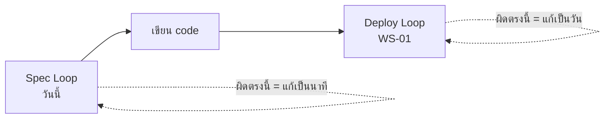
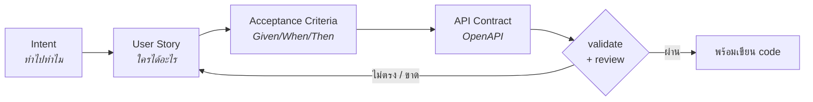
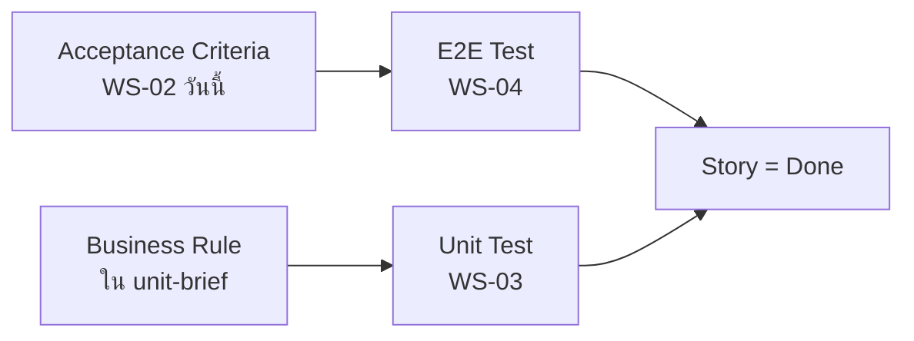
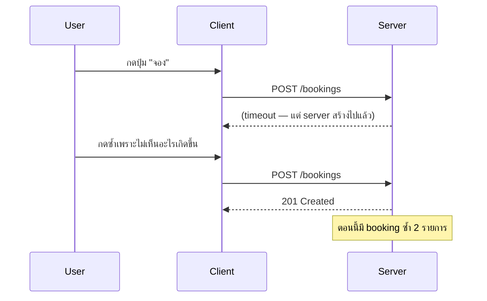
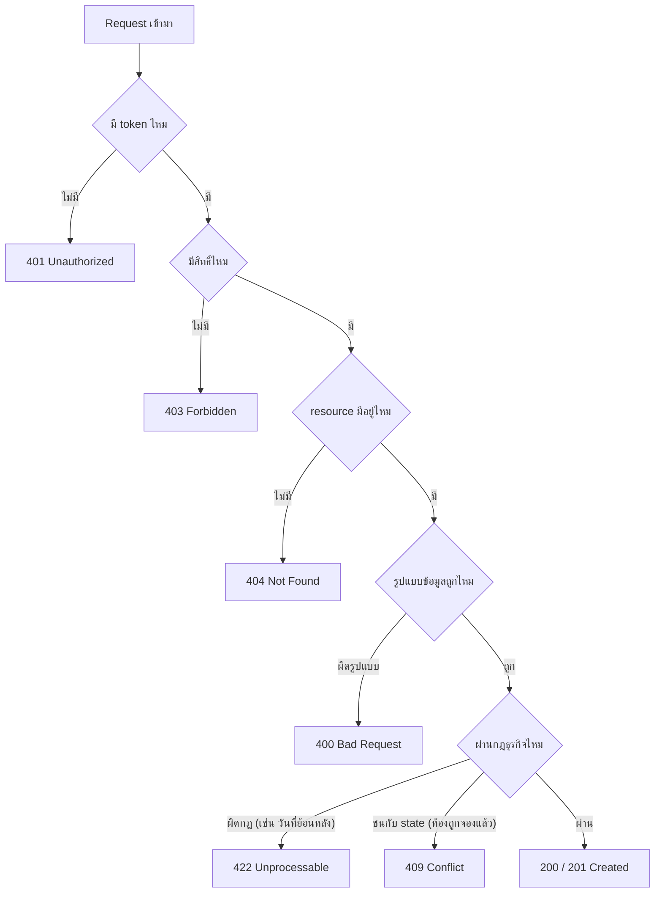
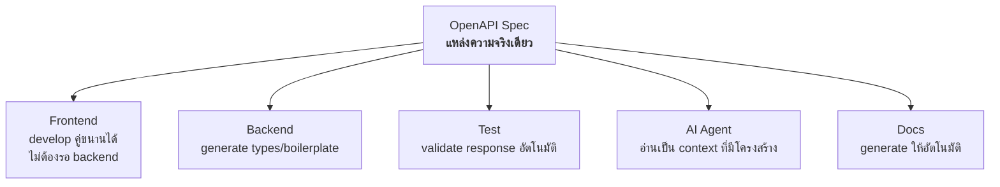
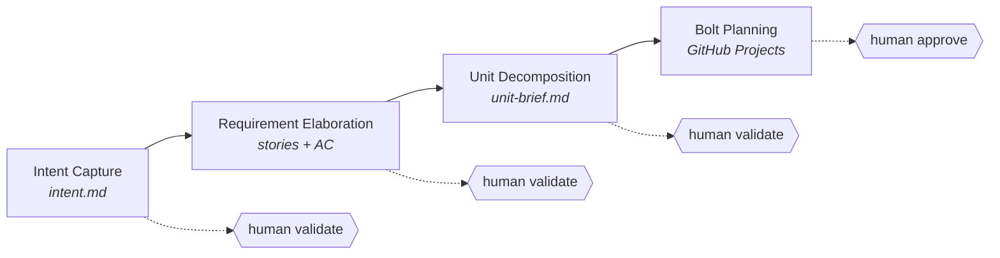

# Lecture: Requirements, API Design & the Spec Loop

**เวลารวม:** 30 นาที

*แนะนำการแบ่งเวลาสำหรับผู้สอน (หน่วย: นาที):* เปิดคาบ → 2 · หัวข้อ 1 → 4 · หัวข้อ 2 → 6 · หัวข้อ 3 → 8 · หัวข้อ 4 → 8

## 🎯 จบคาบนี้แล้วจะทำอะไรได้

| สิ่งที่จะทำได้ | ใช้ในงานจริงอย่างไร |
|---|---|
| แยกออกว่า story ไหน testable และ story ไหนวัดไม่ได้ | ในทีมจริง story ที่วัดไม่ได้จะกลายเป็นงานที่ "เสร็จแล้วแต่ยังไม่เสร็จ" และเถียงกันไม่จบ |
| ออกแบบ REST API พร้อมเลือก status code ให้ตรงความหมาย | API เป็นสัญญาที่ทีมอื่นใช้ — ออกแบบผิดแล้วแก้ทีหลังกระทบทุกคนที่เรียกใช้ |
| อธิบายได้ว่า idempotency สำคัญตอนไหน | เป็นหัวใจของระบบที่มีการชำระเงินหรือการจอง ซึ่งเป็นระบบที่พบมากที่สุดในงานจริง |
| ใช้ OpenAPI spec เป็นแหล่งความจริงเดียวของทีม | ทำให้ frontend กับ backend ทำงานคู่ขนานได้โดยไม่ต้องรอกัน — เป็นวิธีทำงานมาตรฐานของทีมขนาดกลางขึ้นไป |

## 📖 ศัพท์ที่ต้องรู้ก่อนเริ่ม

คำที่จะโผล่ซ้ำตลอดคาบ — ถ้าติดตรงไหนให้ย้อนกลับมาดูตารางนี้

| ศัพท์ | ความหมายในบริบทของวิชานี้ |
|---|---|
| **Spec** | เอกสารที่กำหนดว่าระบบต้องทำอะไร — ในวิชานี้คือ intent + user story + acceptance criteria + OpenAPI รวมกัน |
| **User Story** | ความต้องการที่เขียนจากมุมผู้ใช้ รูปแบบ *As a… I want… So that…* |
| **Acceptance Criteria (AC)** | เงื่อนไขที่ตัดสินว่า story ผ่านหรือไม่ผ่าน เขียนแบบ Given / When / Then |
| **Definition of Done (DoD)** | ข้อตกลงของทีมว่าอะไรถึงเรียกว่า "เสร็จ" ใช้เกณฑ์เดียวกันทุก story |
| **Backlog** | รายการงานที่ยังไม่ได้ทำ เรียงตามความสำคัญ |
| **Intent → Unit → Story → Bolt** *(ทบทวนจาก WS-01)* | ลำดับชั้นของงานใน AI-DLC จากใหญ่ไปเล็ก — Bolt คือหน่วยที่ลงมือทำจริง |
| **Resource / Endpoint** | สิ่งที่ API จัดการ (เช่น `rooms`) / ที่อยู่ของ API หนึ่งจุด (เช่น `GET /rooms`) |
| **Idempotent** | เรียกซ้ำกี่ครั้งผลก็เหมือนเดิม สำคัญมากตอน network สะดุดแล้ว client ยิงซ้ำ |
| **Idempotency Key** | key สุ่มที่ client สร้างต่อ 1 การกระทำ เพื่อให้ server รู้ว่าเป็นคำขอเดิม ไม่ใช่คำขอใหม่ |
| **OpenAPI** | รูปแบบมาตรฐาน (YAML/JSON) สำหรับอธิบาย API ทั้งระบบให้ทั้งคนและเครื่องอ่านได้ |
| **Contract** | ข้อตกลงเรื่องหน้าตาของ API ที่ frontend, backend, test และ AI ยึดร่วมกัน |
| **Contract-first** | วิธีทำงานที่ตกลง spec ให้จบก่อน แล้วสองทีมแยกไปทำพร้อมกันโดยไม่ต้องรอกัน |
| **Mermaid** | ภาษาเขียน diagram เป็นข้อความ ที่ GitHub render ให้อัตโนมัติ — diagram จึงอยู่ใน git ได้ |

---

## ✅ ก่อนเริ่มคาบ — ต้องมีอะไรมาแล้วบ้าง

คาบนี้ต่อจาก `WS-02--before` โดยตรง และจะไม่ทวนเนื้อหาในนั้นซ้ำ
ให้ทุกคนเช็ครายการนี้กับตัวเองใน 2 นาทีแรก

- [ ] อธิบายได้ว่า REST resource ควรตั้งชื่ออย่างไร และ 200/201/400/404/409 ใช้ตอนไหน
- [ ] เขียน user story ตามรูปแบบ *As a … I want … so that …* ได้
- [ ] ติดตั้ง testing framework แล้ว และเพิ่มคำสั่ง test ลง `AGENTS.md` แล้ว
- [ ] มี component diagram ฉบับร่างของกลุ่มติดมาด้วย
- [ ] มีรายการคำถามที่ spec ยังตอบไม่ได้ อย่างน้อย 3 ข้อ

> ข้อไหนยังไม่ครบ **ให้ยกมือบอกตอนนี้** ไม่ใช่ตอนเข้า lab —
> ของที่ขาดจะถูกจัดคู่ให้เพื่อนช่วยระหว่างที่ lecture เดินหน้าต่อ

---

## 0. เชื่อมจากสัปดาห์ที่แล้ว

สัปดาห์ที่แล้วเราปิด **Deploy Loop** — push แล้วเห็นของจริงบน URL
แต่ loop นั้นตอบได้แค่ *"มันขึ้นไปแล้วหรือยัง"* ยังไม่ได้ตอบว่า *"มันควรเป็นอะไร"*

วันนี้เราสร้าง loop ที่อยู่ **ก่อนหน้า** ทุกอย่าง



**คำถามเปิดคาบ (ให้คุยกันในกลุ่ม 1 นาที):**
> "ในระบบของกลุ่มคุณ — user จองล่วงหน้าได้กี่วัน? ยกเลิกได้ถึงเมื่อไหร่?
> คนหนึ่งจองพร้อมกันได้กี่รายการ?"

ส่วนใหญ่จะตอบไม่ตรงกันในกลุ่มเดียวกัน — และนั่นคือประเด็น
**ทุกคำถามที่เราไม่ตอบ AI จะเดาแทน** แล้วคำเดาจะฝังลงใน code เงียบ ๆ

---

## 1. Spec Loop คืออะไร



| ขั้น Verify ของ Spec Loop | ทำอย่างไร | latency |
|---|---|---|
| Story มี AC ที่ pass/fail ได้ | อ่านแล้วถามว่า "จะรู้ได้ยังไงว่าผ่าน" | นาที |
| OpenAPI spec valid | validate ด้วย tool | วินาที |
| Contract ตรงกับ AC | ไล่ทีละ story ว่ามี endpoint รองรับ | นาที |

**ทำไมต้องปิด loop ตรงนี้ก่อนเขียน code:** แก้ requirement ที่ผิดตอนเป็นข้อความ
ใช้เวลาเป็นนาที แต่แก้ตอนเป็น code ที่ deploy แล้วใช้เวลาเป็นวัน

> 💼 **จากหน้างานจริง**
> สาเหตุอันดับต้น ๆ ที่ project ซอฟต์แวร์ล้มเหลว ไม่ใช่ "เขียน code ไม่เก่ง"
> แต่คือ **สร้างของที่ไม่มีใครต้องการ** หรือ **เข้าใจโจทย์คนละอย่าง**
> ในทีมจริง คนที่ถูกมองว่า senior ไม่ใช่คนที่พิมพ์เร็ว แต่คือคนที่ถามคำถามที่ทำให้ทีมทั้งทีม
> ค้นพบว่าเข้าใจโจทย์ผิด — **ก่อน** ที่จะมีใครเปิด editor
> วิธีฝึกที่ถูกที่สุด: ทุกครั้งที่ได้ requirement ให้ถาม 3 คำถาม —
> "ถ้าไม่ทำจะเกิดอะไร", "รู้ได้ยังไงว่าสำเร็จ", "อะไรที่เราจะ *ไม่* ทำ"

---

## 2. User Stories ที่ Testable ได้

### รูปแบบมาตรฐาน

```
As a [user role],
I want to [action],
So that [benefit].
```

ส่วนที่คนข้ามบ่อยที่สุดคือ **So that** — แต่มันคือส่วนเดียวที่บอกว่า
ถ้าทำ feature นี้แล้วไม่ได้ผลตามที่หวัง เราควรเลิกทำ

### Acceptance Criteria (Given/When/Then)

```
Given [context/precondition],
When [action is taken],
Then [expected outcome].
```

### ตัวอย่างที่ดี

```
Story:
As a student, I want to book a study room,
So that I have a guaranteed space to meet my group.

Acceptance Criteria:
Given I am logged in as a student,
When I select an available room and submit a booking for 13:00-15:00,
Then the booking is confirmed and I receive a booking ID.

Given a room is booked for 13:00-15:00,
When another student tries to book the same room at 14:00-16:00,
Then the system rejects with "Room not available for selected time".
```

### กับดัก: Stories ที่ยาก Test

```
❌ "As a user, I want a good experience"
   → "good" วัดไม่ได้

❌ "As an admin, I want to manage everything"
   → "everything" ไม่รู้จะ test อะไร

✅ แต่ละ story ต้องมี acceptance criteria ที่ pass/fail ได้ชัดเจน
```

### AC วันนี้ = Test จริงในอีก 2 สัปดาห์



ถ้าวันนี้เขียน AC แบบวัดไม่ได้ วันนั้นจะเขียน test ไม่ออก —
และจะกลายเป็น story ที่ "ทำเสร็จแล้ว" โดยไม่มีใครพิสูจน์ได้ว่าเสร็จจริง

> 💼 **จากหน้างานจริง**
> คำว่า **Definition of Done** ในทีมจริงคือข้อตกลงที่เขียนไว้ชัด ว่าอะไรถึงเรียกว่าเสร็จ
> เพราะถ้าไม่เขียนไว้ ทุกคนจะมีนิยามของตัวเอง — คนหนึ่งคิดว่า "code เสร็จ"
> อีกคนคิดว่า "ต้องมี test" อีกคนคิดว่า "ต้องขึ้น production แล้ว"
> ทีมที่มีปัญหาเรื่อง "งานเสร็จแล้วแต่ยังไม่เสร็จ" เกือบทั้งหมดคือทีมที่ไม่มี DoD ร่วมกัน

---

## 3. RESTful API Design

### HTTP Methods

| Method | ใช้สำหรับ | ตัวอย่าง | Idempotent |
|---|---|---|---|
| GET | ดึงข้อมูล | `GET /rooms` | ✅ |
| POST | สร้างข้อมูลใหม่ | `POST /bookings` | ❌ |
| PUT | แทนที่ทั้งหมด | `PUT /bookings/123` | ✅ |
| PATCH | อัปเดตบางส่วน | `PATCH /bookings/123` | ❌ (ปกติ) |
| DELETE | ลบ | `DELETE /bookings/123` | ✅ |

> **Idempotent** = เรียกซ้ำกี่ครั้งผลก็เหมือนเดิม สำคัญมากตอน network มีปัญหาแล้ว client retry



> 💼 **จากหน้างานจริง**
> เคสนี้เกิดจริงบ่อยมากในระบบที่มีการชำระเงิน — user กดซ้ำแล้วโดนตัดเงิน 2 ครั้ง
> วิธีแก้มาตรฐานในอุตสาหกรรมคือ **Idempotency Key**: client สร้าง key สุ่มมาต่อ 1 การกระทำ
> ส่งมากับ request ถ้า server เห็น key ซ้ำ จะคืนผลเดิมแทนที่จะสร้างใหม่
> ผู้ให้บริการชำระเงินรายใหญ่ ๆ ทำแบบนี้กันหมด — ถ้าระบบของกลุ่มมีการจอง/จ่ายเงิน ควรคิดถึงข้อนี้

### Status Codes ที่สำคัญ



```
200 OK            — สำเร็จ
201 Created       — สร้างสำเร็จ (ใช้กับ POST) พร้อม header Location
204 No Content    — สำเร็จแต่ไม่มี body (ใช้กับ DELETE)
400 Bad Request   — ข้อมูลที่ส่งมาผิดรูปแบบ
401 Unauthorized  — ยังไม่ได้ login / token ไม่ถูก
403 Forbidden     — login แล้วแต่ไม่มีสิทธิ์
404 Not Found     — ไม่พบ resource
409 Conflict      — ชนกับ state ปัจจุบัน (เช่น ห้องถูกจองแล้ว)
422 Unprocessable — รูปแบบถูกแต่ validation ทาง business ไม่ผ่าน
429 Too Many Requests — เกิน rate limit
500 Server Error  — ระบบมีปัญหา
```

### Resource Naming

```
✅ /rooms              (collection)
✅ /rooms/123          (single resource)
✅ /rooms/123/bookings (nested resource)

❌ /getRoom
❌ /createNewBooking
❌ /deleteAllRooms
```

### Error Response ที่มีรูปแบบเดียวกันทั้งระบบ

```json
{
  "error": {
    "code": "ROOM_NOT_AVAILABLE",
    "message": "Room A101 is already booked for 13:00-15:00",
    "field": "roomId"
  }
}
```

`code` เป็น string คงที่ให้เครื่องอ่าน `message` ให้คนอ่าน —
frontend และ E2E test จะเช็ค `code` ไม่ใช่ข้อความ เพราะข้อความเปลี่ยนได้

> 💼 **จากหน้างานจริง**
> API ที่ error format ไม่เหมือนกันในแต่ละ endpoint คือหนึ่งในสิ่งที่ frontend เกลียดที่สุด
> เพราะต้องเขียน handler พิเศษต่อ endpoint และมันจะพังเงียบ ๆ เมื่อ backend เปลี่ยนข้อความ
> ทีมที่ทำงานเป็นระบบจะกำหนด error shape ไว้ **ครั้งเดียวตั้งแต่ต้น project**
> แล้วบังคับใช้ผ่าน middleware กลาง ไม่ปล่อยให้แต่ละคนคิดเอง

---

## 4. OpenAPI Spec = API Contract

### ทำไม Contract ถึงปิด loop ได้หลายวง



ข้อ **AI Agent** คือเหตุผลที่ spec สำคัญขึ้นมากในยุคนี้:
**spec คือ context ที่มีโครงสร้าง** — สั้นกว่าอธิบายด้วยประโยค แม่นกว่า และไม่ลืม
บอก AI ว่า "อ่าน `docs/openapi.yaml` แล้ว implement `POST /bookings`"
ได้ผลดีกว่าเขียน prompt บรรยาย 20 บรรทัดมาก

> 💼 **จากหน้างานจริง**
> รูปแบบการทำงานที่ใช้กันแพร่หลายคือ **contract-first** (หรือ design-first):
> ตกลง spec ให้จบก่อน แล้วทีม frontend กับ backend แยกไปทำพร้อมกัน
> โดย frontend ใช้ mock server ที่ generate จาก spec ระหว่างรอ backend จริง
> ผลคือสองทีมไม่ต้องรอกัน และวันที่เอามาต่อกันจริงมันมักจะต่อติดเลย —
> เทียบกับการที่ backend ทำเสร็จก่อนแล้วค่อยบอก frontend ว่า API หน้าตาเป็นแบบนี้
> ซึ่งมักจบด้วยการแก้ทั้งสองฝั่ง

### ตัวอย่าง OpenAPI spec เบื้องต้น

```yaml
openapi: 3.1.0
info:
  title: Campus Room Booking API
  version: 1.0.0

security:
  - bearerAuth: []

paths:
  /rooms:
    get:
      summary: List available rooms
      parameters:
        - name: date
          in: query
          required: true
          schema:
            type: string
            format: date
      responses:
        '200':
          description: List of rooms
          content:
            application/json:
              schema:
                type: array
                items:
                  $ref: '#/components/schemas/Room'
        '401':
          $ref: '#/components/responses/Unauthorized'

  /bookings:
    post:
      summary: Create a booking
      requestBody:
        required: true
        content:
          application/json:
            schema:
              $ref: '#/components/schemas/BookingRequest'
      responses:
        '201':
          description: Booking created
          content:
            application/json:
              schema:
                $ref: '#/components/schemas/Booking'
        '401':
          $ref: '#/components/responses/Unauthorized'
        '409':
          description: Room not available for the selected time

components:
  securitySchemes:
    bearerAuth:
      type: http
      scheme: bearer
      bearerFormat: JWT
  responses:
    Unauthorized:
      description: Missing or invalid token
  schemas:
    Room:
      type: object
      required: [id, name, capacity]
      properties:
        id: { type: integer }
        name: { type: string }
        capacity: { type: integer, minimum: 1 }
```

### สิ่งที่ต้อง Review ใน AI-generated OpenAPI Spec

AI ร่าง spec ได้เร็วมาก แต่พลาดซ้ำ ๆ ที่เดิม:

| จุดที่ AI มักพลาด | ตรวจอย่างไร |
|---|---|
| ใช้ `200` กับ POST แทน `201` | ไล่ดูทุก POST |
| มีแต่ happy path ไม่มี error response | ทุก endpoint ต้องมีอย่างน้อย 1 error case |
| ไม่ได้ define authentication | มี `security` และ `securitySchemes` ไหม |
| ไม่มี `required` ใน schema | field ไหนที่ขาดไม่ได้ ต้องอยู่ใน `required` |
| ลืม 409 ตอนที่ business rule ชนกัน | ไล่จาก AC ที่มีคำว่า "reject" |
| เดา field ที่เราไม่เคยพูดถึง | ลบทิ้ง หรือถามตัวเองว่าต้องการจริงไหม |

**เทคนิคที่ใช้ได้ผล:** ให้ AI ตรวจงานตัวเองด้วยเกณฑ์ที่เรากำหนด
```
Re-read the spec you just wrote and check it against this list:
[วาง checklist ข้างบน]
For each item, quote the line that satisfies it, or say MISSING.
```
บังคับให้มัน **อ้างบรรทัด** จะทำให้มันโกหกได้ยากขึ้นมาก

---

## Key Takeaways

- Spec Loop ปิดข้อผิดพลาดตอนที่มันยังเป็นข้อความ ซึ่งถูกกว่าตอนเป็น code เป็นสิบเท่า
- ทุกคำถามที่เราไม่ตอบ AI จะเดาแทน — และคำเดาจะฝังลงใน code เงียบ ๆ
- AC วันนี้คือ E2E test ใน WS-04 และ business rule คือ unit test ใน WS-03
- OpenAPI spec คือ contract เดียวที่ frontend, backend, test และ AI ใช้ร่วมกัน
- เลือก status code ให้ตรงความหมาย และคิดเรื่อง idempotency ตั้งแต่ออกแบบ
- AI ร่าง spec ได้เร็ว แต่พลาดที่เดิมเสมอ: error case, auth, `required`, 201/409

---

## AI-DLC Connection: Inception Phase

### สิ่งที่ทำใน lab วันนี้ = Inception Phase ของ AI-DLC



### Intent vs Unit vs Story vs Bolt

| ระดับ | AI-DLC | Agile | ตัวอย่าง |
|---|---|---|---|
| สูงสุด | **Intent** | Epic | "ระบบจองห้องสำหรับนักศึกษา" |
| กลาง | **Unit** | Feature | "Booking Management", "Room Catalog" |
| ล่างสุด | **Story** | User Story | "As a student, I want to book a room" |
| Execute | **Bolt** | Task/Sprint | implement booking form (4 ชั่วโมง) |

### Human Checkpoint ใน Inception

- AI propose requirements → human review ว่าครบและถูกต้องไหม
- AI suggest unit decomposition → human ตัดสินว่า loosely coupled จริงไหม
- AI plan bolts → human approve ว่า scope สมเหตุสมผลไหม

> **ไม่ใช่:** ปล่อย AI วิ่งแล้วเอาผลมาส่ง
> **แต่คือ:** AI draft → human validate → refine → repeat

### Spec คือ Context ถาวรของ Project

ทุกอย่างที่เขียนวันนี้จะถูก AI อ่านซ้ำทุกสัปดาห์ที่เหลือ
`intent.md` ที่คลุมเครือวันนี้ = code ที่หลงทางในอีก 6 สัปดาห์
ดังนั้นเวลาที่ลงกับ spec วันนี้ ไม่ใช่เวลาที่เสียไปจากการเขียน code — มันคือการลงทุนใน context
