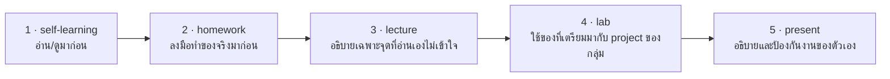

# Self-Learning: เตรียมก่อนเรียน Unit Testing

## 🎯 อ่าน/ดูจบแล้วจะได้อะไร

| สิ่งที่จะทำได้ | ใช้ในงานจริงอย่างไร |
|---|---|
| อธิบายวงจร Red → Green → Refactor ได้ | เป็นวิธีทำงานที่ทีมซึ่งดูแล code เก่าใช้จริง เพราะมันทำให้แก้ของเดิมได้โดยไม่พัง |
| แยก Mock / Stub / Fake ออกจากกัน | ใช้ผิดประเภทแล้ว test จะแดงทุกครั้งที่ refactor ทั้งที่ระบบยังทำงานถูก |
| บอกได้ว่าทำไม coverage 100% ไม่ได้แปลว่าปลอดภัย | หลายองค์กรตั้ง coverage เป็น KPI แล้วได้ test ที่ไม่ยืนยันอะไร — คุณจะไม่ตกหลุมนั้น |
| ร่าง test case ที่จะแดงเมื่อมีคนลบกฎธุรกิจ | เป็นคำถามคัดกรองที่ใช้ได้กับ test ทุกตัวตลอดอาชีพการทำงาน |

---

## สิ่งที่ต้องศึกษา

### TDD & Unit Testing
- [video] Test Driven Development — What? Why? And How? — Modern Software Engineering
  (https://www.youtube.com/watch?v=llaUBH5oayw)
- [video] CS50P Lecture 5 — Unit Tests (ดูช่วง unittest/pytest ก็พอ)
  (https://www.youtube.com/watch?v=tIrcxwLqzjQ)
- [reading] Getting Started with pytest (https://docs.pytest.org/en/stable/getting-started.html)
- [reading] Write Tests, Not Too Many — Kent C. Dodds (https://kentcdodds.com/blog/write-tests)
- [reading] The Practical Test Pyramid — Martin Fowler
  (https://martinfowler.com/articles/practical-test-pyramid.html)
  อ่านเฉพาะหัวข้อ *The Test Pyramid* และ *Unit Tests*

**จุดที่ต้องเข้าใจ:**
- TDD cycle: Red → Green → Refactor
- Arrange / Act / Assert (AAA) pattern
- Unit test vs Integration test ต่างกันอย่างไร
- Test coverage คืออะไร และข้อจำกัดของมัน (coverage สูงไม่ได้แปลว่า test ดี)

### Test Doubles (อ่านก่อนเพื่อเตรียม lab)
- [reading] Test Double — Martin Fowler (https://martinfowler.com/bliki/TestDouble.html)

**จุดที่ต้องเข้าใจ:**
- Mock vs Stub vs Fake vs Spy ต่างกันอย่างไร
- ใช้ test doubles เพื่ออะไร และ over-mocking เสียหายอย่างไร

### ทำไม Test สำคัญเป็นพิเศษเมื่อมี AI เขียน code
- [reading] Claude Code Best Practices (https://code.claude.com/docs/en/best-practices)
  อ่านหัวข้อที่พูดถึง *tests* และ *verification* — หลักการใช้ได้กับ agent ทุกยี่ห้อ

**จุดที่ต้องเข้าใจ:**
- ทำไม agent ที่รัน test เองได้ ถึงให้ผลดีกว่า agent ที่รันไม่ได้
- ทำไม test ที่ "ผ่านง่ายเกินไป" ทำให้ AI agent เดินหลงทางแบบมั่นใจ

---

## 🔗 เตรียมมาแล้วจะได้ใช้ตรงไหน

หน้านี้ไม่ได้จบในตัวเอง — มันคือ **input ของคาบเรียน**
อาจารย์จะไม่สอนซ้ำสิ่งที่อยู่ในหน้านี้ แต่จะเริ่มจากจุดที่หน้านี้จบ

| เตรียมมาจากหน้านี้ | ถูกใช้ต่อที่ | ถ้าไม่ได้เตรียมมา |
|---|---|---|
| โครง AAA และหลัก FIRST | lecture หัวข้อ 3 และ lab Part A — เขียน test ชุดแรกของ project | เขียน test ที่ยาวและตรวจหลายเรื่องในตัวเดียว จนอ่านผลไม่ออกเวลามันแดง |
| test double 5 ชนิด (dummy / stub / spy / mock / fake) | lecture หัวข้อ 4 และ lab Part A — สร้าง fixtures และ factories | ใช้ mock กับทุกอย่าง แล้วได้ test ที่แดงทุกครั้งที่ refactor |
| เหตุผลที่ test สำคัญขึ้นเมื่อ AI เขียน code | lecture หัวข้อ 5 — กับดัก AI-generated test | รับ test ที่ AI สร้างมาโดยไม่อ่าน assertion |
| test 1 ตัวที่คิดไว้ในหัวตอนวอร์มอัพ | lab Part A — เขียนออกมาเป็นตัวจริงตัวแรก | ใช้เวลาช่วงต้น lab ไปกับการนึกว่าจะ test อะไร แทนที่จะลงมือ |

---

## เช็คตัวเองก่อนเข้าห้อง

- [ ] อธิบาย Red → Green → Refactor ได้
- [ ] แยก Arrange / Act / Assert ในโค้ด test ที่เห็นได้
- [ ] บอกความต่างของ Mock / Stub / Fake ได้
- [ ] ตอบได้ว่าทำไม coverage 100% ถึงยังไม่แปลว่าปลอดภัย

### วอร์มอัพ: ลองเขียน 1 test ในหัว
เลือก business rule 1 ข้อจาก `unit-brief.md` ของกลุ่ม แล้วลองร่าง test case
ที่จะ **แดง** ถ้าใครลบกฎข้อนั้นออกจาก code (pseudocode ก็ได้)

แล้วถามตัวเองว่า *"test นี้จะแดงตอนไหน"* — ถ้าตอบไม่ได้ แปลว่ายังไม่ใช่ test ที่ดี
คำถามนี้จะถูกใช้ซ้ำตลอดทั้ง lab และตอน present
