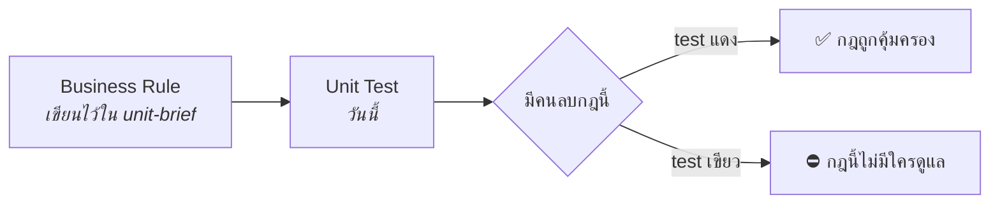
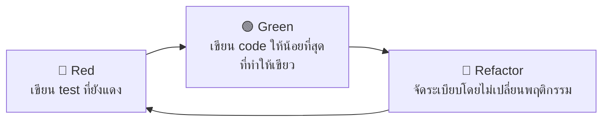
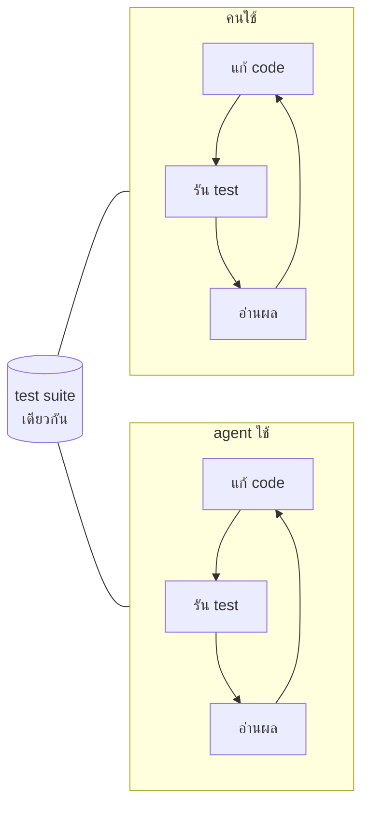
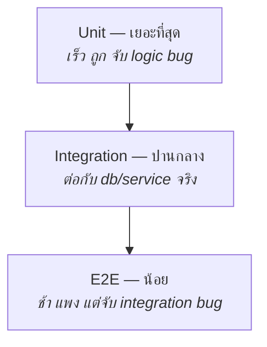
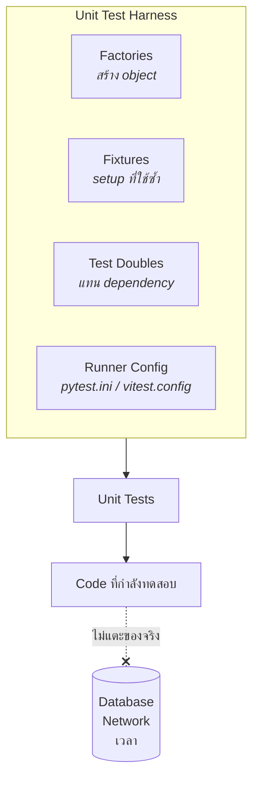
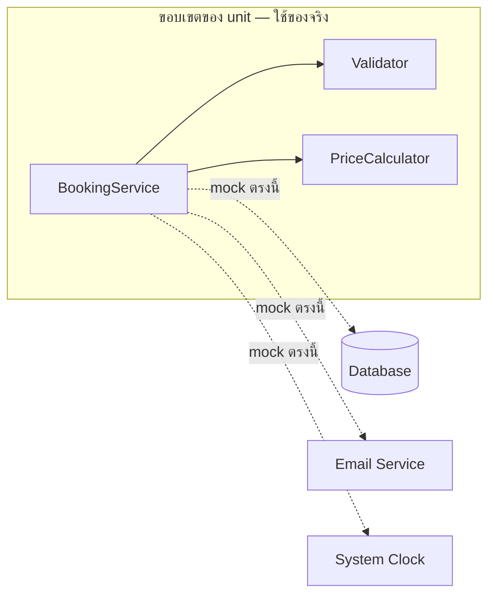
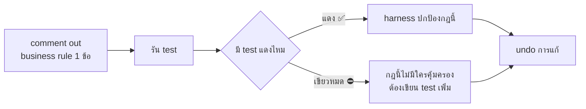

# Lecture: Unit Testing & the Unit Test Harness

**เวลารวม:** 30 นาที

*แนะนำการแบ่งเวลาสำหรับผู้สอน (หน่วย: นาที):* เปิดคาบ → 2 · หัวข้อ 1 → 4 · หัวข้อ 2 → 3 · หัวข้อ 3 → 4 · หัวข้อ 4 → 9 · หัวข้อ 5 → 8

## 🎯 จบคาบนี้แล้วจะทำอะไรได้

| สิ่งที่จะทำได้ | ใช้ในงานจริงอย่างไร |
|---|---|
| เขียน test ที่แดงจริงเมื่อ business rule หายไป | test ที่เขียวตลอดคือหนี้ที่ทำให้ทีมมั่นใจผิด ๆ และปล่อย bug ขึ้น production |
| เลือกใช้ test double ให้ถูกประเภทและไม่ mock เกินจำเป็น | over-mocking ทำให้ refactor ไม่ได้ ซึ่งเป็นสาเหตุที่ code เก่าหลายระบบแตะไม่ได้ |
| จัดการเวลา random และ network ให้ test ไม่แกว่ง | test ที่พังเฉพาะสิ้นเดือนหรือตอนเปลี่ยน timezone เป็นเรื่องที่ทุกทีมเคยเจอ |
| ตรวจ AI-generated test ด้วยคำถาม "ลบอะไรออกแล้วมันจะแดง" | AI ผลิต test ที่ดันตัวเลข coverage ได้เร็วมาก — คนต้องเป็นคนคัดว่าอันไหนมีค่า |

## 📖 ศัพท์ที่ต้องรู้ก่อนเริ่ม

คำที่จะโผล่ซ้ำตลอดคาบ — ถ้าติดตรงไหนให้ย้อนกลับมาดูตารางนี้

| ศัพท์ | ความหมายในบริบทของวิชานี้ |
|---|---|
| **Unit test** | test ที่ตรวจ logic ก้อนเล็ก ๆ โดยไม่แตะ database, network หรือเวลาจริง |
| **SUT** (System Under Test) | ชิ้นส่วนที่กำลังถูกทดสอบอยู่ในขณะนั้น |
| **Test Harness** | โครงสร้างรอบ test = test doubles + fixtures + factories + runner config |
| **Test Double** | ของแทน dependency จริงใน test — เป็นคำร่มของ Stub / Fake / Mock / Spy |
| **Stub** | คืนค่าที่กำหนดไว้ล่วงหน้าเสมอ ใช้เมื่ออยากคุม return value |
| **Fake** | implementation จริงแต่ย่อส่วน เช่น repository ที่เก็บข้อมูลใน memory |
| **Mock** | ใช้ตรวจว่า method ถูกเรียกจริงหรือไม่ (verify behavior) |
| **Fixture** | ชุด setup ที่เตรียมไว้ให้ test หยิบไปใช้ซ้ำได้ |
| **Factory** | ฟังก์ชันสร้าง object สำหรับ test ที่ override เฉพาะ field ที่สนใจได้ |
| **AAA** | Arrange / Act / Assert — โครงมาตรฐานของ test 1 ตัว |
| **FIRST** | Fast, Independent, Repeatable, Self-validating, Timely — คุณสมบัติของ test ที่ดี |
| **Coverage** | สัดส่วนบรรทัดที่ถูกรันระหว่าง test — บอกว่า "ถูกรัน" ไม่ได้บอกว่า "ถูกปกป้อง" |
| **Zombie test** | test ที่ยังเขียวแม้ลบ business logic ออก = ไม่ได้ปกป้องอะไรเลย |
| **Mutation testing** | เครื่องมือที่แก้ code ทีละจุดแล้วดูว่ามี test แดงไหม — *killed* = ดี, *survived* = ช่องโหว่ของ test suite |

---

## ✅ ก่อนเริ่มคาบ — ต้องมีอะไรมาแล้วบ้าง

คาบนี้ต่อจาก `WS-03--before` โดยตรง และจะไม่ทวนเนื้อหาในนั้นซ้ำ
ให้ทุกคนเช็ครายการนี้กับตัวเองใน 2 นาทีแรก

- [ ] อธิบายวงจร red → green → refactor ได้
- [ ] บอกความต่างของ stub / mock / fake ได้
- [ ] `pytest` หรือ `vitest` รันได้จริงใน repo ของกลุ่ม
- [ ] ติดตั้ง Playwright เรียบร้อยแล้ว
- [ ] มีตัวเลขว่า test loop ของกลุ่มใช้เวลากี่วินาที

> ข้อไหนยังไม่ครบ **ให้ยกมือบอกตอนนี้** ไม่ใช่ตอนเข้า lab —
> ของที่ขาดจะถูกจัดคู่ให้เพื่อนช่วยระหว่างที่ lecture เดินหน้าต่อ

---

## 0. เชื่อมจากสัปดาห์ที่แล้ว

WS-02 เราเขียน business rules ไว้ใน `unit-brief.md` — วันนี้เราทำให้มันมี "ผู้คุ้มกัน"



**คำถามเปิดคาบ (คิดในใจ 30 วินาที):**
> "ถ้าคืนนี้มีคนเข้าไปลบเงื่อนไข `if not room.is_available` ออกจาก code ของกลุ่มคุณ
> พรุ่งนี้เช้าจะมีอะไรบอกคุณไหม"

ถ้าคำตอบคือ "ไม่มี" — นั่นแปลว่ากฎข้อนั้นอยู่ได้ด้วยความจำของคนในกลุ่มเท่านั้น
และความจำจะหายไปเมื่อจบเทอม เมื่อคนเปลี่ยน หรือเมื่อมี AI เข้ามาแก้ code

---

## 1. Unit Test Loop: loop ที่สั้นที่สุดในวิชานี้



| คุณสมบัติของ loop | เป้าหมายในวิชานี้ | ทำไม |
|---|---|---|
| **Latency** | test suite ทั้งชุด < 10 วินาที | ถ้าช้ากว่านี้ คนจะเลิกรันระหว่างเขียน |
| **Fidelity** | ลบ business rule 1 ข้อ → ต้องมี test แดงอย่างน้อย 1 ตัว | signal ต้องไม่โกหก |
| **Coverage** | ทุก business rule ใน `unit-brief.md` มี test คู่กัน | ครอบคลุมสิ่งที่สำคัญ ไม่ใช่ทุกบรรทัด |

**และนี่คือ loop เดียวกันกับที่ AI agent ใช้** — เมื่อ agent รัน `npm test` แล้วอ่านผล
มันกำลังยืมขั้น Verify ที่เราสร้างไว้



> test suite ที่เร็วและซื่อสัตย์ = agent ที่ฉลาดขึ้น
> test suite ที่ช้าหรือหลอก = agent ที่มั่นใจแบบผิด ๆ

> 💼 **จากหน้างานจริง**
> มีเส้นแบ่งทางจิตวิทยาที่ชัดมากอยู่ราว ๆ **10 วินาที**: ถ้า test รันเสร็จภายในนั้น
> คนจะรันมันระหว่างเขียน code เป็นธรรมชาติ แต่ถ้ามันใช้เวลาเป็นนาที
> คนจะเปลี่ยนไปทำอย่างอื่นระหว่างรอ แล้วเสียสมาธิ สุดท้ายก็จะเลิกรันจนกว่าจะ push
> ทีมที่ดูแล test suite เป็นระบบจะ **มอนิเตอร์เวลารัน test เหมือน monitor performance ของ product**
> เพราะเมื่อไหร่ที่มันช้าเกินไป loop ทั้งวงก็ตายลงเงียบ ๆ

---

## 2. Test Pyramid: จะเขียน test แบบไหน อย่างละเท่าไร



| ระดับ | ตอบคำถาม | ความเร็ว | เขียนกี่ตัว |
|---|---|---|---|
| Unit | logic ถูกไหม | มิลลิวินาที | มาก |
| Integration | ต่อกันติดไหม | วินาที | ปานกลาง |
| E2E | user ใช้ได้จริงไหม | นาที | น้อยแต่สำคัญ |

**หลักตัดสินง่าย ๆ:** ถ้าเรื่องหนึ่ง unit test ตรวจได้ ให้ตรวจด้วย unit test
อย่ายกไปเป็น E2E เพราะ "มันสำคัญ" — ความสำคัญไม่ใช่เกณฑ์เลือกระดับของ test

> 💼 **จากหน้างานจริง**
> รูปทรงที่ผิดที่พบบ่อยเรียกกันว่า **"ice cream cone"** — E2E เยอะ unit น้อย
> เกิดเพราะทีมเริ่มจากการ test ผ่านหน้าจอ (ซึ่งเป็นธรรมชาติ) แล้วไม่เคยถอยกลับมาทำชั้นล่าง
> อาการคือ CI ใช้เวลาเป็นชั่วโมง มี flaky เต็มไปหมด และไม่มีใครกล้าแก้ code
> ทางแก้ไม่ใช่ลบ E2E ทิ้ง แต่คือ **ทุกครั้งที่ E2E จับ bug ได้ ให้ถามว่า
> "bug นี้ควรถูกจับด้วย unit test ตัวไหน"** แล้วเขียนตัวนั้นเพิ่ม

---

## 3. Anatomy of a Good Test

### Arrange / Act / Assert (AAA)

```python
def test_booking_confirmed_when_room_available():
    # Arrange — เตรียม state และ dependencies
    room = Room(id=1, capacity=10, is_available=True)
    service = BookingService(room_repo=FakeRoomRepo([room]))

    # Act — เรียก function ที่ต้องการ test
    result = service.create_booking(
        room_id=1, user_id=42,
        start="13:00", end="15:00"
    )

    # Assert — ตรวจสอบผลลัพธ์
    assert result.status == "confirmed"
    assert result.room_id == 1
```

### FIRST Principles

- **F**ast — รันเร็ว (milliseconds ไม่ใช่ seconds)
- **I**ndependent — ไม่พึ่ง test อื่น ลำดับ run ไม่ควรสำคัญ
- **R**epeatable — ผลเหมือนเดิมทุกครั้ง ไม่ขึ้นกับ environment
- **S**elf-validating — pass/fail ชัดเจน ไม่ต้องดู log เพิ่ม
- **T**imely — เขียนพร้อมหรือก่อน production code

### ชื่อ test คือเอกสาร

```python
❌ def test_booking()
❌ def test_1()
✅ def test_booking_rejected_when_room_unavailable()
```

ชื่อที่ดีบอก 3 อย่าง: **ทำอะไร / ภายใต้เงื่อนไขไหน / คาดหวังอะไร**

> 💼 **จากหน้างานจริง**
> เวลา test แดงใน CI ตอนตีสอง สิ่งเดียวที่คุณได้อ่านคือ **ชื่อ test**
> ถ้ามันชื่อ `test_booking_2` คุณต้องเปิด code มาไล่อ่านก่อนถึงจะรู้ว่าอะไรพัง
> แต่ถ้ามันชื่อ `test_booking_rejected_when_room_unavailable` คุณรู้ทันทีว่าต้องไปดูตรงไหน
> อีกมุมหนึ่งที่มีค่ามาก: รายชื่อ test ทั้งหมดของ module หนึ่ง
> คือ **เอกสารที่อัปเดตตัวเองเสมอ** ว่า module นั้นรับประกันอะไรบ้าง — ต่างจาก README ที่ล้าสมัยได้

---

## 4. Unit Test Harness: Test Doubles, Fixtures, Factories

> **Test Harness** = โครงสร้างรอบ ๆ test ที่ทำให้ test รันได้แบบ isolated และได้ผลเหมือนเดิมทุกครั้ง
> ประกอบด้วย **test doubles + fixtures + factories + runner config**
> คำว่า "harness" ในวิชานี้ใช้เฉพาะกับเรื่อง testing (WS-03, WS-04) เท่านั้น



### 4.1 Test Doubles

**Stub — ให้ข้อมูลที่กำหนดไว้ล่วงหน้า**
```python
class StubRoomRepo:
    def find_by_id(self, room_id):
        return Room(id=room_id, is_available=True)  # เสมอ

# ใช้เมื่อ: ต้องการควบคุม return value ของ dependency
```

**Fake — implementation จริงแต่ simplified**
```python
class FakeRoomRepo:
    def __init__(self, rooms):
        self._rooms = {r.id: r for r in rooms}

    def find_by_id(self, room_id):
        return self._rooms.get(room_id)

    def save(self, room):
        self._rooms[room.id] = room

# ใช้เมื่อ: ต้องการ behavior จริง ๆ แต่ไม่อยากใช้ database จริง
```

**Mock — verify ว่า method ถูกเรียก**
```python
from unittest.mock import Mock

def test_notification_sent_after_booking():
    notifier = Mock()
    service = BookingService(notifier=notifier)

    service.create_booking(room_id=1, user_id=42, ...)

    notifier.send_confirmation.assert_called_once_with(user_id=42)
# ใช้เมื่อ: ต้องการ verify ว่า side effect เกิดขึ้น
```

**Spy — record การเรียก แต่ delegate ไปยัง real implementation**
```python
# ใช้น้อย ส่วนใหญ่ใช้ Mock แทนได้
```

| ต้องการ | ใช้ |
|---|---|
| ควบคุม return value | Stub |
| ทดแทน database/repo | Fake |
| Verify ว่า method ถูกเรียก | Mock |
| Real behavior + verify | Spy |

### กับดัก: Over-Mocking

```python
# แย่: mock ทุกอย่างจน test ไม่ได้ test อะไรเลยนอกจาก mock ของตัวเอง
def test_create_booking():
    repo = Mock()
    validator = Mock()
    calculator = Mock()
    calculator.compute.return_value = 300
    service = BookingService(repo, validator, calculator)
    service.create_booking(...)
    repo.save.assert_called_once()
    # ถ้า logic ใน service ผิดหมด test นี้ก็ยังเขียว
```

**กติกา:** mock เฉพาะสิ่งที่ **ข้ามขอบเขต unit** — I/O, network, เวลา, random
ส่วน logic ภายใน ให้ใช้ของจริง



> 💼 **จากหน้างานจริง**
> อาการของ over-mocking ที่สังเกตได้ง่ายที่สุดคือ **refactor ทีไร test แดงทุกที
> ทั้งที่พฤติกรรมของระบบไม่เปลี่ยน** เพราะ test ไปผูกกับ *วิธีการ* ไม่ใช่ *ผลลัพธ์*
> เมื่อถึงจุดนั้น test จะกลายเป็นตัวถ่วงแทนที่จะเป็นตัวช่วย และทีมจะเริ่มเกลียดการเขียน test
> หลักที่ใช้ได้: **test ควรรู้ว่าระบบทำอะไรได้ ไม่ควรรู้ว่าระบบทำมันอย่างไร**

### 4.2 Fixtures & Factories

**ปัญหาของ test data ที่ไม่มี harness**
```python
# แย่: ซ้ำ ๆ ในทุก test
def test_booking_confirmed():
    room = Room(id=1, name="A101", capacity=10,
                location="Building A", is_available=True,
                hourly_rate=50)
    user = User(id=42, name="John", email="john@uni.ac.th",
                student_id="6301234", ...)

def test_booking_rejected():
    room = Room(id=1, name="A101", ...)  # ซ้ำทั้งหมด
```

**Fixture — shared setup ที่ reuse ได้**
```python
@pytest.fixture
def available_room():
    return Room(id=1, name="A101", capacity=10, is_available=True)

def test_booking_confirmed(available_room, student_user):
    service = BookingService(room_repo=FakeRoomRepo([available_room]))
    result = service.create_booking(available_room.id, student_user.id, ...)
    assert result.status == "confirmed"
```

**Factory — สร้าง object ที่ยืดหยุ่น**
```python
def make_room(**overrides):
    defaults = {
        "id": 1, "name": "A101", "capacity": 10,
        "is_available": True, "hourly_rate": 50,
    }
    return Room(**{**defaults, **overrides})

def test_booking_rejected_when_full():
    full_room = make_room(capacity=0)   # override แค่ที่ต้องการ
```

> Factory ทำให้ test **อ่านแล้วรู้ทันทีว่าอะไรคือตัวแปรสำคัญ**
> `make_room(capacity=0)` บอกชัดว่า test นี้สนใจแค่ capacity — ที่เหลือไม่เกี่ยว

### 4.3 กำจัดความไม่แน่นอน (สาเหตุอันดับ 1 ของ test แกว่ง)

```python
# แย่: ผูกกับเวลาจริง — test จะพังตอนเที่ยงคืน
def is_expired(booking):
    return booking.end_at < datetime.now()

# ดี: ฉีดเวลาเข้าไป
def is_expired(booking, now):
    return booking.end_at < now

def test_expired_booking():
    assert is_expired(make_booking(end_at=T("12:00")), now=T("13:00")) is True
```
เช่นเดียวกับ `random`, UUID, และ network — ทั้งหมดต้องควบคุมได้จาก test

> 💼 **จากหน้างานจริง**
> มีเรื่องเล่าซ้ำ ๆ ในทุกทีมที่ทำระบบมานาน: **test ที่พังเฉพาะวันที่ 31, พังเฉพาะสิ้นเดือน,
> พังเฉพาะช่วงเปลี่ยน timezone หรือปีอธิกสุรทิน** ทั้งหมดมีสาเหตุเดียวกันคือ code เรียก `now()` เอง
> การรับเวลาเป็น parameter (หรือฉีด clock เข้าไป) แก้ปัญหานี้ได้ทั้งชุด
> และยังทำให้เขียน test กรณี "ถ้าเป็นปีหน้า" ได้ฟรี ๆ ด้วย

---

## 5. กับดักใหญ่: AI-Generated Tests ที่ไม่มีค่า

### Test ที่ผ่าน Coverage แต่ไม่วัดอะไร

```python
# AI มักสร้าง:
def test_create_booking():
    booking = Booking(room_id=1, user_id=1)
    assert booking is not None     # ไม่มีค่า
    assert booking.room_id == 1    # แค่ test constructor

# Test ที่มีค่า:
def test_booking_rejected_when_room_unavailable():
    room = make_room(is_available=False)
    service = BookingService(room_repo=FakeRoomRepo([room]))

    with pytest.raises(RoomNotAvailableError):
        service.create_booking(room.id, user_id=1, ...)
    # Test นี้จะ fail ถ้า validation logic หายไป
```

### 4 อาการที่พบบ่อยใน AI-generated tests

| อาการ | ตัวอย่าง | ทำไมอันตราย |
|---|---|---|
| **Test constructor** | `assert obj is not None` | coverage ขึ้น แต่ไม่ป้องกันอะไร |
| **Assert ตาม implementation** | เช็คว่า private method ถูกเรียก | refactor ทีไรแดงทุกที ทั้งที่ behavior ถูก |
| **Mock ทุกอย่าง** | ดูหัวข้อ over-mocking | test ตัวเอง ไม่ได้ test code |
| **ลอก logic มาไว้ใน assert** | `assert price == hours * RATE` | ถ้าสูตรผิด ทั้ง code และ test ผิดพร้อมกัน |

### วิธีตรวจแบบมือ: Zombie Test Detection



```python
def create_booking(self, room_id, ...):
    room = self.room_repo.find_by_id(room_id)
    # if not room.is_available:        ← comment out
    #     raise RoomNotAvailableError()
    return Booking(...)

# ถ้า test ยัง pass → test นั้นไม่ได้ protect logic นี้
```

### วิธีตรวจแบบอัตโนมัติ: Mutation Testing

Mutation testing ทำสิ่งเดียวกันให้อัตโนมัติ — มันแก้ code ของเราทีละจุด
(เปลี่ยน `>` เป็น `>=`, ลบบรรทัด, สลับ `and`/`or`) แล้วดูว่ามี test แดงไหม

```bash
# Python
pip install mutmut && mutmut run

# JavaScript / TypeScript
npx stryker run
```

- **mutant killed** = มี test จับได้ → ดี
- **mutant survived** = แก้ code แล้วไม่มีใครรู้ → ตรงนั้นคือช่องโหว่ของ test suite

> Coverage บอกว่า "บรรทัดนี้ถูกรัน" — mutation score บอกว่า "บรรทัดนี้ถูกปกป้อง"

> 💼 **จากหน้างานจริง**
> ในองค์กรที่ตั้งเป้า coverage เป็น KPI มักเกิดผลข้างเคียงที่รู้กันดี:
> ตัวเลข coverage ขึ้นถึงเป้า แต่ bug ไม่ได้ลดลง เพราะคนเขียน test ที่ "รันผ่าน" code
> โดยไม่ได้ **ยืนยัน** อะไร — และตอนนี้ AI ช่วยผลิต test แบบนั้นได้เร็วมาก
> ทีมที่เอาจริงจึงหันมาดู mutation score หรืออย่างน้อยก็ใช้คำถามคัดกรองข้อเดียว:
> **"ถ้าลบ logic อะไรออก test ตัวนี้จะแดง"** — ตอบไม่ได้ = ลบ test ทิ้ง

### วิธีสั่ง AI ให้เขียน test ที่มีค่า

```
Write unit tests for BookingService.create_booking.

Rules:
- Each test must fail if I delete one specific business rule.
  Name the rule in the test name.
- Do not assert on private methods or internal call order.
- Use the existing factories in tests/factories.py — do not create new fixtures.
- Cover these cases: [ลิสต์จาก unit-brief.md]
- No test that only checks the constructor.
```

จากนั้น **ตรวจทุกตัวด้วยคำถามเดียว**: "ลบ logic อะไรออกแล้ว test นี้จะแดง"
ถ้าตอบไม่ได้ ให้ลบ test นั้นทิ้ง

---

## Key Takeaways

- Unit Test Harness = test doubles + fixtures + factories ที่ทำให้ test รันได้อย่าง isolated
- Test pyramid: unit เยอะ, E2E น้อย — ความสำคัญไม่ใช่เกณฑ์เลือกระดับของ test
- mock เฉพาะสิ่งที่ข้ามขอบเขต unit — test ควรรู้ว่าระบบ *ทำอะไรได้* ไม่ใช่ *ทำอย่างไร*
- ควบคุมเวลา/random/network ให้ได้ ไม่งั้น test จะแกว่งโดยไม่มีสาเหตุ
- Coverage สูงไม่ได้แปลว่าปลอดภัย ใช้ zombie test detection หรือ mutation testing วัด fidelity
- คำถามคัดกรอง test ทุกตัว: **"ลบอะไรออกแล้วมันจะแดง"**

---

## AI-DLC Connection: Construction Phase — Test Stage

```
Construction Bolt (DDD):
Model → Design → ADR → Implement → [Test] ← วันนี้
```

สิ่งที่ทำใน lab วันนี้ = Test stage ของ bolt:
- **Unit Test Harness** = infrastructure ที่ทำให้ test stage รันได้อย่าง isolated
- **Test Doubles** = testing ใน isolation โดยไม่ต้องพึ่ง external services
- **Fixtures/Factories** = ensure consistent test data ทุก bolt run

Human checkpoint ใน Test Stage: ทุก test ต้องผ่าน review ก่อน bolt ถือว่า "Done"
AI propose tests → human verify ว่า tests วัด business logic จริง ๆ ไม่ใช่แค่ดัน coverage

> เมื่อ harness นี้พร้อม เราจะเปิดให้ agent วน loop เองได้ยาวขึ้นในสัปดาห์ถัด ๆ ไป
> เพราะมีสัญญาณที่เชื่อถือได้คอยหยุดมันเมื่อทำพัง
