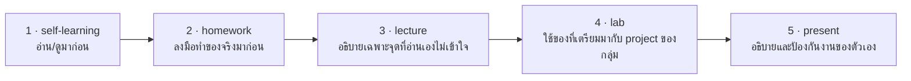

# Self-Learning: เตรียมก่อนเรียน E2E Testing

## 🎯 อ่าน/ดูจบแล้วจะได้อะไร

| สิ่งที่จะทำได้ | ใช้ในงานจริงอย่างไร |
|---|---|
| เลือก locator ที่ไม่พังเมื่อ UI เปลี่ยน | test ที่พังทุกครั้งที่ redesign คือ test ที่ทีมจะลบทิ้งในที่สุด |
| บอกสาเหตุของ flaky test ได้ | flaky test เป็นปัญหาที่ทุกทีมที่ทำ E2E เจอ และเป็นเรื่องที่ถูกถามในสัมภาษณ์บ่อย |
| เข้าใจว่า Page Object Model แก้ปัญหาอะไร | เป็น pattern มาตรฐานที่ทีม QA automation ใช้กันแทบทุกที่ |
| รู้จัก Trace Viewer สำหรับ debug test ที่แดงเฉพาะบน CI | "บนเครื่องผมผ่าน" เป็นสถานการณ์ที่เจอทุกสัปดาห์ในงานจริง |

---

## สิ่งที่ต้องศึกษา

### Playwright
- [video] Playwright Tutorial Full Course — Testers Talk (ดู 20 นาทีแรก)
  (https://www.youtube.com/watch?v=2poXBtifpzA)
- [reading] Playwright — Getting Started (https://playwright.dev/docs/intro)
- [reading] Playwright — Best Practices (https://playwright.dev/docs/best-practices)
  **อ่านให้ครบ** โดยเฉพาะ *Testing philosophy* และ *Use locators*
- [reading] Playwright — Page Object Model (https://playwright.dev/docs/pom)

**จุดที่ต้องเข้าใจ:**
- Locator คืออะไร และทำไม `getByRole` ดีกว่า CSS class
- Web-first assertion (`await expect(...).toBeVisible()`) รออัตโนมัติอย่างไร
- Flaky test คืออะไร เกิดจากอะไร
- Page Object Model แก้ปัญหาอะไร
- Trace Viewer ใช้ debug test ที่ fail ใน CI ได้อย่างไร

### Docker (เตรียมล่วงหน้าสำหรับ WS-05)
- [video] Docker Crash Course for Absolute Beginners — TechWorld with Nana
  (https://www.youtube.com/watch?v=pg19Z8LL06w)
- [reading] Dockerfile Best Practices
  (https://docs.docker.com/build/building/best-practices/)

---

## 🔗 เตรียมมาแล้วจะได้ใช้ตรงไหน

หน้านี้ไม่ได้จบในตัวเอง — มันคือ **input ของคาบเรียน**
อาจารย์จะไม่สอนซ้ำสิ่งที่อยู่ในหน้านี้ แต่จะเริ่มจากจุดที่หน้านี้จบ

| เตรียมมาจากหน้านี้ | ถูกใช้ต่อที่ | ถ้าไม่ได้เตรียมมา |
|---|---|---|
| locator ของ Playwright — `getByRole`, `getByLabel`, `getByTestId` | lecture หัวข้อ 3 และ lab ขั้นตอนที่ 3 — สร้าง page object | เขียน locator ที่ผูกกับ CSS แล้ว test จะพังทุกครั้งที่แก้หน้าตา |
| web-first assertion และสาเหตุของ flaky test | lecture หัวข้อ 2 | ใส่ `sleep` เพื่อแก้อาการ แล้วได้ test ที่ช้าและยังไม่เสถียร |
| Docker พื้นฐาน (เตรียมล่วงหน้า) | lab ขั้นตอนที่ 2 ถ้ารัน database ใน container และเป็นฐานทั้งหมดของ WS-05 | สัปดาห์หน้าจะเริ่มไม่ทัน |
| journey ที่เลือกไว้ตอนวอร์มอัพ | lab ขั้นตอนที่ 4 — เขียน journey นั้นเป็น E2E จริง | เสียเวลาช่วงต้น lab ไปกับการตกลงกันว่าจะทดสอบ flow ไหน |

---

## เช็คตัวเองก่อนเข้าห้อง

- [ ] บอกได้ว่าทำไม `getByRole` ดีกว่า selector ที่อ้าง CSS class
- [ ] อธิบายได้ว่า web-first assertion รอให้เองอย่างไร และทำไมจึงไม่ต้องใช้ `waitForTimeout`
- [ ] บอกสาเหตุของ flaky test ได้อย่างน้อย 2 ข้อ
- [ ] ตอบได้ว่า Page Object Model แก้ปัญหาอะไร

### วอร์มอัพ: เลือก Journey ที่จะเขียนเป็น E2E
เลือก user story 1 อันจาก backlog ที่อยากเขียน E2E test มากที่สุด
แล้วเขียนขั้นตอนที่ user ทำจริงเป็นข้อ ๆ (คลิกอะไร กรอกอะไร คาดหวังเห็นอะไร)

แล้วถามตัวเองว่า *"ทำไม story นี้ถึงควรเป็น E2E ไม่ใช่ unit test"*
ถ้าตอบว่า "เพราะมันสำคัญ" — ยังไม่ใช่เหตุผลที่ถูก คำตอบที่ถูกอยู่ใน lecture
