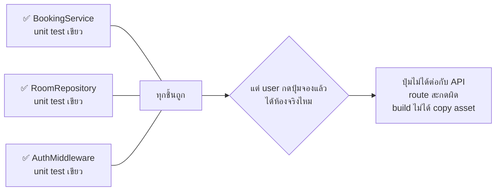
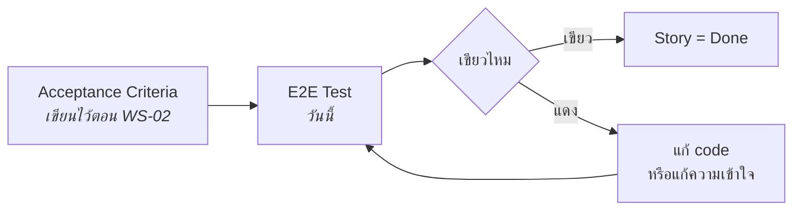
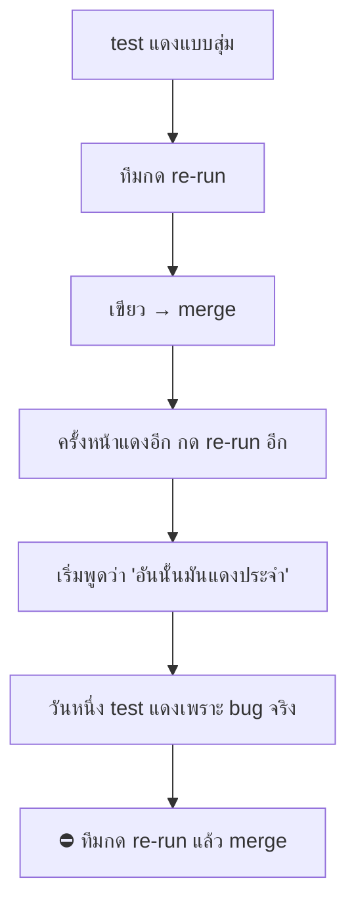
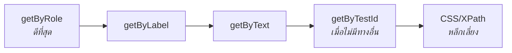
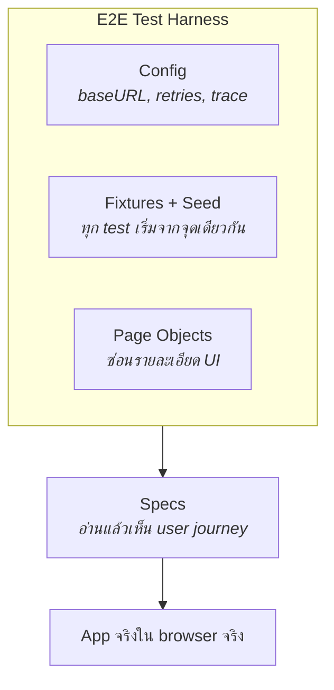
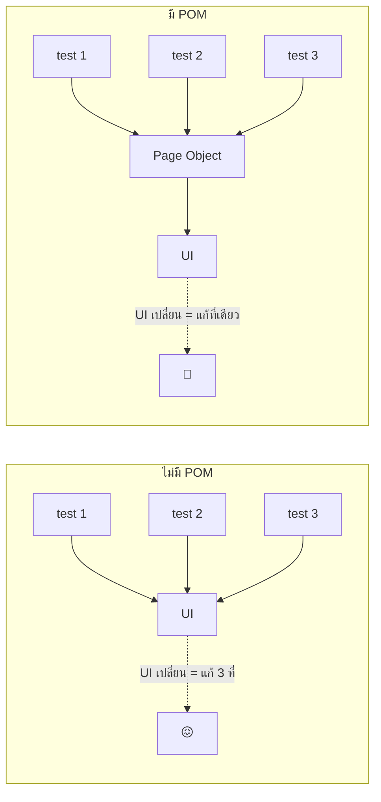
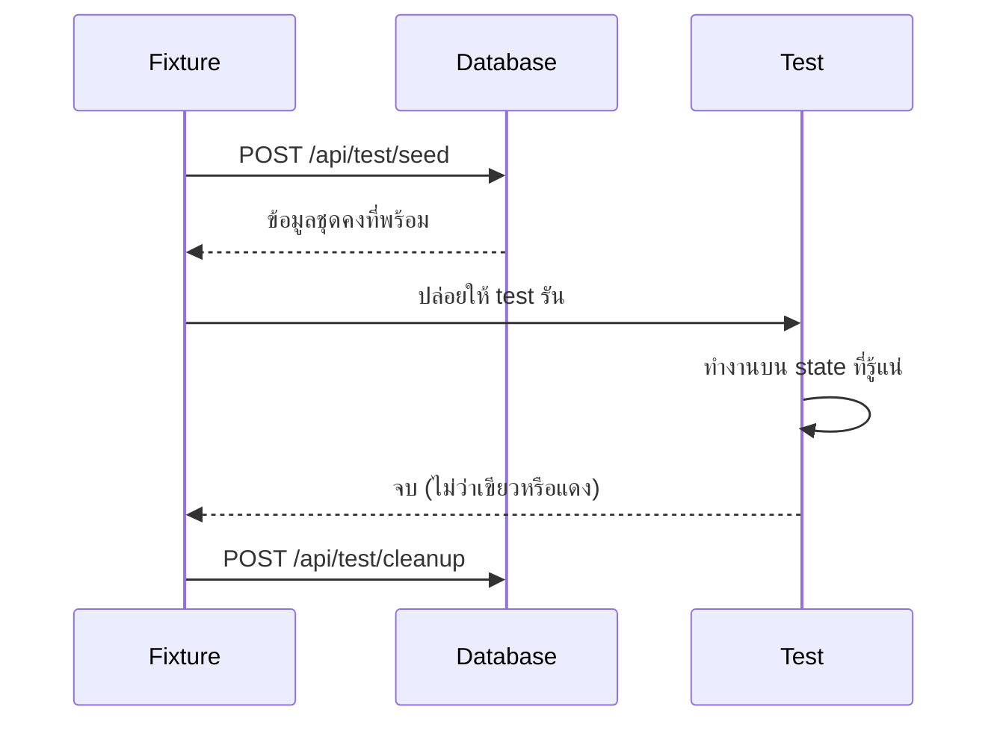
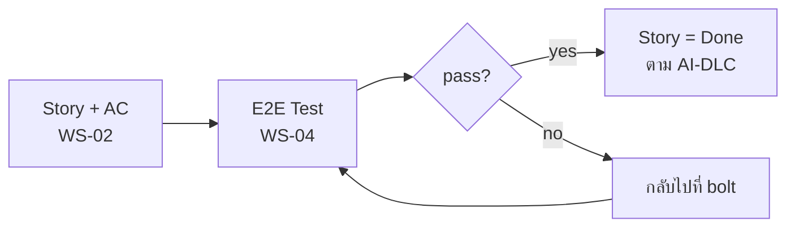

# Lecture: E2E Testing & the E2E Test Harness

**เวลารวม:** 30 นาที

*แนะนำการแบ่งเวลาสำหรับผู้สอน (หน่วย: นาที):* เปิดคาบ → 2 · หัวข้อ 1 → 4 · หัวข้อ 2 → 7 · หัวข้อ 3 → 9 · หัวข้อ 4 → 4

## 🎯 จบคาบนี้แล้วจะทำอะไรได้

| สิ่งที่จะทำได้ | ใช้ในงานจริงอย่างไร |
|---|---|
| ตัดสินใจได้ว่าอะไรควรเป็น E2E และอะไรควรเป็น unit test | E2E ที่เยอะเกินทำให้ CI ใช้เวลาเป็นชั่วโมงจนไม่มีใครรอ — เป็นปัญหาที่พบบ่อยในทีมจริง |
| ระบุและแก้สาเหตุของ flaky test ได้ 4 แบบ | flaky test ทำลายความเชื่อของ test ทั้งชุด ไม่ใช่แค่ตัวมันเอง |
| ออกแบบ E2E harness ครบ 4 ชั้น (config, state, locator, scenario) | เป็นโครงสร้างที่ทำให้ test ชุดใหญ่ยัง maintain ได้เมื่อระบบโตขึ้น |
| สั่ง AI เขียน E2E โดยไม่ให้มันเดา selector | AI ไม่เห็นหน้าจอจริง — การรู้ข้อจำกัดนี้ทำให้ใช้มันได้ผลกว่าเดิมมาก |

## 📖 ศัพท์ที่ต้องรู้ก่อนเริ่ม

คำที่จะโผล่ซ้ำตลอดคาบ — ถ้าติดตรงไหนให้ย้อนกลับมาดูตารางนี้

| ศัพท์ | ความหมายในบริบทของวิชานี้ |
|---|---|
| **E2E test** (End-to-End) | test ที่เปิด browser จริง แล้วเดินตามเส้นทางของผู้ใช้ตั้งแต่ต้นจนจบ |
| **Acceptance test** | test ที่ยืนยันว่า acceptance criteria ของ story เป็นจริง — ในวิชานี้ implement ด้วย E2E |
| **Smoke test** | test สั้น ๆ ที่ตรวจว่าระบบยังทำงานอยู่ ใช้เป็นด่านแรกหลัง deploy |
| **Locator** | วิธีชี้ไปยัง element บนหน้าจอ เช่น `getByRole`, `getByLabel`, `getByTestId` |
| **Web-first assertion** | assertion ที่รอเงื่อนไขให้เป็นจริงเองจนกว่าจะ timeout — ใช้แทนการ `sleep` |
| **data-testid** | attribute ที่ใส่ไว้ให้ test อ้างถึงโดยเฉพาะ ไม่เปลี่ยนเวลา redesign |
| **Flaky test** | test ที่บางครั้งผ่านบางครั้งไม่ผ่าน ทั้งที่ code ไม่ได้เปลี่ยน |
| **Page Object Model (POM)** | pattern ที่รวม locator และ action ของหน้าหนึ่งไว้ในคลาสเดียว เพื่อให้ UI เปลี่ยนแล้วแก้ที่เดียว |
| **Fixture** (ใน Playwright) | กลไกที่เตรียมและเก็บกวาด state ให้อัตโนมัติรอบ ๆ test แต่ละตัว |
| **Seed data** | ข้อมูลตั้งต้นที่ใส่เข้า database ก่อนรัน test เพื่อให้เริ่มจากจุดที่รู้แน่ |
| **Test isolation** | คุณสมบัติที่ test แต่ละตัวไม่รบกวนกัน ลำดับการรันจึงไม่มีผล |
| **Trace / Trace Viewer** | บันทึกทุก step ของ test ที่เปิดย้อนดูได้ ใช้ debug test ที่แดงเฉพาะบน CI |

---

## ✅ ก่อนเริ่มคาบ — ต้องมีอะไรมาแล้วบ้าง

คาบนี้ต่อจาก `WS-04--before` โดยตรง และจะไม่ทวนเนื้อหาในนั้นซ้ำ
ให้ทุกคนเช็ครายการนี้กับตัวเองใน 2 นาทีแรก

- [ ] บอกได้ว่า `getByRole` ต่างจาก selector แบบ CSS อย่างไร
- [ ] อธิบายได้ว่า flaky test คืออะไร และทำไมห้ามแก้ด้วย `sleep`
- [ ] component หลักมี accessible role และ `data-testid` แล้ว
- [ ] มี seed endpoint หรือวิธีเตรียมข้อมูลทดสอบที่รันซ้ำได้
- [ ] Docker Desktop รันได้ และเลือก journey ที่จะเขียนเป็น E2E มาแล้ว

> ข้อไหนยังไม่ครบ **ให้ยกมือบอกตอนนี้** ไม่ใช่ตอนเข้า lab —
> ของที่ขาดจะถูกจัดคู่ให้เพื่อนช่วยระหว่างที่ lecture เดินหน้าต่อ

---

## 0. เชื่อมจากสัปดาห์ที่แล้ว

WS-03 เราคุ้มครอง *business rule* ด้วย unit test แล้ว
แต่ unit test ที่เขียวทั้งชุด **ไม่ได้แปลว่า user ใช้งานได้**



**คำถามเปิดคาบ:**
> "bug แบบไหนที่ unit test ทุกตัวเขียวหมดแต่ยังหลุดขึ้น production ได้"

คำตอบคือ bug ที่อยู่ **ระหว่าง** ชิ้นส่วน ไม่ใช่ภายในชิ้นส่วน — และนั่นคืองานของ E2E

---

## 1. Acceptance Loop: จาก AC สู่ test ที่รันได้



E2E คือ loop ที่ **ครอบคลุมกว้างที่สุดแต่ช้าที่สุด** ในวิชานี้

| | Unit Test Loop | Acceptance (E2E) Loop |
|---|---|---|
| Latency | วินาที | นาที |
| Coverage | logic ทีละก้อน | ทั้งเส้นทางของ user |
| จับอะไรได้ที่อีกอันจับไม่ได้ | — | wiring ผิด, route หาย, build พัง, integration ระหว่างชั้น |
| จำนวนที่ควรมี | มาก | น้อยแต่สำคัญ |

**กติกา:** ถ้าเรื่องหนึ่ง unit test ตรวจได้ ให้ตรวจด้วย unit test
เก็บ E2E ไว้สำหรับสิ่งที่ต้องมี browser จริงเท่านั้น

> 💼 **จากหน้างานจริง**
> ทีมที่ทำ E2E มาสักพักจะมีคำถามประจำว่า *"จะเขียน E2E กี่ตัวถึงจะพอ"*
> คำตอบที่ใช้กันได้จริงคือ: เขียนให้ครอบ **เส้นทางที่ถ้าพังแล้วธุรกิจหยุด**
> (สมัครสมาชิก, เข้าสู่ระบบ, ทำรายการหลัก, จ่ายเงิน) แล้วหยุดแค่นั้น
> ที่เหลือปล่อยให้ unit/integration ดูแล
> เกณฑ์ตรวจสอบง่าย ๆ: ถ้า E2E suite ใช้เวลานานจน **ไม่มีใครยอมรอให้มันจบก่อน merge**
> แปลว่ามันเยอะเกินไปแล้ว ไม่ว่ามันจะ cover ได้ดีแค่ไหน

---

## 2. กับดักใหญ่: Flaky Tests

Flaky test คือ test ที่บางครั้ง pass บางครั้ง fail โดยไม่มีการเปลี่ยน code



> Flaky test อันตรายกว่า test ที่ fail เสมอ เพราะมันทำลาย **fidelity** ของ loop ทั้งวง
> — และมันทำลายความเชื่อของ *ทุก* test ในชุด ไม่ใช่แค่ตัวมันเอง

### สาเหตุที่ 1 — รอตามเวลาแทนรอตาม state

```typescript
// แย่: hardcoded wait — ช้าเกินไปก็เสียเวลา เร็วเกินไปก็แดง
await page.waitForTimeout(3000);

// ดี: web-first assertion รอให้เองจนกว่าเงื่อนไขเป็นจริง (หรือ timeout)
await expect(page.getByTestId('booking-confirmed')).toBeVisible();
```

### สาเหตุที่ 2 — State ค้างจาก test ก่อนหน้า

```typescript
// แย่: tests share state
// Test A สร้าง booking แล้ว Test B อาจเจอ booking นั้น

// ดี: แต่ละ test เริ่มจาก clean state
test.beforeEach(async () => {
  await seedDatabase();
});
```

### สาเหตุที่ 3 — Locator ที่เปลี่ยนตาม style

```typescript
// แย่: class เปลี่ยนเมื่อ redesign
await page.click('.btn.btn-primary.submit-form');

// ดีกว่า: role สะท้อนสิ่งที่ user เห็นและใช้จริง
await page.getByRole('button', { name: 'Book Now' }).click();

// ดีเมื่อไม่มี role/label ที่เสถียร
await page.getByTestId('submit-booking').click();
```

**ลำดับการเลือก locator:**


ข้อดีที่ได้แถมจาก `getByRole`: ถ้าเขียน test ด้วย role ไม่ได้
แปลว่า **หน้าเว็บนั้นมีปัญหา accessibility จริง ๆ** — screen reader ก็หาไม่เจอเหมือนกัน

### สาเหตุที่ 4 — ข้อมูลที่ขึ้นกับเวลาจริง

```typescript
// แย่: test จะพังทุกวันจันทร์ หรือพังตอนสิ้นเดือน
await page.fill('#date', '2024-12-01');   // วันในอดีต → ระบบปฏิเสธ

// ดี: คำนวณจากวันนี้เสมอ
const tomorrow = new Date(Date.now() + 86_400_000).toISOString().slice(0, 10);
await page.getByLabel('Date').fill(tomorrow);
```

### เครื่องมือ debug: Trace Viewer

```typescript
use: { trace: 'on-first-retry' }
```
```bash
npx playwright show-trace trace.zip
```
ได้ timeline, DOM snapshot ทุก step, network, console — ใช้ debug test ที่แดงเฉพาะใน CI ได้จริง

> 💼 **จากหน้างานจริง**
> นโยบายที่ทีมซึ่งเอาจริงเรื่องนี้ใช้กัน: **flaky test ถือเป็น bug ที่ต้องมี ticket และมีเจ้าของ**
> ถ้าแก้ไม่ทันในเวลาที่กำหนด ให้ `skip` พร้อมลิงก์ ticket ไปเลย — ดีกว่าปล่อยให้มันแดงสุ่ม ๆ
> เพราะ test ที่ถูก skip อย่างเปิดเผยยังซื่อสัตย์ แต่ test ที่แดงสุ่มแล้วทุกคนกด re-run
> คือการโกหกที่ทั้งทีมร่วมมือกัน
> อย่าใช้ `retries` สูง ๆ เพื่อกลบอาการ — retry มีไว้กัน network สะดุด ไม่ได้มีไว้กัน test ที่เขียนไม่ดี

---

## 3. E2E Test Harness

> **E2E Test Harness** = โครงสร้างที่ทำให้ E2E test รันซ้ำได้ผลเดิม
> ประกอบด้วย **Page Objects + Fixtures + Seed Data + Config**
> (คำว่า harness ในวิชานี้ใช้กับเรื่อง testing เท่านั้น — WS-03 และ WS-04)



### 3.1 Page Object Model — ชั้น locator

**ปัญหาที่ POM แก้**
```typescript
// แย่: selector กระจายทุก test ถ้า UI เปลี่ยนต้องแก้ทุกที่
test('booking flow', async ({ page }) => {
  await page.click('[data-testid="room-card-1"]');
  await page.fill('[data-testid="date-input"]', '2024-12-01');
  await page.click('[data-testid="submit-booking"]');
});

test('double booking rejected', async ({ page }) => {
  await page.click('[data-testid="room-card-1"]');          // ซ้ำ
  await page.fill('[data-testid="date-input"]', '2024-12-01'); // ซ้ำ
});
```



**POM Solution**
```typescript
// tests/e2e/pages/BookingPage.ts
import { Page, Locator } from '@playwright/test';

export class BookingPage {
  readonly submitButton: Locator;
  readonly confirmation: Locator;
  readonly errorMessage: Locator;

  constructor(private page: Page) {
    this.submitButton = page.getByRole('button', { name: 'Book Now' });
    this.confirmation = page.getByTestId('confirm-msg');
    this.errorMessage = page.getByTestId('error-msg');
  }

  async goto() {
    await this.page.goto('/booking');
  }

  async selectRoom(roomId: number) {
    await this.page.getByTestId(`room-card-${roomId}`).click();
  }

  async fillDate(date: string) {
    await this.page.getByLabel('Date').fill(date);
  }

  async submit() {
    await this.submitButton.click();
  }
}
```

```typescript
test('booking flow', async ({ page }) => {
  const bookingPage = new BookingPage(page);
  await bookingPage.goto();
  await bookingPage.selectRoom(1);
  await bookingPage.fillDate(tomorrow());
  await bookingPage.submit();
  await expect(bookingPage.confirmation).toBeVisible();
});
```

**กฎของ Page Object:**
- เก็บ **locator และ action** ไว้ข้างใน
- **ห้ามใส่ `expect` ไว้ใน Page Object** — assertion อยู่ใน test เท่านั้น
  เพราะ Page Object บอกว่า "ทำอะไรได้" ส่วน test บอกว่า "คาดหวังอะไร"

> 💼 **จากหน้างานจริง**
> ข้อผิดพลาดที่พบบ่อยคือทำ Page Object แล้วยัด assertion ลงไปด้วย
> จนกลายเป็น `bookingPage.verifyBookingSucceeded()` — พอถึงจุดนั้น
> คนอ่าน test จะไม่รู้ว่ามันเช็คอะไรบ้างถ้าไม่เปิดไฟล์อื่นดู
> **test ควรอ่านจบในไฟล์เดียว** — ทำอะไร แล้วคาดหวังอะไร ต้องเห็นครบตรงนั้น

### 3.2 Fixtures + Seed Data — ชั้น state



```typescript
// tests/e2e/fixtures/index.ts
import { test as base, expect } from '@playwright/test';

export const test = base.extend<{ seededDb: void }>({
  seededDb: [async ({ request }, use) => {
    await request.post('/api/test/seed');
    await use();
    await request.post('/api/test/cleanup');
  }, { auto: true }],   // auto: true = รันทุก test โดยไม่ต้องประกาศ
});

export { expect };
```

```typescript
// ใช้ใน tests — import จาก fixtures ไม่ใช่จาก @playwright/test
import { test, expect } from '../fixtures';
```

### 3.3 สรุปองค์ประกอบของ E2E Harness

| ชั้น | ไฟล์ | หน้าที่ |
|---|---|---|
| Config | `playwright.config.ts` | baseURL, retries, trace, reporter |
| State | `fixtures/`, `seed/` | ทำให้ทุก test เริ่มจากจุดเดียวกัน |
| Locator | `pages/` | ซ่อนรายละเอียด UI จาก test |
| Scenario | `specs/` | อ่านแล้วเห็น user journey เป็นภาษาคน |

> 💼 **จากหน้างานจริง**
> seed endpoint แบบที่เราทำวันนี้เป็นวิธีที่ใช้กันจริงในหลายทีม
> แต่ **มันคือช่องโหว่ที่ร้ายแรงถ้าหลุดขึ้น production** — ลองนึกภาพ endpoint
> ที่ล้าง database ได้โดยไม่ต้อง login เปิดอยู่บน internet
> กติกาในทีมจริงคือต้องมี guard อย่างน้อย 2 ชั้น: เช็ค `NODE_ENV`
> และไม่ deploy route กลุ่มนี้ขึ้น production เลยตั้งแต่ตอน build
> เรื่องนี้จะถูกหยิบมาตรวจอีกครั้งใน WS-08

---

## 4. ให้ AI ช่วยเขียน E2E อย่างไรให้ไม่พัง

E2E เป็นจุดที่ AI พลาดบ่อยที่สุด เพราะมัน **ไม่เห็นหน้าจอจริง**

| AI มักทำ | ปัญหา | แก้โดย |
|---|---|---|
| เดา selector จากชื่อ | locator ไม่มีอยู่จริง → แดงทันที | ให้มันอ่านไฟล์ component ก่อน |
| ใส่ `waitForTimeout` | flaky | ห้ามไว้ใน `AGENTS.md` |
| ใส่วันที่ตายตัว | พังในอนาคต | บอกให้คำนวณจากวันนี้ |
| เขียน E2E ครอบทุก edge case | suite ช้ามาก | บอกจำนวนที่ต้องการชัด ๆ |

**Prompt ที่ใช้ได้:**
```
Read tests/e2e/pages/BookingPage.ts and the component files under src/components
before writing anything.

Write 3 E2E tests for this acceptance criteria:
[วาง Given/When/Then จาก GitHub Issue]

Rules:
- Use the existing Page Object; add methods to it if needed, but no expect() inside it.
- Use getByRole or getByLabel when possible, getByTestId otherwise.
- Never use waitForTimeout — use web-first assertions.
- Compute dates relative to today, never hardcode.
Then run `npx playwright test` and fix until green.
```

> 💼 **จากหน้างานจริง**
> มีเครื่องมือรุ่นใหม่ที่ให้ agent **เปิด browser ดูหน้าจอเองแล้วเขียน test**
> ซึ่งแก้ปัญหา "เดา selector" ได้ตรงจุด แต่ก็มีกับดักใหม่:
> agent มักเขียน test ที่ผูกกับสิ่งที่มันเห็น ณ วินาทีนั้นเป๊ะ ๆ จนแตะอะไรนิดเดียวก็แดง
> หลักที่ยังใช้ได้เหมือนเดิมคือ — **คนต้องเป็นคนตัดสินว่า test ควรยืนยันอะไร**
> ให้เครื่องมือช่วยเรื่อง "หา element ยังไง" ได้ แต่ "อะไรคือความสำเร็จ" ยังเป็นงานของเรา

---

## Key Takeaways

- unit test เขียวหมด ≠ user ใช้ได้ — E2E จับ bug ที่อยู่ *ระหว่าง* ชิ้นส่วน
- E2E คือ loop ที่กว้างที่สุดแต่ช้าที่สุด — เขียนเฉพาะเส้นทางที่ถ้าพังแล้วธุรกิจหยุด
- Flaky test ทำลายความเชื่อของ test ทั้งชุด ไม่ใช่แค่ตัวมันเอง — อย่ากลบด้วย retry
- ลำดับ locator: role → label → text → testid และ role ช่วยเรื่อง accessibility ไปด้วย
- E2E Test Harness = Config + Seed/Fixtures + Page Objects + Specs
- Page Object เก็บ locator และ action — assertion อยู่ใน test เท่านั้น

---

## AI-DLC Connection: Construction Phase — Acceptance Test Stage



**E2E Test Harness = AI-DLC Acceptance Test Infrastructure:**
- Page Object Model — consistent interface สำหรับ test ทุก bolt
- Seed Data Fixtures — ensure known state ก่อนทุก test run
- Test Isolation — ทุก bolt run เริ่มจาก clean state

Human checkpoint: AI generate E2E scenarios จาก acceptance criteria →
human verify ว่าครอบคลุม realistic และไม่ได้แค่ทำให้เขียว

> ตอนนี้เรามี loop ครบ 2 ชั้นแล้ว (unit + acceptance)
> WS-05 จะทำให้ทั้งสองรันได้เหมือนกันทุกเครื่อง และ WS-06 จะรันให้อัตโนมัติทุก push
