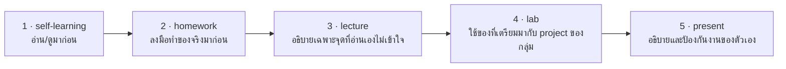

# Self-Learning: เตรียมก่อนเรียน Docker

## 🎯 อ่าน/ดูจบแล้วจะได้อะไร

| สิ่งที่จะทำได้ | ใช้ในงานจริงอย่างไร |
|---|---|
| แยก image กับ container และเข้าใจระบบ layer | Docker เป็นเครื่องมือพื้นฐานที่แทบทุกตำแหน่งงานพัฒนาซอฟต์แวร์ต้องใช้ |
| บอกได้ว่าทำไมลำดับคำสั่งใน Dockerfile ถึงมีผลต่อความเร็ว build | build ที่ช้าคือเวลาที่ทั้งทีมเสียไปพร้อมกันทุกครั้งที่ push |
| รู้ว่าต้องใช้ `docker compose` ไม่ใช่ `docker-compose` | ตัวอย่างบนอินเทอร์เน็ตส่วนใหญ่ยังเป็นของเก่า — ต้องแยกออกว่าอะไรล้าสมัย |
| เข้าใจว่าทำไม config ต้องมาจาก environment | เป็นหลักการ Twelve-Factor ที่ระบบสมัยใหม่ใช้เป็นมาตรฐาน |

---

## สิ่งที่ต้องศึกษา

### Docker
- [video] Docker Crash Course for Absolute Beginners — TechWorld with Nana
  (https://www.youtube.com/watch?v=pg19Z8LL06w)
- [reading] Dockerfile / Build Best Practices
  (https://docs.docker.com/build/building/best-practices/)
- [reading] Docker Compose — Getting Started
  (https://docs.docker.com/compose/gettingstarted/)
- [reading] The Twelve-Factor App — อ่านเฉพาะข้อ III (Config) และ X (Dev/prod parity)
  (https://12factor.net/)

**จุดที่ต้องเข้าใจ:**
- Image vs Container ต่างกันอย่างไร
- Layer คืออะไร caching ทำงานอย่างไร
- ทำไม COPY manifest ก่อนแล้วค่อย COPY source ถึงสำคัญ
- Compose ช่วยอะไรเมื่อมีหลาย services
- ทำไม config ต้องมาจาก environment variable ไม่ใช่ hardcode ในไฟล์

**หมายเหตุเรื่องคำสั่ง:** ใช้ `docker compose` (เว้นวรรค — Compose v2)
คำสั่ง `docker-compose` แบบมีขีดคือ v1 ที่หมดอายุการสนับสนุนแล้ว
และไฟล์ยุคใหม่ชื่อ `compose.yaml` โดยไม่ต้องมีบรรทัด `version:` อีกต่อไป

---

## 🔗 เตรียมมาแล้วจะได้ใช้ตรงไหน

หน้านี้ไม่ได้จบในตัวเอง — มันคือ **input ของคาบเรียน**
อาจารย์จะไม่สอนซ้ำสิ่งที่อยู่ในหน้านี้ แต่จะเริ่มจากจุดที่หน้านี้จบ

| เตรียมมาจากหน้านี้ | ถูกใช้ต่อที่ | ถ้าไม่ได้เตรียมมา |
|---|---|---|
| image / container / layer ต่างกันอย่างไร | lecture หัวข้อ 2–3 และ lab ขั้นตอนที่ 1 — เขียน Dockerfile | เขียน Dockerfile ที่ build ใหม่ทั้งหมดทุกครั้ง แล้วรอ build นานทุกรอบ |
| multi-stage build และ layer cache | lecture หัวข้อ 3 — กับดัก layer caching | ได้ image ที่ใหญ่เกินจำเป็นและ build ช้า |
| compose คืออะไร ต่างจาก `docker run` อย่างไร | lecture หัวข้อ 4 และ lab ขั้นตอนที่ 2 | ยังต้องจำ flag ยาว ๆ เองทุกครั้งที่รันระบบ |
| จำนวนขั้นตอน setup ของกลุ่มที่นับมาตอนวอร์มอัพ | lab ขั้นตอนที่ 2 — ใช้เป็นตัวเลข Before ในตาราง Before/After | ไม่มีหลักฐานว่า Environment Loop ที่ทำวันนี้ทำให้ดีขึ้นจริงแค่ไหน |

---

## เช็คตัวเองก่อนเข้าห้อง

- [ ] อธิบายความต่างของ image กับ container ได้
- [ ] บอกได้ว่าทำไม `COPY package.json` ต้องมาก่อน `COPY . .`
- [ ] บอกได้ว่า `npm ci` ต่างจาก `npm install` อย่างไร
- [ ] รู้ว่าต้องใช้คำสั่ง `docker compose` (เว้นวรรค) ไม่ใช่ `docker-compose`
- [ ] จดไว้แล้วว่า Dockerfile instruction ไหนที่ยังไม่เข้าใจ — เอาไปถามในห้องได้

### วอร์มอัพ: นับขั้นตอน Setup ของกลุ่มตัวเอง
ลองนับดูว่า ตอนนี้ถ้าเพื่อนใหม่มา clone repo ของกลุ่ม
**ต้องทำกี่ขั้นตอนกว่าจะรัน app ได้** และใช้เวลารวมประมาณเท่าไร

จดตัวเลขไว้ — lab สัปดาห์นี้จะลดมันให้เหลือ **1 คำสั่ง** และเราจะเทียบกันตอนท้าย
