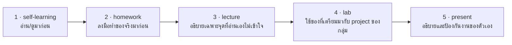

# Self-Learning: เตรียมก่อนเรียน CI/CD

## 🎯 อ่าน/ดูจบแล้วจะได้อะไร

| สิ่งที่จะทำได้ | ใช้ในงานจริงอย่างไร |
|---|---|
| แยก workflow / job / step และอ่าน YAML ของ CI ได้ | ทุกทีมมี pipeline และทุกคนต้องแก้มันเป็นเมื่อมันแดง |
| รู้ว่า secret เก็บที่ไหนและทำไมห้าม hardcode | secret หลุดคือ incident ที่ต้องรายงานและ revoke ทั้งระบบ |
| บอก 4 ตัวชี้วัดของ DORA ได้ | เป็นภาษาที่ผู้บริหารสายเทคโนโลยีใช้คุยกันเรื่องประสิทธิภาพของทีม |
| ประมาณ lead time และ deployment frequency ของกลุ่มตัวเอง | ฝึกมองงานของตัวเองเป็นระบบที่วัดได้ ไม่ใช่แค่ความรู้สึก |

---

## สิ่งที่ต้องศึกษา

- [video] GitHub Actions for Beginners (https://www.youtube.com/watch?v=hoN9r86D72U)
- [reading] GitHub Actions Quickstart
  (https://docs.github.com/en/actions/get-started/quickstart)
- [reading] Using Secrets in GitHub Actions
  (https://docs.github.com/en/actions/how-tos/write-workflows/choose-what-workflows-do/use-secrets)
- [reading] DORA — Software Delivery Metrics (https://dora.dev/)
  อ่านเฉพาะ 4 ตัวชี้วัด: deployment frequency, lead time for changes,
  change failure rate, failed deployment recovery time

**จุดที่ต้องเข้าใจ:**
- Workflow, Job, Step ต่างกันอย่างไร
- Trigger (`on: push`, `pull_request`) คืออะไร
- Secrets ใช้อย่างไร ทำไมถึงต้องใช้แทน hardcode
- `permissions:` ใน workflow ทำอะไร และทำไมควรตั้งให้น้อยที่สุด
- 4 ตัวชี้วัดของ DORA วัดอะไร และมันเกี่ยวกับ "loop" อย่างไร

---

## 🔗 เตรียมมาแล้วจะได้ใช้ตรงไหน

หน้านี้ไม่ได้จบในตัวเอง — มันคือ **input ของคาบเรียน**
อาจารย์จะไม่สอนซ้ำสิ่งที่อยู่ในหน้านี้ แต่จะเริ่มจากจุดที่หน้านี้จบ

| เตรียมมาจากหน้านี้ | ถูกใช้ต่อที่ | ถ้าไม่ได้เตรียมมา |
|---|---|---|
| workflow / job / step ต่างกันอย่างไร | lecture หัวข้อ 2 และ lab ขั้นตอนที่ 1 — สร้าง pipeline เต็ม | อ่าน YAML ที่ AI สร้างไม่ออก และแก้ตอนมันแดงไม่ได้ |
| secret เก็บที่ไหน และทำไมห้าม hardcode | lecture หัวข้อ 3 และ lab ขั้นตอนที่ 2 — ตั้ง GitHub Secrets และ Environments | เสี่ยงเอา credential ใส่ลงไฟล์ที่ push ขึ้น repo สาธารณะ |
| 4 ตัวชี้วัดของ DORA | lecture หัวข้อ 1 และ lab ขั้นตอนที่ 4 — วัดผล loop ของกลุ่ม | วัดผลสิ่งที่ทำทั้งวันไม่ได้ |
| ตัวเลข lead time และ deployment frequency ที่เดาไว้ตอนวอร์มอัพ | lab ขั้นตอนที่ 4 — เอามาเทียบกับตัวเลขจริงหลังต่อ pipeline | ไม่เห็นว่า pipeline เปลี่ยนพฤติกรรมของทีมไปแค่ไหน |

---

## เช็คตัวเองก่อนเข้าห้อง

- [ ] อธิบายความต่างของ Workflow / Job / Step ได้
- [ ] บอกได้ว่า `on: push` ต่างจาก `on: pull_request` อย่างไร
- [ ] รู้ว่า secret เก็บที่ไหน และทำไมห้าม hardcode
- [ ] บอกชื่อ 4 ตัวชี้วัดของ DORA ได้

### วอร์มอัพ: ประมาณตัวเลขของกลุ่มตัวเอง
ลองประมาณ 2 ตัวเลขนี้ของกลุ่มในตอนนี้ (เดาได้ ไม่ต้องแม่น):

- ตั้งแต่ commit จนถึงขึ้น staging ใช้เวลาเท่าไร — **lead time**
- อาทิตย์ที่ผ่านมา deploy ไปกี่ครั้ง — **deployment frequency**

จดไว้ แล้วเทียบอีกครั้งหลัง lab
