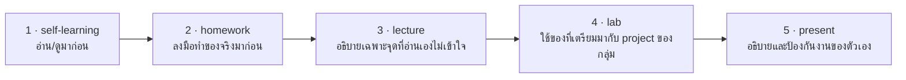

# Self-Learning: เตรียมก่อนเรียน Performance & Observability

## 🎯 อ่าน/ดูจบแล้วจะได้อะไร

| สิ่งที่จะทำได้ | ใช้ในงานจริงอย่างไร |
|---|---|
| อธิบายได้ว่าทำไม p95 บอกความจริงมากกว่า average | ตัวเลขเฉลี่ยซ่อนประสบการณ์แย่ของผู้ใช้กลุ่มที่สำคัญที่สุดเสมอ |
| แยก logs / metrics / traces ออกจากกัน | เป็นภาษาพื้นฐานของงาน on-call และการสอบสวนเหตุการณ์ |
| บอกได้ว่า SLI ต่างจาก SLO อย่างไร | SLO ทำให้ทีมเถียงกันเรื่อง "เร็วพอหรือยัง" บนตัวเลขแทนความรู้สึก |
| ตั้ง hypothesis เรื่อง bottleneck เป็นตัวเลข | การกล้าเดาแล้วไปวัด เป็นวิธีทำงานของวิศวกรที่โตเร็ว |

---

## สิ่งที่ต้องศึกษา

- [video] k6 setup for Load Testing — step by step (https://www.youtube.com/watch?v=XR2MAivt-9E)
- [reading] k6 — Running k6 (https://grafana.com/docs/k6/latest/get-started/running-k6/)
- [reading] k6 — Test Types (https://grafana.com/docs/k6/latest/testing-guides/test-types/)
  smoke / load / stress / soak ต่างกันอย่างไร
- [reading] The Three Pillars of Observability
  (https://www.ibm.com/think/insights/observability-pillars)
- [reading] Google SRE Book — Service Level Objectives
  (https://sre.google/sre-book/service-level-objectives/)
  อ่านหัวข้อ *Indicators, Objectives, Agreements* ก็พอ

**จุดที่ต้องเข้าใจ:**
- Virtual Users (VUs) คืออะไร
- p95 latency ต่างจาก average อย่างไร และทำไม average หลอกได้
- Logs, Metrics, Traces ต่างกันอย่างไร
- SLI / SLO คืออะไร และต่างจาก "ทำให้เร็วที่สุด" อย่างไร

---

## 🔗 เตรียมมาแล้วจะได้ใช้ตรงไหน

หน้านี้ไม่ได้จบในตัวเอง — มันคือ **input ของคาบเรียน**
อาจารย์จะไม่สอนซ้ำสิ่งที่อยู่ในหน้านี้ แต่จะเริ่มจากจุดที่หน้านี้จบ

| เตรียมมาจากหน้านี้ | ถูกใช้ต่อที่ | ถ้าไม่ได้เตรียมมา |
|---|---|---|
| VU, throughput และ percentile | lecture หัวข้อ 2 และ lab ขั้นตอนที่ 1 — เขียน k6 script | อ่านผล k6 ไม่ออก และรายงานได้แค่ว่า “ระบบช้า” |
| ความต่างของ smoke / load / stress / soak | lecture หัวข้อ 1 และ lab ขั้นตอนที่ 1 — ออกแบบ stage ของการยิง | ยิงรัวโดยไม่มี ramp-up แล้วได้ตัวเลขที่ไม่สะท้อนผู้ใช้จริง |
| logs / metrics / traces และ SLI / SLO | lecture หัวข้อ 5 และ lab ขั้นตอนที่ 2 — ใส่ structured logging | หา bottleneck ไม่เจอ เพราะไม่มีหลักฐานอะไรให้ดูนอกจากเวลารวม |
| hypothesis ของ bottleneck ที่เขียนเป็นตัวเลขไว้ | lab ขั้นตอนที่ 1 — กรอกตาราง Hypothesis vs Actual | ไม่มีอะไรให้เทียบ และเสียโอกาสเรียนรู้จากการเดาผิด |

---

## เช็คตัวเองก่อนเข้าห้อง

- [ ] อธิบายได้ว่า VUs คืออะไร
- [ ] อธิบายได้ว่าทำไม p95 บอกความจริงมากกว่า average
- [ ] แยก Logs / Metrics / Traces ออกจากกันได้
- [ ] บอกได้ว่า SLI ต่างจาก SLO อย่างไร

### วอร์มอัพ: ตั้ง Hypothesis ของ Bottleneck
เขียน hypothesis ที่ **พิสูจน์ได้เป็นตัวเลข** ว่า feature ไหนใน project จะช้าที่สุด เช่น

> "คิดว่า `GET /api/rooms?date=` จะช้าที่สุด เพราะมัน join ตาราง bookings ทั้งตาราง
> คาดว่า p95 จะเกิน 500ms ที่ 10 VUs"

**ผิดได้ ไม่มีผลต่อคะแนน** — แต่ต้องกล้าเดาเป็นตัวเลข
เพราะ lab สัปดาห์นี้จะไปวัดของจริงมาเทียบ และการเดาผิดแล้วรู้ว่าผิดเพราะอะไร
มีค่ามากกว่าการไม่กล้าเดา
