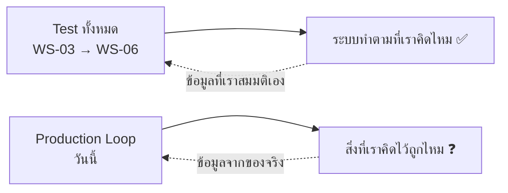
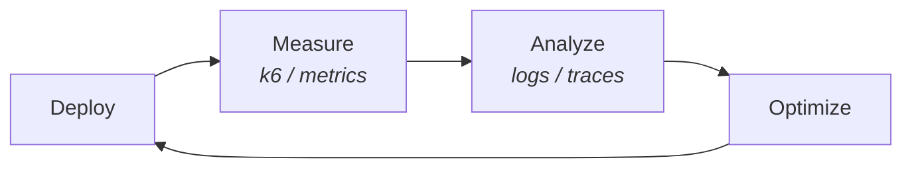
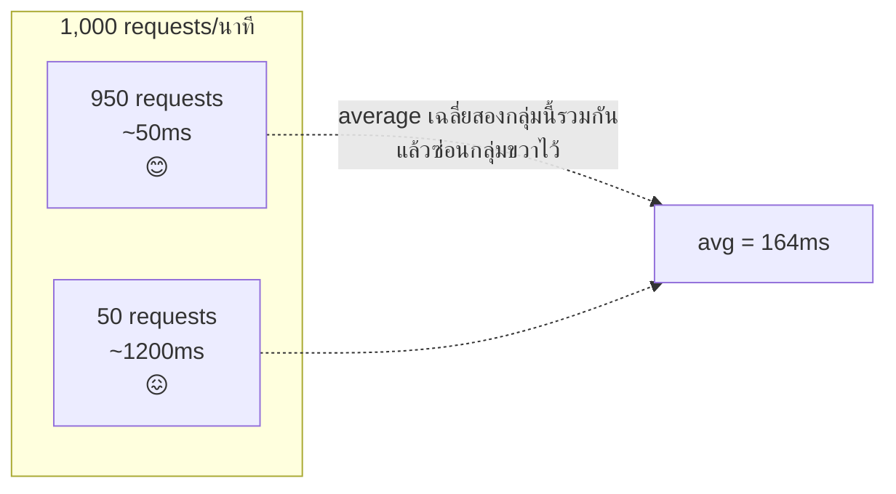
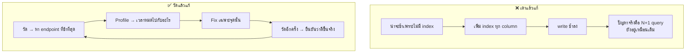
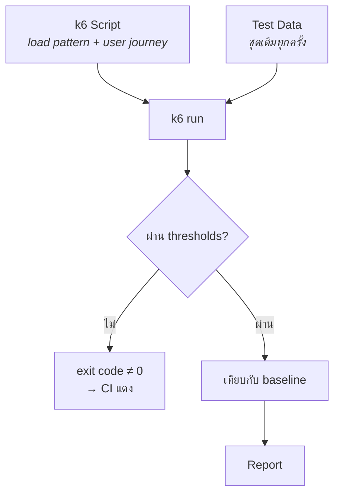
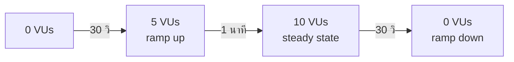
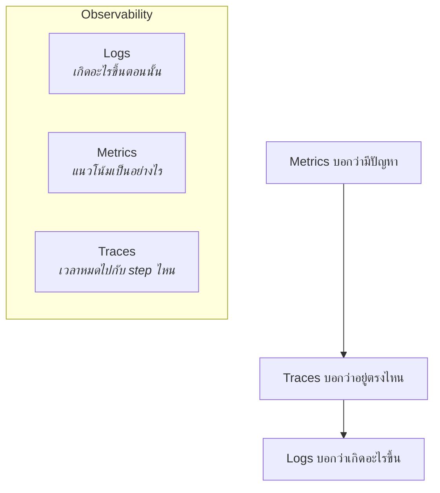
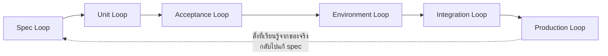
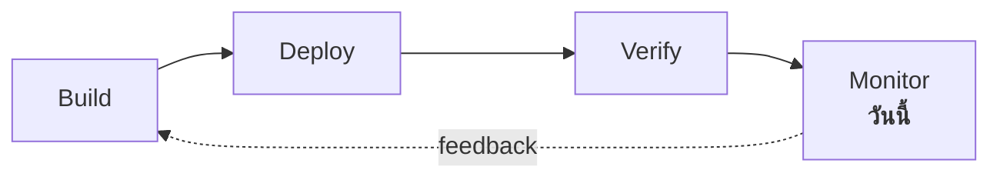

# Lecture: Performance, Observability & the Production Loop

**เวลารวม:** 30 นาที

*แนะนำการแบ่งเวลาสำหรับผู้สอน (หน่วย: นาที):* เปิดคาบ → 3 · หัวข้อ 1 → 4 · หัวข้อ 2 → 6 · หัวข้อ 3 → 4 · หัวข้อ 4 → 6 · หัวข้อ 5 → 5 · หัวข้อ 6 → 2

## 🎯 จบคาบนี้แล้วจะทำอะไรได้

| สิ่งที่จะทำได้ | ใช้ในงานจริงอย่างไร |
|---|---|
| อ่านผล load test แล้วบอกได้ว่าผู้ใช้จริงเจออะไร | แปลตัวเลขเป็นผลกระทบทางธุรกิจได้ ซึ่งเป็นสิ่งที่ทำให้ข้อเสนอของคุณถูกอนุมัติ |
| ตั้ง threshold ให้ performance เป็นด่าน pass/fail ใน CI | ป้องกัน performance regression ที่ค่อย ๆ แย่ลงจนไม่มีใครสังเกต |
| วัดก่อน optimize และรู้ว่าจะให้ข้อมูลอะไรกับ AI | การเดาแล้วแก้เป็นสาเหตุที่ทีมเสียเวลาไปกับจุดที่ไม่ใช่ปัญหา |
| เขียน structured log ที่ค้นหาและวิเคราะห์ได้ | เป็นพื้นฐานของงาน on-call และการหาสาเหตุเหตุการณ์บน production |

## 📖 ศัพท์ที่ต้องรู้ก่อนเริ่ม

คำที่จะโผล่ซ้ำตลอดคาบ — ถ้าติดตรงไหนให้ย้อนกลับมาดูตารางนี้

| ศัพท์ | ความหมายในบริบทของวิชานี้ |
|---|---|
| **Load test** | การยิง request จำลองผู้ใช้จำนวนมาก เพื่อดูว่าระบบรับไหวแค่ไหน |
| **VU** (Virtual User) | ผู้ใช้จำลอง 1 คนในเครื่องมืออย่าง k6 |
| **Throughput / RPS** | จำนวน request ที่ระบบรับได้ต่อวินาที |
| **Percentile (p50 / p95 / p99)** | ค่าที่ x% ของ request เร็วกว่านี้ — p95 = 95% เร็วกว่าค่านี้ อีก 5% ช้ากว่า |
| **Tail latency** | ความช้าของกลุ่มปลายแถว (p95 ขึ้นไป) ซึ่งคือกลุ่มที่ผู้ใช้หนักเจอบ่อยที่สุด |
| **Threshold** | เกณฑ์ผ่าน/ไม่ผ่านที่ k6 ใช้ตัดสิน — ไม่ผ่านแล้ว exit code ≠ 0 ทำให้ CI แดง |
| **Baseline** | ผลการวัดครั้งแรกที่เก็บไว้เป็นจุดอ้างอิงสำหรับเปรียบเทียบครั้งต่อ ๆ ไป |
| **Think time** | เวลาหน่วงระหว่าง request เพื่อจำลองว่าคนไม่ได้คลิกรัวเหมือน bot |
| **Ramp up / Steady state** | ช่วงค่อย ๆ เพิ่มจำนวนผู้ใช้ / ช่วงที่คงจำนวนไว้เพื่อดูพฤติกรรมจริง |
| **Smoke / Load / Stress / Soak** | ยังทำงานไหม / รับ traffic ปกติไหว / พังที่จุดไหนและพังอย่างไร / รันนาน ๆ แล้วรั่วไหม |
| **SLI / SLO / Error budget** | ตัวชี้วัด / เป้าที่ตกลงกันไว้ / งบความผิดพลาดที่ยังเหลือใช้ได้ก่อนต้องหยุดปล่อยของ |
| **Observability** | ความสามารถในการรู้ว่าข้างในระบบเกิดอะไรขึ้น จากสัญญาณที่มันส่งออกมา |
| **Logs / Metrics / Traces** | เกิดอะไรขึ้นตอนนั้น / แนวโน้มเป็นอย่างไร / เวลาหมดไปกับ step ไหน |
| **Structured logging** | log ที่เป็น JSON มี field คงที่ ทำให้ค้นหาและรวมสถิติได้ |
| **Correlation ID / requestId** | รหัสที่ติดไปกับทุก log ของ request เดียวกัน เพื่อร้อยเรื่องเข้าด้วยกันตอน debug |
| **N+1 query** | ดึงรายการมา n แถว แล้ววนลูป query ทีละแถว กลายเป็น n+1 ครั้ง — ช้าเฉพาะตอนข้อมูลเยอะ |

---

## ✅ ก่อนเริ่มคาบ — ต้องมีอะไรมาแล้วบ้าง

คาบนี้ต่อจาก `WS-07--before` โดยตรง และจะไม่ทวนเนื้อหาในนั้นซ้ำ
ให้ทุกคนเช็ครายการนี้กับตัวเองใน 2 นาทีแรก

- [ ] อธิบายได้ว่า VU คืออะไร และทำไม p95 บอกความจริงมากกว่าค่าเฉลี่ย
- [ ] แยก logs / metrics / traces ได้ และบอกความต่างของ SLI กับ SLO ได้
- [ ] รัน k6 smoke test กับ staging ผ่านแล้วอย่างน้อย 1 ครั้ง
- [ ] มี health endpoint ที่เรียกได้จากภายนอก
- [ ] เขียน hypothesis ของ bottleneck ไว้เป็นตัวเลขแล้ว

> ข้อไหนยังไม่ครบ **ให้ยกมือบอกตอนนี้** ไม่ใช่ตอนเข้า lab —
> ของที่ขาดจะถูกจัดคู่ให้เพื่อนช่วยระหว่างที่ lecture เดินหน้าต่อ

---

## 0. เชื่อมจากสัปดาห์ที่แล้ว

ตอนนี้เรามี pipeline ที่บอกได้ว่า **"ระบบทำตามที่เราคิดไว้หรือเปล่า"**
แต่ยังไม่มีอะไรบอกว่า **"สิ่งที่เราคิดไว้มันถูกหรือเปล่า"**



**คำถามเปิดคาบ (ให้แต่ละกลุ่มขานคำตอบ):**
> "endpoint ไหนใน project ของกลุ่มคุณที่คิดว่าช้าที่สุด และ p95 น่าจะเป็นเท่าไร"

จดคำตอบของทุกกลุ่มไว้บนกระดาน — ตอนจบ lab เราจะกลับมาดูว่าใครเดาถูก
และที่สำคัญกว่าคือ **ใครเดาผิดแล้วได้เรียนรู้อะไร**

> 💼 **จากหน้างานจริง**
> วิศวกรที่มีประสบการณ์มากแค่ไหนก็เดา bottleneck ผิดเป็นประจำ
> ประโยคที่ได้ยินบ่อยในทีมคือ *"ไม่น่าเชื่อว่าจะเป็นตรงนั้น"* — เพราะระบบจริงมีปฏิสัมพันธ์
> ที่ซับซ้อนเกินกว่าจะคิดออกจากการอ่าน code
> นี่คือเหตุผลที่วัฒนธรรมวิศวกรรมที่ดีให้ค่ากับ **"วัดแล้วรู้"** มากกว่า **"คิดว่าน่าจะ"**
> — และให้เกียรติคนที่กล้าเดาแล้วเดาผิดแบบเปิดเผย เพราะนั่นคือวิธีที่ทีมได้ความรู้จริง

---

## 1. Production Loop: loop ที่ยาวที่สุดและจริงที่สุด



| | Test Loops (WS-03–06) | Production Loop |
|---|---|---|
| ข้อมูล | เราสมมติเอง | ของจริงจากการใช้งาน |
| Latency | วินาที–นาที | นาที–วัน |
| จับอะไรได้ | สิ่งที่เรานึกออกว่าจะพัง | **สิ่งที่เราไม่เคยนึกถึง** |

---

## 2. p95 Latency vs Average

### ทำไม Average หลอกได้

```
Request times (ms): 50, 48, 52, 49, 51, 53, 47, 50, 49, 1200

Average: 164.9ms ← ดูเหมือนช้าปานกลาง แต่ไม่มี request ไหนใช้เวลาเท่านี้เลย
p50:      50ms   ← ครึ่งหนึ่งของ users เร็วกว่านี้
p95:    1200ms   ← 5% ของ users รอนาน 1.2 วินาที
```



### ความหมายในทางปฏิบัติ

```
ถ้า app มี 1,000 requests/นาที:
p95 = 1200ms หมายความว่า ~50 requests/นาที ที่ผู้ใช้รอนาน 1.2 วินาที

เป้าหมายที่ใช้กันทั่วไป:
- API response:   p95 < 200ms
- Page load:      p95 < 3s
- Background job: p95 < 30s
```

> 💼 **จากหน้างานจริง**
> ประเด็นที่มักถูกมองข้าม: **ผู้ใช้คนหนึ่งไม่ได้ยิงแค่ request เดียว**
> ถ้าหน้าจอหนึ่งเรียก API 20 ครั้ง และแต่ละครั้งมีโอกาส 5% ที่จะช้า
> โอกาสที่ผู้ใช้คนนั้นจะเจอความช้าอย่างน้อยหนึ่งครั้งคือเกือบ 65%
> แปลว่า **p95 ระดับ request กลายเป็นประสบการณ์แย่ของผู้ใช้ส่วนใหญ่**
> และคนที่ใช้ระบบหนักที่สุด — ซึ่งมักเป็นลูกค้าที่สำคัญที่สุด — คือคนที่เจอ tail latency บ่อยที่สุด
> ทีมที่เอาจริงจึงดู p99 ไม่ใช่แค่ p95 และดู latency ระดับ *หน้าจอ* ไม่ใช่แค่ระดับ request

### จาก Percentile สู่ SLO

```
SLI (Indicator): p95 ของ GET /api/rooms
SLO (Objective): p95 < 300ms ใน 99% ของช่วงเวลา ตลอด 30 วัน
```
SLO ทำให้คำว่า "เร็วพอ" มีคำตอบที่ pass/fail ได้ — เหมือนที่ acceptance criteria
ทำให้ "ทำงานถูก" มีคำตอบที่ pass/fail ได้

> 💼 **จากหน้างานจริง**
> SLO ไม่ได้มีไว้ให้ตั้งเป้าที่ 100% — และไม่ควรตั้งด้วย
> ระยะห่างระหว่าง SLO กับ 100% เรียกว่า **error budget** และมันคือ "งบความผิดพลาด"
> ที่ทีมใช้ได้ในการปล่อยของใหม่ ถ้าเดือนนี้ยังไม่ใช้งบหมด = ปล่อยของได้ตามปกติ
> ถ้าใช้หมดแล้ว = หยุดปล่อย feature ไปแก้ความเสถียรก่อน
> วิธีคิดแบบนี้เปลี่ยนการเถียงกันระหว่างทีมพัฒนากับทีมดูแลระบบ
> จาก "ความเห็นใครดังกว่า" เป็น **ข้อตกลงที่มีตัวเลขรองรับ**

### k6 Output อ่านอย่างไร

```
http_req_duration...: avg=145ms min=45ms med=98ms
                      max=2100ms p(90)=310ms p(95)=890ms

http_req_failed.....: 1.50% ✓ 1856 ✗ 30
http_reqs...........: 1886  62.87/s
```
- `p(95)=890ms` → 5% ของ requests ช้ากว่า 890ms → ต้อง investigate
- `http_req_failed=1.50%` → error rate 1.5% → น่ากังวลถ้า target คือ < 1%
- `62.87/s` → throughput ปัจจุบัน

---

## 3. กับดัก: Optimize ก่อน Measure



**ข้อนี้ใช้กับ AI ด้วย** — ถ้าถาม AI ว่า "ทำไม endpoint นี้ช้า" โดยไม่ให้ข้อมูลการวัด
มันจะตอบด้วยรายการสาเหตุยอดฮิตที่อาจไม่เกี่ยวกับ code เราเลย
ให้ป้อน k6 output + query log + code จริงเข้าไปด้วย คำตอบจะเปลี่ยนไปคนละเรื่อง

> 💼 **จากหน้างานจริง**
> N+1 query เป็นปัญหาที่พบบ่อยที่สุดในระบบที่ใช้ ORM: โค้ดดึงรายการมา 100 รายการ
> แล้ววนลูปดึงข้อมูลที่เกี่ยวข้องทีละรายการ กลายเป็น 101 queries โดยที่ code อ่านดูปกติมาก
> อาการเด่นคือ **ตอน dev มีข้อมูล 10 แถวเลยเร็ว แต่พอขึ้นจริงมี 10,000 แถวแล้วช้ามาก**
> ทีมที่เจอปัญหานี้บ่อยจะติดตั้งเครื่องมือนับ query ต่อ request ไว้ใน dev
> แล้วให้มันเตือนทันทีเมื่อเกินเกณฑ์ — เป็นการย้าย loop นี้จาก production กลับมาที่ dev

---

## 4. ทำให้ Performance เป็นด่านที่ pass/fail ได้



### k6 Thresholds

```javascript
export const options = {
  thresholds: {
    // 95% ของ requests ต้องเสร็จใน 500ms
    'http_req_duration': ['p(95)<500'],
    // Error rate ต้องต่ำกว่า 1%
    'http_req_failed': ['rate<0.01'],
    // เจาะจงราย endpoint ด้วย tag
    'http_req_duration{name:list_rooms}': ['p(95)<300'],
  },
};
```

ถ้า threshold ไม่ผ่าน **k6 exit ด้วย code ≠ 0 → CI fail อัตโนมัติ**
นี่คือสิ่งที่เปลี่ยน performance จาก "ตัวเลขที่ดูแล้วผ่าน ๆ ไป" เป็นด่านจริงใน loop

### Load Profile ที่สมจริง

```javascript
export const options = {
  stages: [
    { duration: '30s', target: 5  },   // ramp up
    { duration: '1m',  target: 10 },   // steady state
    { duration: '30s', target: 0  },   // ramp down
  ],
};
```



- ramp up ช่วยให้เห็นว่าระบบ **เริ่มแย่ที่ VU เท่าไร** ไม่ใช่แค่ผ่าน/ไม่ผ่าน
- ต้องมี **think time** (`sleep`) ระหว่าง request ไม่งั้นเรากำลังวัด "bot ยิงรัว" ไม่ใช่ "คนใช้งาน"

### ประเภทของ Load Test

| ประเภท | ตอบคำถาม |
|---|---|
| **Smoke** | ระบบยังทำงานอยู่ไหม (VU น้อยมาก) |
| **Load** | รับ traffic ปกติได้ไหม |
| **Stress** | พังที่จุดไหน และพังอย่างไร |
| **Soak** | รันนาน ๆ แล้วมี memory leak ไหม |

> 💼 **จากหน้างานจริง**
> Soak test คือประเภทที่คนข้ามบ่อยที่สุดแต่จับปัญหาที่แพงที่สุด — memory leak,
> connection pool ที่ค่อย ๆ หมด, ไฟล์ชั่วคราวที่ไม่เคยถูกลบ
> ปัญหาพวกนี้ไม่โผล่ใน test 2 นาที แต่จะโผล่ตอนตี 3 ของวันที่ 5 หลัง deploy
> อีกเรื่องคือ **stress test มีค่าไม่ใช่เพราะบอกว่าพังที่เท่าไร แต่เพราะบอกว่าพัง *อย่างไร*** —
> ระบบที่ดีควรค่อย ๆ ช้าลงและปฏิเสธ request ส่วนเกินอย่างสุภาพ (429) ไม่ใช่ล้มทั้งระบบ

> ⚠️ **ข้อควรระวังสำคัญ:** ยิง load test ใส่ staging เท่านั้น
> อย่ายิงใส่ production หรือใส่ระบบของคนอื่นเด็ดขาด — นั่นคือ DoS และผิดกฎหมาย

---

## 5. Observability: ทำให้ระบบเล่าเรื่องตัวเองได้

k6 บอกว่า "ช้า" แต่ไม่บอกว่า "ช้าตรงไหน" — observability คือส่วนที่ตอบข้อหลัง

### ปัญหาของ console.log ธรรมดา

```javascript
console.log("User booked room " + roomId);
// ค้นหายาก ไม่มี context ไม่รู้ว่าใช้เวลาเท่าไร query ไม่ได้
```

### Structured Logging (JSON)

```javascript
logger.info({
  event: 'booking_created',
  userId: 42,
  roomId: 5,
  duration_ms: 145,
  requestId: req.id,
});

// ค้นหาได้:  event="booking_created" AND userId=42
// วิเคราะห์ได้: p95 ของ duration_ms ต่อ event
// Alert ได้:   เมื่อ booking_created หายไปเกิน 5 นาทีในช่วงเวลาทำการ
```

**กติกา 3 ข้อ:**
1. หนึ่ง event = หนึ่งบรรทัด JSON มี `event` เป็นชื่อคงที่
2. มี `requestId` (correlation id) ทุกบรรทัด เพื่อร้อยเรื่องของ request เดียวกันเข้าด้วยกัน
3. **ห้าม log ข้อมูลส่วนบุคคลหรือ secret** — email, รหัสนักศึกษา, token, password
   ให้ log `userId` แทน

### สามเสาของ Observability



Traces ตอบคำถาม "ช้าตรงไหน" ได้ตรงที่สุด มาตรฐานปัจจุบันคือ **OpenTelemetry**
ในวิชานี้ยังไม่ต้อง setup เต็มรูปแบบ แต่ให้รู้ว่า `requestId` ที่เราใส่ใน log
คือรุ่นทำมือของ trace id

> 💼 **จากหน้างานจริง**
> ตอนเกิดเหตุจริง ลำดับที่ทีมใช้คือ **metrics → traces → logs** เสมอ:
> metrics เตือนว่ามีอะไรผิดปกติ, traces ชี้ว่าอยู่ service ไหน, logs บอกรายละเอียด
> ระบบที่มีแต่ logs อย่างเดียวจะ debug ช้ามาก เพราะไม่มีอะไรบอกว่าควรเริ่มอ่านจากตรงไหน
> อีกบทเรียนที่มักได้มาแบบเจ็บตัว: **log ที่มีข้อมูลส่วนบุคคลคือปัญหาด้านกฎหมาย**
> ไม่ใช่แค่เรื่องเทคนิค เพราะ log มักถูกเก็บไว้นาน ส่งต่อไปหลายระบบ และเข้าถึงได้โดยคนจำนวนมาก
> ทีมที่ทำถูกจะ redact ตั้งแต่ต้นทาง ไม่ใช่ไปกรองทีหลัง

### Log คือ context ของ AI ด้วย

```
❌ "ระบบช้า ช่วยดูให้หน่อย"
✅ "นี่คือ k6 output, structured log 20 บรรทัดของ request ที่ช้าที่สุด
    และ code ของ handler นี้ — ช่วยหาว่าเวลาหมดไปตรงไหน"
```

---

## 6. เชื่อมทุกอย่างเข้าด้วยกัน



Production Loop ปิดวงกลับไปหา Spec Loop — สิ่งที่วัดได้จากของจริง
คือข้อมูลที่ดีที่สุดสำหรับตัดสินใจว่ารอบหน้าจะสร้างอะไร

---

## Key Takeaways

- Production Loop เป็น loop เดียวที่ใช้ความจริง ไม่ใช่ข้อมูลที่เราสมมติเอง
- p95 สำคัญกว่า average — และเมื่อหนึ่งหน้าจอเรียก API หลายครั้ง tail latency จะกลายเป็นเรื่องปกติของผู้ใช้
- SLO + error budget เปลี่ยนการเถียงกันเรื่อง "เร็วพอหรือยัง" ให้เป็นข้อตกลงที่มีตัวเลข
- วัดก่อน optimize เสมอ ทั้งเวลาเราคิดเองและเวลาถาม AI
- Thresholds ทำให้ performance test เป็นด่านจริงใน CI ไม่ใช่แค่รายงาน
- ตอนเกิดเหตุจริง ลำดับคือ metrics → traces → logs
- Structured logging + requestId คือฐานของ observability และเป็น context ชั้นดีให้ AI

---

## AI-DLC Connection: Operations Phase — Monitor Stage



**Monitor Stage:**
- k6 script = load scenario ที่รันซ้ำได้เหมือนเดิมทุก deploy
- Thresholds = quality gate อัตโนมัติ — fail fast ถ้ามี performance regression
- Structured logging = สัญญาณที่ทั้งคนและ AI ใช้วิเคราะห์ได้
- Baseline comparison = รู้ทันทีว่า bolt ใหม่ทำให้ช้าลงหรือไม่

Human checkpoint ใน Monitor Stage: review performance report หลังทุก significant bolt
AI analyze logs → propose optimizations → human validate และ approve

> ตอนนี้ loop ครบวงแล้ว: spec → unit → acceptance → environment → integration → production
> สัปดาห์สุดท้ายเราจะใช้ทั้งหมดนี้เป็นตาข่ายนิรภัยเพื่อกล้าแก้ code ที่ไม่ดี
