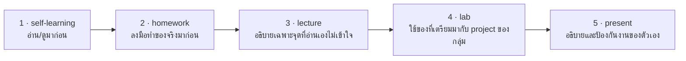

# Self-Learning: เตรียมก่อนเรียน Code Quality & Security

## 🎯 อ่าน/ดูจบแล้วจะได้อะไร

| สิ่งที่จะทำได้ | ใช้ในงานจริงอย่างไร |
|---|---|
| เรียกชื่อ code smell ที่พบบ่อยได้ | การเรียกชื่อปัญหาให้ถูกทำให้คุยกันใน code review ได้เร็วและไม่เป็นเรื่องส่วนตัว |
| แยก refactoring ออกจาก rewriting | สองอย่างนี้มีความเสี่ยงต่างกันคนละระดับ และผู้บริหารต้องรู้ก่อนอนุมัติ |
| ระบุ OWASP Top 10 ข้อที่เกี่ยวกับระบบของตัวเอง | security review ในองค์กรอ้างอิงรายการนี้เป็นมาตรฐาน |
| เข้าใจความเสี่ยงใหม่ที่มาพร้อม AI agent | prompt injection และ excessive agency เป็นหัวข้อที่องค์กรเริ่มออกนโยบายควบคุมแล้ว |

---

## สิ่งที่ต้องศึกษา

### Code Smells & Refactoring
- [video] More Python Code Smells: Avoid These 7 Smelly Snags — ArjanCodes
  (https://www.youtube.com/watch?v=zmWf_cHyo8s)
- [video] Uncle Bob's SOLID Principles Made Easy — ArjanCodes
  (https://www.youtube.com/watch?v=pTB30aXS77U)
- [reading] Code Smells — Refactoring Guru (https://refactoring.guru/refactoring/smells)
- [reading] Refactoring Techniques (https://refactoring.guru/refactoring/techniques)
- [reading] Technical Debt — Martin Fowler (https://martinfowler.com/bliki/TechnicalDebt.html)

### Security
- [reading] OWASP Top 10 (https://owasp.org/www-project-top-ten/)
- [reading] OWASP Top 10 for LLM Applications
  (https://owasp.org/www-project-top-10-for-large-language-model-applications/)
  อ่านเฉพาะ *Prompt Injection*, *Sensitive Information Disclosure*, *Excessive Agency*
- [reading] GitHub — Secret Scanning
  (https://docs.github.com/en/code-security/concepts/secret-security/secret-scanning)

### Architecture Decision Records
- [reading] ADR — Architectural Decision Records (https://adr.github.io/)
  ดูตัวอย่าง template แล้วเลือกแบบที่ชอบ

**จุดที่ต้องเข้าใจ:**
- Code smells ที่พบบ่อย: Long Method, God Class, Duplicate Code, Magic Numbers
- Refactoring ต่างจาก rewriting อย่างไร — และทำไมต้องมี test ก่อน
- OWASP Top 10 ข้อไหนเกี่ยวกับ project ของกลุ่มมากที่สุด
- ถ้าให้ AI agent รันคำสั่งได้เอง ความเสี่ยงใหม่ที่เพิ่มขึ้นคืออะไร (Excessive Agency)
- ADR บันทึกอะไร และทำไมต้องบันทึก "ทางเลือกที่ไม่ได้เลือก" ด้วย

---

## 🔗 เตรียมมาแล้วจะได้ใช้ตรงไหน

หน้านี้ไม่ได้จบในตัวเอง — มันคือ **input ของคาบเรียน**
อาจารย์จะไม่สอนซ้ำสิ่งที่อยู่ในหน้านี้ แต่จะเริ่มจากจุดที่หน้านี้จบ

| เตรียมมาจากหน้านี้ | ถูกใช้ต่อที่ | ถ้าไม่ได้เตรียมมา |
|---|---|---|
| ชื่อของ code smell ที่พบบ่อย | lecture หัวข้อ 2 และ lab ขั้นตอนที่ 1 — ทำ refactoring plan | บอกได้แค่ว่า code “ไม่สวย” ซึ่งใช้คุยกันใน review ไม่ได้ |
| ความต่างระหว่าง refactoring กับ rewriting | lecture หัวข้อ 1 — Quality Loop | เผลอเขียนใหม่ทั้งก้อนโดยไม่มีตาข่ายนิรภัย |
| OWASP Top 10 ข้อที่เกี่ยวกับ project ของกลุ่มมากที่สุด | lecture หัวข้อ 4 และ lab ขั้นตอนที่ 3 — ปิดช่องโหว่จริง | ไล่ security แบบสุ่ม แทนที่จะไล่จากความเสี่ยงที่ระบบตัวเองมีจริง |
| template ของ ADR | lecture หัวข้อ 6 และ lab ขั้นตอนที่ 4 — เขียน ADR ฉบับแรก | เขียน ADR ที่ขาด Alternatives Considered ซึ่งเป็นหัวใจของมัน |
| function ที่แย่ที่สุดที่เลือกไว้ + คำตอบว่ามี test คุ้มครองหรือไม่ | lab ขั้นตอนที่ 2 — เป็นเป้าหมาย refactor จริงของวันนี้ | ต้องใช้เวลาใน lab ไปกับการหาเป้าหมาย แทนที่จะลงมือแก้ |

---

## เช็คตัวเองก่อนเข้าห้อง

- [ ] บอกชื่อ code smell ได้อย่างน้อย 4 แบบ
- [ ] อธิบายได้ว่า refactoring ต่างจาก rewriting อย่างไร
- [ ] บอกได้ว่า OWASP Top 10 ข้อไหนเกี่ยวกับ project ของกลุ่มมากที่สุด
- [ ] อธิบายได้ว่า Excessive Agency ของ AI agent คือความเสี่ยงแบบไหน

### วอร์มอัพ: หา Function ที่แย่ที่สุดในกลุ่ม
เลือก 1 function จาก codebase ที่คิดว่าแย่ที่สุด แล้วตอบตัวเอง 2 ข้อ:

1. มันแย่เพราะอะไร — ระบุชื่อ code smell ให้ได้
2. **ถ้าจะ refactor มันตอนนี้ มี test อะไรคุ้มครองอยู่บ้าง**

ถ้าคำตอบข้อ 2 คือ "ไม่มีเลย" — นั่นคือคำตอบที่ถูก และเป็นจุดเริ่มของ lab สัปดาห์นี้
(function นั้นจะถูกใช้เป็นเป้าหมายจริงใน lab จึงควรเลือกอันที่กลุ่มอยากแก้จริง ๆ)
