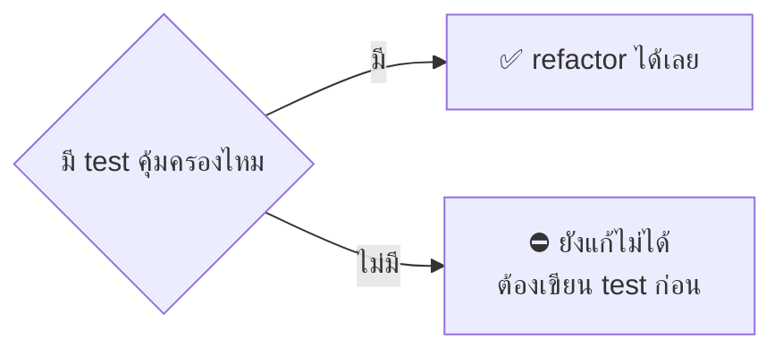
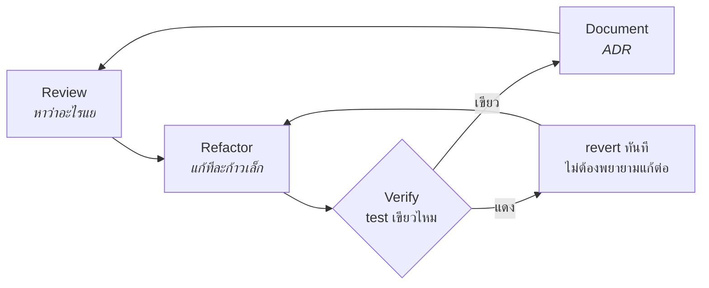
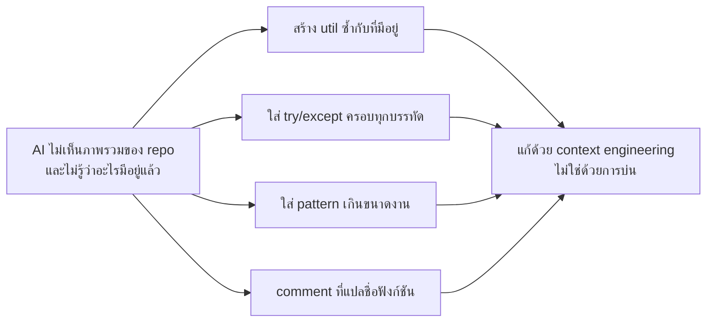
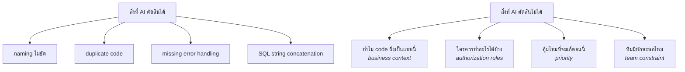
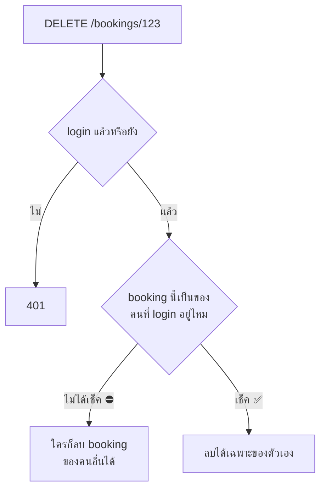
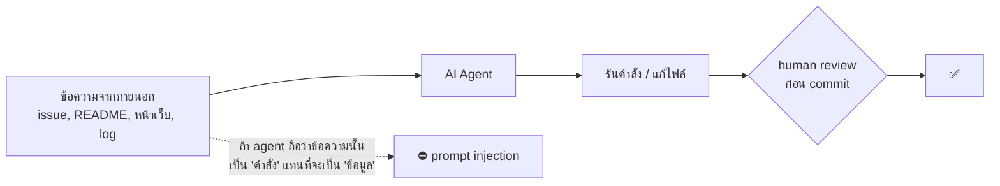
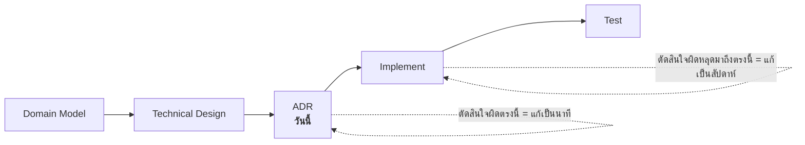
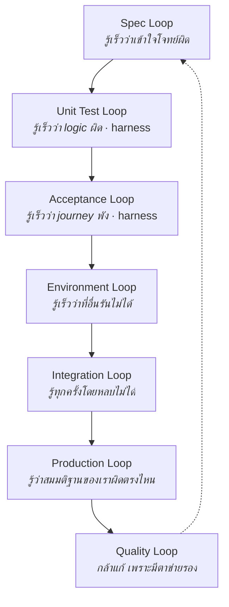

# Lecture: Code Quality, Security & the Quality Loop

**เวลารวม:** 30 นาที

*แนะนำการแบ่งเวลาสำหรับผู้สอน (หน่วย: นาที):* เปิดคาบ → 3 · หัวข้อ 1 → 4 · หัวข้อ 2 → 6 · หัวข้อ 3 → 4 · หัวข้อ 4 → 7 · หัวข้อ 5 → 2 · หัวข้อ 6 → 2

## 🎯 จบคาบนี้แล้วจะทำอะไรได้

| สิ่งที่จะทำได้ | ใช้ในงานจริงอย่างไร |
|---|---|
| refactor อย่างปลอดภัยโดยใช้ test เป็นตาข่าย | เป็นวิธีเดียวที่ทำให้แตะ code เก่าได้โดยไม่ทำ production ล่ม |
| แยกได้ว่าข้อเสนอของ AI อันไหนเชื่อได้ อันไหนต้องปฏิเสธ | AI ตัดสินเรื่องที่ต้องรู้ context ทางธุรกิจไม่ได้ และมักเสนอเกินความจำเป็น |
| มองเห็นช่องโหว่ authorization ที่เครื่องมือสแกนจับไม่ได้ | Broken Access Control เป็นช่องโหว่อันดับต้น ๆ ของระบบเว็บจริง |
| เขียน ADR ที่บันทึกทางเลือกที่ไม่ได้เลือกไว้ด้วย | ทำให้ทีมในอนาคตเถียงกันบนข้อเท็จจริงแทนความทรงจำ |

## 📖 ศัพท์ที่ต้องรู้ก่อนเริ่ม

คำที่จะโผล่ซ้ำตลอดคาบ — ถ้าติดตรงไหนให้ย้อนกลับมาดูตารางนี้

| ศัพท์ | ความหมายในบริบทของวิชานี้ |
|---|---|
| **Code smell** | สัญญาณว่า code น่าจะมีปัญหาเชิงโครงสร้าง แม้ตอนนี้จะยังทำงานถูกอยู่ |
| **Refactoring** | เปลี่ยนโครงสร้างภายในโดย **ไม่เปลี่ยนพฤติกรรมที่สังเกตได้จากภายนอก** |
| **Rewriting** | เขียนใหม่ทั้งก้อน — ความเสี่ยงสูงกว่า refactor มาก และต้องขออนุมัติต่างกัน |
| **Technical debt** | ทางลัดที่เลือกไว้วันนี้ แล้วต้องจ่ายคืนด้วยเวลาในอนาคต |
| **Safety net** | ชุด test ที่ทำให้กล้าแก้ code เพราะรู้ว่าถ้าทำพังจะมีอะไรบอกทันที |
| **Characterization test** | test ที่บันทึกพฤติกรรม *ปัจจุบัน* ไว้ตามที่มันเป็น เพื่อจับการเปลี่ยนแปลง ไม่ใช่เพื่อตัดสินว่าถูกหรือผิด |
| **ADR** (Architecture Decision Record) | เอกสารสั้น ๆ 1 ฉบับต่อ 1 การตัดสินใจ บันทึกบริบท ทางเลือกที่พิจารณา เหตุผลที่เลือก และผลที่ตามมา |
| **Superseded** | สถานะของ ADR ที่ถูกแทนที่ด้วยฉบับใหม่ — ไม่ลบทิ้ง เพราะประวัติการตัดสินใจมีค่าเท่ากับตัวการตัดสินใจ |
| **SOLID** | หลัก 5 ข้อสำหรับออกแบบ class/module ให้แก้ง่ายและกระทบกันน้อย |
| **OWASP Top 10** | รายการช่องโหว่เว็บที่พบบ่อยที่สุด ใช้เป็นมาตรฐานอ้างอิงใน security review ทั่วโลก |
| **Broken Access Control / IDOR** | ตรวจแค่ว่า login แล้ว แต่ไม่ตรวจว่ามีสิทธิ์กับข้อมูล *ชิ้นนั้น* — เดา id แล้วเข้าถึงของคนอื่นได้ |
| **SQL injection** | การแทรกคำสั่ง SQL ผ่านข้อมูลที่ผู้ใช้ส่งมา เพราะ code เอา string มาต่อกันตรง ๆ |
| **Prompt injection** | ข้อความในสิ่งที่ AI *อ่าน* (issue, README, หน้าเว็บ) ถูกตีความเป็น *คำสั่ง* ให้มันทำตาม |
| **Excessive agency** | การให้ AI agent มีสิทธิ์ลงมือทำมากเกินความจำเป็น เช่น deploy หรือลบข้อมูลได้เอง |
| **Least privilege** | ให้สิทธิ์น้อยที่สุดเท่าที่งานนั้นต้องใช้ — ใช้กับทั้งคนและ agent |

---

## ✅ ก่อนเริ่มคาบ — ต้องมีอะไรมาแล้วบ้าง

คาบนี้ต่อจาก `WS-08--before` โดยตรง และจะไม่ทวนเนื้อหาในนั้นซ้ำ
ให้ทุกคนเช็ครายการนี้กับตัวเองใน 2 นาทีแรก

- [ ] บอกชื่อ code smell ได้อย่างน้อย 4 แบบ
- [ ] อธิบายความต่างของ refactoring กับ rewriting ได้
- [ ] รัน AI review ทั้ง codebase มาแล้ว และมีผลติดมาด้วย
- [ ] เปิด Dependabot / CodeQL / secret scanning บน repo แล้ว และมี `docs/security-pre-check.md`
- [ ] เลือก function ที่แย่ที่สุดของกลุ่มไว้แล้ว พร้อมคำตอบว่ามี test คุ้มครองหรือไม่

> ข้อไหนยังไม่ครบ **ให้ยกมือบอกตอนนี้** ไม่ใช่ตอนเข้า lab —
> ของที่ขาดจะถูกจัดคู่ให้เพื่อนช่วยระหว่างที่ lecture เดินหน้าต่อ

---

## 0. เชื่อมจากสัปดาห์ที่แล้ว

7 สัปดาห์ที่ผ่านมาเราสร้างของเพิ่มตลอด — วันนี้เป็นสัปดาห์เดียวที่ **ไม่เพิ่ม feature อะไรเลย**
แต่เป็นสัปดาห์ที่ทำให้ทุกอย่างที่สร้างมาอยู่ต่อได้

**คำถามเปิดคาบ (คุยกันในกลุ่ม 1 นาที):**
> "เปิด function ที่กลุ่มคิดว่าแย่ที่สุดขึ้นมา — ตอนนี้มี test อะไรคุ้มครองมันอยู่บ้าง"



กลุ่มที่ตอบว่า "ไม่มีเลย" คือกลุ่มที่ **ยังแก้ไม่ได้** — และนั่นคือคำตอบที่ถูกต้อง
เพราะมันบอกลำดับงานของวันนี้ให้แล้ว

---

## 1. Quality Loop



Quality Loop ทำงานได้ก็เพราะมี **test harness จาก WS-03/WS-04 เป็นตาข่ายนิรภัย**

```
สมการแห่งหายนะ:
Code ที่ต้อง refactor + ไม่มี test = วิธีที่ดีที่สุดในการ break production

ขั้นตอนที่ถูกต้อง:
1. เขียน test ครอบคลุม behavior ที่ต้องรักษาก่อน
2. ยืนยัน test เขียวกับ code เก่า
3. Refactor ทีละก้าวเล็ก ๆ
4. รัน test หลังทุกก้าว — ต้องเขียวตลอด
5. ถ้าแดง → revert ทันที ไม่ต้องพยายามแก้ต่อ
```

> Refactoring คือการเปลี่ยน **โครงสร้าง** โดย **ไม่เปลี่ยนพฤติกรรม**
> ถ้าไม่มีอะไรยืนยันว่าพฤติกรรมไม่เปลี่ยน — สิ่งที่ทำอยู่ไม่ใช่ refactoring แต่คือการเขียนใหม่แล้วภาวนา

> 💼 **จากหน้างานจริง**
> ข้อ 5 เป็นข้อที่คนฝืนบ่อยที่สุด — พอ test แดงแล้วมักคิดว่า "อีกนิดเดียวก็เสร็จ" แล้วแก้ต่อ
> จนหลงทางไปไกลและกู้กลับไม่ได้ วิธีที่ใช้กันจริงคือ **commit ทุกครั้งที่เขียว**
> ให้ commit ถี่ ๆ เป็นจุด save เพื่อจะได้ `git reset --hard` กลับมาได้โดยไม่เสียใจ
> เทคนิคนี้บางทีเรียกว่า *"ถ้า test แดงเกิน 2 นาที ให้ย้อนกลับไปจุดที่เขียวล่าสุด"*
> ฟังดูโหด แต่มันเร็วกว่าการนั่งไล่ debug ของที่เพิ่งพังไปแบบไม่รู้ว่าพังตรงไหน

---

## 2. Code Smells ที่พบบ่อย

### Long Method

```python
# แย่: function ทำหลายอย่าง
def process_booking(room_id, user_id, start, end):
    # validate (5 lines)
    # check availability (8 lines)
    # calculate price (5 lines)
    # save to db (3 lines)
    # send notification (4 lines)
    # log event (2 lines)
    # return response (2 lines)
    # รวม 30+ lines ใน function เดียว

# ดี: Single Responsibility
def process_booking(room_id, user_id, start, end):
    validate_booking_input(room_id, user_id, start, end)
    check_room_availability(room_id, start, end)
    price = calculate_price(room_id, start, end)
    booking = save_booking(room_id, user_id, start, end, price)
    notify_user(user_id, booking)
    return booking
```

### Magic Numbers

```python
# แย่
if duration > 8:              # 8 คืออะไร
    raise ValueError("error")
price = hours * 150           # 150 คืออะไร

# ดี
MAX_BOOKING_HOURS = 8
HOURLY_RATE_THB = 150

if duration > MAX_BOOKING_HOURS:
    raise ValueError(f"Max {MAX_BOOKING_HOURS} hours per booking")
price = hours * HOURLY_RATE_THB
```

### Primitive Obsession

```python
# แย่: string/int ลอย ๆ ที่ไม่รู้ว่าหน่วยอะไร รูปแบบไหน
def create_booking(room: int, start: str, end: str, price: float): ...

# ดี: type ที่บอกความหมายและ validate ตัวเองได้
def create_booking(room: RoomId, slot: TimeSlot, price: Money): ...
```

### Smell ยุคใหม่: AI-Shaped Code



| อาการ | ตัวอย่าง |
|---|---|
| **Duplicate abstraction** | มี `formatDate` อยู่แล้ว 3 ที่ AI สร้างอันที่ 4 |
| **Over-defensive** | `try/except` ครอบทุกบรรทัดจนกลืน error จริง |
| **Comment ที่แปลชื่อฟังก์ชัน** | `# increment counter` เหนือ `counter += 1` |
| **Config ที่ไม่มีใครใช้** | option/flag ที่ generate มาแต่ไม่มีที่เรียก |
| **Pattern เกินขนาดงาน** | Factory + Strategy + Observer สำหรับ CRUD 3 endpoint |

> 💼 **จากหน้างานจริง**
> สิ่งที่ทีมเริ่มสังเกตเห็นเมื่อใช้ AI มาสักพักคือ **code เพิ่มเร็วกว่าความเข้าใจของทีม**
> โค้ดที่ไม่มีใครในทีมอธิบายได้เลยว่าทำไมถึงเขียนแบบนี้ คือหนี้ทางเทคนิคชนิดที่แย่ที่สุด
> เพราะไม่มีใครกล้าแตะ และไม่มีใครกล้าลบ
> ทางกันที่ได้ผลคือ **บังคับให้ PR เล็กพอที่คนจะอ่านจบจริง ๆ**
> ตัวเลขที่หลายทีมใช้คือ ~200–400 บรรทัดต่อ PR — เกินกว่านั้นคุณภาพของ review จะตกลงอย่างชัดเจน
> เพราะคนจะเริ่มอ่านผ่าน ๆ แล้วกด approve

---

## 3. AI Code Review: เชื่อตรงไหน ปฏิเสธตรงไหน



**หลักที่ใช้ตัดสิน:** AI เก่งเรื่องที่ตัดสินได้จาก **code ที่เห็นตรงหน้า**
และอ่อนเรื่องที่ต้องรู้ **สิ่งที่ไม่อยู่ใน context**

### Prompt ที่ได้ผล

```
Review this function. For each issue:
1. Specific code smell or problem name
2. WHY it's a problem (impact on this codebase)
3. Concrete fix with example
4. Severity: High/Medium/Low
Do not suggest new design patterns unless the current code has a concrete
problem they solve. Prefer the smallest change that removes the problem.
```

> 💼 **จากหน้างานจริง**
> code review ที่ดีมีเป้าหมายมากกว่าการหา bug — มันคือการ **แพร่ความรู้ในทีม**
> และเป็นที่ที่คนใหม่เรียนรู้ว่าทีมนี้ให้ค่ากับอะไร
> AI ทำส่วนที่เป็นกลไก (format, naming, null check) ได้ดีมาก และควรให้มันทำ
> เพื่อให้คนมีเวลาไปโฟกัสส่วนที่เครื่องทำไม่ได้: *"design แบบนี้จะพาเราไปไหนในอีก 6 เดือน"*
> ทีมที่ใช้ AI review ได้ผลดีคือทีมที่ให้มันทำ **ด่านแรก** แล้วให้คนตรวจ **ด่านที่ต้องใช้วิจารณญาณ**
> ไม่ใช่ทีมที่ให้ AI แทนคนทั้งหมด

---

## 4. Security: สิ่งที่ AI มักพลาด

### SQL Injection

```python
# แย่: AI บางครั้งสร้าง code แบบนี้เมื่อขอ "dynamic filter"
query = f"SELECT * FROM rooms WHERE name = '{user_input}'"
# ถ้า user_input = "'; DROP TABLE rooms; --" → disaster

# ดี: Parameterized queries
db.execute("SELECT * FROM rooms WHERE name = ?", (user_input,))
```

### Missing Authorization — ข้อที่ AI มองไม่เห็นที่สุด



```python
# แย่: ตรวจแค่ว่า login แล้ว
@login_required
def delete_booking(booking_id):
    Booking.get(booking_id).delete()   # ใครก็ลบ booking ของคนอื่นได้

# ดี: ตรวจ ownership ด้วย
@login_required
def delete_booking(booking_id):
    booking = Booking.get(booking_id)
    if booking.user_id != current_user.id:
        raise ForbiddenError("Not your booking")
    booking.delete()
```

> 💼 **จากหน้างานจริง**
> ช่องโหว่ประเภทนี้ (บางทีเรียกว่า IDOR — เดา id แล้วเข้าถึงของคนอื่นได้) เป็นหนึ่งใน
> ช่องโหว่ที่พบบ่อยที่สุดในระบบเว็บจริง และเป็นประเภทที่ **เครื่องมือสแกนอัตโนมัติจับได้ยากที่สุด**
> เหตุผลคือมันไม่ใช่ bug ของ code — code ทำงานถูกต้องตามที่เขียน
> มันคือ bug ของ *"เราไม่ได้บอกไว้ว่าใครควรทำอะไรได้"*
> AI ก็มองไม่เห็นด้วยเหตุผลเดียวกัน: มันไม่มีทางรู้กฎการเข้าถึงของระบบเรา ถ้าเราไม่เขียนไว้
> วิธีที่ใช้ได้จริงคือ **เขียนตารางสิทธิ์ไว้ (ใครทำอะไรกับ resource ไหนได้)
> แล้วเขียน test หนึ่งตัวต่อหนึ่งช่อง** — งานน่าเบื่อแต่คุ้มมาก

### Exposed Sensitive Data

```python
# แย่: return ทั้ง object
return user.__dict__          # รวม password_hash, internal_id

# ดี: explicit fields
return {"id": user.public_id, "name": user.name}
```
เช็คด้วยว่า **log ก็รั่วได้** (จาก WS-07) และ **error message ก็รั่วได้**
```python
return {"error": str(e)}      # ❌ อาจมี connection string อยู่ข้างใน
```

### Endpoint ที่ลืมปิด

`/api/test/seed` และ `/api/test/cleanup` จาก WS-04 — เปิดดูตอนนี้เลยว่ามี guard หรือยัง

### ความเสี่ยงใหม่: Excessive Agency ของ AI Agent



| ความเสี่ยง | ตัวอย่าง | ป้องกัน |
|---|---|---|
| **Prompt injection** | issue/README/หน้าเว็บที่ agent อ่าน มีข้อความสั่งให้มันทำอย่างอื่น | ถือว่าทุกอย่างที่ agent *อ่าน* คือข้อมูล ไม่ใช่คำสั่ง |
| **Excessive agency** | agent รัน `git push --force` หรือลบไฟล์ | จำกัดคำสั่งที่อนุญาต, review diff ก่อน commit เสมอ |
| **Data leak** | วาง production log ที่มี email เข้า chat | redact ก่อน (จาก WS-07) |
| **Secret ใน context** | agent อ่าน `.env` แล้วเผลอเขียนค่าลงไฟล์อื่น | `.env` อยู่ใน `.gitignore` + ห้ามใน `AGENTS.md` |

> 💼 **จากหน้างานจริง**
> หลักที่องค์กรใช้กันคือ **least privilege ใช้กับ agent เหมือนที่ใช้กับคน**:
> agent ที่ทำงาน docs ไม่ควรมีสิทธิ์ deploy, agent ที่ตอบคำถามลูกค้าไม่ควรเข้าถึง database ตรง ๆ
> และทุกการกระทำที่ย้อนกลับไม่ได้ (deploy, ลบข้อมูล, ส่งอีเมลออกไปข้างนอก, จ่ายเงิน)
> ต้องมีคนกดยืนยันเสมอ
> **กติกาที่ใช้ได้จริง: AI เสนอ diff — คนเป็นคนกด commit**
> อย่าให้ขั้น "ลงมือทำจริงกับของจริง" อยู่นอกสายตาคน

---

## 5. Responsible AI: License & Privacy

### License ของ AI-Generated Code

- ผู้ให้บริการรายใหญ่อนุญาตให้ใช้ output ใน commercial products — แต่ **อ่าน ToS ของตัวที่ใช้จริงเสมอ**
- ถ้า AI generate code ที่คล้ายของ GPL project มาก — อาจมีปัญหาเรื่อง license
- ในงานจริง หลายบริษัทมีนโยบายของตัวเองที่เข้มกว่า ToS

### อย่าส่งเข้า AI Tools

- Passwords, API keys, tokens (แม้ใน comment)
- Personal data ของ users (email, ชื่อจริง, รหัสนักศึกษา)
- Proprietary business logic ที่เป็น confidential
- Code ของบริษัทที่มี NDA

> 💼 **จากหน้างานจริง**
> เกือบทุกองค์กรตอนนี้มีรายการเครื่องมือ AI ที่ **อนุมัติแล้ว** กับ **ห้ามใช้**
> ความต่างมักอยู่ที่สัญญาว่าข้อมูลจะไม่ถูกนำไปเทรนต่อ และข้อมูลถูกเก็บที่ไหน
> การเอา source code ของบริษัทไปวางในเครื่องมือที่ไม่ได้รับอนุมัติ ถือเป็นเรื่องวินัย
> ไม่ใช่แค่เรื่องเทคนิค — และเป็นเรื่องที่นักศึกษาจบใหม่พลาดกันบ่อยเพราะเคยชินจากตอนเรียน
> **ติดนิสัยถามก่อนใช้ตั้งแต่ตอนนี้ จะช่วยคุณในที่ทำงานจริง**

---

## 6. ADR: บันทึกการตัดสินใจ

ADR แก้ปัญหา "ทำไมตอนนั้นถึงเลือกแบบนี้" ที่ไม่มีใครตอบได้ในอีก 6 เดือน

```markdown
# ADR-[number]: [Title]

## Status

Proposed / Accepted / Superseded by ADR-XXX

## Context

[ทำไมถึงต้องตัดสินใจเรื่องนี้ — constraint อะไรบ้าง]

## Decision

[ตัดสินใจอะไร]

## Alternatives Considered

[ทางเลือกอื่น + ทำไมถึงไม่เลือก]

## Consequences

Positive: [ข้อดี]
Negative: [trade-offs ที่ยอมรับ]

## AI-DLC Note

[AI เสนออะไร / human เห็นด้วยหรือ push back อะไร เพราะรู้อะไรที่ AI ไม่รู้]
```

section **Alternatives Considered** สำคัญที่สุด เพราะมันบอกว่า
เราคิดถึงทางอื่นแล้ว ไม่ใช่หยิบอันแรกที่ AI เสนอมาใช้

> 💼 **จากหน้างานจริง**
> ADR มีค่าที่สุดตอนที่ **มีคนอยากเปลี่ยนการตัดสินใจเดิม** — เพราะมันบอกว่าตอนนั้น
> เรารู้อะไรและไม่รู้อะไร ทำให้เถียงกันได้บนข้อเท็จจริงแทนความทรงจำ
> ADR ที่ดีจึงบันทึก **บริบทและข้อจำกัด ณ ตอนนั้น** ไว้ด้วย ไม่ใช่แค่ผลการตัดสินใจ
> และ ADR ไม่ต้องถูกลบเมื่อล้าสมัย — ให้ mark เป็น *Superseded* แล้วเขียนฉบับใหม่
> เพราะประวัติของการตัดสินใจก็มีค่าพอ ๆ กับตัวการตัดสินใจ
> ผลข้างเคียงที่ดีในยุค AI: ADR กลายเป็น context ชั้นเยี่ยมที่ทำให้ agent
> ไม่เสนอทางที่ทีมพิจารณาแล้วปฏิเสธไปแล้วซ้ำ ๆ

---

## Key Takeaways

- Quality Loop ทำงานได้เพราะมี test harness จาก WS-03/WS-04 เป็นตาข่ายนิรภัย
- Refactor ทีละก้าวเล็ก ๆ commit ทุกครั้งที่เขียว แดงเมื่อไหร่ revert ทันที
- AI เก่งเรื่องที่ตัดสินจาก code ตรงหน้า อ่อนเรื่องที่ต้องรู้ context ที่ไม่ได้ให้ไป
- Broken Access Control คือช่องโหว่ที่ทั้งเครื่องมือและ AI มองไม่เห็น — ต้องเขียนกฎสิทธิ์ไว้เอง
- ยุค agent มีความเสี่ยงใหม่: prompt injection และ excessive agency — คนต้องอยู่ตรงจุดที่ลงมือจริง
- PR ต้องเล็กพอที่คนจะอ่านจบจริง — code ที่ไม่มีใครเข้าใจคือหนี้ที่แย่ที่สุด
- ADR บันทึก "ทางที่ไม่ได้เลือก" และบริบท ณ ตอนนั้น ไม่ใช่แค่ผลการตัดสินใจ

---

## AI-DLC Connection: Construction Phase — ADR Stage



### ปิดท้ายทั้งวิชา: loop ครบวงแล้ว



> เครื่องมือในวิชานี้จะล้าสมัย — Playwright, k6, Actions จะถูกแทนที่ในไม่กี่ปี
> แต่คำถาม **"ฉันจะรู้ได้เร็วแค่ไหนว่าสิ่งที่เพิ่งทำไปมันผิด และฉันเชื่อสัญญาณนั้นได้แค่ไหน"**
> จะยังเป็นคำถามเดิมเสมอ ไม่ว่าจะมี AI เก่งขึ้นอีกกี่รุ่น
>
> ย้อนกลับไปที่คำถามแรกของ WS-01: *"กว่าจะรู้ว่าเขียนผิด ใช้เวลานานแค่ไหน"*
> ตอนนี้คำตอบของคุณควรเปลี่ยนไปแล้ว
