# IT Project Management ในยุค AI

> ⚠️ **หมายเหตุก่อนอ่าน:** เอกสารฉบับนี้สร้างขึ้นโดย **Claude Opus 5** จึงอาจมีเนื้อหาที่คลาดเคลื่อน
> ตกหล่น หรือล้าสมัยได้ ให้ใช้วิจารณญาณในการอ่าน ตรวจสอบย้อนกลับไปยังเอกสารอ้างอิงท้ายบท
> และเปรียบเทียบกับแหล่งข้อมูลอื่นประกอบเสมอ — การตั้งคำถามกับสิ่งที่อ่าน
> คือส่วนหนึ่งของการฝึก **critical thinking** ในวิชานี้

> **เชื่อมกับ loop ของวิชา:** การบริหารโครงการ คือการออกแบบ loop ที่ **ยาวที่สุด** ในองค์กร —
> วงจร "ตัดสินใจ → ลงมือ → เห็นผล → ปรับ" ที่กินเวลาเป็นสัปดาห์หรือเดือน

---

## 🎯 อ่านจบแล้วจะได้อะไร

| สิ่งที่จะทำได้ | ใช้ในงานจริงอย่างไร |
|---|---|
| อธิบายได้ว่าทำไมโครงการ IT ล้มเหลวบ่อยกว่าโครงการก่อสร้าง | ทำให้ประเมินความเสี่ยงของงานตัวเองได้ตั้งแต่ต้น ไม่ใช่ตอนสาย |
| แยกกระบวนการแบบ predictive ออกจาก adaptive และเลือกใช้ให้ถูกงาน | องค์กรจริงใช้ผสมกัน การเลือกผิดทำให้ทั้งทีมทำงานฝืนกระบวนการ |
| ทำ RACI และวางตัวกับแต่ละ role ได้ถูกจังหวะ | ความขัดแย้งในโครงการส่วนใหญ่ไม่ได้มาจากงาน แต่มาจากความไม่ชัดว่าใครตัดสินใจ |
| แตกงานเป็น WBS ที่ตรวจรับได้และหาเส้นทางวิกฤตเจอ | งานที่ไม่ปรากฏใน WBS คืองานที่จะโผล่มาในสัปดาห์สุดท้ายเสมอ |
| ประมาณงานด้วยวิธีที่มีหลักการ ไม่ใช่เดาเอาจากความรู้สึก | การประมาณคือสิ่งที่ junior ถูกขอให้ทำตั้งแต่เดือนแรก และเป็นสิ่งที่ทำพลาดบ่อยที่สุด |
| บอกได้ว่า AI ช่วยงาน PM ตรงไหนได้จริง และตรงไหนห้ามให้ช่วย | ป้องกันการส่งงานที่ดูดีแต่ตัวเลขไม่มีที่มา ซึ่งเป็นความเสี่ยงต่อชื่อเสียงของตัวเอง |

---

## 📖 ศัพท์ที่ต้องรู้ก่อนเริ่ม

| ศัพท์ | ความหมายในบริบทของวิชานี้ |
|---|---|
| **Scope** | ขอบเขตงาน — สิ่งที่ตกลงว่าจะส่งมอบ และโดยนัยคือสิ่งที่ตกลงว่าจะ *ไม่* ส่งมอบ |
| **Scope creep** | ขอบเขตที่บวมขึ้นทีละนิดโดยไม่มีใครอนุมัติเพิ่มเวลา/คน |
| **Stakeholder** | ทุกคนที่ได้รับผลกระทบจากโครงการ ไม่ใช่แค่คนจ่ายเงิน |
| **Deliverable** | ของที่ส่งมอบได้จริง ตรวจรับได้ ไม่ใช่ "ความคืบหน้า" |
| **Milestone** | จุดหมายที่มีวันที่ชัดเจน ใช้ยืนยันว่าโครงการยังอยู่ในเส้นทาง |
| **Baseline** | แผน/ตัวเลขที่ตกลงกันไว้ตอนต้น ใช้เป็นฐานเทียบว่าเบี่ยงไปเท่าไร |
| **Predictive / Waterfall** | วางแผนทั้งหมดล่วงหน้า เหมาะเมื่อความต้องการนิ่งและต้นทุนการเปลี่ยนสูง |
| **Adaptive / Agile** | วางแผนเป็นรอบสั้น ๆ เรียนรู้แล้วปรับ เหมาะเมื่อความต้องการยังไม่นิ่ง |
| **Iteration / Sprint** | รอบการทำงานที่จบด้วยของที่ใช้งานได้จริง 1 ชิ้น |
| **Velocity** | ปริมาณงานที่ทีมทำเสร็จจริงต่อรอบ ใช้พยากรณ์ ไม่ใช่ใช้เร่ง |
| **RACI** | ตารางระบุว่าใคร Responsible / Accountable / Consulted / Informed |
| **WBS** | Work Breakdown Structure — การแตกขอบเขตทั้งหมดลงเป็นชิ้นที่ตรวจรับได้ |
| **Work Package** | ชิ้นล่างสุดของ WBS ที่ประมาณเวลาได้และมอบหมายให้คนเดียวรับผิดชอบได้ |
| **กฎ 100%** | ลูกทุกตัวรวมกันต้องได้ขอบเขตของพ่อพอดี ไม่ขาดไม่เกิน |
| **Progressive elaboration** | แตกละเอียดเฉพาะงานที่ใกล้จะทำ ส่วนที่ไกลปล่อยเป็นก้อนใหญ่ไว้ก่อน |
| **Vertical slice** | การแตกงานเป็นชิ้นบางที่ทะลุทุกชั้นจนผู้ใช้ใช้ได้จริง ไม่ใช่แตกตามชั้นเทคนิค |
| **Critical path** | ลำดับงานที่ถ้าช้า 1 วัน โครงการทั้งหมดช้า 1 วัน |
| **Float / Slack** | เวลาที่งานหนึ่งยืดได้โดยไม่กระทบวันจบโครงการ |
| **Definition of Done (DoD)** | เงื่อนไขที่ทำให้งานชิ้นหนึ่งนับว่า "เสร็จ" เหมือนกันทั้งทีม |
| **Bolt** | หน่วยงานที่เล็กที่สุดที่ทำจนจบได้ใน AI-DLC ระดับชั่วโมงถึงวัน |

---

## 1. ทำไมโครงการ IT ถึงพลาดบ่อยเป็นพิเศษ

งานก่อสร้างสะพานกับงานสร้างระบบซอฟต์แวร์ต่างกันที่ **ความมองเห็นได้ของความคืบหน้า**
สะพานที่สร้างไปครึ่งหนึ่ง ใคร ๆ ก็ดูออกว่าครึ่งหนึ่ง
ระบบที่ "เขียนไปแล้ว 90%" อาจเหลืออีก 90% ก็ได้

งานวิจัยร่วมของ McKinsey กับ BT Centre for Major Programme Management แห่ง University of Oxford
ที่สำรวจโครงการ IT กว่า 5,400 โครงการ พบว่าโครงการขนาดใหญ่โดยเฉลี่ย
**ใช้งบเกินแผน 45%, ใช้เวลาเกินแผน 7% และส่งมอบคุณค่าได้น้อยกว่าที่สัญญาไว้ 56%**

ตัวเลขที่น่าสนใจกว่าค่าเฉลี่ยคือ **หาง** ของการกระจาย — งานวิจัยเดียวกันเรียกโครงการที่งบบานเกิน 200%
ว่า *black swan* และพบว่ามันเกิดบ่อยกว่าที่ทฤษฎีความน่าจะเป็นแบบปกติทำนายไว้มาก
Bent Flyvbjerg เรียกลักษณะนี้ว่า **fat-tailed risk**: ความเสียหายที่แท้จริงไม่ได้อยู่ที่ "เกินงบนิดหน่อยบ่อย ๆ"
แต่อยู่ที่ "เกินงบมหาศาลนาน ๆ ครั้ง" ซึ่งเป็นเหตุผลที่การวางแผนโดยดูแค่ค่าเฉลี่ยจึงไม่พอ

สาเหตุเชิงโครงสร้าง 4 ข้อ:

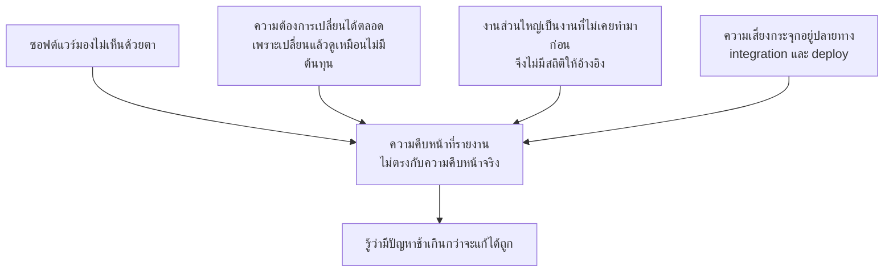

ข้อ D คือหัวใจที่เชื่อมกับวิชานี้โดยตรง: ถ้าความเสี่ยงทั้งหมดถูกเก็บไว้ตอนท้าย
loop ของโครงการจะมี latency สูงมาก — กว่าจะรู้ว่าพลาดก็เหลือเวลาน้อยเกินกว่าจะแก้
**มาตรการที่ตรงจุดที่สุดคือการบังคับให้ deploy ของจริงตั้งแต่สัปดาห์แรก ทั้งที่ยังไม่มี feature อะไรเลย**
นั่นคือการย้ายความเสี่ยงจากปลายทางมาไว้ต้นทาง

> 💼 **จากหน้างานจริง**
> คำถามที่ PM ที่มีประสบการณ์ถามในสัปดาห์แรกไม่ใช่ "จะเสร็จเมื่อไร"
> แต่คือ *"อะไรคือสิ่งที่เราไม่รู้ และเราจะรู้มันได้เร็วที่สุดเมื่อไร"*
> โครงการที่จัดการดีคือโครงการที่ทยอยลดความไม่รู้ ไม่ใช่โครงการที่ทำตามแผนได้เป๊ะ

---

## 2. วงจรชีวิตของโครงการ และกรอบของ Princeton

มหาวิทยาลัย Princeton เปิดเผยกระบวนการบริหารโครงการ IT ของตัวเองผ่านหน่วยงาน
**PATCO — Project and Technology Consulting Office** ซึ่งเป็นตัวอย่างที่ดีของกรอบที่ใช้จริงในองค์กร
เพราะมีทั้ง *เอกสารต้นแบบ* แยกตามระยะของโครงการ และมีเวอร์ชันแยกสำหรับโครงการแบบ agile

โครงสร้างที่ PATCO ใช้แบ่งโครงการเป็นระยะ พร้อมกำหนดว่าแต่ละระยะต้องมีเอกสารอะไรออกมา:

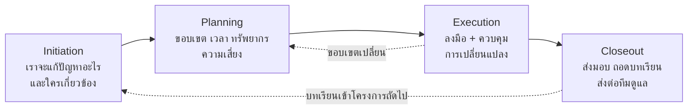

เอกสารสำคัญที่ปรากฏในกรอบลักษณะนี้ และมีอยู่จริงในองค์กรทั่วไป:

| ระยะ | เอกสาร | คำถามที่เอกสารนั้นตอบ |
|---|---|---|
| Initiation | Project Charter / Initiation Plan | ทำไมต้องทำ ใครอนุมัติ ขอบเขตคร่าว ๆ คืออะไร |
| Initiation | Project Roles / **RACI Matrix** | ใครตัดสินใจ ใครลงมือ ใครต้องถูกถาม ใครแค่รับรู้ |
| Planning | Work Breakdown / Schedule | งานใหญ่แตกเป็นงานย่อยอะไร ลำดับเป็นอย่างไร |
| Planning | Risk Register | อะไรอาจพัง เราจะรู้ได้อย่างไร และจะทำอะไร |
| Execution | Status Report / Change Log | ตอนนี้อยู่ตรงไหนเทียบ baseline และมีอะไรเปลี่ยนบ้าง |
| Closeout | Post Project Responsibilities | ใครดูแลต่อหลังโครงการจบ — จุดที่โครงการมหาวิทยาลัยพลาดบ่อยที่สุด |

Princeton ยังมี **PPIM — Princeton Process Improvement Methodology** สำหรับงานที่เป้าหมายคือ
"ปรับกระบวนการ" ไม่ใช่ "สร้างระบบใหม่" ซึ่งเป็นการแยกที่มีประโยชน์มาก
เพราะโครงการ IT จำนวนมากที่ล้มเหลว แท้จริงแล้วเป็นโครงการเปลี่ยนกระบวนการทำงานของคน
ที่ถูกจัดการเหมือนเป็นโครงการเขียนซอฟต์แวร์

> 💼 **จากหน้างานจริง**
> เอกสารระยะ Closeout คือเอกสารที่ถูกข้ามบ่อยที่สุดและเจ็บที่สุด
> ระบบที่ส่งมอบแล้วไม่มีใครรับผิดชอบดูแลต่อ จะกลายเป็น "ระบบผี" ภายใน 1 ปี —
> ยังมีคนใช้ แต่ไม่มีใครกล้าแตะ และต้องใช้เทคนิคอย่าง characterization test เข้าไปแกะทีหลัง

---

## 3. RACI — ใครทำอะไร และ PM ต้องวางตัวอย่างไรกับแต่ละ role

คำถามที่ทำให้โครงการพังเงียบ ๆ มากที่สุดไม่ใช่ "งานนี้ทำอย่างไร"
แต่คือ **"ตกลงใครตัดสินใจเรื่องนี้"** RACI คือเครื่องมือหน้าเดียวที่ตอบคำถามนี้
ก่อนที่มันจะกลายเป็นข้อพิพาทตอนงานสาย

### 3.1 ความหมายของแต่ละตัวอักษร

| ตัวอักษร | ชื่อเต็ม | ความหมายที่ใช้ตัดสินจริง | จำนวนต่อ 1 งาน |
|---|---|---|---|
| **R** | **Responsible** | คนที่ *ลงมือทำ* งานนั้น มือเปื้อนจริง | ≥ 1 (มีหลายคนได้) |
| **A** | **Accountable** | คนที่ *รับผิดชอบผลลัพธ์* และเป็นคนอนุมัติว่างานนี้เสร็จ | **ต้องมี 1 คนเท่านั้น** |
| **C** | **Consulted** | คนที่ต้อง *ถูกถามก่อนตัดสินใจ* — สื่อสารสองทาง | 0 ถึงหลายคน |
| **I** | **Informed** | คนที่ต้อง *รู้ผลหลังตัดสินใจแล้ว* — สื่อสารทางเดียว | 0 ถึงหลายคน |

เส้นแบ่งที่คนสับสนมากที่สุดคือ **A กับ R** และ **C กับ I**

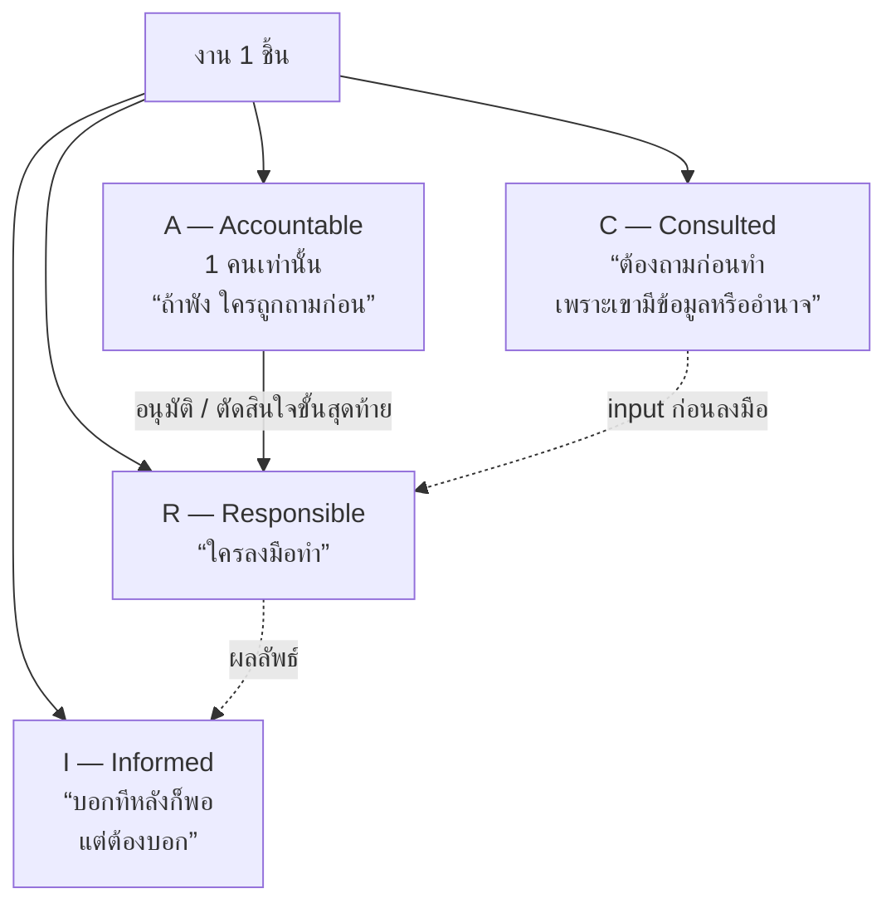

**วิธีทดสอบว่าใส่ตัวอักษรถูกไหม** — ถามคำถามเดียวนี้:

> *ถ้างานชิ้นนี้พังต่อหน้าอาจารย์หรือลูกค้า ใครคือคนที่ต้องยืนขึ้นตอบ?*

คำตอบต้องเป็น **ชื่อคนเดียว** — คนนั้นคือ A
ถ้าตอบว่า "ทั้งกลุ่ม" แปลว่ายังไม่มี A จริง และในทางปฏิบัติแปลว่า **ไม่มีใครรับผิดชอบ**

### 3.2 กติกาที่ห้ามละเมิด

1. **หนึ่งงาน = หนึ่ง A เท่านั้น** — A สองคนคือการไม่มี A
   เมื่อเกิดปัญหา ทั้งสองคนจะคิดว่าอีกคนดูอยู่
2. **ทุกงานต้องมี A** — งานที่ไม่มี A คืองานที่จะถูกลืม
3. **A กับ R เป็นคนเดียวกันได้** เขียนเป็น `A/R` โดยเฉพาะในทีมเล็ก
4. **C ไม่ใช่สิทธิ์ยับยั้ง** — C ให้ข้อมูลและความเห็น แต่คนตัดสินคือ A
   ถ้า C มีอำนาจหยุดงานได้จริง เขาไม่ใช่ C เขาคือ A
5. **อย่าใส่ C เยอะเกินไป** — ทุก C คือการรอ 1 รอบ
   RACI ที่มี C สิบคนคือแผนที่ของความล่าช้า

### 3.3 ตัวอย่างจริงสำหรับโครงการในวิชานี้

| กิจกรรม | Product Owner<br/>(ตัวแทนผู้ใช้) | PM /<br/>Team Lead | Dev | QA /<br/>ผู้ทดสอบ | อาจารย์ /<br/>Sponsor |
|---|:---:|:---:|:---:|:---:|:---:|
| กำหนดขอบเขตและลำดับความสำคัญ | **A** | R | C | I | C |
| เขียน user story + AC | A | R | C | C | I |
| เลือก tech stack | I | **A** | R | C | C |
| ออกแบบ API contract | C | A | **R** | C | I |
| เขียน code + unit test | I | A | **R** | I | — |
| ออกแบบและรัน E2E test | C | A | C | **R** | I |
| อนุมัติ deploy ขึ้น staging | I | **A/R** | R | C | I |
| ตัดสินใจตัด feature เมื่อเวลาไม่พอ | **A** | R | C | I | C |
| เขียน ADR | I | A | **R** | C | I |
| รายงานความคืบหน้ารายสัปดาห์ | I | **A/R** | I | I | **I** |

สังเกตแถว *ตัดสินใจตัด feature* — A อยู่ที่ Product Owner ไม่ใช่ PM
เพราะการตัดของออกเป็นการตัดสินใจเรื่อง **คุณค่า** ไม่ใช่เรื่อง **แผน**
นี่คือเส้นแบ่งที่สำคัญที่สุดเส้นหนึ่งในงานจริง และเป็นจุดที่ PM มือใหม่ก้าวข้ามบ่อยที่สุด

> 💼 **จากหน้างานจริง**
> ในทีมเล็ก คนหนึ่งมักสวมหลายหมวก การมี RACI ไม่ได้แปลว่าต้องมีคน 5 คน
> แต่แปลว่าเวลาสวมหมวกไหน ต้องรู้ตัวว่ากำลังพูดในฐานะอะไร
> ประโยคที่ได้ยินในทีมที่ทำถูกคือ *"อันนี้ผมพูดในฐานะ dev นะ ยังไม่ใช่การตัดสินใจในฐานะ lead"*

### 3.4 พฤติกรรมของ PM ต่อแต่ละ role

RACI จะไร้ประโยชน์ทันทีถ้า PM ปฏิบัติกับทุกคนเหมือนกันหมด
สิ่งที่เปลี่ยนตาม role ไม่ใช่แค่ *ใครได้อีเมล* แต่คือ **จังหวะ ช่องทาง และรูปแบบของข้อมูล**

#### 🔵 กับคนที่เป็น **A (Accountable)**

*PM มีหน้าที่ทำให้เขาตัดสินใจได้ ไม่ใช่ตัดสินใจแทนเขา*

| ทำ | ไม่ทำ |
|---|---|
| เสนอทางเลือกพร้อม trade-off อย่างน้อย 2 ทาง และบอกว่าตัวเองแนะนำอันไหน | ถามลอย ๆ ว่า "จะเอาแบบไหนดีครับ" โดยไม่มีข้อมูลประกอบ |
| ระบุ **deadline ของการตัดสินใจ** ว่าถ้าเลยวันนี้จะเกิดอะไร | ปล่อยให้เรื่องค้างแล้วโทษว่าเขาไม่ตอบ |
| บันทึกทุกการตัดสินใจเป็นลายลักษณ์อักษรและส่งกลับให้ยืนยัน | อาศัยความจำจากที่คุยกันในห้อง |
| เตือนล่วงหน้าเมื่อ trade-off เริ่มเปลี่ยน | รอจนถึงวันสุดท้ายแล้วค่อยบอกว่าทำไม่ทัน |

ประโยคที่ใช้ได้จริง:
> "ตอนนี้มี 2 ทาง — A ใช้เวลาเพิ่ม 3 วันแต่ทดสอบได้ครบ, B ทันกำหนดแต่ไม่มี E2E
> ผมแนะนำ A ครับ ขอคำตอบภายในวันพฤหัสฯ เพราะหลังจากนั้นเปลี่ยนไม่ทันแล้ว"

#### 🟢 กับคนที่เป็น **R (Responsible)**

*PM มีหน้าที่กำจัดสิ่งกีดขวาง ไม่ใช่เร่งหรือควบคุมรายละเอียด*

| ทำ | ไม่ทำ |
|---|---|
| ตกลง **Definition of Done** ให้ชัดก่อนเริ่ม | ถามความคืบหน้าเป็น % ทุกวัน |
| ถามว่า "ติดอะไรอยู่ ให้ช่วยอะไรได้บ้าง" | ถามว่า "เสร็จหรือยัง" ซ้ำ ๆ |
| ปกป้องเวลาโฟกัสของเขา รวบคำถามเป็นรอบ | ทักแทรกทีละคำถามตลอดวัน |
| ให้เขาเป็นคนประมาณเวลาเอง | ยัดตัวเลขที่ตกลงกับคนอื่นไว้แล้วมาให้ |
| รับข่าวร้ายโดยไม่ตำหนิ เพื่อให้ครั้งหน้ายังกล้าบอกเร็ว | แสดงความผิดหวังตอนได้ยินข่าวร้าย |

แถวสุดท้ายสำคัญที่สุด — **ทีมจะบอกข่าวร้ายเร็วแค่ไหน ขึ้นกับว่าครั้งก่อนบอกแล้วเจออะไร**
นี่คือ latency ของ loop ระดับทีม และ PM เป็นคนกำหนดมันด้วยปฏิกิริยาของตัวเอง

#### 🟡 กับคนที่เป็น **C (Consulted)**

*PM มีหน้าที่ถามให้ตรงจุดและถามให้ทัน — ไม่ใช่ถามทุกเรื่องเพื่อเอาตัวรอด*

| ทำ | ไม่ทำ |
|---|---|
| ถามคำถามที่เจาะจงพอจะตอบได้ใน 10 นาที | ส่งเอกสาร 20 หน้าไปแล้วบอกว่า "ช่วยดูให้หน่อย" |
| บอกชัดว่าต้องการคำตอบภายในเมื่อไร และถ้าไม่ตอบจะถือว่าอย่างไร | รอคำตอบไม่มีกำหนดแล้วอ้างว่าติดรอ |
| ถามให้ทันก่อนงานเริ่ม ไม่ใช่หลังทำเสร็จแล้ว | เอาของที่ทำเสร็จแล้วไปให้ดูเพื่อขอความเห็นชอบ |
| ปิด loop กลับไปว่าความเห็นของเขาถูกใช้อย่างไร รวมถึงกรณีที่ไม่ได้ใช้ | เงียบหายไปหลังได้คำตอบ |

การปิด loop กลับคือสิ่งที่ทำให้ครั้งหน้าเขายังตอบเร็ว —
คนที่ให้ความเห็นแล้วไม่เคยรู้ว่ามันไปไหนต่อ จะเลิกให้ความเห็นในที่สุด

#### ⚪ กับคนที่เป็น **I (Informed)**

*PM มีหน้าที่ทำให้เขาไม่ต้องมาถาม — ด้วยข้อมูลที่สม่ำเสมอและอ่านจบใน 30 วินาที*

| ทำ | ไม่ทำ |
|---|---|
| ส่งอัปเดตตามรอบที่ตกลงไว้ แม้สัปดาห์ที่ไม่มีอะไรคืบหน้า | ส่งเฉพาะตอนมีข่าวดี |
| เขียนสั้น มีโครงเดิมทุกครั้ง: เสร็จอะไร / กำลังทำอะไร / ติดอะไร / ต้องการอะไร | ส่ง log ดิบหรือรายละเอียดเชิงเทคนิคที่เขาไม่ได้ใช้ |
| ยกระดับเป็นการคุยตัวต่อตัวทันทีเมื่อเป็นข่าวร้ายใหญ่ | ให้เขารู้ข่าวร้ายครั้งแรกจากอีเมลรวม |
| แยกให้ชัดว่าอันไหนคือ "แจ้งเพื่อทราบ" อันไหนคือ "ขอการตัดสินใจ" | ปนสองอย่างในข้อความเดียว |

> 💼 **จากหน้างานจริง**
> กฎ **no surprises** — ผู้บริหารยอมรับข่าวร้ายได้ แต่ไม่ยอมรับข่าวร้ายที่เพิ่งรู้ตอนสาย
> PM ที่รายงานปัญหาตั้งแต่ยังเป็นแค่ความเสี่ยง จะได้รับความเชื่อถือมากกว่า
> PM ที่รายงานว่าทุกอย่างเรียบร้อยมาตลอดแล้วจู่ ๆ ก็บอกว่าทำไม่ทัน

### 3.5 อาการป่วยของ RACI ที่พบบ่อย

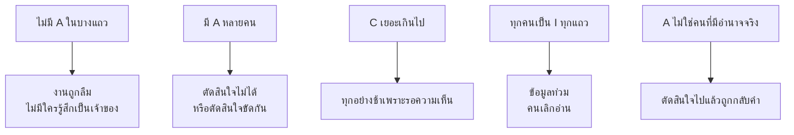

ข้อสุดท้ายอันตรายที่สุด: การเขียนชื่อคนที่ *ไม่มีอำนาจจริง* ลงในช่อง A
ทำให้เอกสารดูสมบูรณ์แต่ในความเป็นจริง การตัดสินใจยังต้องขึ้นไปข้างบนอยู่ดี
วิธีตรวจคือถามว่า **"คนนี้พูดคำเดียวแล้วเรื่องจบเลยไหม"**

### 3.6 ตัวแปรอื่นที่จะเจอในงานจริง

| รูปแบบ | เพิ่มอะไร | ใช้เมื่อไร |
|---|---|---|
| **RASCI** | เพิ่ม **S — Support** คนที่ช่วยลงแรงแต่ไม่ใช่เจ้าของงาน | ทีมใหญ่ที่มีคนช่วยข้ามทีม |
| **RACI-VS** | เพิ่ม **V — Verifier**, **S — Signatory** | งานที่มีการตรวจรับอย่างเป็นทางการ |
| **DACI** | **Driver / Approver / Contributor / Informed** | ใช้กับ *การตัดสินใจ* มากกว่างาน |
| **MOCHA** | **Manager / Owner / Consulted / Helper / Approver** | นิยมในองค์กรที่ทำงานเป็น squad |

ทั้งหมดแก้ปัญหาเดียวกัน: **ทำให้ความเป็นเจ้าของและอำนาจตัดสินใจชัดเจนก่อนเริ่มงาน**
สำหรับโครงการขนาดวิชาเรียน RACI แบบพื้นฐานเพียงพอแล้ว —
สิ่งที่ต้องได้จริงคือคำตอบของคำถามว่า *ใครตัดสินใจเรื่อง scope* และ *ใครอนุมัติว่างานเสร็จ*

### 3.7 ทำ RACI ของกลุ่มใน 20 นาที

1. เขียนกิจกรรมหลักของโครงการเป็นแถว — เอาแค่ 8–12 แถวที่สำคัญจริง
2. เขียนชื่อคนในกลุ่มเป็นคอลัมน์ ไม่ใช่ตำแหน่งลอย ๆ
3. ไล่ทีละแถว **ใส่ A ก่อนเสมอ** แล้วค่อยใส่ R, C, I
4. ตรวจ 3 ข้อ: ทุกแถวมี A พอดี 1, ทุกแถวมี R อย่างน้อย 1, ไม่มีคอลัมน์ไหนว่างทั้งคอลัมน์
5. อ่านออกเสียงให้ทุกคนฟัง แล้วถามว่า *"ใครไม่เห็นด้วยกับแถวไหน"* — ความขัดแย้งที่โผล่ตรงนี้
   คือความขัดแย้งที่ประหยัดเวลาที่สุดในทั้งโครงการ
6. เก็บไว้ที่ `docs/raci.md` และทบทวนอีกครั้งกลางเทอม

---

## 4. Predictive กับ Adaptive: เลือกอย่างไรให้ถูกงาน

**PMBOK Guide ฉบับที่ 7** ของ PMI เปลี่ยนแนวทางครั้งใหญ่ จากเดิมที่บอกเป็น *กระบวนการ 49 ข้อ*
มาเป็น **12 หลักการ** และ **8 performance domains** โดยยอมรับชัดเจนว่า
วิธีบริหารต้องเลือกให้เหมาะกับบริบทของงาน ไม่มีสูตรเดียวที่ใช้ได้ทุกที่

หลักการเลือกที่ใช้ได้จริง:

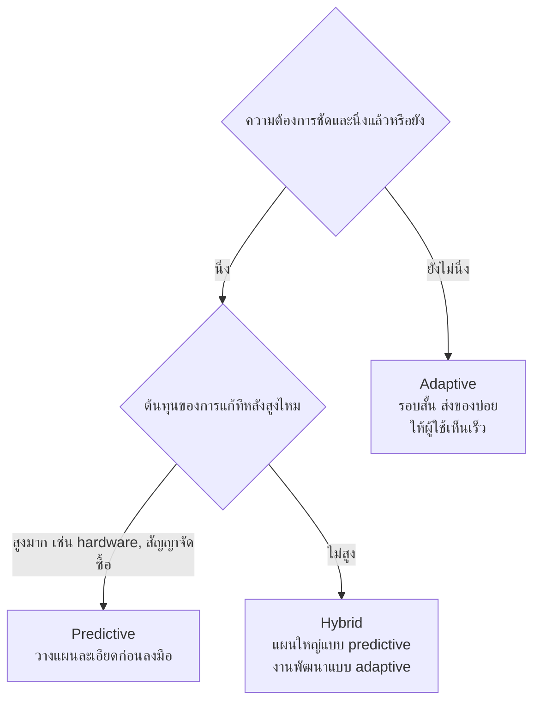

ในความเป็นจริงขององค์กรไทยส่วนใหญ่ คำตอบคือ **Hybrid**:
สัญญาและงบประมาณถูกล็อกแบบ predictive เพราะระบบจัดซื้อบังคับ
แต่ทีมพัฒนาทำงานเป็นรอบสั้นแบบ adaptive ข้างใน
ความขัดแย้งนี้ไม่ใช่ความผิดพลาด แต่เป็นเงื่อนไขที่ต้องบริหาร —
วิธีจัดการคือ **ล็อกงบและเวลาไว้ แต่ปล่อยให้ scope ยืดหยุ่นได้ตามลำดับความสำคัญ**

### สามเหลี่ยมข้อจำกัด และเหตุผลที่มันไม่พอ

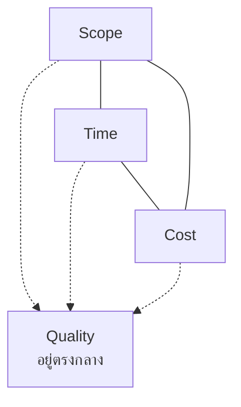

สามเหลี่ยมคลาสสิกบอกว่าเลือกได้แค่ 2 จาก 3 — แต่ในงานจริง
เมื่อผู้บริหารยืนยันทั้ง 3 ด้าน สิ่งที่ถูกลดคือ **Quality** เสมอ โดยไม่มีใครประกาศ
มันจะกลายเป็นหนี้เทคนิคที่ถูกจ่ายคืนพร้อมดอกเบี้ยในไตรมาสถัดไป

PMBOK 7 จึงขยายเป็น 6 ข้อจำกัด โดยเพิ่ม **Quality, Risk และ Resources**
ประโยชน์ของการเพิ่มคือทำให้ trade-off ถูกพูดออกมาดัง ๆ แทนที่จะเกิดขึ้นเงียบ ๆ

---

## 5. Work Breakdown Structure — แตกงานให้ประมาณได้

ก่อนจะประมาณเวลาได้ ต้องรู้ก่อนว่า *มีงานอะไรบ้าง*
**WBS** คือการแตกขอบเขตทั้งหมดของโครงการลงเป็นชิ้นเล็กที่มองเห็นและตรวจรับได้
มันเป็นเครื่องมือที่ดูธรรมดาที่สุดแต่แก้ปัญหาได้มากที่สุด เพราะงานที่ไม่ปรากฏใน WBS
คืองานที่ไม่มีใครประมาณเวลาให้ ไม่มีใครเป็นเจ้าของ และจะโผล่มาในสัปดาห์สุดท้ายเสมอ

### 5.1 กติกา 3 ข้อที่ทำให้ WBS ใช้ได้จริง

**ข้อ 1 — กฎ 100%**
ทุกระดับต้องรวมกันได้ **100% ของขอบเขต** ของระดับบน ไม่ขาดและไม่เกิน
ถ้าลูกทุกตัวรวมกันแล้วยังไม่ครบสิ่งที่พ่อสัญญาไว้ แปลว่ามีงานที่หายไป
ถ้ารวมกันแล้วเกิน แปลว่ามี scope creep แอบเข้ามาแล้ว

**ข้อ 2 — เป็น "ของ" ไม่ใช่ "การกระทำ"**
WBS ที่ดีแตกเป็น **deliverable** ที่ตรวจรับได้ ไม่ใช่กิจกรรมลอย ๆ

> ❌ "พัฒนาระบบ" · "ทดสอบ" · "ประชุมทีม"
> ✅ "API contract ที่ผ่าน review แล้ว" · "รายงานผล E2E ที่เขียวทั้งชุด" · "Dockerfile ที่ build ผ่าน CI"

เหตุผลคือ "ทดสอบ" ตอบไม่ได้ว่าเสร็จเมื่อไร แต่ "รายงานผล E2E ที่เขียวทั้งชุด" ตอบได้ทันที

**ข้อ 3 — แตกจนถึงขนาดที่ประมาณได้และมอบหมายได้**
หน่วยล่างสุดเรียกว่า **Work Package** เกณฑ์ที่ใช้กันคือ **กฎ 8/80** —
งานหนึ่งชิ้นควรใช้เวลาระหว่าง 8 ถึง 80 ชั่วโมง
สำหรับโครงการขนาดวิชาเรียนควรเล็กกว่านั้น: **4–16 ชั่วโมง** ต่อชิ้น

| อาการ | แปลว่า |
|---|---|
| ประมาณเวลาไม่ได้เลย ตอบได้แค่ "ไม่รู้" | ยังใหญ่เกินไป ต้องแตกต่อ |
| ต้องใช้คน 3 คนจากคนละส่วนพร้อมกัน | ยังใหญ่เกินไป หรือขอบเขตยังพร่า |
| แตกจนมี work package 200 ชิ้นในโครงการ 8 สัปดาห์ | ละเอียดเกินไป ต้นทุนการดูแลจะเกินประโยชน์ |

### 5.2 หน้าตาของ WBS

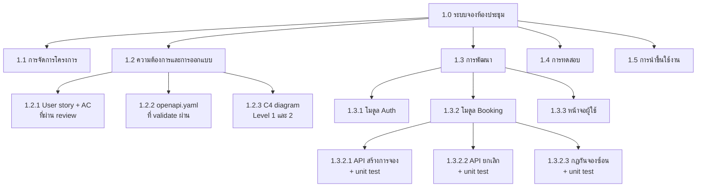

สังเกตว่า **1.1 การจัดการโครงการ** ก็เป็นกิ่งหนึ่งใน WBS ด้วย
เพราะการประชุม การเขียนรายงาน และการเตรียม present กินเวลาจริง
โครงการที่ลืมใส่กิ่งนี้จะประมาณเวลาต่ำกว่าความจริงประมาณ 10–20% ทันที

### 5.3 เลือกวิธีแตกให้เหมาะกับงาน

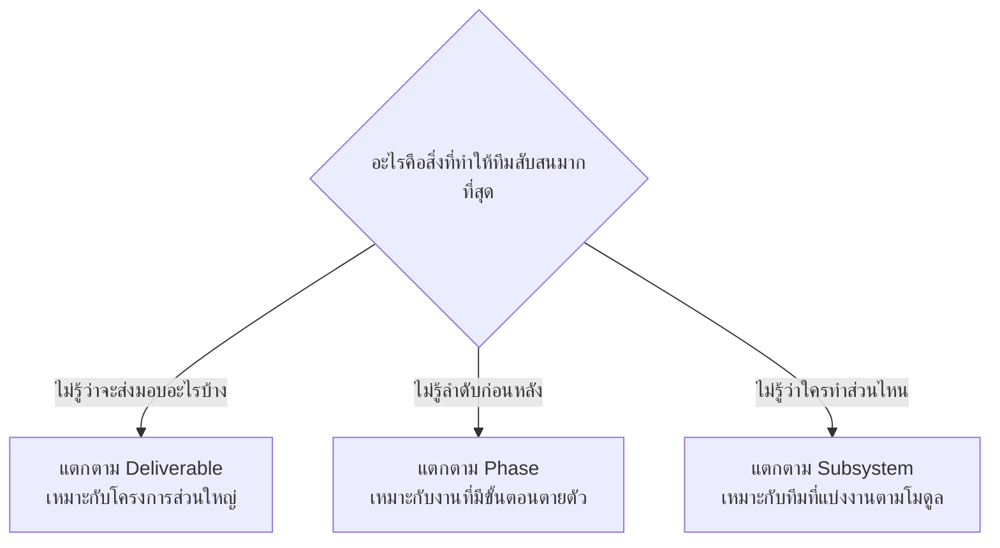

**ระดับบนกับระดับล่างใช้คนละวิธีได้** และมักจะดีกว่าด้วย เช่น
ระดับ 2 แตกตาม phase (ออกแบบ / พัฒนา / ทดสอบ / นำขึ้นใช้)
แต่ระดับ 3 ภายใต้ "พัฒนา" แตกตาม subsystem
สิ่งที่ห้ามคือการปนสองวิธีใน *ระดับเดียวกัน* เพราะจะทำให้กฎ 100% ตรวจไม่ได้

### 5.4 WBS Dictionary — ที่ที่ความคลุมเครือไปตาย

WBS เป็นแค่ชื่อกล่อง สิ่งที่ทำให้มันใช้งานได้จริงคือ **WBS Dictionary**
ซึ่งเป็นตารางที่อธิบายแต่ละ work package

| ช่อง | ตัวอย่าง |
|---|---|
| **รหัส** | 1.3.2.3 |
| **ชื่อ** | กฎกันจองซ้อน + unit test |
| **สิ่งที่ส่งมอบ** | ฟังก์ชันตรวจช่วงเวลาทับซ้อน + unit test ครอบคลุมกรณีขอบ |
| **เกณฑ์ยอมรับ** | test ผ่านทุกกรณีในตาราง boundary + CI เขียว + มีคนอื่น review แล้ว |
| **ไม่รวมอะไร** | ไม่รวมหน้าจอแจ้งเตือน ไม่รวมการแจ้งอีเมล |
| **ผู้รับผิดชอบ (R)** | [ชื่อ] |
| **ผู้อนุมัติ (A)** | [ชื่อ] *(เชื่อมกับ RACI ในหัวข้อ 3)* |
| **ประมาณเวลา** | 6 ชั่วโมง (O=4, M=6, P=12 → PERT ≈ 6.7) |
| **ขึ้นกับงานไหน** | 1.2.2 openapi.yaml ต้องเสร็จก่อน |

ช่อง **"ไม่รวมอะไร"** คือช่องที่มีค่าที่สุดและคนละเลยบ่อยที่สุด
ข้อพิพาทเรื่องขอบเขตเกือบทั้งหมดเกิดจากการที่สองฝ่ายเข้าใจ *ขอบนอก* ของงานไม่ตรงกัน
ไม่ใช่เข้าใจแกนกลางไม่ตรงกัน

### 5.5 จาก WBS ไปสู่ตารางเวลา

WBS บอกว่า *มีอะไรบ้าง* แต่ไม่บอกว่า *ทำอันไหนก่อน* ขั้นถัดไปคือใส่ลำดับการพึ่งพา

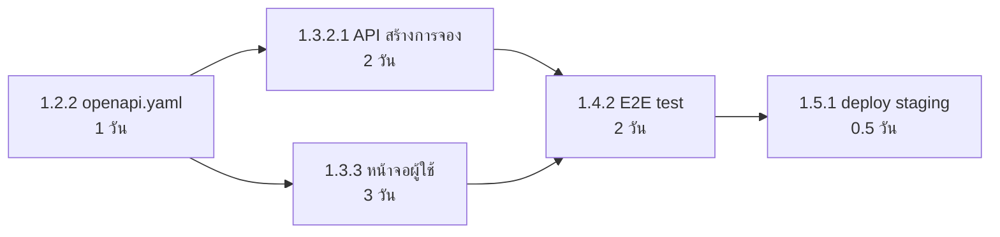

เส้นทางที่ยาวที่สุดจากต้นถึงปลายคือ **critical path** — ในภาพนี้คือ
`1.2.2 → 1.3.3 → 1.4.2 → 1.5.1` รวม 6.5 วัน
งานบนเส้นนี้ถ้าช้า 1 วัน ทั้งโครงการช้า 1 วัน ส่วนงานนอกเส้นมี **float** ให้ยืดหยุ่นได้

ประโยชน์ที่ใช้ได้ทันที: **เวลามีปัญหาต้องเลือกว่าจะช่วยใครก่อน ให้ช่วยคนที่อยู่บน critical path**

### 5.6 WBS ในโลก Agile — และในวิชานี้

หลายคนเข้าใจว่า agile ไม่ใช้ WBS ซึ่งไม่จริง มันแค่เปลี่ยนชื่อและเปลี่ยนจังหวะการทำ

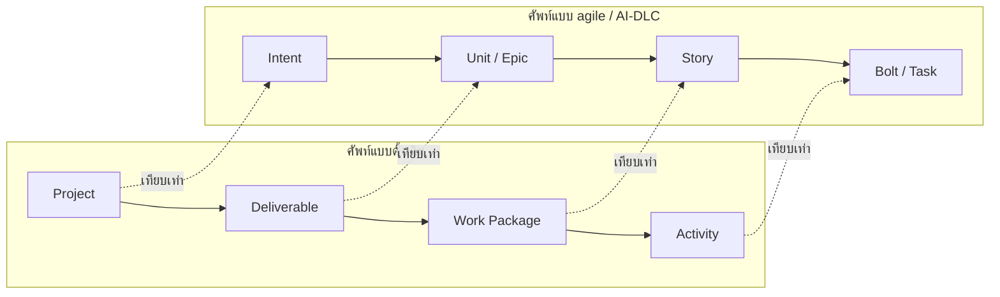

ความต่างที่แท้จริงมี 2 ข้อ

1. **ความละเอียดไม่เท่ากันทั้งแผน** — งานที่จะทำเดือนหน้าแตกละเอียด
   งานที่จะทำอีก 3 เดือนปล่อยไว้เป็นก้อนใหญ่ก่อน เรียกว่า **progressive elaboration**
   การแตกละเอียดทุกอย่างตั้งแต่วันแรกคือการทิ้งงานเปล่า เพราะครึ่งหนึ่งจะเปลี่ยน
2. **หน่วยล่างสุดต้องส่งมอบคุณค่าได้** — story ต้องเป็นสิ่งที่ผู้ใช้ทำได้ 1 อย่าง
   ไม่ใช่ชิ้นส่วนทางเทคนิคที่ผู้ใช้ไม่เห็น

> ❌ แตกแบบชั้นเทคนิค: "ทำ database" → "ทำ API" → "ทำ UI"
>   ปัญหา: จบสองงานแรกแล้วยังไม่มีอะไรให้ผู้ใช้ลองใช้เลย และยังไม่รู้ว่าออกแบบถูกไหม
>
> ✅ แตกแบบชิ้นบาง (vertical slice): "จองห้องได้ 1 ห้องในวันเดียว โดยยังไม่มีการยกเลิก"
>   ได้ของที่ deploy ได้จริงตั้งแต่สัปดาห์แรก และได้ feedback ทันที

การแตกแบบชิ้นบางคือ WBS เวอร์ชันที่เข้ากับ **loop engineering** โดยตรง —
เพราะทุก work package จบด้วยของที่ผ่านขั้น Verify ได้

### 5.7 ทำ WBS ของกลุ่มใน 30 นาที

1. **เขียนเป้าหมายของโครงการ 1 ประโยค** ไว้บนสุด — ถ้าเขียนไม่ได้ ให้หยุดแล้วคุยเรื่องนี้ก่อน
2. **ระดมสมองแบบ post-it** ทุกคนเขียนสิ่งที่ต้องส่งมอบคนละ 10 ใบ ห้ามคุยกันระหว่างเขียน
3. **จัดกลุ่มบนกระดาน** ใบที่ซ้ำกันรวมเข้าด้วยกัน กลุ่มที่เกิดขึ้นคือระดับ 2
4. **ตรวจกฎ 100%** ไล่ทีละกลุ่มแล้วถามว่า *"ถ้าทำครบทุกใบในกลุ่มนี้ กลุ่มนี้เสร็จจริงไหม"*
5. **แตกต่อเฉพาะกิ่งที่จะทำใน 2–3 สัปดาห์ข้างหน้า** ที่เหลือปล่อยไว้ก่อน
6. **ใส่เกณฑ์ยอมรับ** ให้ทุกใบในระดับล่างสุด — ใบที่เขียนเกณฑ์ไม่ได้คือใบที่ยังไม่ชัดพอ
7. **ใส่เจ้าของ (R) และผู้อนุมัติ (A)** ทุกใบ
8. เก็บผลลง `docs/wbs.md` แล้วเชื่อมกับ issue บน GitHub

**สิ่งที่มักถูกลืมใส่ — ตรวจว่ามีครบไหม**

- [ ] การตั้ง environment และ CI/CD ครั้งแรก
- [ ] การเขียนและแก้ตาม code review
- [ ] การเขียนเอกสาร: README, ADR, รายงาน
- [ ] การเตรียมและซ้อม present
- [ ] การแก้ bug ที่จะเจอตอน integrate — กันไว้เลย ไม่ใช่หวังว่าจะไม่มี
- [ ] เวลารอคนอื่น: รออนุมัติ รอสิทธิ์เข้าถึง รอคำตอบ
- [ ] การย้ายข้อมูลหรือเตรียมข้อมูลตัวอย่าง
- [ ] งานเก็บกวาดหลังส่ง: ปิด access, เขียนคู่มือส่งต่อ

### 5.8 ให้ AI ช่วยทำ WBS อย่างไรให้ได้ผลจริง

WBS เป็นงานที่ AI ช่วยได้ดีมากในขั้น *ระดมความเป็นไปได้* เพราะมันจำรายการงานที่คนมักลืมได้ครบกว่า
แต่มันจะเสนอทุกอย่างเสมือนทุกอย่างสำคัญเท่ากัน ซึ่งเป็นจุดที่คนต้องเข้ามาตัด

**prompt ที่ใช้ได้จริง**

```
นี่คือขอบเขตโครงการของเรา: [วางเป้าหมาย + user story ที่มี]
ข้อจำกัด: ทีม 4 คน, 8 สัปดาห์, ทุกคนเรียนไปด้วย, stack คือ [...]

ช่วยเสนอ WBS แบบ deliverable-oriented ลึก 3 ระดับ
- ระดับล่างสุดต้องเป็นสิ่งที่ตรวจรับได้ และมีเกณฑ์ยอมรับกำกับ
- ระบุด้วยว่าแต่ละใบขึ้นกับใบไหนก่อน
- แยกรายการ "งานที่ทีมนักศึกษามักลืมใส่" ออกมาอีกส่วนหนึ่ง
- อย่าประมาณเวลาให้ เราจะประมาณเอง
```

บรรทัดสุดท้ายสำคัญ — **อย่าให้ AI ใส่ตัวเลขเวลา**
เพราะตัวเลขนั้นไม่ได้มาจาก velocity ของทีมคุณ แต่มาจากค่าเฉลี่ยของข้อความบนอินเทอร์เน็ต
เมื่อตัวเลขปรากฏในตารางที่จัดหน้าสวยงาม คนจะเริ่มเชื่อมันโดยไม่รู้ตัว

**สิ่งที่คนต้องทำต่อเสมอ**

| ขั้น | ใครทำ |
|---|---|
| เสนอรายการงานที่เป็นไปได้ | AI |
| ตัดสิ่งที่ไม่จำเป็นออก | คน — ต้องรู้ว่าอะไรคือเกณฑ์ให้คะแนน/คุณค่าธุรกิจ |
| ตัดสินลำดับความสำคัญ | คน |
| ประมาณเวลา | คน โดยอ้างอิงเวลาจริงของทีมเอง |
| กำหนดเจ้าของงาน | คน |
| ตรวจกฎ 100% | คน + ใช้ AI ช่วยหาช่องว่างอีกรอบ |

---

## 6. การประมาณงาน — ทักษะที่พลาดบ่อยที่สุด

### Cone of Uncertainty

ความแม่นยำของการประมาณไม่ได้ขึ้นกับความสามารถของคนประมาณเป็นหลัก
แต่ขึ้นกับ **เวลาที่ประมาณ**


บทเรียนที่ใช้ได้ทันที: **ถ้าถูกขอตัวเลขตอนต้นโครงการ ให้ตอบเป็นช่วง ไม่ใช่ตัวเลขเดียว**
"ประมาณ 3–7 สัปดาห์" ซื่อสัตย์กว่า "5 สัปดาห์" และป้องกันตัวเองได้ดีกว่ามาก

### PERT / Three-point estimate

$$E = \frac{O + 4M + P}{6}$$

- **O** = optimistic (ทุกอย่างราบรื่น)
- **M** = most likely (ปกติ)
- **P** = pessimistic (เจอปัญหาที่คาดไว้)

ค่าที่ได้จะเอนไปทาง M แต่ถูกถ่วงด้วย P ซึ่งแก้อคติที่คนมักประมาณจากภาพที่ทุกอย่างราบรื่น
อคตินี้มีชื่อเรียกว่า **planning fallacy** — คนประมาณงานของตัวเองต่ำเกินจริงอย่างเป็นระบบ
แม้จะเคยพลาดแบบเดียวกันมาแล้วหลายครั้ง

### Reference Class Forecasting

วิธีแก้ planning fallacy ที่ Flyvbjerg เสนอ คือ **เลิกประมาณจากภายใน แล้วหันไปดูสถิติจากภายนอก**

> ❌ มุมมองจากข้างใน: "งานนี้มี 5 หน้าจอ หน้าจอละ 2 วัน = 10 วัน"
> ✅ มุมมองจากข้างนอก: "3 feature ที่แล้วของทีมเรา ประมาณไว้ 10 วัน ใช้จริง 16, 14, 22 วัน
>   ดังนั้นงานนี้น่าจะ 16–22 วัน"

ในระดับนักศึกษา มุมมองจากข้างนอกทำได้ทันทีโดยการ **จดเวลาจริงของทุก task ในสัปดาห์แรก**
แล้วใช้เป็นฐานเทียบตลอดเทอม นี่คือ loop ของการประมาณ: ประมาณ → ทำ → วัด → ปรับตัวคูณ

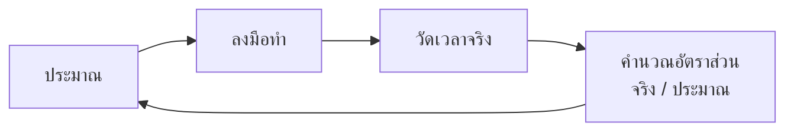

> 💼 **จากหน้างานจริง**
> ทีมที่โตแล้วจะไม่ถามว่า "ประมาณแม่นไหม" แต่ถามว่า "ตัวคูณของทีมเราคือเท่าไร"
> ทีมที่รู้ว่าตัวเองประมาณต่ำไป 1.8 เท่าเป็นประจำ วางแผนได้แม่นกว่าทีมที่เชื่อว่าตัวเองประมาณแม่น

---

## 7. AI เข้ามาเปลี่ยนอะไรในงาน PM

AI ไม่ได้ทำให้การบริหารโครงการง่ายขึ้นโดยอัตโนมัติ สิ่งที่มันเปลี่ยนคือ **ต้นทุนของแต่ละขั้นใน loop**
เมื่อขั้น "ลงมือ" ถูกลงมาก ขั้นที่กลายเป็นคอขวดคือ **"ตรวจ" และ "ตัดสินใจ"**

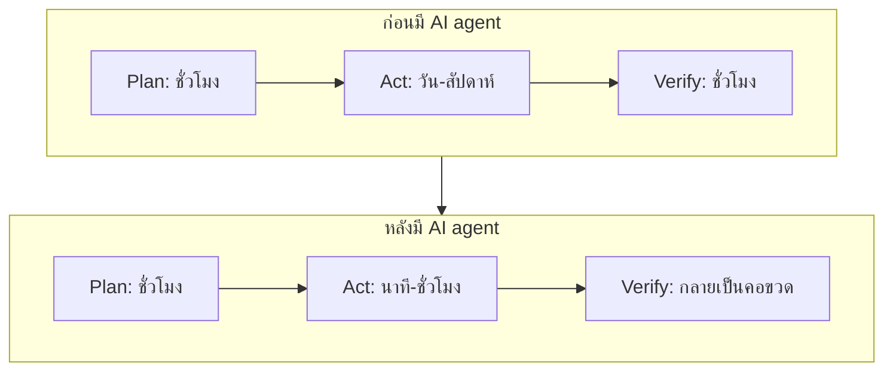

นี่คือเหตุผลที่วิชานี้ลงทุนกับ test, CI และ observability มากกว่าการสอนเขียน code เร็ว ๆ

### สิ่งที่ AI ทำได้ดีในงาน PM

| งาน | เหตุผลที่ AI ทำได้ดี | สิ่งที่คนยังต้องทำ |
|---|---|---|
| แตก epic เป็น task ย่อย | เป็นงานที่มีรูปแบบซ้ำ ๆ และมีตัวอย่างเยอะ | ตัดสินว่าอันไหนไม่ต้องทำ |
| ร่างเอกสาร charter, status report | โครงสร้างเอกสารเป็นมาตรฐาน | ยืนยันว่าตัวเลขในเอกสารมาจากไหน |
| ตั้งคำถามความเสี่ยงที่ทีมมองข้าม | ไม่มีอคติผูกพันกับแผนที่ทีมภูมิใจ | ประเมินว่าความเสี่ยงไหนจริงในบริบทนี้ |
| สรุป meeting เป็น action item | งานถอดความที่ใช้เวลาคนมาก | ยืนยันเจ้าของงานและกำหนดวัน |
| แปลง requirement เป็น user story + AC | มีรูปแบบชัด ทวนซ้ำได้ | ตรวจว่า AC วัดผลได้จริงหรือไม่ |

### สิ่งที่ห้ามให้ AI ตัดสิน

1. **ตัวเลขประมาณการที่จะเอาไปผูกสัญญา** — AI ไม่รู้ velocity จริงของทีมคุณ
   มันจะให้ตัวเลขที่ *ฟังดูสมเหตุสมผล* ซึ่งอันตรายกว่าการไม่ให้เลย
2. **การจัดลำดับความสำคัญของ feature** — ต้องรู้ว่าใครจ่ายเงิน ใครมีอำนาจ และการเมืองภายในเป็นอย่างไร
3. **การประเมินคน** — เป็นเรื่องจริยธรรมและกฎหมาย ไม่ใช่แค่เรื่องความแม่น
4. **การตัดสินใจว่า "พอแล้ว"** — เกณฑ์คุณภาพที่ยอมรับได้เป็นการตัดสินใจทางธุรกิจ

> ⚠️ **Automation bias**
> เมื่อคำตอบมาในรูปแบบตารางที่จัดหน้าสวยงามและมีตัวเลขทศนิยม
> คนมีแนวโน้มจะเชื่อมากกว่าคำตอบเดียวกันที่เขียนด้วยลายมือ
> วิธีป้องกันที่ใช้ได้จริงคือบังคับให้ทุกตัวเลขในเอกสารมี **ที่มา** กำกับเสมอ
> ตัวเลขที่ไม่มีที่มา = ตัวเลขที่ยังไม่มีอยู่

### AI-DLC: จาก Sprint สู่ Bolt

เมื่อขั้น Act เร็วขึ้นระดับ 10 เท่า รอบการทำงานแบบ 2 สัปดาห์เริ่มไม่สมเหตุสมผล
แนวคิด AI-DLC จึงเสนอหน่วยงานที่เล็กลงมาก:

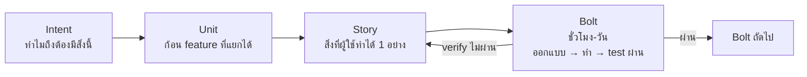

สิ่งที่ *ไม่* เปลี่ยนคือ: bolt ยังต้องจบด้วยของที่ verify ได้จริง
การย่อรอบให้สั้นลงโดยไม่มีขั้น verify ที่เชื่อถือได้ ไม่ได้ทำให้เร็วขึ้น — ทำให้พังเร็วขึ้นเท่านั้น

---

## 8. วัดผลโครงการอย่างไรให้มีความหมาย

ตัวชี้วัดที่แย่จะถูก "เล่นเกม" ทันทีที่ถูกใช้ประเมินคน — เรียกว่า **Goodhart's Law**:
เมื่อตัวชี้วัดกลายเป็นเป้าหมาย มันจะเลิกเป็นตัวชี้วัดที่ดี

| ตัวชี้วัด | ปัญหาเมื่อใช้ผิด | ใช้อย่างไรให้ถูก |
|---|---|---|
| จำนวนบรรทัด code | เขียนยาวขึ้นเพื่อให้ดูขยัน | ไม่ควรใช้เลย |
| Velocity | ทีมจะพองแต้ม story point | ใช้พยากรณ์ภายในทีมเท่านั้น ห้ามเทียบข้ามทีม |
| % งานเสร็จ | รายงาน 90% ค้างได้เป็นเดือน | นับเฉพาะสิ่งที่ deploy ขึ้น staging แล้ว |
| จำนวน bug ที่ปิด | สร้าง bug ง่าย ๆ มาปิดเอง | ดูแนวโน้ม bug ที่หลุดถึงผู้ใช้แทน |

**DORA metrics** เป็นชุดตัวชี้วัดที่ทนต่อการเล่นเกมได้ดีกว่า เพราะวัดที่ *ระบบส่งมอบ* ไม่ใช่ตัวคน:

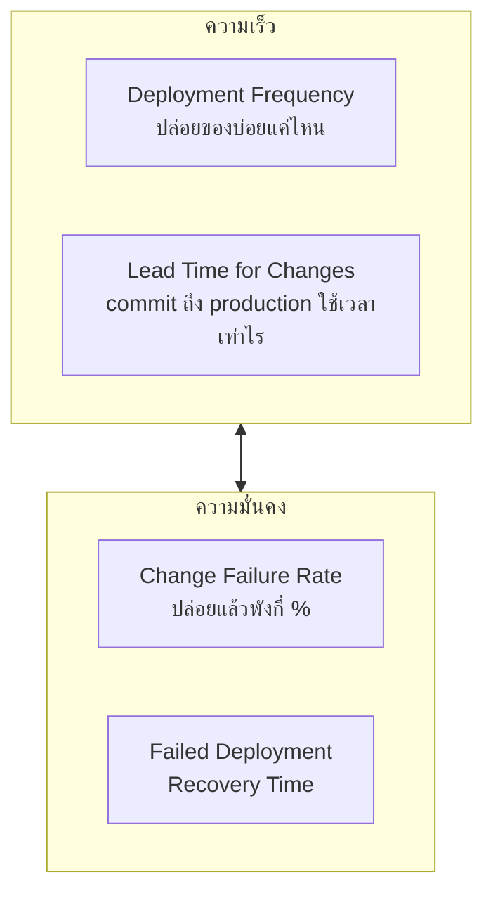

ข้อค้นพบสำคัญของงานวิจัย DORA คือ **ความเร็วกับความมั่นคงไม่ได้แลกกัน** —
ทีมที่ปล่อยของบ่อยกว่า มักพังน้อยกว่าและฟื้นเร็วกว่า เพราะการปล่อยของทีละน้อยทำให้
หาสาเหตุง่ายและย้อนกลับง่าย ซึ่งก็คือ loop ที่มี latency ต่ำนั่นเอง

---

## 9. Checklist สำหรับโครงการของกลุ่ม

ก่อนเริ่มเขียน code สัปดาห์แรก:

- [ ] ระบุได้ว่าใครคือผู้ใช้จริง และใครคือคนที่จะบอกว่างานนี้สำเร็จหรือไม่
- [ ] เขียน **Definition of Done** ของกลุ่มไว้เป็นลายลักษณ์อักษร
- [ ] มี `docs/raci.md` ที่ทุกแถวมี **A พอดี 1 คน** *(วิธีทำในหัวข้อ 3.7)*
- [ ] มี `docs/wbs.md` ที่ผ่านการตรวจกฎ 100% แล้ว *(วิธีทำในหัวข้อ 5.7)*
- [ ] รู้ว่า critical path ของโครงการวิ่งผ่านงานไหนบ้าง
- [ ] แยก "ต้องมี / ควรมี / ไว้ทีหลัง" ของ feature ทั้งหมด
- [ ] มีช่องทางสื่อสารที่ตกลงกันว่าเรื่องด่วนใช้ช่องไหน
- [ ] มี risk register เริ่มต้นอย่างน้อย 5 ข้อ
- [ ] deploy ของว่าง ๆ ขึ้น URL จริงได้แล้ว

ระหว่างทาง ทุกสัปดาห์:

- [ ] เทียบเวลาจริงกับที่ประมาณไว้ แล้วจดตัวคูณของทีม
- [ ] ทบทวนว่า risk ข้อไหนหายไปแล้ว และมีข้อใหม่อะไรโผล่มา
- [ ] ตรวจว่าการเปลี่ยน scope ทุกครั้งมีคนอนุมัติและมีการปรับเวลา

---

## 📚 เอกสารอ้างอิง

**กรอบและมาตรฐาน**
- PMI — *A Guide to the Project Management Body of Knowledge (PMBOK Guide)*, 7th Edition
  (https://www.pmi.org/standards/pmbok)
- PMI — Project Management Principles ภาพรวมฉบับเปิด (https://www.pmi.org/learning/library)
- Princeton University — **PATCO: Project and Technology Consulting Office**
  (https://patco.princeton.edu/) — ดูหัวข้อ *Templates by Project Phase* และ *Complex Project Templates*
  ซึ่งรวม RACI Matrix และ Princeton Process Improvement Methodology (PPIM)
- Princeton OIT — IT Governance และ Annual IT Planning Process
  (https://oit.princeton.edu/about-oit/it-governance)
- Scrum Guide ฉบับทางการ (https://scrumguides.org/scrum-guide.html)
- Atlassian — *DACI: a decision-making framework* ตัวแปรของ RACI ที่ใช้กับการตัดสินใจ
  (https://www.atlassian.com/team-playbook/plays/daci)
- PMI — *Practice Standard for Work Breakdown Structures*, 3rd Edition — ที่มาของกฎ 100%
  และเกณฑ์ 8/80 (https://www.pmi.org/standards)
- Jeff Patton — *User Story Mapping* — วิธีแตกงานแบบ vertical slice
  (https://jpattonassociates.com/story-mapping/)

**งานวิจัยและสถิติ**
- McKinsey & Company ร่วมกับ University of Oxford — *Delivering large-scale IT projects on time,
  on budget, and on value*
  (https://www.mckinsey.com/capabilities/tech-and-ai/our-insights/delivering-large-scale-it-projects-on-time-on-budget-and-on-value)
- Bent Flyvbjerg & Dan Gardner — *How Big Things Get Done* (2023) — แหล่งของแนวคิด
  reference class forecasting และ fat-tailed risk
- DORA — *Accelerate State of DevOps Report* (https://dora.dev/)

**การประมาณงาน**
- Steve McConnell — *Software Estimation: Demystifying the Black Art* — ที่มาของ Cone of Uncertainty
- Daniel Kahneman — *Thinking, Fast and Slow* — บทที่ว่าด้วย planning fallacy และ outside view

**AI กับกระบวนการพัฒนา**
- AWS — AI-Driven Development Life Cycle (AI-DLC)
  (https://aws.amazon.com/blogs/devops/ai-driven-development-life-cycle/)
- OWASP — Top 10 for Large Language Model Applications
  (https://owasp.org/www-project-top-10-for-large-language-model-applications/)
  โดยเฉพาะหัวข้อ *Excessive Agency* ที่เกี่ยวกับการมอบอำนาจตัดสินใจให้ AI

> หมายเหตุ: เว็บไซต์ของ Princeton บางส่วนปิดกั้นการเข้าถึงแบบอัตโนมัติ
> ให้เปิดผ่าน browser ปกติ
