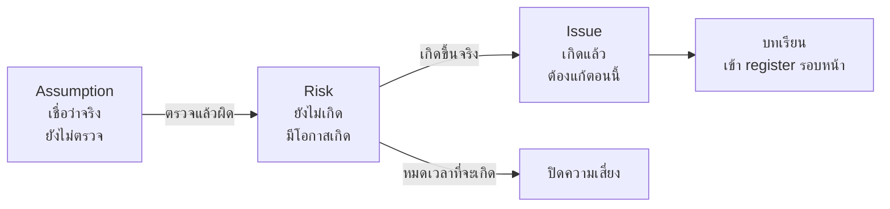
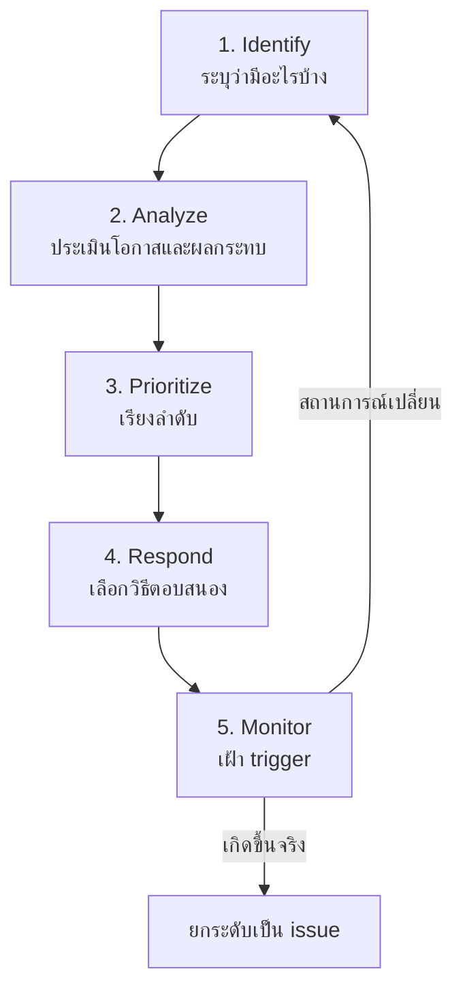
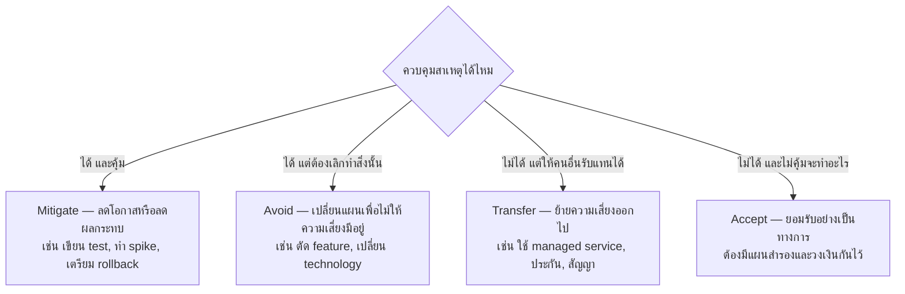
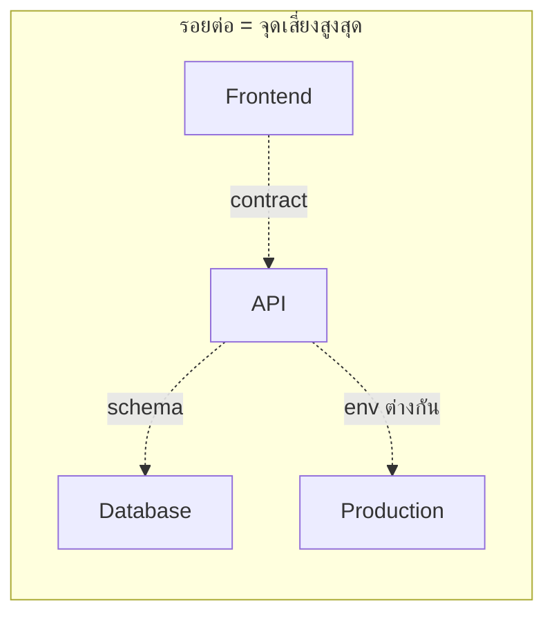
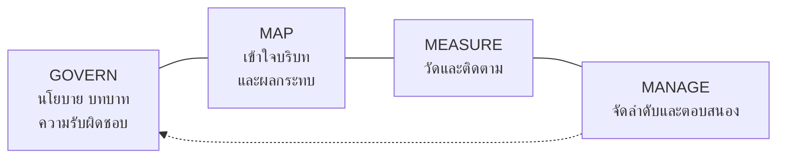
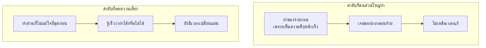

# Risk Management สำหรับงานซอฟต์แวร์

> ⚠️ **หมายเหตุก่อนอ่าน:** เอกสารฉบับนี้สร้างขึ้นโดย **Claude Opus 5** จึงอาจมีเนื้อหาที่คลาดเคลื่อน
> ตกหล่น หรือล้าสมัยได้ ให้ใช้วิจารณญาณในการอ่าน ตรวจสอบย้อนกลับไปยังเอกสารอ้างอิงท้ายบท
> และเปรียบเทียบกับแหล่งข้อมูลอื่นประกอบเสมอ — การตั้งคำถามกับสิ่งที่อ่าน
> คือส่วนหนึ่งของการฝึก **critical thinking** ในวิชานี้

> **เชื่อมกับ loop ของวิชา:** ความเสี่ยงคือ *ความไม่รู้ที่มีราคา*
> การจัดการความเสี่ยงจึงคือการออกแบบว่า **จะจ่ายเงินเท่าไรเพื่อรู้คำตอบเร็วขึ้นกี่วัน**

---

## 🎯 อ่านจบแล้วจะได้อะไร

| สิ่งที่จะทำได้ | ใช้ในงานจริงอย่างไร |
|---|---|
| แยก risk / issue / assumption ออกจากกันได้ | ทีมที่ปนสามคำนี้จะรายงานสถานะผิดและแก้ปัญหาผิดจังหวะ |
| ทำ risk register ที่ใช้งานได้จริง ไม่ใช่เอกสารประดับ | เป็นเอกสารที่ผู้บริหารเปิดดูเป็นอย่างแรกเมื่อโครงการเริ่มมีปัญหา |
| เลือกวิธีตอบสนองความเสี่ยงให้เหมาะกับต้นทุน | การ mitigate ทุกอย่างเท่ากันคือการใช้เวลาทีมไปกับเรื่องที่ไม่สำคัญ |
| จัดลำดับงานโดยเอาความเสี่ยงขึ้นก่อน | เป็นวิธีคิดที่แยก senior ออกจาก junior ชัดที่สุดเรื่องหนึ่ง |
| ระบุความเสี่ยงชนิดใหม่ที่มากับการใช้ AI agent | องค์กรเริ่มมีนโยบายควบคุมเรื่องนี้แล้ว และจะถูกถามในการสัมภาษณ์งาน |

---

## 📖 ศัพท์ที่ต้องรู้ก่อนเริ่ม

| ศัพท์ | ความหมายในบริบทของวิชานี้ |
|---|---|
| **Risk** | เหตุการณ์ที่ *ยังไม่เกิด* ซึ่งถ้าเกิดจะกระทบเป้าหมาย — มีความน่าจะเป็นเสมอ |
| **Issue** | ความเสี่ยงที่ **เกิดขึ้นแล้ว** กลายเป็นปัญหาที่ต้องแก้ตอนนี้ ไม่ใช่เฝ้าระวัง |
| **Assumption** | สิ่งที่เราเชื่อว่าจริงโดยยังไม่ได้ตรวจสอบ — assumption ที่ผิดจะกลายเป็น risk ทันที |
| **Constraint** | ข้อจำกัดที่รู้แน่นอนแล้ว เช่น ต้องส่งงานก่อนสอบไฟนอล |
| **Likelihood** | โอกาสที่ความเสี่ยงจะเกิด |
| **Impact** | ความรุนแรงถ้ามันเกิด |
| **Exposure / EMV** | ค่าคาดหวังของความเสียหาย = likelihood × impact |
| **Risk appetite** | ระดับความเสี่ยงที่องค์กรยอมรับได้โดยไม่ต้องทำอะไร |
| **Trigger** | สัญญาณที่บอกว่าความเสี่ยงกำลังจะกลายเป็น issue |
| **Risk owner** | คนเดียวที่รับผิดชอบเฝ้าและตัดสินใจเรื่องความเสี่ยงข้อนั้น |
| **Residual risk** | ความเสี่ยงที่ยังเหลืออยู่หลังจากทำมาตรการแล้ว |
| **Spike** | งานทดลองสั้น ๆ ที่ทำเพื่อ *ลดความไม่รู้* ไม่ใช่เพื่อส่งมอบ feature |
| **Bus factor** | จำนวนคนที่ถ้าหายไปพร้อมกันแล้วโครงการเดินต่อไม่ได้ |
| **Blameless postmortem** | การถอดบทเรียนหลังเหตุการณ์ที่มุ่งหาสาเหตุเชิงระบบ ไม่ใช่หาคนผิด |

---

## 1. ความเสี่ยงคืออะไร และไม่ใช่อะไร

ประโยคที่พบบ่อยในรายงานของนักศึกษา:

> ❌ "ความเสี่ยงคือทีมอาจทำงานไม่ทัน"

ประโยคนี้ใช้ไม่ได้ เพราะไม่บอกว่า *อะไรทำให้ไม่ทัน* จึงไม่มีทางรู้ว่าต้องทำอะไร
โครงสร้างประโยคความเสี่ยงที่ใช้ได้จริงมี 3 ส่วน:

> **เพราะ** [ข้อเท็จจริงที่เป็นสาเหตุ] → **อาจเกิด** [เหตุการณ์ที่ไม่แน่นอน] → **ซึ่งจะทำให้** [ผลกระทบที่วัดได้]

ตัวอย่างที่แก้แล้ว:

> ✅ "**เพราะ** ทั้งกลุ่มไม่มีใครเคยใช้ WebSocket มาก่อน
> **อาจเกิด** การที่ feature แจ้งเตือนแบบ real-time ใช้เวลานานกว่าที่ประมาณไว้ 2 เท่า
> **ซึ่งจะทำให้** ไม่มีเวลาทำ E2E test ก่อน present"

### ความต่างที่ต้องแยกให้ออก



ความผิดพลาดที่พบบ่อยที่สุดคือการเอา **issue** ไปใส่ในตารางความเสี่ยง
ผลคือรายงานดูเหมือนมีการจัดการ ทั้งที่จริงคือรายการปัญหาที่ยังไม่มีใครแก้

---

## 2. วงจรการจัดการความเสี่ยง

มาตรฐาน **ISO 31000** วางกระบวนการไว้เป็นวงจรที่ต้องหมุนซ้ำ ไม่ใช่ทำครั้งเดียวตอนต้นโครงการ



จังหวะที่เหมาะกับโครงการขนาดวิชาเรียน: **ทบทวน register สัปดาห์ละครั้ง ใช้เวลา 15 นาที**
คำถามที่ถามในที่ประชุมมีแค่ 3 ข้อ

1. ข้อไหน *หายไปแล้ว* — ปิดทิ้ง
2. ข้อไหน *ใกล้จะเกิด* — ดู trigger
3. มีอะไร *ใหม่* จากสิ่งที่เพิ่งรู้สัปดาห์นี้

> 💼 **จากหน้างานจริง**
> Risk register ที่ไม่เคยมีบรรทัดไหนถูกปิดเลย คือ register ที่ไม่มีใครอ่าน
> การปิดความเสี่ยงเป็นสัญญาณสุขภาพที่ดี — แปลว่าความไม่รู้ลดลงจริง

---

## 3. ประเมินความเสี่ยง

### วิธีเชิงคุณภาพ: ตาราง Likelihood × Impact

ใช้สเกล 1–5 ทั้งสองแกน แล้วคูณกันได้คะแนน 1–25

| | **Impact 1**<br/>เล็กน้อย | **2**<br/>น้อย | **3**<br/>ปานกลาง | **4**<br/>สูง | **5**<br/>รุนแรง |
|---|---|---|---|---|---|
| **Likelihood 5** เกิดแน่ | 5 | 10 | 15 | 🔴 20 | 🔴 25 |
| **4** น่าจะเกิด | 4 | 8 | 🟡 12 | 🔴 16 | 🔴 20 |
| **3** เกิดได้ | 3 | 6 | 🟡 9 | 🟡 12 | 🔴 15 |
| **2** ไม่น่าเกิด | 2 | 4 | 6 | 🟡 8 | 🟡 10 |
| **1** แทบเป็นไปไม่ได้ | 1 | 2 | 3 | 4 | 5 |

- 🔴 **15–25** ต้องมีแผนตอบสนองที่ลงมือแล้ว และมีเจ้าของชัดเจน
- 🟡 **8–14** ต้องมีแผนเตรียมไว้ และมี trigger ที่เฝ้าอยู่
- ⚪ **1–7** รับไว้ ทบทวนเดือนละครั้ง

**กับดักที่ต้องระวัง:** คะแนนคูณกันทำให้ความเสี่ยงที่ *โอกาสต่ำมาก แต่ผลกระทบมหาศาล*
ได้คะแนนเท่ากับ *โอกาสสูง ผลกระทบเล็ก* ทั้งที่สองอย่างนี้ต้องจัดการคนละแบบสิ้นเชิง
ข้อมูลรั่วไหลมีโอกาสเกิดต่ำ แต่ถ้าเกิดแล้วโครงการอาจจบทันที
ความเสี่ยงประเภทนี้ต้องดูที่ผลกระทบเป็นหลัก ไม่ใช่คะแนนรวม

### วิธีเชิงปริมาณ: Expected Monetary Value

$$EMV = P(\text{เกิด}) \times \text{ผลกระทบ}$$

ตัวอย่างการใช้ตัดสินใจจริง:

| ทางเลือก | ต้นทุนที่ต้องจ่ายแน่ | ความเสี่ยงที่เหลือ | EMV รวม |
|---|---|---|---|
| ไม่ทำอะไร | 0 | 40% × เสียเวลา 10 วัน | 4.0 วัน |
| ทำ spike ทดลอง 1 วัน | 1 วัน | 10% × เสียเวลา 10 วัน | 2.0 วัน |
| เปลี่ยนไปใช้ของที่ทีมคุ้นเคย | 2 วัน | 5% × เสียเวลา 4 วัน | 2.2 วัน |

ตัวเลขไม่ต้องแม่น ประโยชน์ของการเขียนออกมาคือมันเปลี่ยนการเถียงจาก
"ฉันรู้สึกว่าเสี่ยง" เป็น "เราไม่เห็นตรงกันที่ตัวเลขไหน" ซึ่งคุยกันต่อได้

---

## 4. เลือกวิธีตอบสนอง



ข้อสำคัญ: **Accept ที่ถูกต้องต้องเขียนลงเอกสาร** ไม่ใช่การเงียบ
"เรารู้ว่าเสี่ยง และตัดสินใจร่วมกันว่ารับได้ ถ้าเกิดจะทำ X" ต่างจาก
"ไม่มีใครพูดถึงมันเลย" อย่างสิ้นเชิงในวันที่มันเกิดจริง

ในทางกลับกัน ความไม่แน่นอนไม่ได้แย่เสมอ — ISO 31000 นิยาม risk ว่าเป็น
*ผลของความไม่แน่นอนต่อเป้าหมาย* ซึ่งครอบคลุมด้านบวกด้วย
ด้านบวกมีคู่ขนานกัน: **Exploit, Enhance, Share, Accept**

---

## 5. ความเสี่ยงที่พบจริงในโครงการซอฟต์แวร์

### 5.1 Technical risk — ของที่ไม่เคยทำ

สัญญาณเตือน: ไม่มีใครในทีมเคยทำสิ่งนี้ และไม่มีตัวอย่างที่ใกล้เคียงพอ

**วิธีจัดการ:** ทำ **spike** — งานทดลองที่กำหนดเวลาตายตัว เช่น 4 ชั่วโมง
โดยมีเกณฑ์ชัดว่า *อะไรคือคำตอบที่ต้องได้* และตกลงกันล่วงหน้าว่า
"ถ้าหมดเวลาแล้วยังไม่ได้คำตอบ เราจะเลือกทางสำรอง"

จุดที่คนพลาดคือทำ spike แล้วเอา code ของ spike ไปใช้ต่อ
spike เขียนเพื่อ *เรียนรู้* ไม่ใช่เพื่อใช้งาน — ควรทิ้ง แล้วเขียนใหม่พร้อม test

### 5.2 Integration risk — จุดที่ระบบมาเจอกัน

ความเสี่ยงในซอฟต์แวร์กระจุกตัวที่ *รอยต่อ* เสมอ: ระหว่าง frontend กับ API,
ระหว่าง app กับ database, ระหว่างเครื่องเรากับเครื่อง production



มาตรการที่ได้ผลจึงเป็นการแปลงความเสี่ยงตรงรอยต่อให้กลายเป็นเครื่องมือ:
ล็อก API contract ให้ชัดก่อนเริ่มเขียน code, ทำให้ environment เหมือนกันทุกเครื่องด้วย container,
และทำให้ทุกรอยต่อถูกตรวจอัตโนมัติทุก commit ด้วย CI

### 5.3 People risk — bus factor

ถ้าโครงการมีคนเดียวที่ตั้ง environment เป็น และคนนั้นป่วยในสัปดาห์สอบ
โครงการหยุดทันที นี่คือ **bus factor = 1**

**วิธีจัดการที่ทำได้ทันที:**
- ทุกอย่างที่ทำด้วยมือต้องมีเอกสาร หรือดีกว่านั้นคือทำเป็น script
- `README` ต้องพาคนใหม่จาก clone ถึงรันได้ในคำสั่งไม่เกิน 3 บรรทัด
- หมุนเวียนคนทำงานแต่ละส่วนอย่างน้อย 1 ครั้งต่อเทอม

> 💼 **จากหน้างานจริง**
> `docker compose up` ที่รันได้จริงในเครื่องคนใหม่ คือมาตรการลด people risk
> ที่ได้ผลกว่าเอกสาร onboarding 20 หน้า เพราะเอกสารจะเก่า แต่ compose file ที่ CI รันทุกวันจะไม่เก่า

### 5.4 Schedule risk — งานที่ประเมินต่ำเป็นระบบ

งานที่มักถูกลืมในการประมาณเวลา:

- [ ] เวลาที่ใช้กับการ review และแก้ตาม review
- [ ] เวลาที่ใช้ตอน deploy ครั้งแรกซึ่งไม่เคยผ่านตั้งแต่ครั้งแรก
- [ ] เวลาแก้ bug ที่เจอตอน integrate
- [ ] เวลาเขียนเอกสารและเตรียม present
- [ ] เวลารอคนอื่น — อนุมัติ, ตอบ, ให้สิทธิ์เข้าถึง

**เวลารอคนอื่น** เป็นตัวที่ประเมินพลาดหนักที่สุด เพราะมันไม่ปรากฏใน task ของใครเลย
วิธีจัดการคือ *เริ่มงานที่ต้องรอคนอื่นให้เร็วที่สุด* แม้จะยังไม่ถึงคิวตามแผน

### 5.5 Security risk

ความเสี่ยงด้านความปลอดภัยต่างจากความเสี่ยงอื่นตรงที่ **ผลกระทบไม่ได้จบที่โครงการเรา**
ข้อมูลผู้ใช้ที่รั่วไปแล้วเรียกคืนไม่ได้ และในไทยมี PDPA กำกับด้วย

ใช้ **OWASP Top 10** เป็น checklist ตั้งต้น สิ่งที่ต้องจำในบริบทของ risk คือ
ช่องโหว่ security มักได้คะแนน likelihood ต่ำแต่ impact สูงสุด — จึงต้องดูที่ impact

---

## 6. ความเสี่ยงชนิดใหม่ที่มากับ AI

การใส่ AI agent เข้ามาใน loop เพิ่มความเสี่ยงประเภทที่ไม่เคยมีในตำรา PM เดิม

| ความเสี่ยง | เกิดขึ้นอย่างไร | มาตรการที่ใช้ได้จริง |
|---|---|---|
| **Hallucination** | AI สร้าง API, ฟังก์ชัน หรือแหล่งอ้างอิงที่ไม่มีอยู่จริง อย่างมั่นใจ | ทุกอย่างต้องรันได้จริง / ทุกลิงก์ต้องเปิดได้จริงก่อน commit |
| **Automation bias** | คนเชื่อคำตอบที่จัดหน้าสวยงามมากกว่าที่ควร | กติกา "อธิบายไม่ได้ ห้าม commit" |
| **Excessive agency** | ให้ agent รันคำสั่งเองได้มากเกินความจำเป็น | จำกัดสิทธิ์, ต้องมีคนอนุมัติก่อนแตะ production |
| **Prompt injection** | ข้อความในไฟล์หรือเว็บที่ agent อ่าน แฝงคำสั่ง | ถือว่าทุกอย่างที่ agent อ่านคือ *ข้อมูล* ไม่ใช่ *คำสั่ง* |
| **ข้อมูลรั่วผ่าน prompt** | วาง secret, ข้อมูลลูกค้า หรือ code ภายในลงในเครื่องมือภายนอก | กติกาข้อ 3 ของวิชา — ห้ามส่ง secret เข้า AI tool |
| **License / IP** | code ที่ AI สร้างอาจคล้ายของที่มีลิขสิทธิ์ | ตรวจ dependency license, หลีกเลี่ยงการลอกก้อนใหญ่โดยไม่เข้าใจ |
| **Skill atrophy** | ทีมอธิบาย code ของตัวเองไม่ได้ | oral defense ทุกสัปดาห์ |
| **Vendor / model drift** | โมเดลเปลี่ยนเวอร์ชัน ผลลัพธ์เปลี่ยน | อย่าให้ระบบพึ่ง output ที่ไม่ deterministic โดยไม่มี test คุม |

กรอบอ้างอิงที่องค์กรใช้จริงคือ **NIST AI Risk Management Framework (AI RMF 1.0)**
ซึ่งวางหน้าที่ไว้ 4 กลุ่ม:



> 💼 **จากหน้างานจริง**
> คำถามที่ถูกถามในการสัมภาษณ์งานมากขึ้นเรื่อย ๆ คือ
> *"คุณให้ AI agent ทำอะไรได้บ้าง และอะไรที่คุณไม่ให้มันทำ เพราะอะไร"*
> คำตอบที่ดีไม่ใช่ "ใช้ทุกอย่าง" หรือ "ไม่ใช้เลย" แต่คือการอธิบายเส้นแบ่งพร้อมเหตุผล

---

## 7. เทคนิคที่ใช้ได้ทันที

### Pre-mortem — ถอดบทเรียนก่อนเกิดเหตุ

เทคนิคของ Gary Klein ที่ใช้เวลา 15 นาทีแต่ได้ผลสูงมาก

1. สมมติว่าตอนนี้คือวัน present และ **โครงการล้มเหลวไปแล้ว**
2. ให้ทุกคนเขียนคนละ 5 นาทีว่า *มันล้มเพราะอะไร* — เขียนเป็นอดีตกาล
3. อ่านออกมาทีละคน แล้วรวมเป็นรายการ
4. เอา 3 ข้อที่คนเขียนตรงกันมากที่สุด ใส่ risk register พร้อมมาตรการ

เหตุผลที่มันได้ผลกว่าการถาม "มีความเสี่ยงอะไรบ้าง" คือการสมมติว่าล้มไปแล้ว
ปลดล็อกคนให้พูดสิ่งที่ปกติไม่กล้าพูดเพราะกลัวดูเป็นคนขวางทีม

### จัดลำดับงานโดยเอาความเสี่ยงขึ้นก่อน



หลักการนี้เป็นเหตุผลที่ควรทำการ deploy ของจริงตั้งแต่ยังไม่มี feature: การ deploy คือส่วนที่ไม่แน่นอนที่สุดและถูกเลื่อนบ่อยที่สุด
จึงต้องเอามาไว้ต้นทาง

### Blameless postmortem

เมื่อความเสี่ยงกลายเป็น issue จริง สิ่งที่ทำหลังจากนั้นสำคัญกว่าตัวเหตุการณ์

แม่แบบสั้น ๆ ที่ใช้ได้:

```markdown
## เกิดอะไรขึ้น
[ลำดับเหตุการณ์พร้อมเวลา — ข้อเท็จจริงล้วน ไม่มีการตีความ]

## ผลกระทบ
[ใครได้รับผลกระทบ นานเท่าไร วัดเป็นตัวเลขได้ไหม]

## ทำไมระบบถึงยอมให้เกิดขึ้นได้
[ถามว่า "ทำไม" ต่อเนื่องจนถึงสาเหตุเชิงระบบ ไม่หยุดที่ "คนทำพลาด"]

## สัญญาณที่มีอยู่แล้วแต่ไม่มีใครเห็น
[log, test, alert ที่ควรจับได้แต่ไม่ได้จับ]

## จะทำอะไรให้มันจับได้เองครั้งหน้า
[งานที่มีเจ้าของและกำหนดวัน — ไม่ใช่ "จะระมัดระวังมากขึ้น"]
```

บรรทัดสุดท้ายคือหัวใจ: **"จะระมัดระวังมากขึ้น" ไม่ใช่มาตรการ**
มาตรการที่แท้จริงคือสิ่งที่ทำให้ครั้งหน้าระบบจับได้เองโดยไม่ต้องพึ่งความจำของคน
ซึ่งก็คือการเพิ่ม coverage ให้ loop นั่นเอง

---

## 8. แม่แบบ Risk Register

สร้างไฟล์ `docs/risk-register.md` ในโครงการของกลุ่ม

```markdown
# Risk Register — [ชื่อโครงการ]
อัปเดตล่าสุด: [วันที่]

| ID | ความเสี่ยง (เพราะ...อาจเกิด...ทำให้...) | L | I | คะแนน | วิธีตอบสนอง | มาตรการที่ลงมือแล้ว | Trigger | เจ้าของ | สถานะ |
|---|---|---|---|---|---|---|---|---|---|
| R1 | เพราะไม่มีใครเคยตั้ง CI มาก่อน อาจเกิดการที่ pipeline ใช้เวลาเกิน 2 วัน ทำให้งานส่วน CI/CD ไม่เสร็จ | 4 | 3 | 12 | Mitigate | ทำ spike 3 ชม. ในสัปดาห์ก่อนหน้า | ผ่านไป 1 วันแล้ว workflow ยังแดง | [ชื่อ] | เปิด |
| R2 | | | | | | | | | |

## ความเสี่ยงที่ปิดแล้ว
| ID | ความเสี่ยง | ปิดเมื่อ | เหตุผลที่ปิด |
|---|---|---|---|

## Assumption ที่ยังไม่ได้ตรวจ
| สมมติฐาน | จะตรวจอย่างไร | ตรวจเมื่อไร |
|---|---|---|
```

**เกณฑ์ว่า register นี้ใช้ได้จริงหรือไม่:** เปิดดูแล้วต้องตอบได้ทันทีว่า
*สัปดาห์นี้ต้องเฝ้าอะไรเป็นพิเศษ* ถ้าตอบไม่ได้ แปลว่ามันยังเป็นเอกสารประดับ

---

## 📚 เอกสารอ้างอิง

**มาตรฐานและกรอบ**
- ISO 31000 — Risk management guidelines (https://www.iso.org/iso-31000-risk-management.html)
- ISO/IEC 27005 — Information security risk management
  (https://www.iso.org/standard/80585.html)
- NIST — *AI Risk Management Framework (AI RMF 1.0)*
  (https://www.nist.gov/itl/ai-risk-management-framework)
- NIST — Risk Management Framework for Information Systems
  (https://csrc.nist.gov/projects/risk-management)
- PMI — PMBOK Guide 7th Edition, performance domain ว่าด้วย *Uncertainty*
  (https://www.pmi.org/standards/pmbok)

**ความเสี่ยงด้านความปลอดภัยและ AI**
- OWASP Top 10 (https://owasp.org/www-project-top-ten/)
- OWASP Top 10 for LLM Applications
  (https://owasp.org/www-project-top-10-for-large-language-model-applications/)
- OWASP Risk Rating Methodology
  (https://owasp.org/www-community/OWASP_Risk_Rating_Methodology)
- สำนักงานคณะกรรมการคุ้มครองข้อมูลส่วนบุคคล — PDPA (https://www.pdpc.or.th/)

**เทคนิคและงานวิจัย**
- Gary Klein — *Performing a Project Premortem*, Harvard Business Review
  (https://hbr.org/2007/09/performing-a-project-premortem)
- Google SRE Book — *Postmortem Culture: Learning from Failure*
  (https://sre.google/sre-book/postmortem-culture/)
- Google SRE Book — *Embracing Risk* (https://sre.google/sre-book/embracing-risk/)
- Bent Flyvbjerg & Alexander Budzier — *Why Your IT Project May Be Riskier Than You Think*,
  Harvard Business Review (https://hbr.org/2011/09/why-your-it-project-may-be-riskier-than-you-think)
  — ที่มาของแนวคิด *black swan IT project*
