# Software Testing — ภาพรวมและหลักการ

> ⚠️ **หมายเหตุก่อนอ่าน:** เอกสารฉบับนี้สร้างขึ้นโดย **Claude Opus 5** จึงอาจมีเนื้อหาที่คลาดเคลื่อน
> ตกหล่น หรือล้าสมัยได้ ให้ใช้วิจารณญาณในการอ่าน ตรวจสอบย้อนกลับไปยังเอกสารอ้างอิงท้ายบท
> และเปรียบเทียบกับแหล่งข้อมูลอื่นประกอบเสมอ — การตั้งคำถามกับสิ่งที่อ่าน
> คือส่วนหนึ่งของการฝึก **critical thinking** ในวิชานี้

> **เชื่อมกับ loop ของวิชา:** Test คือขั้น **Verify** ที่ถูกทำให้เป็นเครื่องจักร —
> คุณภาพของ test คือเพดานคุณภาพของทั้ง loop รวมถึง loop ของ AI agent

---

## 🎯 อ่านจบแล้วจะได้อะไร

| สิ่งที่จะทำได้ | ใช้ในงานจริงอย่างไร |
|---|---|
| รู้ว่า tester ต้องทำอะไรในแต่ละ phase ไม่ใช่แค่ตอนท้าย | คุณค่าสูงสุดของงานทดสอบอยู่ที่การป้องกัน ไม่ใช่การยืนยันความเสียหาย |
| เขียนรายงาน bug ที่ dev ใช้ทำงานต่อได้ทันที | รายงานที่ทำซ้ำไม่ได้กินเวลาทีมมากกว่าที่ประหยัดไปหลายเท่า |
| อธิบาย defect life cycle และรู้ว่าใครปิดใบได้ | ทุกองค์กรมีระบบติดตาม bug และคาดหวังให้ใช้เป็นตั้งแต่วันแรก |
| เลือกระดับของ test ให้เหมาะกับสิ่งที่อยากรู้ | ทีมที่เขียน E2E ทุกอย่างจะได้ pipeline ที่ช้าและ flaky จนไม่มีใครเชื่อ |
| ออกแบบ test case ด้วยเทคนิคที่มีหลักการ ไม่ใช่นึกเอา | เทคนิคเหล่านี้คือสิ่งที่ทำให้ test 8 ตัวครอบคลุมกว่า test 40 ตัวที่สุ่มเขียน |
| อ่านตัวเลข coverage อย่างเข้าใจข้อจำกัดของมัน | หลายองค์กรตั้ง KPI จาก coverage ซึ่งถูกเล่นเกมได้ง่ายมาก |
| แยก test double 5 ชนิดและเลือกใช้ให้ถูก | การใช้ mock พร่ำเพรื่อทำให้ test ผูกกับโครงสร้างภายในจน refactor ไม่ได้ |
| จัดการ flaky test อย่างเป็นระบบ | flaky test 1 ตัวทำลายความเชื่อถือของทั้ง suite |
| ทดสอบระบบที่มี AI อยู่ข้างใน ซึ่งผลลัพธ์ไม่คงที่ | เป็นทักษะที่กำลังกลายเป็นข้อกำหนดพื้นฐานของงานสายนี้ |

---

## 📖 ศัพท์ที่ต้องรู้ก่อนเริ่ม

| ศัพท์ | ความหมายในบริบทของวิชานี้ |
|---|---|
| **Verification** | "เราสร้างของถูกวิธีไหม" — ตรงตาม spec หรือเปล่า |
| **Validation** | "เราสร้างของที่ถูกไหม" — มันแก้ปัญหาของผู้ใช้จริงหรือเปล่า |
| **SUT** | System Under Test — ส่วนที่กำลังถูกทดสอบ |
| **Test Harness** | โครงสร้างรอบ test ที่ทำให้รันซ้ำได้ผลเดิม: runner, fixtures, factories, test doubles, seed data |
| **Test Double** | ของปลอมที่ใช้แทนของจริงระหว่าง test — คำรวมของ dummy/stub/spy/mock/fake |
| **Fixture** | สถานะตั้งต้นที่ test ต้องการก่อนเริ่มทำงาน |
| **Assertion** | ประโยคที่ประกาศว่าผลลัพธ์ต้องเป็นอะไร ถ้าไม่ตรง test แดง |
| **Test Oracle** | แหล่งที่บอกว่าผลลัพธ์ที่ถูกต้องคืออะไร — spec, AC, ระบบเดิม หรือคนที่รู้เรื่อง |
| **Defect / Bug** | ความไม่ตรงกันระหว่างพฤติกรรมจริงกับพฤติกรรมที่คาดหวัง |
| **Severity** | ความรุนแรงทางเทคนิคของ bug — tester เป็นคนตัดสิน |
| **Priority** | ความเร่งด่วนทางธุรกิจว่าจะแก้เมื่อไร — เจ้าของผลิตภัณฑ์เป็นคนตัดสิน |
| **Triage** | การประชุมสั้นเพื่อคัดกรอง bug ใหม่ กำหนด priority และเจ้าของ |
| **Retest** | ทดสอบซ้ำเฉพาะ bug ที่แจ้งว่าแก้แล้ว ว่าหายจริงไหม |
| **Regression** | ของที่เคยทำงานได้แล้วกลับพัง — และ regression testing คือการตรวจว่าไม่เกิดสิ่งนี้ |
| **Entry / Exit criteria** | เงื่อนไขที่ตกลงไว้ว่าเมื่อไรเริ่มทดสอบได้ และเมื่อไรถือว่าทดสอบเสร็จ |
| **DRE** | Defect Removal Efficiency — สัดส่วน bug ที่จับได้ก่อนถึงมือผู้ใช้ |
| **Flaky test** | test ที่บางครั้งเขียวบางครั้งแดง ทั้งที่ code ไม่เปลี่ยน |
| **Coverage** | สัดส่วนของ code ที่ถูกรันระหว่าง test — วัดการ *รัน* ไม่ใช่การ *ตรวจ* |
| **Mutation testing** | การจงใจแก้ code ให้ผิดแล้วดูว่า test จับได้ไหม — วัดคุณภาพของ test |
| **Test isolation** | test แต่ละตัวไม่แชร์สถานะกัน จึงสลับลำดับหรือรันขนานได้ |
| **Determinism** | รันกี่ครั้งก็ได้ผลเดิมเมื่อ input เดิม |
| **Shift left** | ย้ายการตรวจให้เกิดเร็วขึ้นในกระบวนการ |
| **Quality gate** | เงื่อนไขที่ต้องผ่านก่อนงานจะไปขั้นถัดไปได้ |

---

## 1. ทำไมต้องทดสอบ — คำตอบที่เป็นตัวเลข

คำตอบที่ว่า "เพื่อหา bug" ถูกแต่ไม่พอ เหตุผลที่แท้จริงคือ **ต้นทุนของ bug ขึ้นกับว่าเจอมันเมื่อไร**

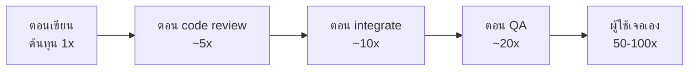

ตัวคูณที่แน่นอนต่างกันไปตามงานวิจัยและถูกโต้แย้งอยู่บ้าง แต่ *ทิศทาง* ไม่มีใครเถียง
เหตุผลไม่ใช่เรื่องเทคนิคล้วน ๆ แต่เป็นเรื่องของบริบทที่หายไป:

- **เจอตอนเขียน** — คุณยังจำได้ว่าทำไมถึงเขียนแบบนั้น แก้ใน 2 นาที
- **เจอหลังผู้ใช้ใช้แล้ว** — ต้องทำซ้ำให้เกิด, สืบจาก log, แก้, ทดสอบ,
  deploy ฉุกเฉิน, สื่อสารกับผู้ใช้, บางกรณีต้องแก้ข้อมูลที่เสียไปแล้ว

**นี่คือนิยามของ latency ใน loop engineering โดยตรง** — test ที่รันใน 2 วินาที
ไม่ได้แค่ "เร็ว" แต่มันย้ายจุดที่เราเจอ bug จากปลายเส้นมาไว้ต้นเส้น

> 💼 **จากหน้างานจริง**
> คำถามที่ควรถามตัวเองไม่ใช่ "test นี้จำเป็นไหม" แต่คือ
> *"ถ้าตรงนี้พัง ฉันอยากรู้ตอนไหน และตอนนั้นจะแก้ยากแค่ไหน"*
> ส่วนของระบบที่พังแล้วเจ็บมาก ควรได้ test ที่แน่นกว่า ส่วนที่พังแล้วแค่รำคาญ

---

## 2. หน้าที่ของ Tester ในแต่ละ phase

ในทีมสมัยใหม่ คำว่า "tester" ไม่ได้แปลว่าต้องมีคนตำแหน่งนี้แยกออกมา —
หลายทีมให้ developer สลับกันสวมหมวกนี้ และในวิชานี้ทุกคนต้องสวมหมวกนี้เป็นด้วย
สิ่งที่สำคัญไม่ใช่ตำแหน่ง แต่คือ **มีคนที่รับผิดชอบตั้งคำถามว่า "เรารู้ได้อย่างไรว่ามันถูก"**

### 2.1 ความเข้าใจผิดที่ต้องแก้ก่อน

> ❌ "tester คือคนที่มาไล่กดหาที่พังหลังจาก dev เขียนเสร็จ"

ถ้า tester เข้ามาตอนท้ายอย่างเดียว งานของเขาจะเป็นแค่การ *ยืนยันความเสียหาย*
มูลค่าสูงสุดของ tester อยู่ที่ **การป้องกันไม่ให้ bug เกิด** ซึ่งต้องเข้ามาตั้งแต่ตอนคุย requirement

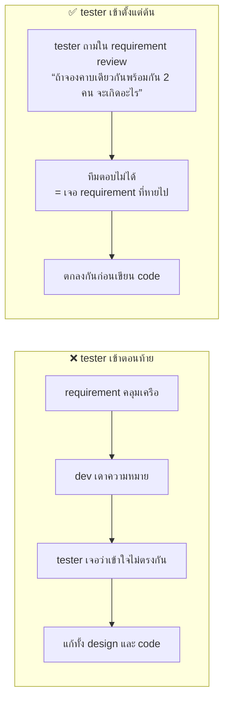

การถามคำถามเดียวในห้อง requirement review มีมูลค่าเท่ากับการเจอ bug หลายสิบตัวหลัง deploy
เพราะมันตัดตั้งแต่ต้นทาง

### 2.2 V-Model — แต่ละ phase คู่กับการทดสอบระดับไหน

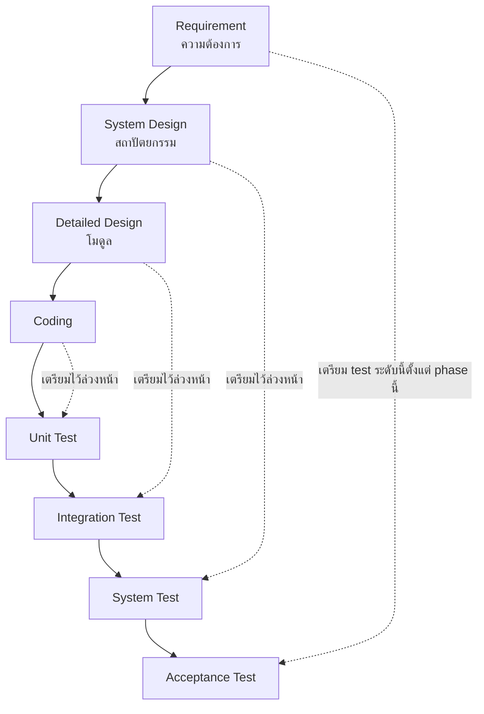

สาระสำคัญของ V-Model ไม่ใช่ลำดับขั้นแบบ waterfall แต่คือ **เส้นประ** —
การทดสอบแต่ละระดับควรถูก *ออกแบบ* ตั้งแต่ phase ฝั่งซ้ายที่คู่กัน ไม่ใช่มาคิดตอนถึงคิว
แม้ทีมจะทำงานแบบ agile หลักนี้ก็ยังใช้ได้ เพียงแต่วงจรนี้หมุนซ้ำทุก sprint หรือทุก bolt

### 2.3 หน้าที่ของ tester ทีละ phase

| Phase | tester ทำอะไร | ส่งมอบอะไร | คำถามหลักที่ถือติดตัว |
|---|---|---|---|
| **1. Requirement / Analysis** | ทบทวน user story และ AC, หา requirement ที่กำกวมหรือขัดแย้ง, ตรวจว่า **ทดสอบได้จริงไหม**, เสนอ AC เพิ่ม | รายการคำถามที่ยังตอบไม่ได้, AC ที่แก้แล้ว | "ข้อนี้จะพิสูจน์ว่าผ่านได้อย่างไร" |
| **2. Design** | ทบทวน C4/ER diagram หาจุดที่ทดสอบยาก, ขอ hook สำหรับทดสอบ เช่น seed endpoint, ระบุ risk ของแต่ละส่วน | บันทึกความเสี่ยงเชิงทดสอบ, ข้อกำหนดเรื่อง testability | "ถ้าส่วนนี้พังเงียบ ๆ เราจะรู้ได้อย่างไร" |
| **3. Test Planning** | จัดลำดับตามความเสี่ยง, กำหนดขอบเขตว่าจะทดสอบและ**ไม่ทดสอบ**อะไร, กำหนด entry/exit criteria, เตรียม environment และข้อมูล | test plan ฉบับย่อ, นิยาม "พร้อมทดสอบ" และ "ทดสอบเสร็จ" | "เวลาที่มีจำกัด ควรใช้กับส่วนไหนก่อน" |
| **4. Test Design & Implementation** | เขียน test case ด้วยเทคนิคในหัวข้อ 4, เตรียม test data, สร้าง test harness และ automation | test case, fixture/seed, automated test | "test นี้จะแดงเมื่อไร ถ้าไม่เคยแดงเลยแปลว่าอะไร" |
| **5. Development** | ทำงานคู่กับ dev, review unit test ของ dev, ทดสอบทีละ bolt ที่เสร็จ ไม่รอจนครบทั้ง feature | feedback รายวัน, bug ที่พบเร็ว | "ส่วนนี้ integrate กับของเดิมแล้วยังโอเคไหม" |
| **6. Test Execution** | รัน test ตามแผน + exploratory testing, บันทึกผล, รายงาน bug, ทดสอบซ้ำหลังแก้ (retest) และ **regression** | รายงานผลการทดสอบ, bug ที่มีหลักฐานครบ | "อาการนี้ทำซ้ำได้อย่างเสถียรหรือยัง" |
| **7. Release / Deploy** | ตัดสินใจร่วมว่าพร้อมปล่อยไหม โดยอ้าง exit criteria, ทดสอบ smoke หลัง deploy จริง, ยืนยันแผน rollback | สรุปสถานะคุณภาพ + คำแนะนำ go / no-go | "ถ้าปล่อยตอนนี้ ความเสี่ยงที่เหลือคืออะไร" |
| **8. Production / Operations** | เฝ้า log และ metric, สืบ bug ที่ผู้ใช้แจ้ง, แปลง bug ที่หลุดออกไปเป็น test ถาวร | test ที่กันไม่ให้ bug เดิมกลับมา, บทเรียน | "ทำไม suite ของเราถึงปล่อยตัวนี้ผ่าน" |
| **9. Test Completion / Retrospective** | สรุปตัวเลข, เก็บ test ที่ยังมีค่าไว้ ทิ้งที่หมดอายุ, ถอดบทเรียนเข้ากระบวนการ | รายงานปิดรอบ, การปรับปรุงกระบวนการ | "รอบหน้าจะจับได้เร็วขึ้นตรงไหน" |

**แถวที่ 8 คือแถวที่แยกทีมที่เก่งออกจากทีมทั่วไป** — ทุก bug ที่หลุดถึงผู้ใช้
ไม่ได้จบที่การแก้ แต่ต้องจบที่คำถามว่า *ทำไม loop ของเราถึงไม่จับมัน*
และคำตอบต้องกลายเป็น test ใหม่เสมอ

> 💼 **จากหน้างานจริง**
> ในทีมที่ทำงานเป็น sprint/bolt สั้น ๆ ทั้ง 9 phase นี้ไม่ได้เรียงเป็นเส้นตรง
> แต่หมุนครบทุกรอบภายในไม่กี่วัน สิ่งที่ไม่เปลี่ยนคือ **ลำดับของคำถาม** —
> ต้องรู้ก่อนว่า "ถูกคืออะไร" จึงจะทดสอบได้ ไม่ว่าจะรอบยาวหรือรอบสั้น

### 2.4 Entry / Exit Criteria — เส้นที่ต้องตกลงกันล่วงหน้า

ความขัดแย้งระหว่าง dev กับ tester เกือบทั้งหมดมาจากการไม่ได้ตกลงเส้นสองเส้นนี้ไว้ก่อน

| | เงื่อนไข |
|---|---|
| **Entry — พร้อมให้ทดสอบเมื่อไร** | build ขึ้น staging แล้ว · smoke test ผ่าน · unit test เขียวใน CI · มี test data พร้อม · มีคำอธิบายว่าเปลี่ยนอะไรบ้าง |
| **Exit — ถือว่าทดสอบเสร็จเมื่อไร** | test case ที่วางไว้รันครบ · ไม่มี bug ระดับ Critical/High ค้าง · bug ที่เหลือมีเจ้าของและถูกยอมรับอย่างเป็นทางการ · regression suite เขียว · ผลถูกบันทึกแล้ว |

สังเกตว่า exit criteria **ไม่ใช่** "ไม่มี bug เหลือเลย" ซึ่งเป็นไปไม่ได้ —
แต่คือ "bug ที่เหลือถูกมองเห็น ถูกประเมิน และมีคนตัดสินใจรับไว้อย่างรู้ตัว"

---

## 3. ระดับของการทดสอบ

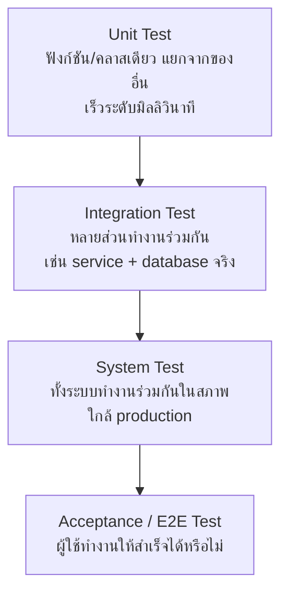

แต่ละระดับตอบคำถามคนละข้อ และ **ไม่ทดแทนกัน**

| ระดับ | ตอบคำถามว่า | จับ bug ประเภทไหน | จับไม่ได้ |
|---|---|---|---|
| Unit | ตรรกะข้างในถูกไหม | คำนวณผิด, เงื่อนไขขอบผิด | ประกอบกันแล้วไม่ทำงาน |
| Integration | ประกอบกันแล้วคุยกันรู้เรื่องไหม | schema ไม่ตรง, transaction, query ผิด | ผู้ใช้ใช้ไม่ได้เพราะปุ่มหาย |
| System | ระบบในสภาพจริงยังทำงานไหม | config, network, environment | ของที่ถูกทุกอย่างแต่ไม่ใช่สิ่งที่ผู้ใช้ต้องการ |
| Acceptance | ผู้ใช้ทำงานสำเร็จไหม | flow ขาด, UX พัง | รายละเอียดตรรกะลึก ๆ |

### รูปทรงของ suite: Pyramid, Trophy และ Ice Cream Cone

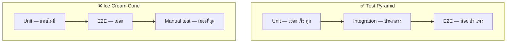

**Ice cream cone** คือรูปทรงที่เกิดขึ้นเองถ้าไม่มีใครออกแบบ เพราะการทดสอบด้วยมือ
ให้ความมั่นใจได้ทันทีโดยไม่ต้องลงทุน ปัญหาคือมันไม่ *สะสม* — สัปดาห์หน้าต้องทำใหม่ทั้งหมด

รูปทรงที่เหมาะกับงานที่มีหน้าจอเยอะและตรรกะน้อย เช่น web app ทั่วไป
คือสิ่งที่ Kent C. Dodds เรียกว่า **Testing Trophy** ซึ่งให้น้ำหนักกับ integration มากที่สุด
เพราะ bug ส่วนใหญ่ของงานประเภทนี้ไม่ได้อยู่ในตรรกะเดี่ยว ๆ แต่อยู่ที่รอยต่อ

**ข้อสรุปที่ใช้ได้จริง:** รูปทรงที่ถูก = รูปทรงที่ทำให้ suite ทั้งชุด
รันจบเร็วพอที่จะรันทุกครั้งที่แก้ code และเชื่อผลได้ทุกครั้ง

---

## 4. เทคนิคออกแบบ test case

การนึกเอาว่า "น่าจะทดสอบอะไร" ทำให้ได้ test ที่กระจุกอยู่ที่ happy path
เทคนิคด้านล่างนี้เป็นมาตรฐานที่สอนใน **ISTQB Foundation Level** และใช้ได้ทันที

### 4.1 Equivalence Partitioning — แบ่งกลุ่มค่าที่ให้ผลเหมือนกัน

ถ้าระบบรับอายุ 18–65 การทดสอบ 20, 21, 22, 23 ไม่ได้ให้ข้อมูลเพิ่มเลย เพราะอยู่กลุ่มเดียวกัน

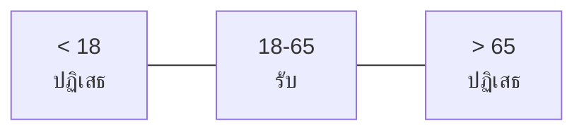

เลือกตัวแทนกลุ่มละ 1 ค่า → เหลือ 3 test แทน 40 test

### 4.2 Boundary Value Analysis — ตรงขอบคือที่ที่ bug อยู่

bug ส่วนใหญ่เกิดจาก `<` ที่ควรเป็น `<=` ดังนั้นให้ทดสอบที่ **ขอบและรอบขอบ**

สำหรับช่วง 18–65 ทดสอบ: **17, 18, 19** และ **64, 65, 66**

รวมสองเทคนิคเข้าด้วยกันได้ test 6–8 ตัวที่ครอบคลุมกว่า test 40 ตัวที่สุ่มเขียน

### 4.3 Decision Table — เมื่อเงื่อนไขหลายตัวมาเจอกัน

| # | เป็นสมาชิก | ยอดซื้อ > 1000 | มีคูปอง | ผลลัพธ์ที่คาดหวัง |
|---|---|---|---|---|
| 1 | ใช่ | ใช่ | ใช่ | ลด 20% |
| 2 | ใช่ | ใช่ | ไม่ | ลด 15% |
| 3 | ใช่ | ไม่ | ใช่ | ลด 10% |
| 4 | ไม่ | ใช่ | ใช่ | ลด 5% |
| 5 | ไม่ | ไม่ | ไม่ | ไม่ลด |

ประโยชน์ที่มากกว่าการได้ test case คือ **มันทำให้เจอช่องที่ spec ไม่ได้บอกไว้**
ระหว่างทำตารางมักจะพบว่ามีบางแถวที่ไม่มีใครในทีมตอบได้ว่าผลควรเป็นอะไร —
นั่นคือ requirement ที่หายไป และควรถามก่อนเขียน code

### 4.4 State Transition — เมื่อลำดับมีความหมาย

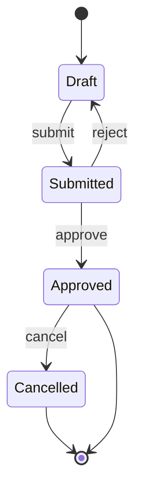

test ที่ต้องมีไม่ใช่แค่เส้นทางปกติ แต่รวมถึง **การเปลี่ยนสถานะที่ต้องถูกปฏิเสธ**
เช่น ยกเลิกใบที่ยังเป็น Draft, อนุมัติใบที่ถูกยกเลิกไปแล้ว
ช่องโหว่ด้าน business logic ส่วนใหญ่ซ่อนอยู่ตรงนี้

### 4.5 Pairwise Testing — เมื่อการรวมกันเยอะเกินไป

ระบบที่มี 5 ตัวเลือก ตัวละ 4 ค่า = 1,024 การรวมกัน ทดสอบครบไม่ไหว
แต่ถ้าออกแบบให้ **ทุกคู่ของค่า** ปรากฏอย่างน้อยหนึ่งครั้ง จะเหลือประมาณ 20 กรณี
และครอบคลุม bug ส่วนใหญ่ เพราะ bug ที่ต้องใช้ตัวแปร 3 ตัวขึ้นไปพร้อมกันจึงจะเกิดนั้นพบได้น้อย

---

## 5. Coverage — สิ่งที่มันบอก และสิ่งที่มันไม่บอก

```python
def divide(a, b):
    return a / b

# test นี้ให้ statement coverage 100%
def test_divide():
    divide(10, 2)     # ไม่มี assert เลยแม้แต่ตัวเดียว
```

test ข้างบนได้ coverage 100% แต่ **จับอะไรไม่ได้เลย** — แม้เปลี่ยนเป็น `a * b` ก็ยังเขียว

| ชนิดของ coverage | วัดอะไร | ยังพลาดอะไร |
|---|---|---|
| Statement | บรรทัดถูกรันหรือยัง | ไม่รู้ว่ามีการตรวจผลหรือไม่ |
| Branch | ทุกกิ่ง if/else ถูกรันครบไหม | ไม่รู้ว่าเงื่อนไขย่อยถูกทดสอบครบ |
| Condition | เงื่อนไขย่อยแต่ละตัวเป็นทั้ง true และ false | ยังไม่ครอบคลุมทุกการรวมกัน |
| Path | ทุกเส้นทางถูกเดินครบไหม | เพิ่มแบบทวีคูณ ทำครบไม่ไหวในทางปฏิบัติ |

**Coverage เป็นตัวชี้วัดเชิงลบที่ดี:** ส่วนที่ coverage เป็น 0% แปลว่าไม่มีอะไรตรวจแน่นอน
แต่ 90% ไม่ได้แปลว่าปลอดภัย 90% เมื่อไรที่มันกลายเป็น KPI มันจะถูกเล่นเกมทันที
(Goodhart's Law อีกครั้ง)

### Mutation Testing — วัดคุณภาพของ test แทน

แนวคิด: จงใจแก้ code ให้ผิดทีละจุด แล้วดูว่า test แดงไหม

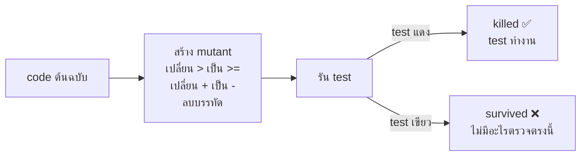

**Mutation score** = mutant ที่ถูกฆ่า / mutant ทั้งหมด — เป็นตัวเลขที่โกงยากกว่า coverage มาก
เพราะการจะได้คะแนนสูง test ต้องมี assertion ที่มีความหมายจริง ๆ
เครื่องมือที่ใช้: `mutmut`/`cosmic-ray` สำหรับ Python, **Stryker** สำหรับ JS/TS

---

## 6. Test Double — ของปลอม 5 ชนิด

คำศัพท์ชุดนี้มาจาก *xUnit Test Patterns* ของ Gerard Meszaros
คนส่วนใหญ่เรียกทุกอย่างว่า "mock" ซึ่งทำให้คุยกันคนละเรื่อง

| ชนิด | ทำอะไร | ใช้เมื่อไร |
|---|---|---|
| **Dummy** | ส่งไปให้ครบพารามิเตอร์ ไม่ถูกใช้จริง | ต้องใส่ค่าแต่ค่านั้นไม่เกี่ยว |
| **Stub** | คืนค่าที่กำหนดไว้ล่วงหน้า | ต้องการให้ dependency ตอบแบบเจาะจง |
| **Spy** | เป็น stub ที่จำว่าถูกเรียกอย่างไรบ้าง | อยากตรวจว่ามีการเรียกจริง เช่น ส่งอีเมล |
| **Mock** | ตั้งความคาดหวังไว้ล่วงหน้า และ fail ถ้าไม่เป็นไปตามนั้น | ตรวจ *พฤติกรรมการเรียก* เป็นหลัก |
| **Fake** | ของจริงเวอร์ชันย่อที่ทำงานได้ เช่น in-memory repository | อยากได้ของที่ทำงานจริงแต่เร็ว |

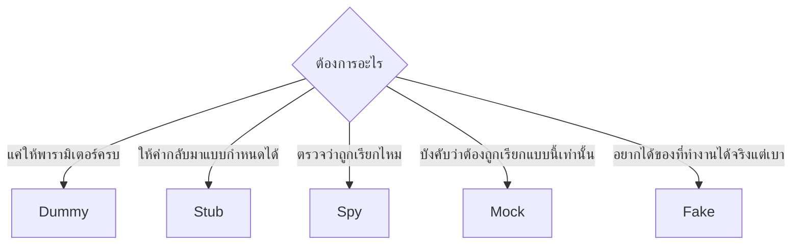

### Over-mocking — กับดักที่พบบ่อยที่สุด

เมื่อ test เต็มไปด้วย mock สิ่งที่มันตรวจจะกลายเป็น *โครงสร้างภายในของ code*
ไม่ใช่ *พฤติกรรมที่ผู้ใช้สนใจ* ผลคือ refactor ทีไร test แดงทุกที
ทั้งที่พฤติกรรมไม่เปลี่ยนเลย — test แบบนี้เปลี่ยนจากตาข่ายนิรภัยเป็นโซ่ตรวน

**หลักที่ใช้ตัดสิน:** mock เฉพาะสิ่งที่อยู่ *ข้ามขอบเขตที่เราควบคุมไม่ได้* —
network, เวลา, ระบบไฟล์, บริการภายนอก, การสุ่ม
ส่วนตรรกะภายในของเราเอง ให้ใช้ของจริง

> 💼 **จากหน้างานจริง**
> `time` และ `random` เป็นสองสิ่งที่ทำให้ test flaky มากที่สุดในระบบจริง
> ทีมที่ทำถูกจะ inject ทั้งสองอย่างเข้าไปตั้งแต่ต้น ไม่ใช่เรียก `Date.now()` กลางฟังก์ชัน
> การออกแบบให้ test ได้ กับการออกแบบให้ดี มักเป็นสิ่งเดียวกัน

---

## 7. TDD และ BDD

### TDD: Red → Green → Refactor

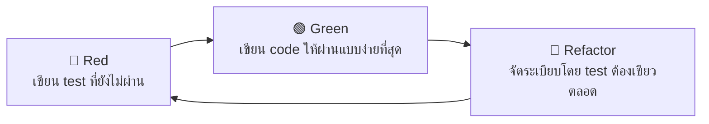

คุณค่าที่แท้จริงของ TDD ไม่ใช่ "ได้ test" แต่คือ **มันบังคับให้ออกแบบ interface ก่อนลงมือ**
การเขียน test ก่อนคือการเขียนว่า *จะเรียกใช้ของสิ่งนี้อย่างไร* ซึ่งเป็นการออกแบบ

ขั้น Red มีหน้าที่สำคัญที่คนข้ามบ่อย: **มันพิสูจน์ว่า test ตัวนี้จับอะไรได้จริง**
test ที่ไม่เคยเห็นเป็นสีแดง คือ test ที่ยังไม่รู้ว่าใช้งานได้หรือเปล่า

**TDD กับ AI agent:** เมื่อ agent เขียน code ได้เร็วมาก การเขียน test ก่อนกลายเป็น
การกำหนดเป้าหมายที่วัดได้ให้มัน — agent มีสัญญาณชัดเจนว่าเสร็จหรือยัง
แทนที่จะต้องเดาว่ามนุษย์พอใจหรือยัง

### BDD: ภาษาที่คนไม่ใช่ programmer อ่านได้

```gherkin
Feature: จองห้องประชุม

  Scenario: จองห้องว่างสำเร็จ
    Given ห้อง "A101" ว่างในวันที่ 2026-08-10 เวลา 09:00-10:00
    When ผู้ใช้ "somchai" จองห้อง "A101" ในช่วงเวลานั้น
    Then การจองถูกบันทึกด้วยสถานะ "confirmed"
    And ผู้ใช้เห็นการจองในหน้ารายการของตัวเอง
```

ประโยชน์ไม่ได้อยู่ที่ syntax แต่อยู่ที่การบังคับให้เขียน **เกณฑ์ยอมรับให้ชัดก่อนเขียน code**
รูปแบบ Given/When/Then เป็นโครงเดียวกับ **AAA — Arrange / Act / Assert** ในระดับ unit

---

## 8. Flaky Test — ศัตรูอันดับหนึ่งของความเชื่อถือ

test ที่เขียวบ้างแดงบ้างโดย code ไม่เปลี่ยน ทำลาย suite ทั้งชุด
เพราะเมื่อคนเริ่มชินกับการ "รันใหม่อีกทีเดี๋ยวก็เขียว" **test แดงที่เป็นของจริงจะถูกมองข้ามด้วย**

| สาเหตุ | อาการ | วิธีแก้ |
|---|---|---|
| แชร์สถานะระหว่าง test | สลับลำดับแล้วแดง | ให้แต่ละ test สร้างและเก็บกวาดข้อมูลของตัวเอง |
| พึ่งเวลาจริง | แดงตอนข้ามวัน หรือตอนเที่ยงคืน | inject clock แล้วตรึงเวลาใน test |
| รอด้วย sleep | แดงเมื่อเครื่อง CI ช้ากว่าปกติ | ใช้ assertion ที่รอจนกว่าเงื่อนไขจะเป็นจริง |
| ลำดับแบบขนาน | รันขนานแล้วแดง | แยก database/schema ต่อ worker |
| พึ่งบริการภายนอก | แดงเมื่อเน็ตช้า | ใช้ test double หรือ container ของตัวเอง |
| ไม่ deterministic | แดงแบบสุ่ม | ตรึง seed ของการสุ่ม |

**นโยบายที่ทีมที่ทำถูกใช้กัน:**

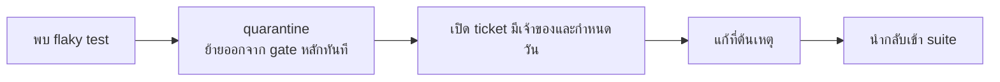

สิ่งที่ **ห้ามทำ** คือใส่ retry ทับไว้แล้วเดินหน้าต่อ — retry ซ่อนอาการ
แต่บ่อยครั้งอาการนั้นคือ race condition จริงที่ผู้ใช้จะเจอในภายหลัง

---

## 9. เจอ bug แล้วต้องทำอะไร — และ Defect Life Cycle

การเจอ bug เป็นแค่จุดเริ่ม สิ่งที่กำหนดว่ามันจะถูกแก้จริงหรือหายไปในความว่างเปล่า
คือสิ่งที่เกิดขึ้นใน 15 นาทีถัดมา

### 9.1 ลำดับการทำงานเมื่อเจอ bug

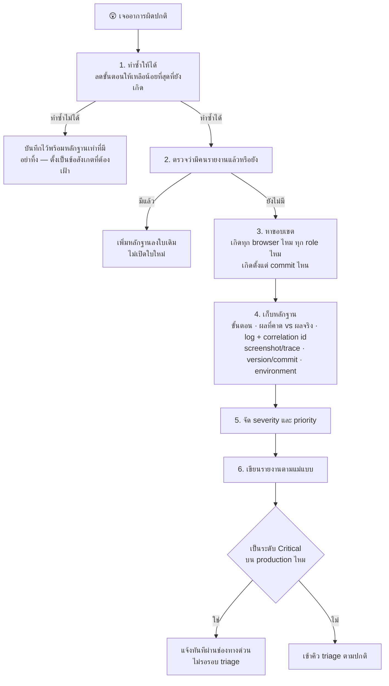

**ขั้นที่ 1 คือขั้นที่คนข้ามบ่อยที่สุดและแพงที่สุด**
รายงานที่บอกว่า "กดแล้วพัง" โดยไม่มีขั้นตอนที่ทำซ้ำได้ จะกินเวลาของ dev
มากกว่าเวลาที่ tester ประหยัดไปหลายเท่า

หลักการลดขั้นตอน: ตัดขั้นตอนออกทีละอย่างแล้วลองใหม่ ถ้ายังเกิดอยู่แปลว่าขั้นตอนนั้นไม่เกี่ยว
สุดท้ายจะได้ **ขั้นตอนที่สั้นที่สุดที่ยังทำให้เกิด** ซึ่งมักจะชี้ไปที่สาเหตุด้วยตัวมันเอง

> 💼 **จากหน้างานจริง**
> `"cannot reproduce"` ไม่ใช่คำตอบ แต่เป็นสัญญาณว่ากระบวนการมีรู —
> อาจเป็นเพราะ log ไม่พอ, ไม่ได้บันทึกเวอร์ชัน, หรือ environment ต่างกัน
> ทีมที่ทำถูกจะถือว่าใบที่ปิดด้วยเหตุผลนี้เป็น *ปัญหาของระบบสังเกตการณ์* ไม่ใช่ความผิดของผู้รายงาน

### 9.2 แม่แบบรายงาน bug

```markdown
**หัวข้อ:** [ที่ไหน] [ทำอะไร] แล้ว [เกิดอะไร] แทนที่จะ [ควรเกิดอะไร]

**Environment**
- Version / commit: abc1234
- Environment: staging
- Browser / OS / device: Chrome 141 / macOS 15
- Account / role ที่ใช้: student_test01

**ขั้นตอนที่ทำให้เกิด (สั้นที่สุดที่ยังเกิด)**
1. ...
2. ...
3. ...

**ผลที่คาดหวัง**
[อ้างอิง AC หรือ spec ข้อไหน]

**ผลที่เกิดจริง**
[ข้อเท็จจริงล้วน ไม่ใช่การเดาสาเหตุ]

**ความถี่**
เกิดทุกครั้ง / เกิด 3 ใน 10 ครั้ง

**หลักฐาน**
- screenshot / วิดีโอ / Playwright trace
- log พร้อม requestId: `7f3a...`
- คำขอ/คำตอบของ API ที่เกี่ยวข้อง

**Severity:** High   **Priority:** Medium
**เป็น regression ไหม:** ใช่ — เคยทำงานได้ในเวอร์ชัน 1.2.0
```

**หัวข้อที่ดีกับไม่ดีต่างกันมาก**

> ❌ "ระบบจองพัง"
> ❌ "หน้าจอมีปัญหา"
> ✅ "หน้ารายการจอง: กดยกเลิกการจองที่ถูกอนุมัติแล้ว ได้ 500 แทนที่จะได้ 409 พร้อมข้อความ"

หัวข้อที่ดีทำให้คนอ่านตัดสินได้ทันทีว่าเรื่องนี้เกี่ยวกับตัวเองไหม โดยไม่ต้องเปิดอ่าน

### 9.3 Severity ต่างจาก Priority

สองคำนี้ถูกใช้สลับกันบ่อยที่สุดในวงการ และเป็นคนละเรื่องกันสิ้นเชิง

- **Severity** = ความรุนแรงทาง *เทคนิค* — ตัดสินโดยผู้รายงาน/tester
- **Priority** = ความเร่งด่วนทาง *ธุรกิจ* — ตัดสินโดยเจ้าของผลิตภัณฑ์

| | **Priority สูง** | **Priority ต่ำ** |
|---|---|---|
| **Severity สูง** | ชำระเงินแล้วเงินหักแต่ไม่ได้สินค้า → แก้ทันที | ระบบล่มเมื่อใช้ browser ที่เลิกสนับสนุนแล้ว → เข้าคิวปกติ |
| **Severity ต่ำ** | ชื่อบริษัทสะกดผิดบนหน้าแรก → แก้วันนี้ แม้ไม่กระทบการทำงาน | ข้อความ tooltip ในหน้า admin เยื้อง 2px → ทำเมื่อว่าง |

ช่อง **Severity ต่ำ / Priority สูง** คือช่องที่พิสูจน์ว่าสองคำนี้ไม่ใช่สิ่งเดียวกัน
และเป็นเหตุผลที่ tester ไม่ควรเป็นคนตัดสิน priority เพียงลำพัง

**เกณฑ์ severity ที่ใช้ได้จริง**

| ระดับ | เกณฑ์ |
|---|---|
| **Critical** | ระบบใช้ไม่ได้ / ข้อมูลเสียหายถาวร / ข้อมูลรั่ว / ไม่มีทางเลี่ยง |
| **High** | ฟังก์ชันหลักใช้ไม่ได้ แต่มีทางเลี่ยงที่ยุ่งยาก |
| **Medium** | ฟังก์ชันรองผิดพลาด หรือฟังก์ชันหลักผิดในกรณีเฉพาะ |
| **Low** | ปัญหาด้านความสวยงามหรือข้อความ ไม่กระทบการใช้งาน |

### 9.4 Defect Life Cycle

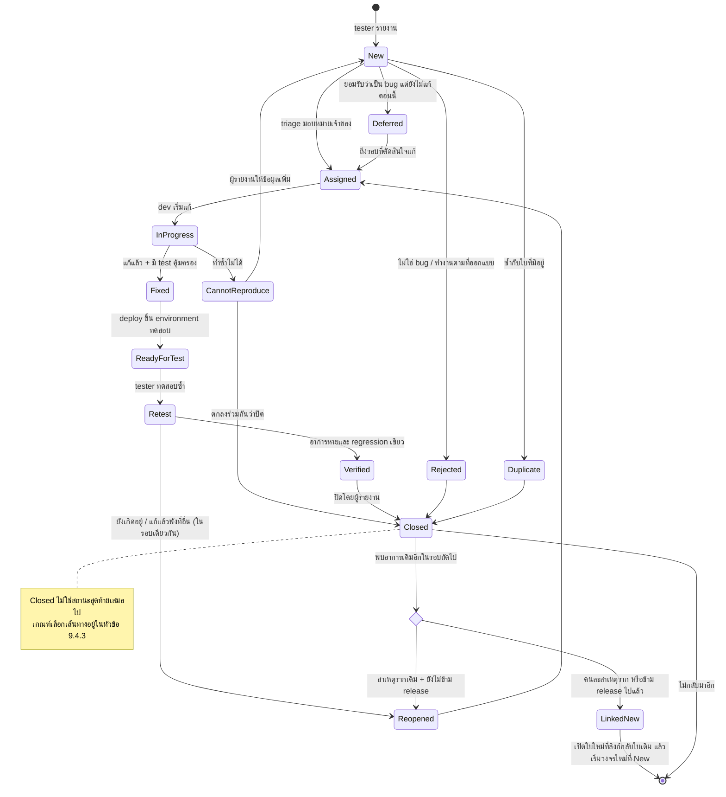

**สิ่งที่เปลี่ยนจาก diagram แบบพื้นฐาน** คือ `Closed` เลิกเป็น terminal state เพียงอย่างเดียว
และมี **จุดตัดสิน** คั่นก่อนเสมอ — ไม่ใช่ลากเส้น `Closed --> Reopened` ตรง ๆ
เพราะการ reopen อัตโนมัติทุกครั้งที่เจออาการซ้ำ จะทำให้รายงานคุณภาพของ release ที่ปิดไปแล้วเพี้ยน

### 9.4.1 ใครถือใบในสถานะไหน

state diagram ด้านบนบอกว่า *ใบเดินไปทางไหนได้บ้าง*
แต่คำถามที่ทำให้งานติดในทางปฏิบัติคือ **"ตอนนี้ใบอยู่ในมือใคร"**

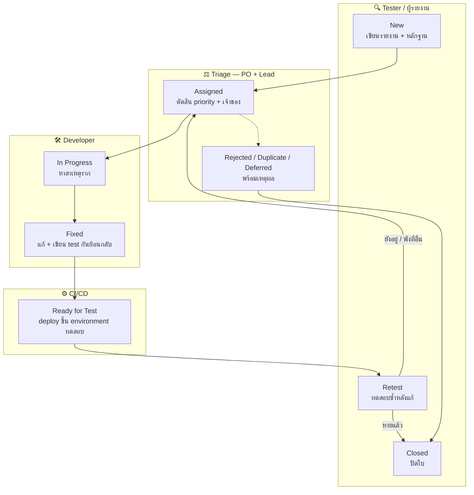

**เส้นที่ต้องจำ:** ใบวิ่งจาก tester → triage → dev → CI → กลับมาที่ tester เสมอ
ใบที่ข้ามขั้น `Retest` ไปปิดเลย คือใบที่ไม่มีใครยืนยันว่าแก้จริง

### 9.4.2 ตัวอย่างการเดินทางของ bug หนึ่งใบ

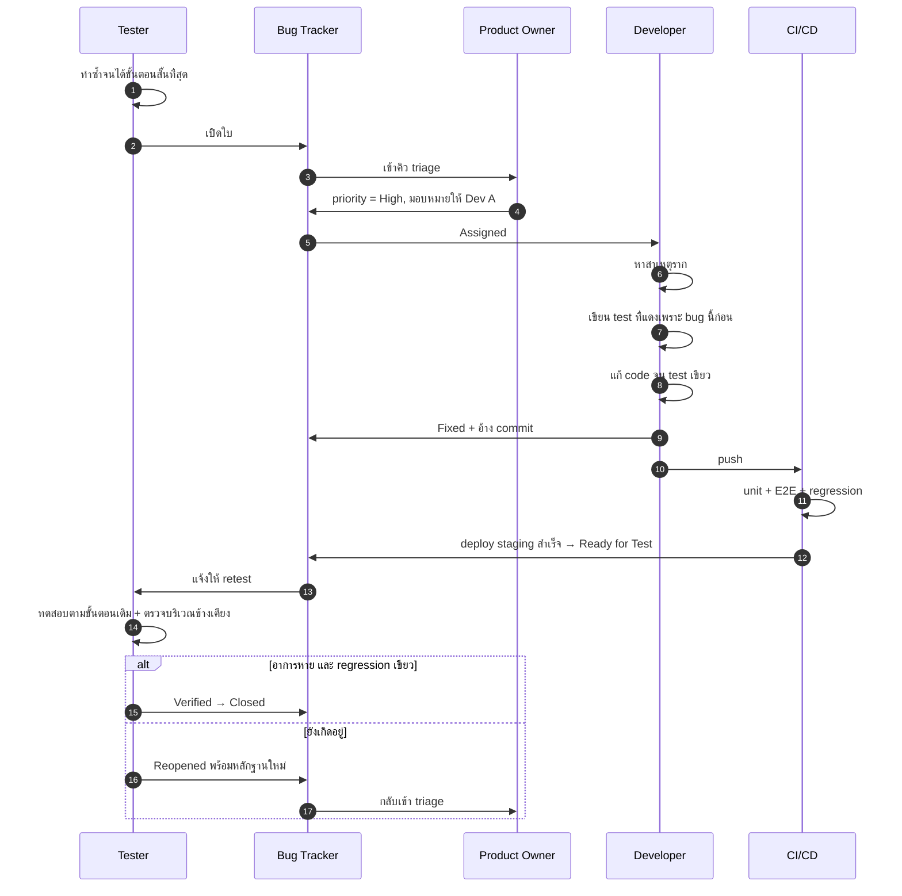

ขั้นที่ 7 — **เขียน test ที่แดงเพราะ bug นี้ก่อนแก้** — คือขั้นที่ทำให้วงจรนี้
เป็นการเพิ่ม coverage ให้ loop จริง ๆ ไม่ใช่แค่การซ่อมอาการ
ถ้า test ตัวนั้นไม่เคยแดงมาก่อน แปลว่ามันยังไม่ได้ตรวจ bug ตัวนี้

**กติกาที่ทำให้วงจรนี้ไม่พัง**

| กติกา | เหตุผล |
|---|---|
| **คนที่ปิดใบต้องเป็นผู้รายงาน ไม่ใช่คนแก้** | คนแก้มีอคติที่จะเชื่อว่าแก้แล้ว การให้คนอื่นยืนยันคือขั้น Verify ที่แท้จริง |
| ทุกใบที่ถูกปิดแบบ **Fixed** ต้องมี test ที่จะแดงถ้า bug นี้กลับมา | ไม่งั้นมันจะกลับมาแน่นอน และครั้งหน้าไม่มีใครรู้ตัว |
| **Rejected / Duplicate / Deferred** ต้องเขียนเหตุผลเสมอ | เพื่อไม่ให้คนถัดไปเสียเวลาสืบเรื่องเดิมซ้ำ |
| **Deferred** ต้องมีเงื่อนไขว่าจะกลับมาพิจารณาเมื่อไร | ไม่งั้นมันคือการปฏิเสธแบบสุภาพ |
| ใบที่ **Reopened** เกิน 2 ครั้งต้องยกระดับเป็นการคุยเรื่องสาเหตุราก | แปลว่าไม่มีใครเข้าใจสาเหตุจริง กำลังแก้ที่อาการ |
| ทุกใบต้องมี **สถานะและเจ้าของเสมอ** | ใบที่ไม่มีเจ้าของคือใบที่ไม่มีใครทำ |

### 9.4.3 เมื่อ bug ที่ปิดไปแล้วกลับมาอีก

การเจออาการเดิมซ้ำหลังใบถูกปิดไปแล้ว เป็นสัญญาณ **สองชั้น** ที่ต้องจัดการคนละแบบ

- ชั้นที่เห็นง่าย: *ใบนี้จะเดินต่ออย่างไร* — เป็นเรื่องของกระบวนการติดตาม
- ชั้นที่สำคัญกว่า: *ทำไม loop ของเราถึงปล่อยมันผ่านมาได้อีก* — เป็นเรื่องของคุณภาพ suite

#### เกณฑ์ตัดสินเส้นทาง

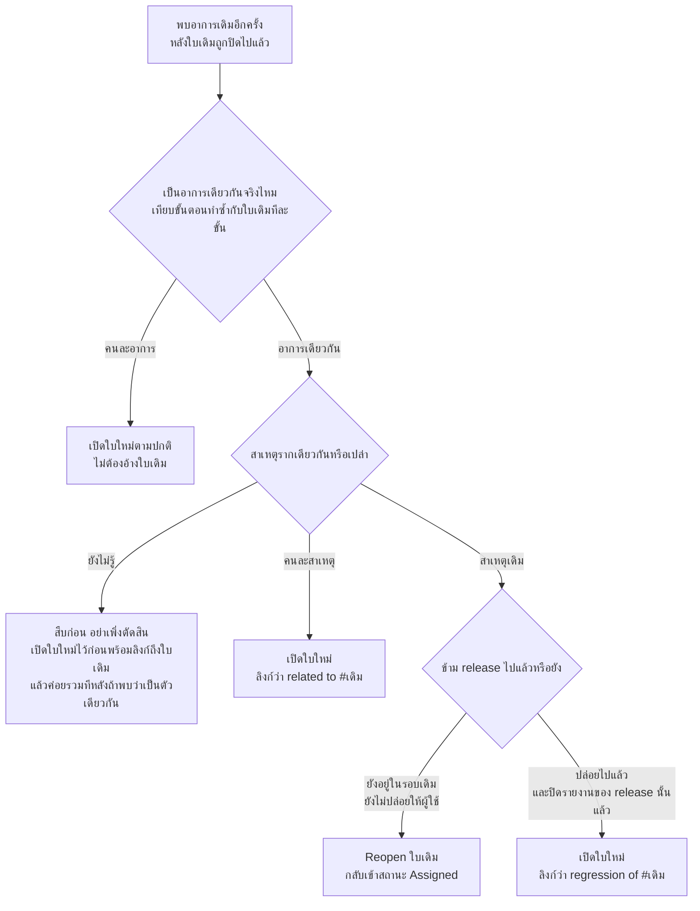

#### สองทางเลือกนี้แลกอะไรกัน

| | **Reopen ใบเดิม** | **เปิดใบใหม่ที่ลิงก์กลับ** |
|---|---|---|
| ประวัติการสืบสวน | อยู่ที่เดียว อ่านย้อนได้ครบในใบเดียว | กระจายหลายใบ ต้องตามลิงก์ |
| ความจริงของรายงานราย release | **เพี้ยน** — ใบที่ปิดไปใน v1.2 จะกลับมาดูเหมือนไม่เคยปิด | **ตรง** — v1.2 ปิดจริง ส่วน v1.4 มีใบใหม่ |
| ผลต่อตัวชี้วัด | ดันค่า **reopen rate** ขึ้น (ถูกต้อง ถ้าเป็นการแก้ที่ไม่จบ) | ดันค่า **escape rate / regression rate** ขึ้น |
| การวางแผนรอบถัดไป | ใบเก่าโผล่กลับเข้า backlog ซึ่งบางทีมมองว่าสับสน | ใบใหม่เข้าคิว triage ตามปกติ |
| เหมาะเมื่อ | ยังไม่ข้าม release และสาเหตุรากเดิม | ข้าม release แล้ว หรือคนละสาเหตุราก |

**กฎง่าย ๆ ที่ทีมส่วนใหญ่ใช้:** ยังไม่ปล่อยของ → *reopen*, ปล่อยไปแล้ว → *ใบใหม่ที่ลิงก์กลับ*
เหตุผลคือรายงานคุณภาพของแต่ละ release ต้อง **แช่แข็งได้** —
ถ้าย้อนไปแก้สถานะของใบเก่าได้เรื่อย ๆ จะไม่มีทางตอบได้ว่า
"ตอนปล่อย v1.2 เรารู้ตัวว่ามี bug นี้ค้างอยู่หรือเปล่า"

#### สิ่งที่ต้องทำเสมอ ไม่ว่าจะเลือกทางไหน

การกลับมาของ bug ที่ปิดไปแล้ว แปลว่า **กติกา "ทุกใบที่ปิดแบบ Fixed ต้องมี test คุ้มครอง" ถูกละเมิดที่ใดที่หนึ่ง**
ต้องหาให้เจอว่าละเมิดตรงไหน ก่อนจะเริ่มแก้ code

| ทำไมถึงหลุดกลับมาได้ | ต้องแก้ที่ระบบ ไม่ใช่ที่ใบนี้ |
|---|---|
| ปิดใบไปโดยไม่ได้เขียน test เลย | กติกาการปิดใบ — บังคับให้แนบชื่อ test ที่คุ้มครอง |
| มี test แต่ตรวจคนละเงื่อนไขกับที่พังจริง | คุณภาพของ assertion — ใช้ mutation testing ตรวจย้อน |
| มี test แต่ไม่ได้อยู่ใน suite ที่รันทุก commit | ย้าย test เข้าด่านหลักของ CI |
| test ถูก `skip` หรือ quarantine ค้างไว้ | นโยบาย quarantine ต้องมีวันหมดอายุและมีเจ้าของ |
| แก้แล้วแต่ commit หายตอน merge หรือถูก revert ทับ | กระบวนการ branch และ release ไม่ใช่เรื่องของ test |

**ลำดับการลงมือที่ถูกต้อง**

1. เขียนหรือแก้ test ให้ **แดงกับของที่พังอยู่ตอนนี้ก่อน** — ถ้าเขียนแล้วมันยังเขียว แปลว่ายังไม่เข้าใจสาเหตุ
2. ค่อยแก้ code จน test เขียว
3. ยืนยันว่า test ตัวนั้นอยู่ในด่านที่รันทุกครั้ง ไม่ใช่ suite ที่รันสัปดาห์ละหน
4. บันทึกสั้น ๆ ว่า loop ปล่อยผ่านมาได้เพราะอะไร แล้วปิดช่องนั้นที่ระบบ

> ⚠️ ใบเดียวกันที่ถูก reopen **เกิน 2 ครั้ง** ให้หยุดแก้ที่อาการทันที
> แล้วยกระดับเป็นการคุยเรื่องสาเหตุราก — ตัวเลขนี้เป็นสัญญาณที่เชื่อถือได้ว่า
> ไม่มีใครในทีมเข้าใจว่าจริง ๆ แล้วมันพังเพราะอะไร

---

### 9.5 Triage — การประชุมที่สั้นแต่จำเป็น

รอบละ 15–20 นาที ไล่เฉพาะใบที่สถานะ `New` โดยตัดสิน 3 อย่างเท่านั้น:

1. **เป็น bug จริงไหม** — ถ้าไม่ใช่ ให้ระบุว่ามันคือ requirement ใหม่หรือความเข้าใจผิด
2. **priority เท่าไร** — เจ้าของผลิตภัณฑ์ตัดสิน
3. **ใครเป็นเจ้าของ** — ต้องได้ชื่อคน ไม่ใช่ชื่อทีม

สิ่งที่ **ห้ามทำใน triage** คือการเริ่มดีบักหาสาเหตุตรงนั้น
เพราะจะกินเวลาทั้งห้องเพื่อแก้ใบเดียว ให้บันทึกว่าต้องสืบต่อแล้วเดินหน้าไปใบถัดไป

### 9.6 ตัวเลขที่ใช้ดูสุขภาพของกระบวนการ

| ตัวชี้วัด | สูตร | บอกอะไร |
|---|---|---|
| **Defect Removal Efficiency (DRE)** | bug ที่เจอก่อนปล่อย ÷ (เจอก่อนปล่อย + เจอหลังปล่อย) × 100 | loop ของเราจับได้กี่ % ก่อนถึงมือผู้ใช้ |
| **Escape rate / Leakage** | bug ที่ผู้ใช้เจอ ÷ bug ทั้งหมด | สัดส่วนที่หลุดออกไป — ยิ่งต่ำยิ่งดี |
| **Reopen rate** | ใบที่ถูกเปิดใหม่ ÷ ใบที่เคยปิดว่า Fixed | คุณภาพของการแก้และการยืนยัน *ภายในรอบเดียวกัน* |
| **Regression rate** | ใบที่กลับมาอีกหลังปิดและข้าม release แล้ว ÷ ใบที่ปิดทั้งหมด | suite ของเรากันของเก่าไม่ให้พังซ้ำได้ดีแค่ไหน |
| **Defect age** | เวลาเฉลี่ยตั้งแต่รายงานจนปิด | คิวติดขัดตรงไหน |
| **Defect density** | จำนวน bug ÷ ขนาดของโมดูล | ส่วนไหนของระบบเสี่ยงที่สุด |

**DRE คือ coverage ของ loop ในเชิงกระบวนการ** — มันตอบคำถามเดียวกับที่ mutation score
ตอบในระดับ code เพียงแต่วัดที่ระดับทีม

> ⚠️ ตัวเลขเหล่านี้ใช้ดู *แนวโน้มของกระบวนการ* เท่านั้น
> ทันทีที่เอา "จำนวน bug ที่แต่ละคนทำให้เกิด" ไปประเมินคน
> คนจะเลิกรายงาน bug ของตัวเอง และตัวเลขจะสวยขึ้นทั้งที่คุณภาพแย่ลง

---

## 10. การทดสอบที่ไม่ใช่ฟังก์ชัน

| ประเภท | ถามว่า | เครื่องมือที่ใช้บ่อย |
|---|---|---|
| Performance | เร็วพอไหมภายใต้โหลดจริง | k6, JMeter, Locust |
| Security | มีช่องให้ทำสิ่งที่ไม่ควรทำได้ไหม | OWASP ZAP, CodeQL, Dependabot |
| Accessibility | คนที่ใช้ screen reader ใช้ได้ไหม | axe-core, Lighthouse |
| Compatibility | ทำงานบน browser/อุปกรณ์อื่นไหม | Playwright หลาย project |
| Reliability | รันยาว ๆ แล้วยังปกติไหม | soak test |

การทดสอบ accessibility ด้วย `axe-core` สอดแทรกเข้าไปใน E2E test ได้ตรง ๆ
และมักเจอปัญหาจริงตั้งแต่ครั้งแรกที่รัน — เป็นของที่ให้ผลตอบแทนสูงเทียบกับแรงที่ลง

### Exploratory Testing — สิ่งที่ automation ทดแทนไม่ได้

การทดสอบอัตโนมัติตรวจได้เฉพาะสิ่งที่เรา *คิดออกแล้ว* ว่าต้องตรวจ
Exploratory testing คือการนั่งใช้ระบบจริงโดยตั้งใจหาเรื่อง โดยมีกรอบเวลาและเป้าหมายกำกับ

กติกาที่ทำให้มันเป็นงานวิศวกรรมไม่ใช่การสุ่มคลิก:
1. ตั้งเวลา 30 นาที และตั้ง **charter** ว่ารอบนี้จะสำรวจอะไร
2. จดทุกอย่างที่แปลก แม้ยังไม่แน่ใจว่าเป็น bug
3. ทุกอย่างที่พบและยืนยันแล้ว **ต้องถูกแปลงเป็น automated test**

ข้อ 3 คือสิ่งที่ทำให้ความรู้สะสม แทนที่จะต้องหาใหม่ทุกสัปดาห์

---

## 11. ทดสอบระบบที่มี AI อยู่ข้างใน

ปัญหาพื้นฐาน: LLM ไม่ deterministic — input เดิมอาจได้ output ต่างกัน
`assertEqual(output, "ข้อความที่คาดหวัง")` จึงใช้ไม่ได้

**สิ่งที่ยังทดสอบได้แบบเดิมทุกประการ**

- โครงสร้างของผลลัพธ์ — เป็น JSON ที่ตรง schema ไหม
- ขอบเขต — ไม่มี field ต้องห้ามหลุดออกมา, ความยาวอยู่ในเกณฑ์
- พฤติกรรมของระบบรอบ ๆ — timeout, retry, fallback เมื่อ API ล่ม
- ความปลอดภัย — ข้อความที่พยายาม prompt injection ต้องไม่ทำให้ระบบทำสิ่งต้องห้าม
- ต้นทุน — จำนวน token ต่อคำขอไม่เกินเพดาน

**สิ่งที่ต้องเปลี่ยนวิธี**

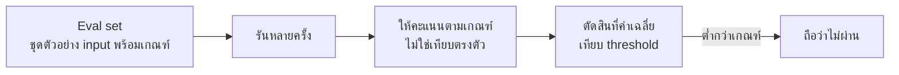

- ใช้ **eval set** ที่มีตัวอย่างหลากหลาย แทน test case เดี่ยว
- ตัดสินด้วย **เกณฑ์** เช่น "ต้องมีข้อมูลครบ 3 อย่าง" ไม่ใช่ข้อความตรงตัว
- ตั้ง threshold เป็นสัดส่วนที่ผ่าน เช่น ≥ 90% ของ eval set
- ระวังการใช้ LLM มาตรวจ LLM — ทำได้แต่ต้องมีชุดที่คนตรวจเองไว้เทียบด้วย ไม่งั้นอคติจะสะสม

**อีกด้านหนึ่ง: ทดสอบ code ที่ AI เขียนให้**
อันตรายที่สุดคือการให้ agent เขียนทั้ง code และ test ในรอบเดียวกัน
เพราะถ้ามันเข้าใจโจทย์ผิด มันจะเข้าใจผิดเหมือนกันทั้งสองไฟล์ และทุกอย่างจะเขียวสวยงาม
วิธีป้องกันคือ **คนกำหนดเกณฑ์ยอมรับก่อน** แล้วค่อยให้ agent ทำ
หรืออย่างน้อยคนต้องอ่าน assertion ทุกบรรทัดว่ามันตรวจสิ่งที่ควรตรวจจริง

---

## 12. Tester ทำงานร่วมกับ AI อย่างไรให้ได้ผลสูงสุด

เมื่อ AI เขียน code ได้เร็วขึ้นมาก จำนวนของที่ต้องตรวจก็เพิ่มขึ้นตาม
บทบาทของ tester จึงไม่ได้ลดลง แต่ **ย้ายจุดโฟกัส** — จากการเป็นคนเขียน test case ทีละใบ
ไปเป็นคนออกแบบว่า *อะไรคือเกณฑ์ตัดสินว่าถูก* ซึ่งเป็นสิ่งที่ AI ให้ไม่ได้

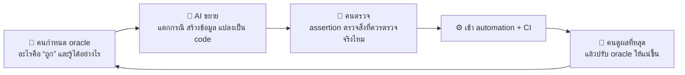

คำว่า **oracle** ในวงการทดสอบหมายถึง *แหล่งที่บอกว่าผลลัพธ์ที่ถูกต้องคืออะไร*
AI ไม่มี oracle ของระบบคุณ เพราะมันไม่รู้ว่าธุรกิจนี้ตกลงอะไรกันไว้

### 12.1 แบ่งงานให้ชัด

| งาน | ให้ AI ทำ | คนต้องทำ |
|---|---|---|
| แตก AC เป็น test case เบื้องต้น | ✅ ทำได้ดีมาก ครอบคลุมกว่าที่คนนึกออกเอง | ตัดที่ไม่เกี่ยว, เติมกรณีที่ต้องรู้บริบทธุรกิจ |
| ไล่ค่า boundary และ equivalence class | ✅ เป็นงานเชิงกลไก | ยืนยันว่าขอบที่ถูกต้องคือค่าไหน |
| สร้าง test data หลากหลายรูปแบบ | ✅ รวมถึงชื่อภาษาไทย, อักขระพิเศษ, emoji | ห้ามใช้ข้อมูลจริงของผู้ใช้เด็ดขาด |
| แปลงขั้นตอนทดสอบด้วยมือเป็น Playwright | ✅ ประหยัดเวลามาก | ตรวจว่า locator ที่มันเขียนมีอยู่จริง |
| ร่างรายงาน bug จากบันทึกดิบ | ✅ จัดรูปแบบให้ครบช่อง | ยืนยันข้อเท็จจริงทุกบรรทัดด้วยตาตัวเอง |
| วิเคราะห์ log จำนวนมาก จัดกลุ่มอาการ | ✅ เก่งเรื่องหารูปแบบซ้ำ | ตัดสินว่าสมมติฐานไหนน่าเชื่อ |
| เสนอกรณีที่ทีมอาจมองข้าม | ✅ ไม่มีอคติผูกพันกับ design | ประเมินว่ากรณีนั้นเกิดจริงไหมในบริบทนี้ |
| **ตัดสินว่าผลลัพธ์ถูกหรือผิด** | ❌ | **คนเท่านั้น** |
| **จัดลำดับตามความเสี่ยงทางธุรกิจ** | ❌ | **คนเท่านั้น** |
| **ตัดสิน severity/priority** | ❌ | **คนเท่านั้น** |
| **ปิดใบ bug** | ❌ | **คนเท่านั้น** |
| **ตัดสินว่า "ทดสอบพอแล้ว"** | ❌ | **คนเท่านั้น** |

### 12.2 prompt ที่ใช้ได้จริง 4 แบบ

**1) แตก test case จาก AC**

```
นี่คือ acceptance criteria ของ story:
[วาง AC]

ช่วยแตกเป็น test case โดย:
- ใช้ equivalence partitioning และ boundary value analysis
- แยกเป็น 3 กลุ่ม: happy path / กรณีที่ต้องถูกปฏิเสธ / กรณีขอบ
- ทุก case ต้องระบุว่ามาจาก AC ข้อไหน
- ท้ายสุดให้ลิสต์ "สิ่งที่ AC นี้ยังไม่ได้ระบุ จึงทดสอบไม่ได้" แยกออกมา
```

บรรทัดสุดท้ายมีค่าที่สุด — มันเปลี่ยน AI จากเครื่องผลิต test case
เป็นเครื่องมือหาช่องโหว่ใน requirement

**2) หากรณีที่ทีมมองข้าม**

```
นี่คือ test case ที่เรามีอยู่แล้ว: [วางรายการ]
นี่คือ code ของฟังก์ชัน: [วาง code]

อะไรคือกรณีที่ code นี้จะทำงานผิดแต่ test ชุดนี้จับไม่ได้
เรียงตามความน่าจะเกิดในการใช้งานจริง และอธิบายว่าทำไม test เดิมถึงจับไม่ได้
```

**3) แปลงบันทึกดิบเป็นรายงาน bug**

```
นี่คือบันทึกดิบจากการทดสอบ: [วาง]
นี่คือแม่แบบรายงานของเรา: [วางแม่แบบในหัวข้อ 9.2]

จัดให้อยู่ในแม่แบบ โดย:
- ถ้าข้อมูลช่องไหนไม่มีในบันทึก ให้เขียนว่า "ยังไม่มีข้อมูล" ห้ามเดา
- แยก "ข้อเท็จจริงที่สังเกตได้" ออกจาก "การคาดเดาสาเหตุ" ให้ชัด
```

ข้อห้ามเดาสำคัญมาก เพราะรายงาน bug ที่มีรายละเอียดที่ถูกแต่งขึ้น
จะทำให้ dev ไล่ผิดทางและเสียความเชื่อถือของ tester ไปด้วย

**4) วิเคราะห์ flaky test**

```
test นี้แดง 3 ใน 20 ครั้งบน CI แต่เขียวตลอดในเครื่อง
นี่คือ test: [วาง]  นี่คือ log ของรอบที่แดง: [วาง]

ระบุสาเหตุที่เป็นไปได้ 3 อันดับ เรียงตามหลักฐานที่มี
และบอกว่าจะยืนยันหรือตัดแต่ละข้อออกได้ด้วยการวัดอะไร
ห้ามเสนอให้ใส่ retry หรือ sleep
```

### 12.3 กับดักที่ต้องระวัง

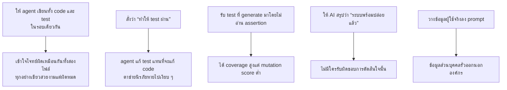

**มาตรการที่ตอบกับดักแต่ละข้อ**

- ข้อ 1 — ให้ **คนเขียนหรืออนุมัติ AC และ assertion ก่อน** แล้วค่อยให้ agent เขียน implementation
  หรืออย่างน้อยให้คนละรอบ/คนละ context กัน
- ข้อ 2 — ใส่ข้อห้ามลงใน prompt และใน `AGENTS.md` ว่า **ห้ามแก้ไฟล์ test**
  แล้วตรวจด้วย `git diff --stat` ทุกครั้งก่อน commit
- ข้อ 3 — อ่าน assertion ทุกบรรทัด และใช้ mutation testing เป็นตัวตรวจสอบซ้ำ
- ข้อ 4 — การตัดสินใจ go/no-go ต้องมีชื่อคนกำกับเสมอ ตาม RACI
- ข้อ 5 — ใช้ข้อมูลสังเคราะห์เท่านั้น และตรวจว่าไม่มี secret ตามกติกาข้อ 3 ของวิชา

### 12.4 วิธีวัดว่าการใช้ AI ได้ผลจริง

อย่าวัดที่ "เขียน test ได้กี่ตัว" เพราะจำนวน test ไม่ใช่คุณภาพ ให้ดูตัวเลขที่มีความหมาย:

| ก่อนใช้ AI | หลังใช้ AI | ตีความ |
|---|---|---|
| escape rate | ลดลง | ✅ จับได้เร็วขึ้นจริง |
| mutation score | สูงขึ้น | ✅ test มีคุณภาพขึ้น ไม่ใช่แค่เยอะขึ้น |
| จำนวน test | เพิ่มขึ้นมาก แต่ escape rate เท่าเดิม | ⚠️ ได้ test ที่ไม่ตรวจอะไร |
| เวลา review test | เพิ่มขึ้นจนกลายเป็นคอขวด | ⚠️ ต้องลดปริมาณลงและเน้นคุณภาพ |

> 💼 **จากหน้างานจริง**
> ทักษะของ tester ที่มีมูลค่าสูงขึ้นในยุคนี้คือ **การตั้งคำถามที่ทำให้ความคลุมเครือปรากฏ**
> เพราะทั้งมนุษย์และ AI สร้าง code จาก requirement ที่กำกวมได้เร็วพอ ๆ กัน —
> แต่คนที่ถามว่า *"ถ้าสองคนกดพร้อมกันเป๊ะ ๆ จะเกิดอะไร"* ยังหายากเหมือนเดิม

---

## 13. Checklist ก่อนบอกว่า "test พอแล้ว"

- [ ] ทุก business rule ที่เขียนใน spec มี test อย่างน้อย 1 ตัวที่จะแดงถ้าลบ rule นั้นทิ้ง
- [ ] มี test ของ **กรณีที่ต้องล้มเหลว** ไม่ใช่เฉพาะ happy path
- [ ] ค่าที่ขอบถูกทดสอบ ไม่ใช่แค่ค่ากลาง ๆ
- [ ] test ทั้ง suite รันได้จบเร็วพอที่จะรันทุกครั้งที่แก้ code
- [ ] สลับลำดับ test แล้วยังเขียว
- [ ] รัน 10 ครั้งติดกันแล้วเขียวทั้ง 10 ครั้ง
- [ ] ลองแก้ code ให้ผิดโดยตั้งใจ 1 จุด แล้วมี test แดงจริง
- [ ] ไม่มี test ที่ถูก skip ค้างไว้โดยไม่มีเหตุผลกำกับ
- [ ] CI รัน test ชุดเดียวกับที่รันในเครื่อง และได้ผลเหมือนกัน

ข้อที่ 7 คือ mutation testing แบบทำมือ และเป็นข้อที่ให้ข้อมูลมากที่สุดในเวลาที่น้อยที่สุด

---

## 📚 เอกสารอ้างอิง

**มาตรฐานและหลักสูตร**
- ISTQB — Certified Tester Foundation Level Syllabus
  (https://www.istqb.org/certifications/certified-tester-foundation-level)
- ISO/IEC/IEEE 29119 — Software Testing standard (https://www.iso.org/standard/81291.html)
- ISO/IEC 25010 — คุณลักษณะคุณภาพของซอฟต์แวร์ (https://www.iso.org/standard/78176.html)
- IEEE 1044 — Standard Classification for Software Anomalies — ที่มาของการจัดหมวด defect
  (https://standards.ieee.org/ieee/1044/4207/)
- ISTQB Glossary — นิยามศัพท์ที่ใช้อ้างอิงในอุตสาหกรรม (https://glossary.istqb.org/)

**บทความอ้างอิงหลัก**
- Martin Fowler — *Test Pyramid* (https://martinfowler.com/bliki/TestPyramid.html)
- Martin Fowler — *Test Double* (https://martinfowler.com/bliki/TestDouble.html)
- Martin Fowler — *Mocks Aren't Stubs*
  (https://martinfowler.com/articles/mocksArentStubs.html)
- Martin Fowler — *Eradicating Non-Determinism in Tests*
  (https://martinfowler.com/articles/nonDeterminism.html)
- Kent C. Dodds — *The Testing Trophy and Testing Classifications*
  (https://kentcdodds.com/blog/the-testing-trophy-and-testing-classifications)
- Google Testing Blog — *Test Sizes* (https://testing.googleblog.com/2010/12/test-sizes.html)

**หนังสือ**
- Gerard Meszaros — *xUnit Test Patterns: Refactoring Test Code* (http://xunitpatterns.com/)
- Kent Beck — *Test-Driven Development: By Example*
- Michael Feathers — *Working Effectively with Legacy Code* — ที่มาของ characterization test

**เครื่องมือ**
- pytest (https://docs.pytest.org/) · Vitest (https://vitest.dev/) · Jest (https://jestjs.io/)
- Playwright (https://playwright.dev/docs/intro)
- Stryker Mutator (https://stryker-mutator.io/) · mutmut (https://mutmut.readthedocs.io/)
- axe-core สำหรับ accessibility (https://github.com/dequelabs/axe-core)
- k6 (https://grafana.com/docs/k6/latest/)
