# System Architecture Design

> ⚠️ **หมายเหตุก่อนอ่าน:** เอกสารฉบับนี้สร้างขึ้นโดย **Claude Opus 5** จึงอาจมีเนื้อหาที่คลาดเคลื่อน
> ตกหล่น หรือล้าสมัยได้ ให้ใช้วิจารณญาณในการอ่าน ตรวจสอบย้อนกลับไปยังเอกสารอ้างอิงท้ายบท
> และเปรียบเทียบกับแหล่งข้อมูลอื่นประกอบเสมอ — การตั้งคำถามกับสิ่งที่อ่าน
> คือส่วนหนึ่งของการฝึก **critical thinking** ในวิชานี้

> **เชื่อมกับ loop ของวิชา:** สถาปัตยกรรมคือสิ่งที่กำหนดว่า **loop ของเราจะสั้นได้แค่ไหน** —
> ระบบที่มีขอบเขตชัดจะทดสอบทีละส่วนได้ ปล่อยของทีละส่วนได้ และให้ AI agent ทำงานทีละส่วนได้

---

## 🎯 อ่านจบแล้วจะได้อะไร

| สิ่งที่จะทำได้ | ใช้ในงานจริงอย่างไร |
|---|---|
| แยกได้ว่าอะไรคือการตัดสินใจเชิงสถาปัตยกรรม อะไรคือรายละเอียดการเขียน | ทำให้ทุ่มเวลาถกเถียงกับเรื่องที่กลับตัวยาก แทนที่จะถกเรื่องที่แก้ทีหลังได้ใน 10 นาที |
| ออกแบบโดยเริ่มจาก quality attribute ไม่ใช่จาก technology | เป็นวิธีที่ทำให้ตอบได้ว่า "ทำไมถึงเลือกแบบนี้" ซึ่งเป็นคำถามหลักในการสัมภาษณ์ระดับ senior |
| วาดระบบด้วย C4 ให้คนอ่านเข้าใจได้จริง | diagram ที่คนอ่านไม่รู้เรื่องคือเวลาที่เสียเปล่า |
| อธิบายได้ว่าเมื่อไรควรและไม่ควรแยก service | การแยก service เร็วเกินไปเป็นสาเหตุความล้มเหลวที่พบบ่อยที่สุดในทีมขนาดเล็ก |
| ใส่ resilience pattern ที่จำเป็นให้ระบบ | ระบบที่พึ่งบริการภายนอกโดยไม่มี timeout จะล่มทั้งระบบเมื่อของข้างนอกช้า |
| บันทึกการตัดสินใจเป็น ADR | เป็นสิ่งที่ทำให้ทีมในอนาคตไม่ต้องรื้อของที่ตัดสินใจไปแล้วซ้ำ |

---

## 📖 ศัพท์ที่ต้องรู้ก่อนเริ่ม

| ศัพท์ | ความหมายในบริบทของวิชานี้ |
|---|---|
| **Architecture** | ชุดการตัดสินใจที่ *เปลี่ยนทีหลังแล้วแพง* — ไม่ใช่ทุกการตัดสินใจในระบบ |
| **Quality Attribute (QA)** | คุณสมบัติที่ไม่ใช่ฟังก์ชัน เช่น เร็ว ปลอดภัย ขยายได้ แก้ง่าย |
| **Architectural Driver** | สิ่งที่ผลักดันการออกแบบ: requirement + QA + constraint |
| **Coupling** | ระดับที่สองส่วนต้องรู้เรื่องกันและกัน — ยิ่งสูงยิ่งแก้ยาก |
| **Cohesion** | ระดับที่ของในโมดูลเดียวกันเกี่ยวข้องกันจริง — ยิ่งสูงยิ่งดี |
| **Boundary** | เส้นแบ่งความรับผิดชอบ ทุกอย่างข้ามเส้นต้องผ่าน interface ที่ประกาศไว้ |
| **C4 Model** | วิธีวาดสถาปัตยกรรม 4 ระดับ: Context / Container / Component / Code |
| **Container (ใน C4)** | หน่วยที่รันได้และ deploy แยกได้ เช่น web app, API, database — *คนละความหมาย* กับ Docker container |
| **Monolith** | ระบบที่ deploy เป็นก้อนเดียว — ไม่ได้แปลว่าออกแบบไม่ดี |
| **Modular Monolith** | ก้อนเดียวแต่ข้างในแบ่งโมดูลชัด มีขอบเขตบังคับใช้จริง |
| **Microservices** | หลายบริการที่ deploy แยกกันได้และมีข้อมูลของตัวเอง |
| **Distributed Monolith** | แยก service แล้วแต่ยังต้อง deploy พร้อมกัน — ได้ข้อเสียทั้งสองแบบ |
| **Idempotent** | เรียกซ้ำกี่ครั้งผลลัพธ์เท่าเดิม |
| **Circuit Breaker** | กลไกที่ตัดการเรียกบริการที่กำลังพัง เพื่อไม่ให้ลากทั้งระบบล่มตาม |
| **Graceful Degradation** | ระบบยังใช้งานส่วนสำคัญได้ แม้ส่วนรองจะพัง |
| **ADR** | เอกสารสั้น 1 ฉบับต่อ 1 การตัดสินใจ: บริบท ทางเลือก เหตุผล ผลที่ตามมา |
| **Fitness Function** | test อัตโนมัติที่ตรวจว่าสถาปัตยกรรมยังเป็นไปตามที่ตั้งใจ |

---

## 1. สถาปัตยกรรมคืออะไรกันแน่

นิยามที่ใช้ได้จริงที่สุดมาจาก Martin Fowler และ Ralph Johnson:

> สถาปัตยกรรมคือ **สิ่งที่คนในทีมเห็นว่าสำคัญ** และโดยทั่วไปคือ *สิ่งที่เปลี่ยนทีหลังแล้วแพง*

เกณฑ์แยกที่ใช้ได้ทันที:

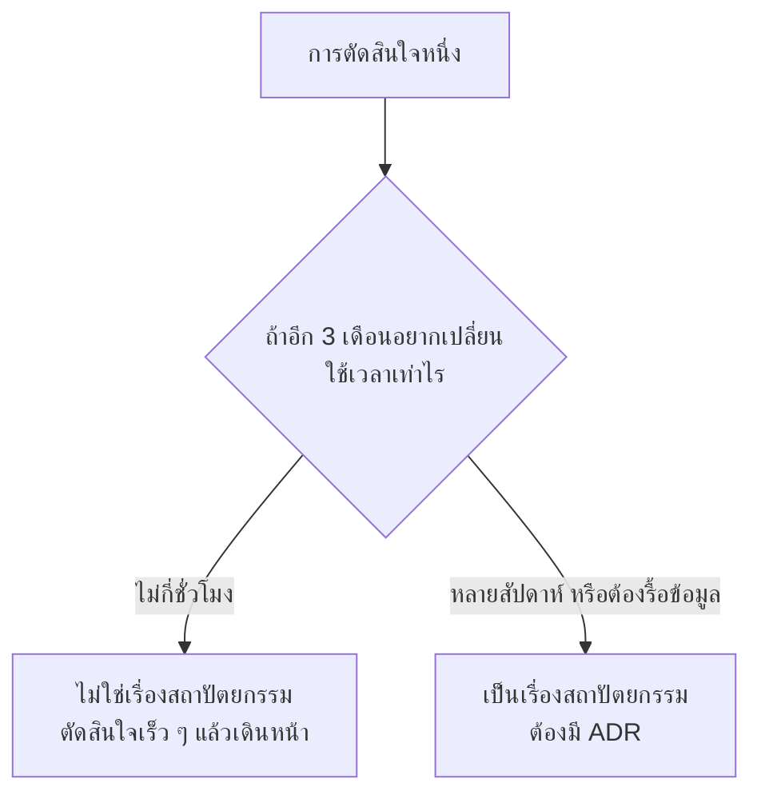

ตัวอย่างที่ **เป็น** เรื่องสถาปัตยกรรม: เลือกฐานข้อมูล, แบ่งขอบเขต service,
รูปแบบการยืนยันตัวตน, สัญญาของ API ที่มีคนอื่นใช้แล้ว, โครงสร้างข้อมูลหลัก

ตัวอย่างที่ **ไม่ใช่**: ชื่อตัวแปร, ใช้ `for` หรือ `map`, จัดโฟลเดอร์แบบไหน,
library ที่ห่อไว้แล้วเปลี่ยนได้ในไฟล์เดียว

> 💼 **จากหน้างานจริง**
> ทีมมักใช้เวลาถกเถียงกับเรื่องที่กลับตัวง่ายมากเกินไป และตัดสินใจเรื่องที่กลับตัวยากเร็วเกินไป
> Jeff Bezos เรียกสองอย่างนี้ว่า **two-way door** กับ **one-way door**
> — ประตูสองทางให้รีบเดินผ่านไป ประตูทางเดียวค่อยยืนคิดให้นาน

---

## 2. เริ่มจาก Quality Attribute ไม่ใช่จาก Technology

คำถามแรกของการออกแบบไม่ใช่ "จะใช้อะไร" แต่คือ **"ระบบนี้ต้องเก่งเรื่องอะไรเป็นพิเศษ"**

มาตรฐาน **ISO/IEC 25010** จัดคุณลักษณะคุณภาพไว้เป็นหมวด ที่ใช้บ่อยในงานจริง:

| Quality Attribute | คำถามที่ต้องตอบเป็นตัวเลข | ผลต่อการออกแบบ |
|---|---|---|
| **Performance** | p95 ต้องต่ำกว่ากี่ ms ที่กี่ผู้ใช้พร้อมกัน | cache, index, การแบ่งงานแบบ async |
| **Scalability** | ต้องรองรับโตกี่เท่าใน 1 ปี | stateless, queue, read replica |
| **Availability** | ยอมให้ล่มได้กี่นาทีต่อเดือน | redundancy, health check, ไม่มี single point of failure |
| **Security** | ข้อมูลอะไรที่รั่วไม่ได้เด็ดขาด | ขอบเขตความไว้วางใจ, การเข้ารหัส, สิทธิ์ขั้นต่ำ |
| **Maintainability** | คนใหม่ใช้เวลากี่วันกว่าจะแก้ bug แรกได้ | ขอบเขตชัด, coupling ต่ำ, มี test |
| **Testability** | ทดสอบตรรกะโดยไม่ต้องยกทั้งระบบได้ไหม | แยก I/O ออกจากตรรกะ, inject dependency |
| **Observability** | ตอนมีปัญหา ใช้เวลากี่นาทีกว่าจะรู้ว่าอยู่ตรงไหน | structured log, correlation id, metrics |

**QA ที่ไม่มีตัวเลขกำกับ ไม่ใช่ requirement แต่เป็นความปรารถนา**
"ระบบต้องเร็ว" ใช้ออกแบบอะไรไม่ได้เลย
"หน้ารายการห้องต้องแสดงผลภายใน 500 ms ที่ p95 เมื่อมีผู้ใช้พร้อมกัน 50 คน" ใช้ได้ทันที
— และนำไปตั้งเป็น threshold ของการทดสอบประสิทธิภาพได้ตรง ๆ

### QA ขัดกันเองเสมอ

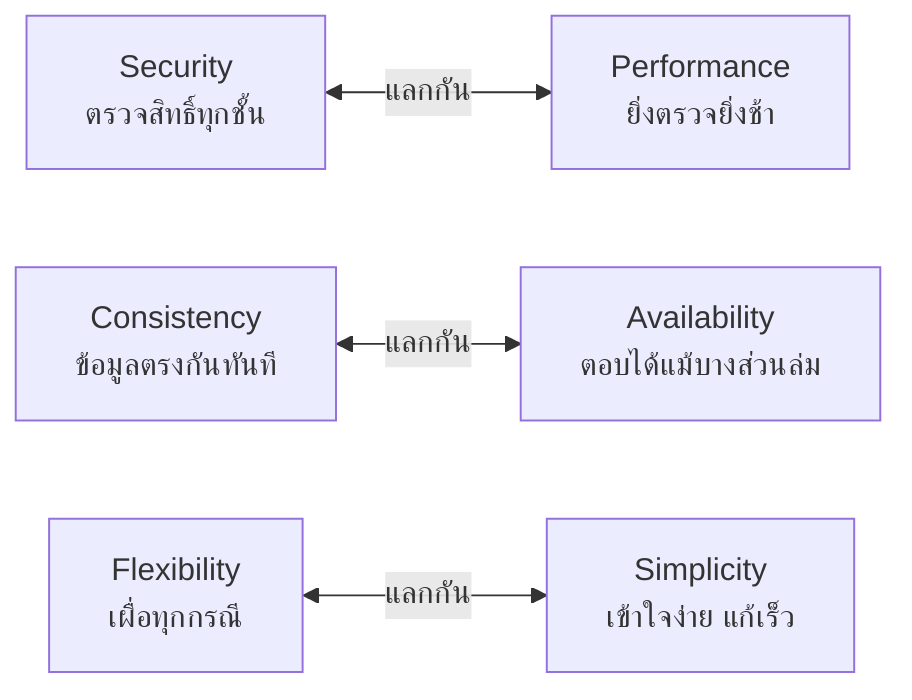

งานของสถาปนิกไม่ใช่การทำให้ทุกอย่างดีที่สุด แต่คือ **การเลือกว่าจะยอมแย่ตรงไหน**
และเขียนเหตุผลของการยอมนั้นลงใน ADR

---

## 3. วาดให้คนอ่านเข้าใจ: C4 Model

ปัญหาของ diagram ส่วนใหญ่คือมันปนหลายระดับความละเอียดไว้ในรูปเดียว
**C4 Model** ของ Simon Brown แก้ปัญหานี้โดยแยกเป็น 4 ระดับ และวาดทีละระดับ

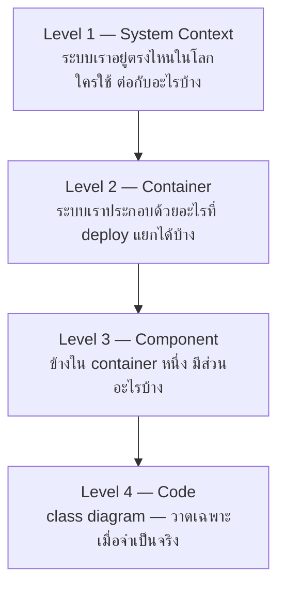

**ผู้ฟังต่างกัน ใช้คนละระดับ:** ผู้บริหารและ stakeholder ดู Level 1,
ทีมพัฒนาและคนดูแลระบบใช้ Level 2 เป็นหลัก, Level 3 ใช้เฉพาะส่วนที่ซับซ้อนจริง,
Level 4 แทบไม่ต้องวาดเพราะ code อ่านเองได้และ diagram จะเก่าเร็วที่สุด

### ตัวอย่าง Level 1 — System Context

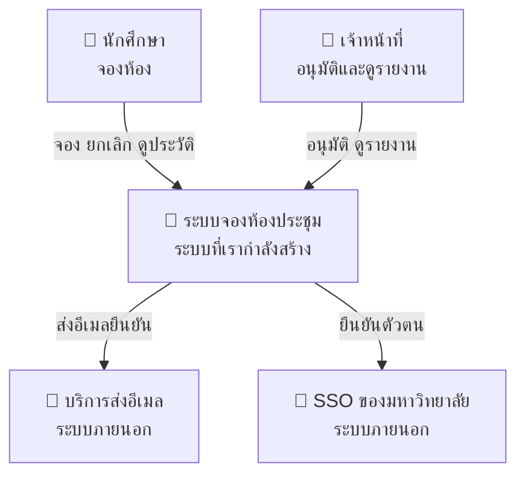

### ตัวอย่าง Level 2 — Container

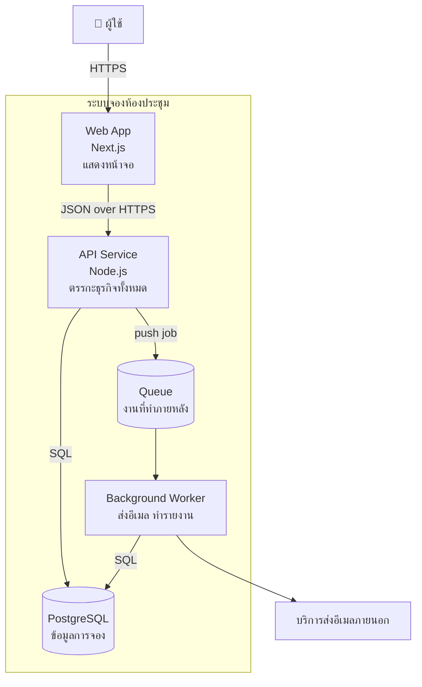

**กติกาที่ทำให้ diagram ใช้งานได้จริง**

1. ทุกกล่องบอก *เทคโนโลยี* ที่ใช้ ไม่ใช่แค่ชื่อเล่น
2. ทุกเส้นบอก *ทิศทางและวิธีสื่อสาร* เช่น `JSON over HTTPS`, `SQL`
3. กล่องเดียวกันต้องมีชื่อเดียวกันทุกที่ รวมถึงในชื่อโฟลเดอร์ของ repo
4. เก็บไฟล์ diagram ไว้ใน repo เป็น Mermaid — ไม่ใช่รูปภาพในสไลด์
   เพราะรูปภาพจะเก่าทันทีที่ระบบเปลี่ยนและไม่มีใคร diff มันได้

---

## 4. รูปแบบสถาปัตยกรรมที่ต้องรู้จัก

รูปแบบ (architectural style / pattern) ไม่ใช่ของที่ต้องเลือกอันเดียวแล้วใช้ทั้งระบบ
ระบบจริงมักผสมกัน เช่น ข้างนอกเป็น 3-tier, ข้างในฝั่ง backend เป็น hexagonal,
ส่วนงานที่ทำภายหลังเป็น event-driven — สิ่งที่ต้องรู้คือ **แต่ละอันแก้ปัญหาอะไร และมาพร้อมราคาอะไร**

### 4.1 Layered Architecture และ 3-Tier

**Layer ≠ Tier** — เป็นคำที่ถูกใช้สลับกันบ่อยที่สุดในหัวข้อนี้

| | หมายถึง | ตัวอย่าง |
|---|---|---|
| **Layer** | การแบ่ง *เชิงตรรกะ* ภายใน code ชุดเดียวกัน | controller / service / repository ในโปรเจกต์เดียว |
| **Tier** | การแบ่ง *เชิงกายภาพ* ที่แยกเครื่องหรือแยก process กันจริง | เครื่อง browser / เครื่อง app server / เครื่อง database |

ระบบหนึ่งมี 4 layer แต่เป็น 2 tier ได้ และเป็นเรื่องปกติมาก

#### 3-Tier แบบคลาสสิก

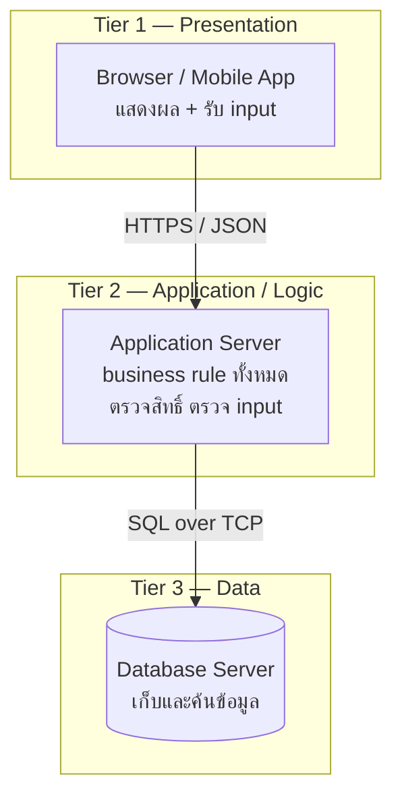

**ทำไมถึงยังเป็นค่าเริ่มต้นของระบบองค์กรทั่วโลก**

- แต่ละ tier ขยายขนาดแยกกันได้ — เพิ่มเครื่อง app server ได้โดยไม่ต้องแตะ database
- ขอบเขตความปลอดภัยชัด — database ไม่ต้องเปิดสู่อินเทอร์เน็ตเลย
- ทีมแบ่งงานได้ตามธรรมชาติ

**กฎเหล็กที่ห้ามละเมิด:** Tier 1 **ห้าม** ต่อ database ตรง
ทุกอย่างต้องผ่าน Tier 2 เพราะ Tier 1 อยู่ในมือผู้ใช้และแก้ไขได้
การซ่อนปุ่มบนหน้าจอไม่ใช่การควบคุมสิทธิ์

**ข้อเสียที่ต้องยอมรับ**

- ทุกคำขอวิ่งผ่านทุกชั้น แม้จะเป็นงานง่าย ๆ — เพิ่ม latency
- ถ้าไม่มีวินัย ตรรกะจะรั่วไปอยู่ผิดชั้น: SQL ใน controller, business rule ใน stored procedure
- เรียกว่า **sinkhole anti-pattern** เมื่อบางชั้นแค่ส่งต่อโดยไม่ทำอะไรเลย

#### N-Layer ภายใน backend

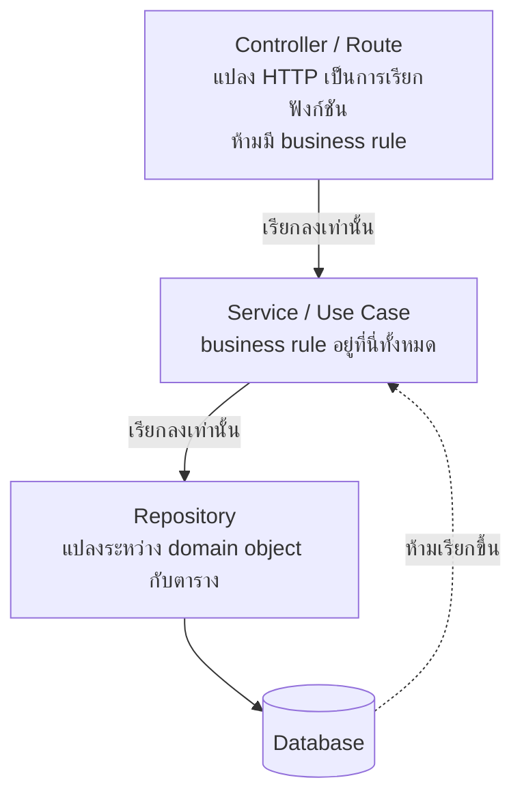

**fitness function ที่คู่กับรูปแบบนี้:** test ที่ทำให้ build แดงเมื่อ repository import service
หรือเมื่อ controller import ORM โดยตรง

> 💼 **จากหน้างานจริง**
> อาการที่พบบ่อยที่สุดคือ "anemic service" — service ที่มีแต่โค้ดเรียก repository ต่อ
> โดยไม่มี business rule เลย เพราะ rule ไปกองอยู่ใน controller
> วิธีตรวจเร็ว ๆ คือเปิดไฟล์ controller แล้วนับจำนวน `if` — ถ้าเยอะ แปลว่าผิดชั้นแล้ว

---

### 4.2 MVC และญาติ ๆ

**MVC — Model / View / Controller** เกิดตั้งแต่ยุค Smalltalk-80 ปี 1979
เพื่อแยก *ข้อมูล* ออกจาก *การแสดงผล* ออกจาก *การรับคำสั่ง*

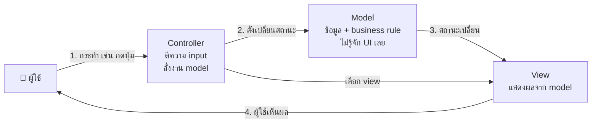

**หัวใจของ MVC คือทิศทางเดียว:** Model ต้องไม่รู้จัก View
ประโยชน์ที่ได้ทันทีคือ **ทดสอบ Model ได้โดยไม่ต้องเปิดหน้าจอ**

#### MVC บนเว็บต่างจาก MVC ดั้งเดิม

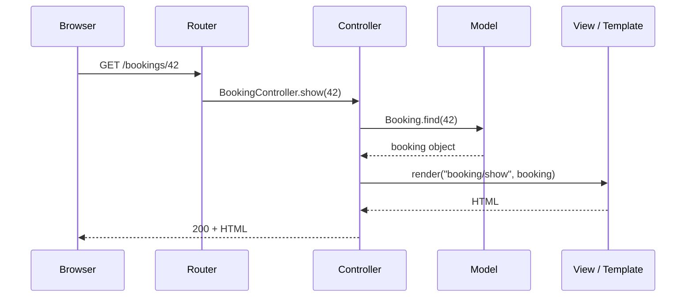

ความต่างสำคัญ: บนเว็บ **Model ไม่ได้แจ้ง View เองแบบ observer**
เพราะ HTTP เป็นแบบขอ-ตอบครั้งเดียว Controller จึงเป็นคนดึงข้อมูลไปส่งให้ View
รูปแบบนี้บางครั้งเรียกว่า **Model 2** และเป็นสิ่งที่ Rails, Laravel, Django, Spring MVC ใช้

#### ตระกูลเดียวกันที่จะเจอในงานจริง

| รูปแบบ | ตัวกลางคืออะไร | View รู้จัก Model ไหม | เจอที่ไหน |
|---|---|---|---|
| **MVC** | Controller | รู้ (อ่านจาก model ได้) | เว็บฝั่ง server, framework คลาสสิก |
| **MVP** | Presenter | ไม่รู้ — คุยผ่าน Presenter ล้วน | แอปเดสก์ท็อป, Android รุ่นเก่า |
| **MVVM** | ViewModel + data binding | ผูกกับ ViewModel ผ่าน binding | WPF, Android Jetpack, Vue |
| **Component-based + unidirectional flow** | store / reducer | รับ state ผ่าน props | React, Svelte, แนวทางสมัยใหม่ |

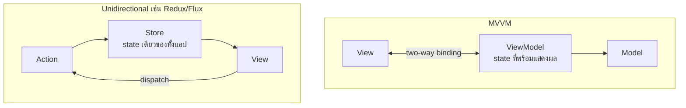

**เหตุผลที่ฝั่ง frontend สมัยใหม่ย้ายไปทาง unidirectional:**
two-way binding ทำให้ *ไม่รู้ว่าใครเป็นคนเปลี่ยน state* เมื่อแอปโตขึ้น
การบังคับให้ทุกการเปลี่ยนแปลงผ่านทางเดียวทำให้ไล่ปัญหาได้ —
นี่คือการออกแบบเพื่อ **observability** ในระดับ code

**กับดักที่ต้องระวัง: Fat Controller**
Controller ควรบาง ทำแค่ 3 อย่าง — แปลง input, เรียก use case, แปลง output
ถ้า controller ยาวเกิน 30 บรรทัดหรือมี `if` ซ้อนกัน แปลว่า business rule เข้าไปอยู่ผิดที่แล้ว

---

### 4.3 Hexagonal / Ports & Adapters และ Clean Architecture

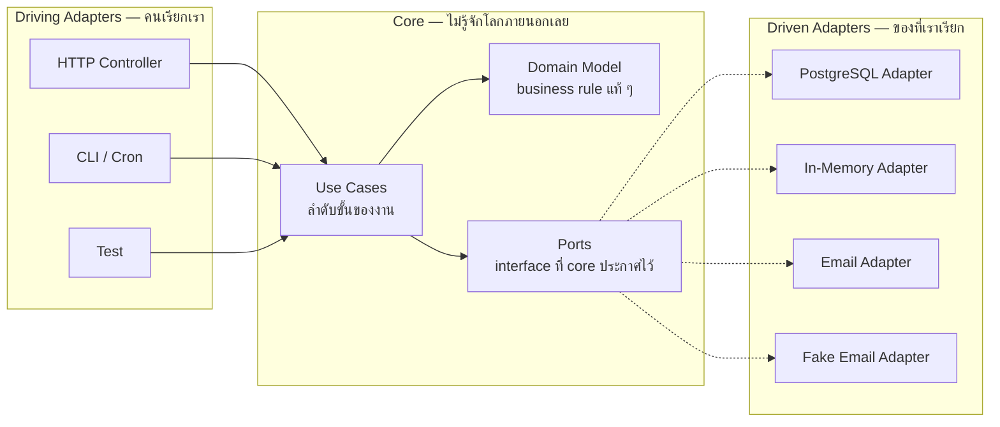

**หลักเดียวที่ต้องจำ: ทิศทางการพึ่งพาชี้เข้าหาแกนกลางเสมอ**
Core ประกาศ interface (port) ว่าต้องการอะไร แล้วโลกภายนอกเป็นฝ่ายมาทำตาม (adapter)
ไม่ใช่ core ไปเรียก library ของ database ตรง ๆ

**Clean Architecture ของ Robert C. Martin** เป็นแนวคิดเดียวกันที่วาดเป็นวงกลมซ้อน
โดยเพิ่มกฎที่เรียกว่า **Dependency Rule** — code ในวงในห้ามรู้จักชื่ออะไรก็ตามในวงนอก

**ประโยชน์ที่วัดได้จริง**

| ก่อน | หลัง |
|---|---|
| unit test ต้องยก PostgreSQL container ก่อน ใช้เวลา 40 วินาที | สลับเป็น in-memory adapter รันจบใน 200 ms |
| เปลี่ยนจาก REST เป็น GraphQL ต้องแก้ business rule ด้วย | เพิ่ม adapter ใหม่ 1 ตัว core ไม่ต้องแตะ |
| ทดสอบกรณี "อีเมลส่งไม่สำเร็จ" ยากมาก | ใช้ fake adapter ที่สั่งให้ล้มเหลวได้ตามต้องการ |

**ราคาที่ต้องจ่าย:** ไฟล์เยอะขึ้น มี interface ที่มี implementation เดียวในช่วงแรก
สำหรับ CRUD ง่าย ๆ อาจไม่คุ้ม — ใช้เมื่อ business rule มีน้ำหนักจริง

---

### 4.4 Modular Monolith — จุดเริ่มที่แนะนำสำหรับทีมเล็ก

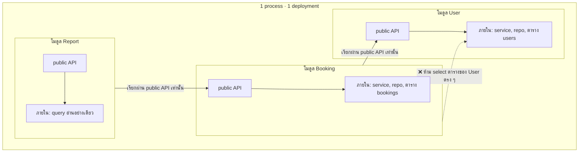

**เงื่อนไข 4 ข้อที่ทำให้เป็น modular จริง ไม่ใช่แค่ชื่อโฟลเดอร์**

1. แต่ละโมดูลเป็นเจ้าของตารางของตัวเอง — โมดูลอื่นห้าม query ข้าม
2. การเรียกข้ามโมดูลต้องผ่าน interface สาธารณะที่ประกาศไว้เท่านั้น
3. มี **fitness function** ที่ทำให้ build แดงเมื่อมีการ import ข้ามขอบเขต
4. แต่ละโมดูลมี test ของตัวเองที่รันแยกได้

**ทำไมถึงเป็นจุดเริ่มที่ดีที่สุด:** ได้ประโยชน์ของขอบเขตที่ชัดเจน
โดยไม่ต้องจ่ายค่าความซับซ้อนของระบบกระจาย และถ้าวันหนึ่งต้องแยกเป็น service จริง
โมดูลที่มีขอบเขตชัดอยู่แล้วจะแยกออกได้โดยไม่ต้องรื้อ

---

### 4.5 Microservices

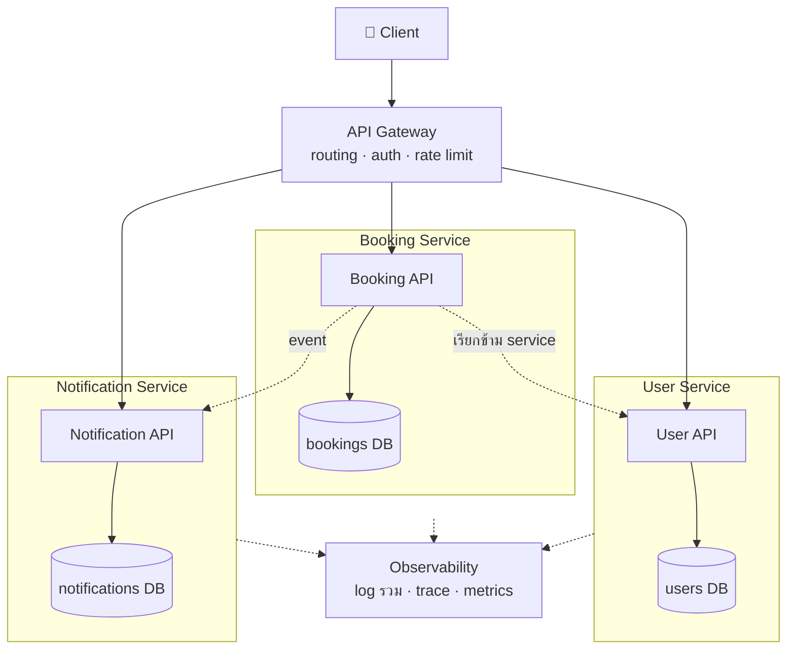

**หลักที่ทำให้เป็น microservices จริง**

| หลัก | ความหมาย | ถ้าละเมิดจะกลายเป็น |
|---|---|---|
| **Database per service** | แต่ละ service เป็นเจ้าของข้อมูลตัวเอง | shared database → แยกไม่จริง |
| **Deploy อิสระ** | ปล่อย service เดียวได้โดยไม่แตะตัวอื่น | distributed monolith |
| **ล้มเหลวแยกส่วน** | service หนึ่งล่ม อีกตัวยังทำงานได้ | ล่มพร้อมกันทั้งระบบ |
| **ทีมเป็นเจ้าของตลอดวงจร** | ทีมเดียวดูแลตั้งแต่เขียนถึง on-call | ส่งต่อกันแล้วไม่มีใครรับผิดชอบ |

#### ปัญหาที่โผล่มาทันทีที่แยก และ pattern ที่ใช้แก้

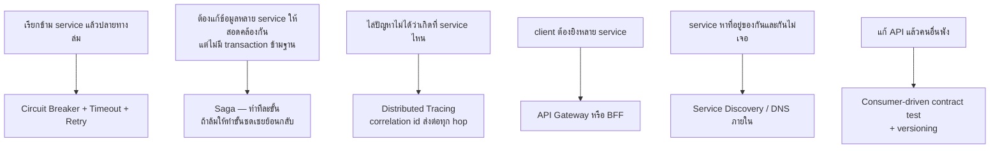

#### Saga — ทดแทน transaction ข้าม service

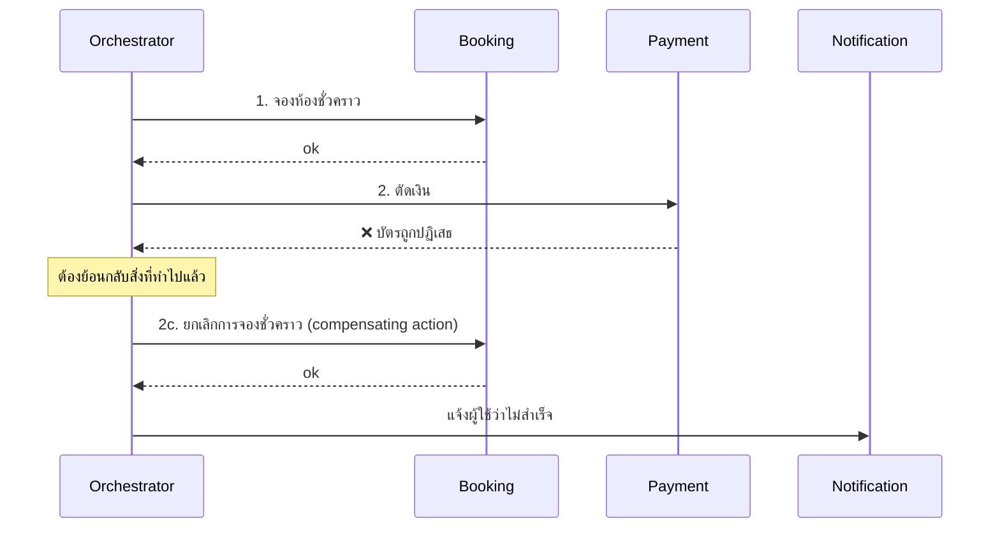

จุดที่ต้องเข้าใจ: **ไม่มีการ rollback อัตโนมัติ** — ต้องเขียน "ขั้นชดเชย" เองทุกขั้น
และระหว่างที่ saga ยังไม่จบ ระบบจะอยู่ในสถานะที่ไม่สอดคล้องชั่วคราว
ซึ่งต้องออกแบบให้ผู้ใช้เห็นสถานะนั้นอย่างเหมาะสม เช่น "กำลังดำเนินการ"

> ⚠️ **สำหรับโครงการในวิชานี้: อย่าแยก microservices**
> ทีม 3–5 คน เวลา 8 สัปดาห์ ต้นทุนการดูแลจะกินเวลาที่ควรใช้สร้าง feature
> ให้ทำ **modular monolith** ที่มีขอบเขตชัดแทน — ได้บทเรียนเรื่องขอบเขตเหมือนกัน
> โดยไม่ต้องจ่ายค่าความซับซ้อนของระบบกระจาย

---

### 4.6 Event-Driven Architecture

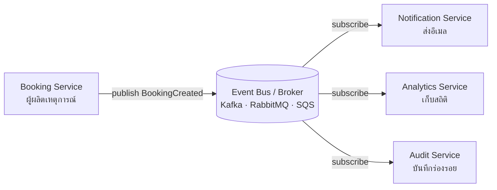

**ประโยชน์ที่แท้จริงคือการเพิ่มผู้รับได้โดยไม่แตะผู้ส่ง** —
วันที่ต้องเพิ่มระบบเก็บสถิติ ไม่ต้องแก้ code ของ Booking Service เลย

| แบบ | ลักษณะ | เหมาะกับ |
|---|---|---|
| **Message Queue** | ข้อความหนึ่งมีผู้รับหนึ่ง อ่านแล้วหายไป | งานที่ต้องทำครั้งเดียว เช่น ส่งอีเมล |
| **Pub/Sub** | ข้อความหนึ่งมีผู้รับหลายคน | แจ้งเหตุการณ์ให้หลายระบบ |
| **Event Streaming** | เก็บ log ของเหตุการณ์ไว้ ย้อนอ่านใหม่ได้ | วิเคราะห์ย้อนหลัง, สร้าง state ใหม่ |

**ราคาที่ต้องจ่าย — ต้องเข้าใจก่อนใช้**

- ข้อความอาจมาถึง **มากกว่าหนึ่งครั้ง** → ผู้รับต้อง **idempotent** เสมอ
- ข้อความอาจมา **ผิดลำดับ** → อย่าออกแบบให้พึ่งลำดับถ้าไม่จำเป็น
- ข้อความที่ประมวลผลไม่สำเร็จซ้ำ ๆ ต้องมี **dead-letter queue** ไม่งั้นจะวนไม่จบ
- การไล่ปัญหายากขึ้นมาก เพราะไม่มี stack trace เดียวที่เล่าเรื่องทั้งหมด

#### CQRS — แยกทางอ่านออกจากทางเขียน

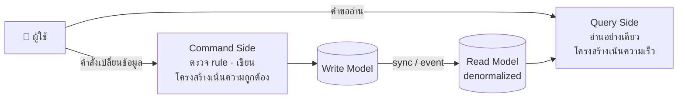

ใช้เมื่ออัตราการอ่านกับการเขียนต่างกันมาก เช่น อ่าน 1000 ครั้งต่อการเขียน 1 ครั้ง
**ราคา:** ข้อมูลฝั่งอ่านจะตามหลังเล็กน้อย (eventual consistency)
ซึ่งต้องบอกผู้ใช้ให้เข้าใจ ไม่ใช่ปล่อยให้เขาสงสัยว่าข้อมูลหาย

#### Event Sourcing — เก็บเหตุการณ์แทนสถานะปัจจุบัน

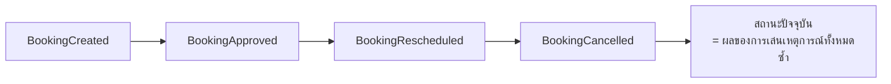

ได้ประวัติทุกการเปลี่ยนแปลงฟรี ซึ่งมีค่ามากในระบบที่ต้องตรวจสอบย้อนหลัง เช่น การเงิน
แต่ซับซ้อนสูงและย้อนกลับยาก — **ไม่แนะนำสำหรับโครงการในวิชานี้**

---

### 4.7 Serverless / Function as a Service

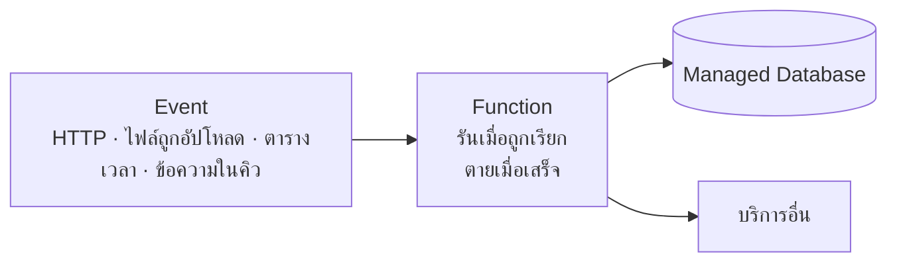

| ได้อะไร | เสียอะไร |
|---|---|
| ไม่ต้องดูแล server เลย | **Cold start** — คำขอแรกหลังพักช้ากว่าปกติ |
| จ่ายตามการใช้จริง ไม่มีการใช้ = ไม่มีค่าใช้จ่าย | มีเพดานเวลาทำงานต่อครั้ง ไม่เหมาะกับงานยาว |
| ขยายขนาดอัตโนมัติตามโหลด | ผูกกับผู้ให้บริการค่อนข้างแน่น (vendor lock-in) |
| เหมาะกับงานที่มาเป็นช่วง เช่น รายงานรายเดือน | ทดสอบและไล่ปัญหาในเครื่องตัวเองยากกว่า |

**ข้อจำกัดที่สำคัญที่สุด: function ต้องไม่มี state** —
ทุกอย่างที่ต้องจำต้องอยู่นอกตัวมัน และ **connection pool ของ database
กลายเป็นปัญหาทันทีเมื่อมี function หลายพันตัวเปิดพร้อมกัน**

---

### 4.8 BFF และ Micro-frontend

#### Backend for Frontend

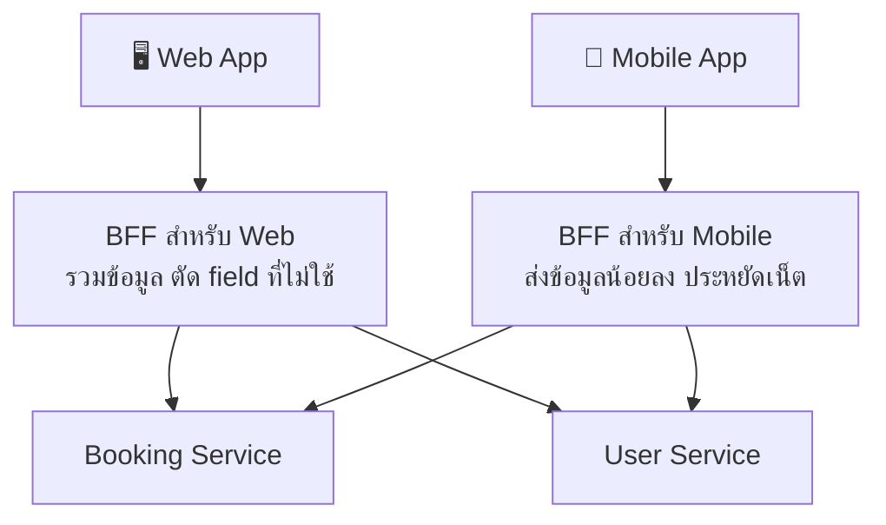

แก้ปัญหาที่ client แต่ละชนิดต้องการข้อมูลไม่เหมือนกัน
ถ้าใช้ API ตัวเดียวกัน มันจะบวมเพราะต้องรองรับทุกคน
**BFF เป็นของทีม frontend ไม่ใช่ของทีม backend** — นี่คือประเด็นเชิงองค์กรที่สำคัญกว่าเรื่องเทคนิค

#### Micro-frontend

แนวคิดเดียวกับ microservices แต่ใช้กับหน้าจอ — แต่ละทีมเป็นเจ้าของส่วนของหน้าจอและ deploy เอง
เหมาะกับองค์กรใหญ่ที่มีหลายทีมทำเว็บเดียวกัน
**ไม่เหมาะกับทีมเล็ก** เพราะต้นทุนการทำให้หน้าตาสอดคล้องกันสูงมาก —
ซึ่งย้อนกลับไปที่ปัญหาเรื่อง *conceptual integrity*

---

### 4.9 สถาปัตยกรรมของแอปที่มี LLM อยู่ข้างใน

รูปแบบที่กลายเป็นมาตรฐานโดยพฤตินัยในช่วงไม่กี่ปีที่ผ่านมา

```mermaid
flowchart TB
    U["👤 ผู้ใช้ถามคำถาม"] --> APP["Application Layer<br/>ตรวจสิทธิ์ · ตรวจ input · จำกัดอัตรา"]
    APP --> RET["Retriever<br/>ค้นข้อมูลที่เกี่ยวข้อง"]
    RET --> VDB[("Vector / Search Index<br/>เอกสารขององค์กร")]
    VDB --> RET
    RET --> PB["Prompt Builder<br/>ประกอบ context + คำถาม"]
    PB --> LLM["LLM"]
    LLM --> GUARD["Output Guard<br/>ตรวจ schema · กรองข้อมูลอ่อนไหว"]
    GUARD --> APP
    APP --> U
    APP -.-> OBS["Observability<br/>log · จำนวน token · ต้นทุน · เวลา"]
```

**หลักการออกแบบที่ต่างจากระบบทั่วไป**

| ประเด็น | สิ่งที่ต้องทำ |
|---|---|
| ผลลัพธ์ไม่คงที่ | บังคับ output ให้ตรง schema แล้วตรวจด้วย validator เสมอ |
| ทุกอย่างที่ retriever ดึงมาคือ **ข้อมูล ไม่ใช่คำสั่ง** | ป้องกัน prompt injection — อย่าให้ข้อความที่ดึงมาสั่งงานระบบได้ |
| model อาจล่ม ช้า หรือเปลี่ยนเวอร์ชัน | ต้องมี timeout, fallback และตรึงเวอร์ชันของ model |
| ต้นทุนต่อคำขอไม่คงที่ | วัด token ต่อคำขอ ตั้งเพดาน และเฝ้าดูเหมือน metric อื่น |
| agent ที่ทำงานเองได้ | จำกัดสิทธิ์ให้น้อยที่สุด และให้คนอนุมัติก่อนทำสิ่งที่ย้อนกลับไม่ได้ |

**LLM คือ dependency ภายนอกที่ไม่น่าเชื่อถือ** — ปฏิบัติกับมันเหมือน third-party API
ที่ช้าได้ ล่มได้ และตอบผิดได้ ไม่ใช่เหมือนฟังก์ชันในระบบเรา

---

### 4.10 เลือกอย่างไร — ตารางเทียบและเส้นทางการตัดสินใจ

| รูปแบบ | ความซับซ้อน | เหมาะกับ | ไม่เหมาะกับ |
|---|:---:|---|---|
| 3-Tier / Layered | 🟢 ต่ำ | ระบบองค์กรทั่วไป, งานในวิชานี้ | ระบบที่ business rule ซับซ้อนมาก |
| MVC | 🟢 ต่ำ | เว็บที่ render ฝั่ง server | แอปที่ state ฝั่ง client ซับซ้อน |
| Hexagonal / Clean | 🟡 กลาง | ระบบที่ business rule มีน้ำหนัก | CRUD ง่าย ๆ ที่ไม่มี rule |
| Modular Monolith | 🟡 กลาง | **ทีมเล็กที่อยากได้ขอบเขตชัด** | ทีมที่ต้องปล่อยของคนละจังหวะจริง |
| Microservices | 🔴 สูง | องค์กรหลายทีม, ต้องขยายบางส่วนแยก | ทีมต่ำกว่า 10 คน |
| Event-Driven | 🔴 สูง | งานที่ทำภายหลังได้, ผู้รับหลายราย | งานที่ต้องตอบผลทันทีเสมอ |
| CQRS / Event Sourcing | 🔴 สูงมาก | ระบบที่ต้องตรวจสอบย้อนหลัง, อ่านหนักมาก | โครงการในวิชานี้ |
| Serverless | 🟡 กลาง | งานเป็นช่วง, งานตามตารางเวลา | งานที่ต้องตอบเร็วตลอดเวลา |

```mermaid
flowchart TD
    S["เริ่มออกแบบระบบใหม่"] --> Q1{"business rule ซับซ้อนไหม"}
    Q1 -->|"ไม่มาก"| L["3-Tier + MVC<br/>เรียบง่าย เข้าใจง่าย"]
    Q1 -->|"ซับซ้อน"| H["เพิ่ม Hexagonal ที่ core<br/>เพื่อให้ทดสอบได้เร็ว"]
    L --> Q2{"มีหลายทีมที่ต้องปล่อยของ<br/>คนละจังหวะไหม"}
    H --> Q2
    Q2 -->|"ไม่มี"| MM["Modular Monolith<br/>✅ คำตอบของโครงการในวิชานี้"]
    Q2 -->|"มี"| MS["พิจารณา Microservices<br/>แยกทีละส่วนที่ขอบเขตชัดที่สุด"]
    MM --> Q3{"มีงานที่ผู้ใช้ไม่ต้องรอผลไหม"}
    MS --> Q3
    Q3 -->|"มี"| ED["เพิ่ม Queue / Event<br/>เฉพาะงานนั้น"]
    Q3 -->|"ไม่มี"| DONE["พอแล้ว — อย่าเพิ่มความซับซ้อนที่ยังไม่ต้องใช้"]
```

> 💼 **จากหน้างานจริง**
> คำถามที่ควรถามก่อนรับรูปแบบใด ๆ เข้ามาคือ
> *"ปัญหาอะไรที่เรามีอยู่ตอนนี้จริง ๆ ที่สิ่งนี้แก้ให้ได้"*
> ถ้าตอบเป็นปัญหาในอนาคตที่ยังไม่เกิด แปลว่ากำลังจ่ายค่าความซับซ้อนล่วงหน้า
> ให้จดไว้ใน ADR ว่าจะกลับมาพิจารณาเมื่อเงื่อนไขไหนเกิดขึ้น แล้วเดินหน้าด้วยของที่เรียบง่ายกว่า

---

## 5. ข้อมูล — จุดที่การตัดสินใจย้อนกลับยากที่สุด

code เขียนใหม่ได้ในหนึ่งสัปดาห์ แต่ข้อมูลที่ถูกเก็บผิดรูปแบบมา 6 เดือน ย้ายยากมาก

| การตัดสินใจ | ถามตัวเองก่อน |
|---|---|
| Relational หรือ Document | ข้อมูลมีความสัมพันธ์ที่ต้อง join บ่อยไหม / schema จะเปลี่ยนบ่อยแค่ไหน |
| Normalize แค่ไหน | อ่านบ่อยหรือเขียนบ่อยกว่ากัน |
| ขอบเขตของ transaction | อะไรบ้างที่ *ต้อง* สำเร็จหรือล้มเหลวไปด้วยกัน |
| เก็บประวัติหรือทับของเก่า | มีวันไหนที่จะมีคนถามว่า "ตอนนั้นข้อมูลเป็นอย่างไร" ไหม |
| ทำ soft delete ไหม | มีข้อกำหนดทางกฎหมายเรื่องการลบข้อมูลจริงหรือไม่ (PDPA) |

**Idempotency คือเรื่องของสถาปัตยกรรม ไม่ใช่รายละเอียดปลีกย่อย**
เครือข่ายล้มเหลวเป็นเรื่องปกติ ผู้ใช้กดปุ่มซ้ำเป็นเรื่องปกติ
ระบบที่รับคำขอเดียวกันสองครั้งแล้วสร้างการจองสองรายการคือระบบที่ออกแบบพลาด

```mermaid
sequenceDiagram
    participant C as Client
    participant A as API
    C->>A: POST /bookings + Idempotency-Key: abc123
    A->>A: มี key นี้แล้วหรือยัง
    A-->>C: 201 Created (booking #42)
    Note over C,A: เครือข่ายขาด client ไม่ได้รับคำตอบ
    C->>A: POST /bookings + Idempotency-Key: abc123 (ยิงซ้ำ)
    A->>A: เจอ key เดิม คืนผลเดิม
    A-->>C: 200 OK (booking #42 เดิม ไม่สร้างใหม่)
```

---

## 6. Resilience — ออกแบบให้พังแล้วไม่ลามทั้งระบบ

สมมติฐานพื้นฐานที่ต้องยอมรับ: **ทุกอย่างที่อยู่ปลายสายเครือข่ายจะล้มเหลวสักวัน**
คำถามจึงไม่ใช่ "ถ้ามันล่มจะทำอย่างไร" แต่คือ "ตอนมันล่ม ระบบเราจะทำตัวอย่างไร"

| Pattern | แก้ปัญหาอะไร | สิ่งที่ต้องระวัง |
|---|---|---|
| **Timeout** | การเรียกที่ค้างจนกิน connection หมด | ต้องตั้งทุกการเรียกข้ามเครือข่าย ไม่มีข้อยกเว้น |
| **Retry + backoff + jitter** | ความล้มเหลวชั่วคราว | retry เฉพาะที่ idempotent เท่านั้น ไม่งั้นข้อมูลซ้ำ |
| **Circuit Breaker** | การยิงซ้ำใส่ระบบที่กำลังพังจนพังหนักกว่าเดิม | ต้องมีเส้นทางสำรองเมื่อวงจรเปิด |
| **Bulkhead** | ส่วนที่ช้าดูดทรัพยากรจนส่วนอื่นตายตาม | จำกัดจำนวน connection ต่อปลายทาง |
| **Graceful Degradation** | ทั้งระบบล่มเพราะฟีเจอร์รองพัง | ต้องแยกให้ออกว่าอะไรคือแกน อะไรคือส่วนเสริม |

```mermaid
stateDiagram-v2
    [*] --> Closed
    Closed --> Open: ล้มเหลวติดกันเกินเกณฑ์
    Open --> HalfOpen: ครบเวลาพัก
    HalfOpen --> Closed: ทดลองเรียกแล้วสำเร็จ
    HalfOpen --> Open: ยังล้มเหลวอยู่

    note right of Open
        ไม่เรียกปลายทางเลย
        คืนค่าสำรองทันที
    end note
```

**Graceful degradation ในระบบจองห้อง:** ถ้าบริการส่งอีเมลล่ม
การจองต้องยังทำได้ ผู้ใช้ยังเห็นการจองของตัวเอง เพียงแต่ไม่ได้อีเมลยืนยัน
ระบบที่ออกแบบไม่ดีจะตอบ `500` ทั้งคำขอเพราะส่งอีเมลไม่ได้
ซึ่งเป็นการทำให้ฟีเจอร์รองมีอำนาจล้มฟีเจอร์หลัก

---

## 7. ความปลอดภัยเป็นเรื่องของการออกแบบ

การเติม security ทีหลังแพงกว่าการออกแบบมาให้ปลอดภัยตั้งแต่ต้นเสมอ

**หลักที่ต้องอยู่ในหัวตอนวาด diagram**

- **Trust boundary** — ตรงไหนที่ข้อมูลข้ามจากฝั่งที่ควบคุมไม่ได้ มาสู่ฝั่งที่เราควบคุม
  ทุกจุดข้ามต้องมีการตรวจสอบ input
- **Least privilege** — ทุกส่วนได้สิทธิ์เท่าที่จำเป็น
  API ที่แค่อ่านรายงาน ไม่ควรใช้ credential เดียวกับที่แก้ข้อมูลได้
- **Defense in depth** — อย่าให้ความปลอดภัยขึ้นกับชั้นเดียว
  การซ่อนปุ่มบน UI ไม่ใช่การควบคุมสิทธิ์ ต้องตรวจที่ฝั่ง server ด้วยเสมอ

**Threat modeling อย่างง่ายด้วย STRIDE** — ไล่ถามทีละข้อกับ diagram ที่วาดไว้

| ตัวอักษร | ภัยคุกคาม | คำถาม |
|---|---|---|
| **S** | Spoofing | มีทางปลอมเป็นคนอื่นไหม |
| **T** | Tampering | มีทางแก้ข้อมูลระหว่างทางไหม |
| **R** | Repudiation | ถ้าเกิดเรื่อง เราพิสูจน์ได้ไหมว่าใครทำ |
| **I** | Information Disclosure | มีข้อมูลอะไรหลุดออกไปเกินความจำเป็นไหม |
| **D** | Denial of Service | มีจุดไหนที่ยิงรัวแล้วล่มได้ไหม |
| **E** | Elevation of Privilege | มีทางทำสิ่งที่ไม่ควรทำได้ไหม |

ใช้เวลา 30 นาทีกับ Level 2 diagram แล้วไล่ 6 ข้อนี้ มักเจอปัญหาจริงอย่างน้อย 2 ข้อ

---

## 8. บันทึกและรักษาสถาปัตยกรรมให้ไม่เน่า

### ADR — Architecture Decision Record

```markdown
# ADR-00X: [หัวข้อการตัดสินใจ]

## Status
Proposed | Accepted | Superseded by ADR-00Y

## Context
[ข้อเท็จจริงและข้อจำกัด ณ เวลานั้น — technical, เวลา, ทักษะทีม]

## Decision
[สิ่งที่เลือก เขียนเป็นประโยคบอกเล่า]

## Alternatives Considered
1. [ทางเลือก A] — ไม่เลือกเพราะ [เหตุผล]
2. [ทางเลือก B] — ไม่เลือกเพราะ [เหตุผล]

## Consequences
### ได้อะไร
### เสียอะไร / ยอมรับอะไร

## Revisit When
[เงื่อนไขที่ทำให้ต้องกลับมาทบทวน]
```

สิ่งที่ทำให้ ADR มีค่ากว่าเอกสารทั่วไปคือ **Alternatives Considered** —
มันบอกทีมในอนาคตว่าทางที่ดูน่าสนใจนั้นเคยถูกพิจารณาแล้วและตกไปเพราะอะไร
ป้องกันการรื้อของเดิมซ้ำโดยไม่รู้ประวัติ

ADR ที่ล้าสมัย **ไม่ลบ** แต่เปลี่ยนสถานะเป็น `Superseded by ADR-00Y`
เพราะประวัติการตัดสินใจมีค่าพอ ๆ กับการตัดสินใจปัจจุบัน

### Fitness Function — ทำให้สถาปัตยกรรมตรวจตัวเองได้

แนวคิดจาก *Building Evolutionary Architectures*: ถ้ากติกาทางสถาปัตยกรรมไม่มีอะไรบังคับ
มันจะถูกละเมิดภายในไม่กี่เดือนโดยไม่มีใครตั้งใจ

ตัวอย่างที่ทำได้จริงในโครงการวิชานี้:

- test ที่ทำให้ build แดงถ้ามีการ import ข้ามขอบเขตโมดูล
- test ที่ตรวจว่าไม่มี layer ล่างเรียก layer บน
- threshold ของ load test ที่ทำให้ CI แดงถ้า p95 เกินที่ตกลงไว้
- การตรวจว่า response ของ API ยังตรงกับ `openapi.yaml`
- การสแกน dependency ที่มีช่องโหว่ในทุก PR

**นี่คือจุดที่สถาปัตยกรรมกลายเป็นส่วนหนึ่งของ loop จริง ๆ** —
จากข้อตกลงบนกระดาษ กลายเป็นสัญญาณที่แดงได้ภายในไม่กี่นาที

---

## 9. สถาปัตยกรรมในยุคที่ AI agent ร่วมเขียน code

การมี agent ช่วยเขียน code ทำให้ **คุณค่าของขอบเขตที่ชัดเจนสูงขึ้น ไม่ใช่ต่ำลง**

```mermaid
flowchart TB
    subgraph bad["❌ ระบบที่ขอบเขตพร่า"]
        B1["agent ต้องอ่าน code เกือบทั้ง repo<br/>เพื่อจะแก้ 1 อย่าง"] --> B2["context ล้น<br/>คุณภาพตก"] --> B3["แก้จุดหนึ่ง พังอีกจุด"]
    end
    subgraph good["✅ ระบบที่มีขอบเขตชัด"]
        G1["agent อ่านแค่โมดูลเดียว<br/>+ interface ของเพื่อนบ้าน"] --> G2["context พอดี<br/>เข้าใจครบ"] --> G3["แก้แล้ว test ของโมดูลนั้นตอบได้ทันที"]
    end
```

สิ่งที่ควรทำเป็นรูปธรรม:

1. **เขียนขอบเขตให้ agent อ่านได้** — `AGENTS.md` ควรบอกว่าโมดูลไหนทำอะไร
   ห้ามข้ามขอบเขตไหน และไฟล์ไหนห้ามแตะ
2. **เก็บ diagram เป็น Mermaid ใน repo** — agent อ่านข้อความได้ แต่อ่านรูปในสไลด์ไม่ได้
3. **ให้ ADR อยู่ใน repo** — เพื่อไม่ให้ agent เสนอทางที่ทีมเคยปฏิเสธไปแล้ว
4. **ทำ fitness function ให้ครบ** — เพราะ agent จะละเมิดกติกาที่ไม่มีอะไรบังคับ
   เร็วกว่ามนุษย์มาก และไม่รู้ตัวด้วย

> ⚠️ สิ่งที่ **ไม่ควร** มอบให้ AI ตัดสิน คือการเลือกขอบเขตของ service และการเลือกโครงสร้างข้อมูลหลัก
> เพราะทั้งสองเรื่องต้องรู้ทิศทางธุรกิจในอีก 1–2 ปี ซึ่งไม่มีอยู่ใน code
> ให้ใช้ AI สำรวจทางเลือกและข้อดีข้อเสีย แล้วคนเป็นคนเลือก และเขียนเหตุผลลง ADR

---

## 10. Checklist ก่อนบอกว่าออกแบบเสร็จ

- [ ] ระบุ quality attribute ที่สำคัญที่สุด 3 ข้อ **พร้อมตัวเลข**
- [ ] มี C4 Level 1 และ Level 2 อยู่ใน repo เป็น Mermaid
- [ ] ทุกกล่องใน diagram มีที่อยู่จริงใน repo และชื่อตรงกัน
- [ ] ระบุขอบเขตของ transaction ได้ว่าอะไรต้องสำเร็จไปด้วยกัน
- [ ] ทุกการเรียกข้ามเครือข่ายมี timeout
- [ ] ระบุได้ว่าถ้าบริการภายนอกล่ม ระบบจะทำตัวอย่างไร
- [ ] ไล่ STRIDE กับ diagram แล้วอย่างน้อย 1 รอบ
- [ ] มี ADR สำหรับทุกการตัดสินใจที่กลับตัวยาก
- [ ] มี fitness function อย่างน้อย 1 ตัวที่บังคับกติกาทางสถาปัตยกรรม
- [ ] ทดสอบตรรกะธุรกิจได้โดยไม่ต้องยกระบบทั้งหมด

ข้อสุดท้ายเป็นข้อเดียวที่ตรวจง่ายที่สุดและบอกอะไรได้มากที่สุด —
ถ้าทำไม่ได้ แปลว่าตรรกะยังผูกกับ infrastructure อยู่ ซึ่งจะทำให้ loop ยาวตลอดทั้งโครงการ

---

## 📚 เอกสารอ้างอิง

**หลักการและนิยาม**
- Martin Fowler — *Software Architecture Guide*
  (https://martinfowler.com/architecture/)
- Martin Fowler — *Who Needs an Architect?*
  (https://martinfowler.com/ieeeSoftware/whoNeedsArchitect.pdf)
- Martin Fowler — *MonolithFirst* (https://martinfowler.com/bliki/MonolithFirst.html)
- Martin Fowler — *Microservice Trade-Offs*
  (https://martinfowler.com/articles/microservice-trade-offs.html)
- Martin Fowler — *Conway's Law* (https://martinfowler.com/bliki/ConwaysLaw.html)

**การวาดและการบันทึก**
- Simon Brown — *The C4 model for visualising software architecture* (https://c4model.com/)
- arc42 — แม่แบบเอกสารสถาปัตยกรรม (https://arc42.org/overview)
- ADR — Architectural Decision Records (https://adr.github.io/)
- Michael Nygard — *Documenting Architecture Decisions*
  (https://www.cognitect.com/blog/2011/11/15/documenting-architecture-decisions)

**รูปแบบและ pattern**
- Alistair Cockburn — *Hexagonal Architecture*
  (https://alistair.cockburn.us/hexagonal-architecture/)
- Microsoft — *Cloud Design Patterns* รวม Circuit Breaker, Bulkhead, Retry
  (https://learn.microsoft.com/en-us/azure/architecture/patterns/)
- AWS Well-Architected Framework (https://aws.amazon.com/architecture/well-architected/)
- The Twelve-Factor App (https://12factor.net/)

**มาตรฐานและหนังสือ**
- ISO/IEC 25010 — System and software quality models
  (https://www.iso.org/standard/78176.html)
- Neal Ford, Rebecca Parsons, Patrick Kua — *Building Evolutionary Architectures*
  — ที่มาของ fitness function
- Sam Newman — *Building Microservices*, 2nd Edition
- Martin Kleppmann — *Designing Data-Intensive Applications*
- SEI Carnegie Mellon — Software Architecture (https://www.sei.cmu.edu/our-work/software-architecture/)

**ความปลอดภัย**
- Microsoft — *Threat Modeling / STRIDE*
  (https://learn.microsoft.com/en-us/azure/security/develop/threat-modeling-tool-threats)
- OWASP — Threat Modeling (https://owasp.org/www-community/Threat_Modeling)
