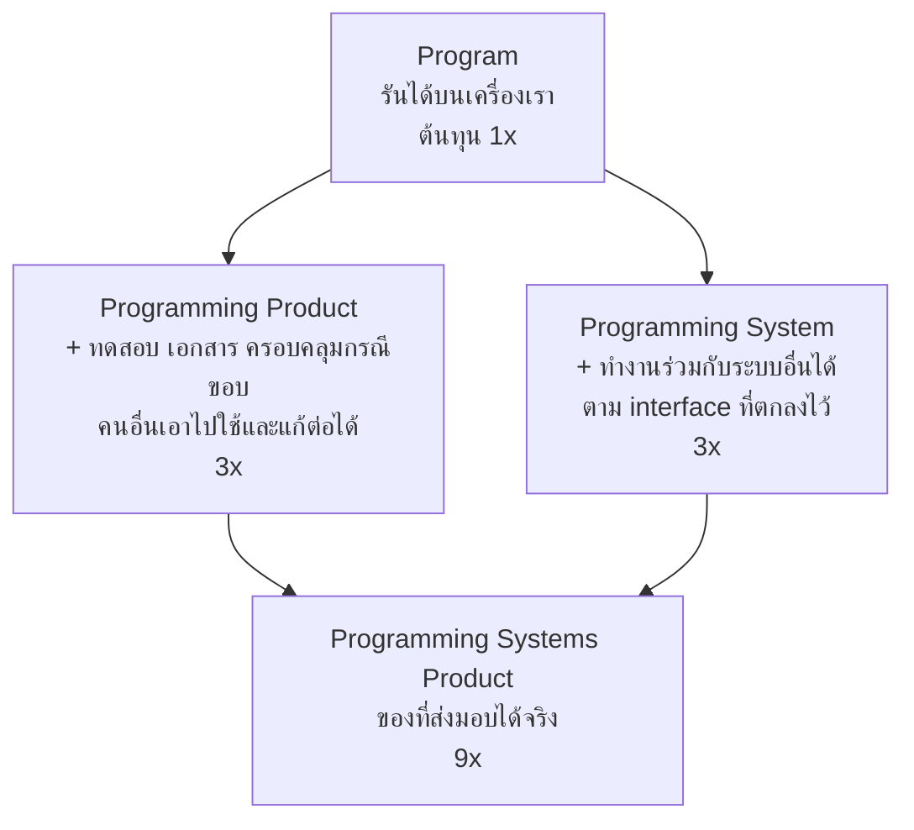
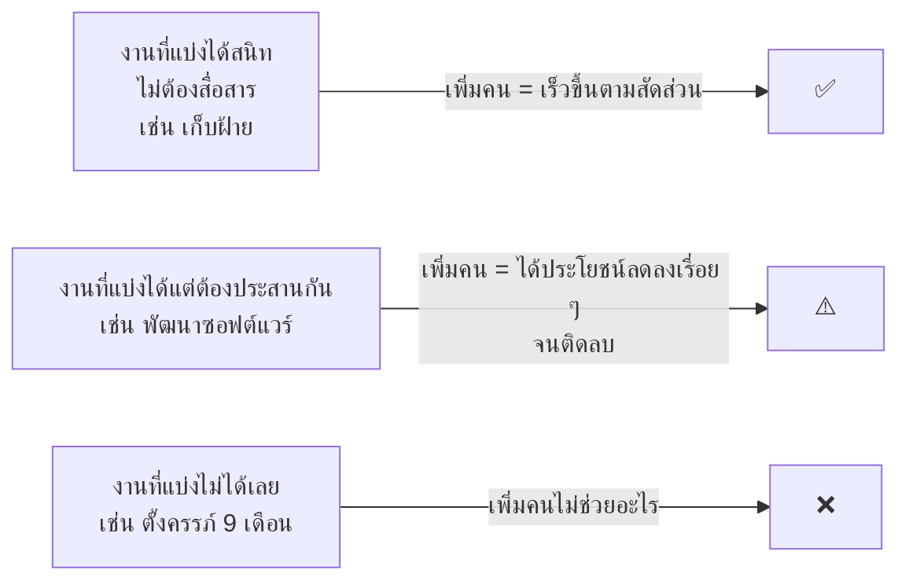
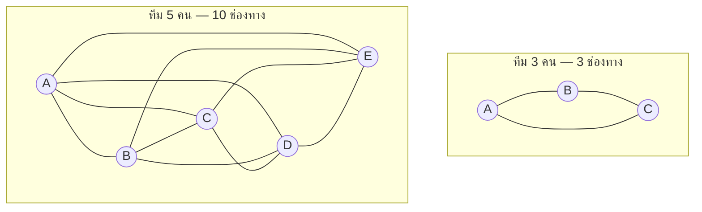
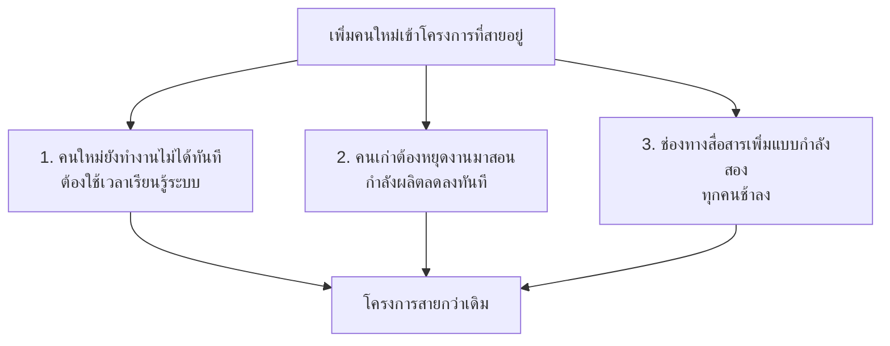
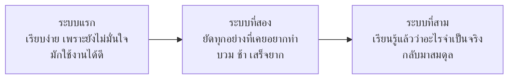
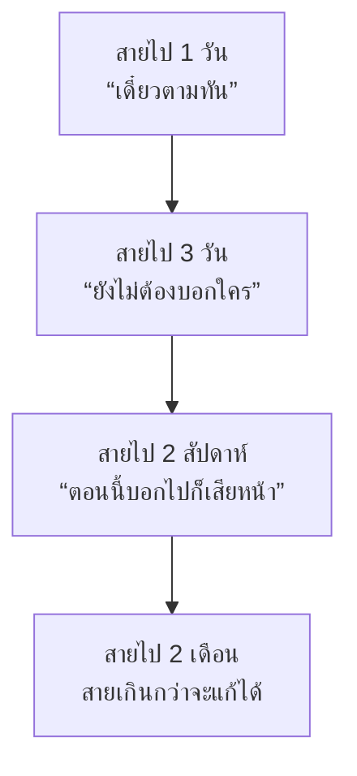
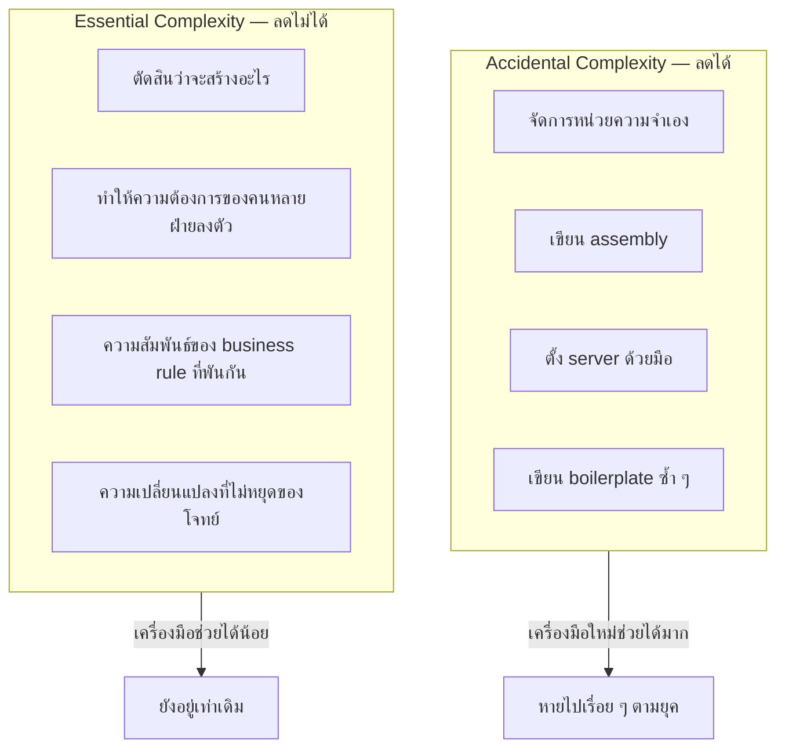
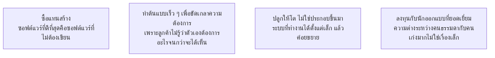
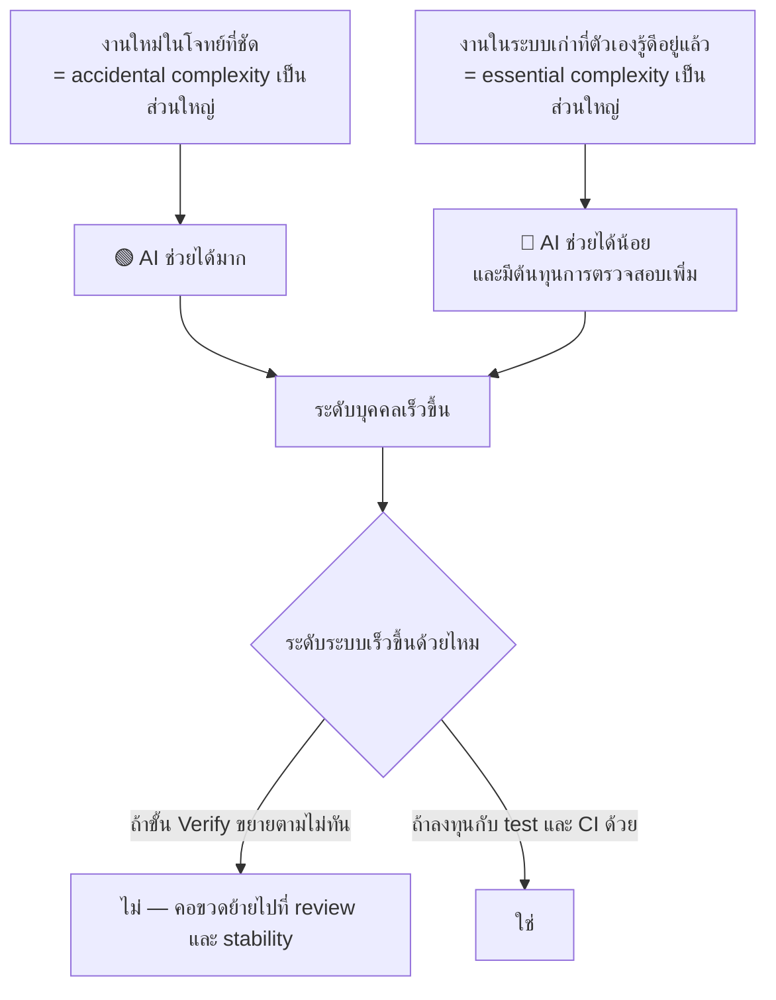

# The Mythical Man-Month — บทเรียนปี 1975 ที่ยังจริงอยู่

> ⚠️ **หมายเหตุก่อนอ่าน:** เอกสารฉบับนี้สร้างขึ้นโดย **Claude Opus 5** จึงอาจมีเนื้อหาที่คลาดเคลื่อน
> ตกหล่น หรือล้าสมัยได้ ให้ใช้วิจารณญาณในการอ่าน ตรวจสอบย้อนกลับไปยังเอกสารอ้างอิงท้ายบท
> และเปรียบเทียบกับแหล่งข้อมูลอื่นประกอบเสมอ — การตั้งคำถามกับสิ่งที่อ่าน
> คือส่วนหนึ่งของการฝึก **critical thinking** ในวิชานี้

> **หนังสือ:** Frederick P. Brooks, Jr. — *The Mythical Man-Month: Essays on Software Engineering* (1975,
> ฉบับครบรอบ 20 ปี ปี 1995 เพิ่มบท *No Silver Bullet* และ *No Silver Bullet Refired*)
> **เชื่อมกับ loop ของวิชา:** หนังสือเล่มนี้อธิบายว่าทำไม **การเพิ่มกำลังคนไม่ทำให้ loop เร็วขึ้น**
> และอะไรคือสิ่งที่แท้จริงที่จำกัดความเร็วของงานซอฟต์แวร์

---

## 🎯 อ่านจบแล้วจะได้อะไร

| สิ่งที่จะทำได้ | ใช้ในงานจริงอย่างไร |
|---|---|
| อธิบาย Brooks's Law และเหตุผลเบื้องหลังได้ | เป็นคำอธิบายที่ใช้คุยกับหัวหน้าได้เมื่อถูกเสนอให้ "เพิ่มคน" ตอนงานสาย |
| คำนวณต้นทุนการสื่อสารของทีมตามขนาด | ทำให้เลือกขนาดทีมและวิธีแบ่งงานได้อย่างมีเหตุผล |
| แยก "งานที่เขียนเสร็จ" ออกจาก "ผลิตภัณฑ์ที่ส่งมอบได้" | เป็นสาเหตุอันดับหนึ่งที่นักศึกษาประมาณเวลาต่ำกว่าความจริง 5–9 เท่า |
| อธิบาย conceptual integrity และรักษามันในทีม | ระบบที่แต่ละส่วนคิดคนละแบบจะใช้ยากและแก้ยากตลอดอายุของมัน |
| แยก essential complexity ออกจาก accidental complexity | เป็นกรอบที่ใช้ตอบได้ว่า AI ช่วยงานเราตรงไหนได้จริง และตรงไหนช่วยไม่ได้ |
| ประเมินคำโฆษณาของเครื่องมือใหม่อย่างมีหลักฐาน | ทุกปีจะมีของใหม่ที่อ้างว่าเปลี่ยนทุกอย่าง — คนที่ประเมินเป็นจะไม่พาทีมไปผิดทาง |

---

## 📖 ศัพท์ที่ต้องรู้ก่อนเริ่ม

| ศัพท์ | ความหมายในบริบทของวิชานี้ |
|---|---|
| **Man-month** | หน่วยงานสมมติ = คน 1 คน × เวลา 1 เดือน — ประเด็นทั้งเล่มคือหน่วยนี้ *หลอกลวง* |
| **Brooks's Law** | "การเพิ่มคนเข้าโครงการที่สายอยู่แล้ว ทำให้มันสายกว่าเดิม" |
| **Communication path** | ช่องทางที่คนสองคนต้องประสานกัน — เพิ่มแบบกำลังสองตามจำนวนคน |
| **Programming Systems Product** | ของที่ส่งมอบได้จริง — ต่างจาก "โปรแกรมที่รันได้บนเครื่องเรา" ประมาณ 9 เท่า |
| **Conceptual Integrity** | ความสอดคล้องของแนวคิดทั้งระบบ ให้ความรู้สึกเหมือนออกแบบโดยคนคนเดียว |
| **Second-system effect** | ระบบที่สองของสถาปนิกมักบวมเพราะยัดทุกอย่างที่เคยอยากทำแต่ไม่ได้ทำ |
| **Surgical team** | ทีมเล็กที่มีคนเก่งเป็นแกน และคนอื่นสนับสนุนเขา แทนทีมใหญ่ที่ทุกคนเท่ากัน |
| **Essential complexity** | ความซับซ้อนที่ติดมากับตัวปัญหาเอง เลี่ยงไม่ได้ |
| **Accidental complexity** | ความซับซ้อนที่เกิดจากเครื่องมือและวิธีทำงานของเรา ลดได้ |
| **No Silver Bullet** | ข้อเสนอว่าไม่มีเทคโนโลยีเดียวที่จะเพิ่มผลิตภาพ 10 เท่าภายในทศวรรษ |

---

## 1. ที่มา และเหตุผลที่ยังต้องอ่านในปี 2026

Fred Brooks เป็นผู้จัดการโครงการ **IBM OS/360** ซึ่งเป็นหนึ่งในโครงการซอฟต์แวร์
ที่ใหญ่ที่สุดในยุคนั้น มีคนเกี่ยวข้องกว่า 1,000 คน และสายกว่ากำหนดอย่างหนัก
หนังสือเล่มนี้คือบันทึกว่า *เขาทำอะไรผิด* และทำไม

เหตุผลที่มันไม่ล้าสมัยทั้งที่ผ่านมา 50 ปี: **ปัญหาที่เขาเขียนถึงไม่ใช่ปัญหาทางเทคนิค
แต่เป็นปัญหาของมนุษย์ที่ทำงานร่วมกัน** เทคโนโลยีเปลี่ยนไปหมดแล้ว
แต่ต้นทุนของการทำให้คนหลายคนเข้าใจตรงกันไม่ได้ลดลงเลย

> 💼 **จากหน้างานจริง**
> เมื่อโครงการเริ่มสาย คำถามแรกของผู้บริหารเกือบทุกคนคือ "ต้องการคนเพิ่มไหม"
> วิศวกรที่อ่านเล่มนี้แล้วจะตอบได้ว่า *ทำไมคำตอบมักจะเป็น "ไม่"*
> และเสนอทางเลือกที่ได้ผลกว่าแทน — ซึ่งเป็นบทสนทนาที่สร้างความน่าเชื่อถือได้มาก

---

## 2. The Tar Pit — ทำไมงานถึงใหญ่กว่าที่คิดเสมอ

บทแรกอธิบายความต่างระหว่าง 4 สิ่งที่คนมักเรียกรวมกันว่า "โปรแกรม"

**นี่คือคำอธิบายที่ตรงที่สุดว่าทำไมนักศึกษาถึงประมาณเวลาพลาด**
"เขียน API จองห้องเสร็จ" ในความหมายของนักศึกษาคือ *Program*
แต่สิ่งที่ถูกให้คะแนนและสิ่งที่ผู้ใช้ต้องการคือ *Programming Systems Product* —
ซึ่งรวม test, การจัดการ error, เอกสาร, การทำงานร่วมกับส่วนอื่น และการ deploy ได้จริง

ระยะห่างระหว่างสองอย่างนี้คือประมาณ **9 เท่า** และมันคือช่องว่างที่ทำให้
"เหลืออีกนิดเดียว" กลายเป็นสองสัปดาห์

**ใช้กับ WBS ได้ทันที:** เมื่อเขียน work package ให้ระบุว่าปลายทางคือระดับไหน
work package ที่เขียนว่า "ทำ API สร้างการจอง" ต้องมีเกณฑ์ยอมรับที่ครอบคลุมทั้ง 9 เท่า
ไม่ใช่แค่ 1 เท่า

---

## 3. The Mythical Man-Month — หัวใจของหนังสือ

> "คนกับเดือนสลับกันได้ ก็ต่อเมื่องานนั้นแบ่งกันทำได้โดยไม่ต้องสื่อสารกัน"

การเก็บฝ้าย 100 ไร่ ใช้คน 10 คน 10 วัน หรือคน 100 คน 1 วัน ก็ได้ผลเท่ากัน
เพราะคนเก็บฝ้ายไม่ต้องคุยกัน แต่งานซอฟต์แวร์ไม่ใช่แบบนั้น

ประโยคที่โด่งดังที่สุดของ Brooks คือ

> "การอุ้มท้อง 9 เดือนเป็นงานที่ผู้หญิง 9 คนช่วยกันทำให้เสร็จใน 1 เดือนไม่ได้"

### ต้นทุนการสื่อสารโตแบบกำลังสอง

จำนวนช่องทางการสื่อสารในทีม $n$ คน:

$$\text{communication paths} = \frac{n(n-1)}{2}$$

| ขนาดทีม | ช่องทางการสื่อสาร | เพิ่มขึ้นจากเดิม |
|:---:|:---:|---|
| 2 | 1 | — |
| 3 | 3 | +2 |
| 4 | 6 | +3 |
| 5 | 10 | +4 |
| 8 | 28 | +7 |
| 10 | 45 | +9 |
| 20 | 190 | +19 |

เพิ่มคนจาก 4 เป็น 5 ได้กำลังทำงานเพิ่ม 25% แต่ได้ต้นทุนการประสานงานเพิ่ม 67%
นี่คือเหตุผลเชิงคณิตศาสตร์ที่อยู่เบื้องหลัง **ทีมสองพิซซ่า** ของ Amazon
และเหตุผลที่ทีมพัฒนาส่วนใหญ่ในโลกอยู่ที่ 5–9 คน

### Brooks's Law

> **"Adding manpower to a late software project makes it later."**

สาเหตุ 3 ข้อที่ทำงานร่วมกัน:

**ข้อยกเว้นที่ต้องรู้ด้วย** — Brooks's Law ไม่ได้แปลว่าห้ามเพิ่มคนตลอดกาล
มันจะไม่เป็นจริงเมื่อ:

- เพิ่มคนตั้งแต่ต้นโครงการ ไม่ใช่ตอนใกล้เส้นตาย
- งานที่เพิ่มให้แยกขาดจากส่วนอื่นได้จริง เช่น เขียนเอกสาร หรือทำงานคนละโมดูลที่ไม่แตะกัน
- คนใหม่คุ้นระบบอยู่แล้ว ไม่ต้องใช้เวลาเรียนรู้
- คอขวดคือกำลังคนจริง ๆ ไม่ใช่การประสานงาน

**สิ่งที่ควรทำแทนการเพิ่มคนเมื่องานสาย**

| ทางเลือก | เมื่อไรถึงเหมาะ |
|---|---|
| **ตัด scope** | เกือบทุกกรณี — และเป็นทางที่ได้ผลที่สุด |
| เลื่อนกำหนดส่ง | เมื่อคุณภาพสำคัญกว่าวันที่ |
| ปล่อยเป็นระยะ ส่งของสำคัญที่สุดก่อน | เมื่อ scope แบ่งเป็นชิ้นบางได้ |
| ลดงานที่ไม่ใช่การพัฒนา เช่น ประชุม | เมื่อทีมถูกขัดจังหวะบ่อย |
| เพิ่มคน | เมื่อยังเหลือเวลามากพอให้คนใหม่คุ้มค่า |

> 💼 **จากหน้างานจริง**
> ในการประชุมที่มีคนเสนอให้เพิ่มคน ประโยคที่ใช้ได้ผลที่สุดไม่ใช่การอ้างชื่อ Brooks
> แต่คือคำถามว่า *"งานส่วนไหนที่คนใหม่ทำได้เลยโดยไม่ต้องรอใครสอน"*
> ถ้าตอบไม่ได้ ทุกคนในห้องจะเห็นคำตอบเอง

---

## 4. Conceptual Integrity — สิ่งที่สำคัญที่สุดในการออกแบบ

Brooks ยืนยันว่า **conceptual integrity คือปัจจัยสำคัญที่สุดของการออกแบบระบบ**
และดีกว่าที่จะได้ระบบที่สอดคล้องกันแต่ขาดฟีเจอร์บางอย่าง
มากกว่าระบบที่มีทุกฟีเจอร์แต่แต่ละส่วนคิดกันคนละแบบ

**อาการของระบบที่ขาด conceptual integrity** — สังเกตได้ง่ายมากในโครงการกลุ่ม:

- endpoint หนึ่งใช้ `snake_case` อีก endpoint ใช้ `camelCase`
- บางที่คืน `404` เมื่อไม่พบ บางที่คืน `200` พร้อม `null`
- บางหน้าจอยืนยันก่อนลบ บางหน้าจอลบทันที
- การจัดการ error สามแบบในระบบเดียว เพราะสามคนเขียนคนละสัปดาห์

ผลที่ตามมาไม่ใช่แค่ความไม่สวยงาม แต่คือ **ผู้ใช้เดาไม่ได้ว่าระบบจะทำอะไร**
และ **คนที่มาแก้ต่อต้องเรียนรู้กฎใหม่ทุกครั้งที่เปิดไฟล์ใหม่**

### วิธีรักษา conceptual integrity ในทีมนักศึกษา

| วิธี | ทำอย่างไร |
|---|---|
| มีคนเดียวที่ตัดสินเรื่องการออกแบบโดยรวม | ไม่ใช่เผด็จการ แต่คือคนที่มีอำนาจตัดสินใจขั้นสุดท้ายเรื่องความสอดคล้อง — ช่อง **A** ใน RACI |
| เขียนกฎลงเป็นลายลักษณ์อักษร | `memory-bank/standards/` และ `AGENTS.md` |
| ทำ API contract ก่อนเขียน code | ตกลง `openapi.yaml` ให้จบก่อนเริ่มเขียน |
| บังคับกฎด้วยเครื่องมือ | linter, schema validation, fitness function |
| review ทุก PR โดยดูความสอดคล้อง ไม่ใช่แค่ความถูกต้อง | ตั้งคำถามว่า "อันนี้ทำเหมือนที่อื่นในระบบไหม" |

**นี่คือจุดที่หนังสือปี 1975 พูดตรงกับปัญหาของยุค AI พอดี** —
เมื่อ agent เขียน code ให้หลายส่วนโดยไม่มีความทรงจำร่วมกัน
มันจะสร้างรูปแบบใหม่ทุกครั้งที่ถูกเรียก conceptual integrity จึงต้องถูก
*เขียนออกมาเป็นข้อความที่ agent อ่านได้* ไม่ใช่เก็บไว้ในหัวของใครคนหนึ่ง

---

## 5. Second-System Effect

Brooks สังเกตว่าสถาปนิกที่ออกแบบระบบแรกมักจะระมัดระวังเพราะยังไม่มั่นใจ
ผลคือระบบแรกมักเรียบง่ายและใช้ได้ดี

แต่ **ระบบที่สอง** คือระบบที่อันตรายที่สุด เพราะเขาจะยัดทุกอย่างที่เคยอยากทำแต่ไม่ได้ทำ
ทั้งการเผื่อกรณีที่อาจไม่มีวันเกิด และการทำให้ทุกอย่างยืดหยุ่นเกินจำเป็น

**อาการในโครงการนักศึกษา:** ทำระบบเสร็จรอบแรกแล้วรู้สึกว่ามันธรรมดาเกินไป
จึงเริ่มเพิ่ม plugin system, ระบบ config ที่ยืดหยุ่นทุกอย่าง, abstraction ที่รองรับกรณีที่ยังไม่มี

**ยาแก้:** ถามว่า *"ตอนนี้มีผู้ใช้จริงกี่คนที่ต้องการสิ่งนี้"*
ถ้าคำตอบคือศูนย์ ให้จดไว้ใน backlog แล้วเดินหน้าต่อ
หลักที่เกี่ยวข้องคือ **YAGNI — You Aren't Gonna Need It**

---

## 6. Plan to Throw One Away — และการกลับคำของ Brooks

ประโยคดั้งเดิมในหนังสือคือ

> "จงวางแผนที่จะทิ้งระบบแรกไป เพราะยังไงคุณก็จะต้องทิ้งมันอยู่ดี"

แต่ในฉบับครบรอบ 20 ปี **Brooks กลับคำข้อนี้ด้วยตัวเอง** เขาบอกว่าคำแนะนำนี้
ใช้ได้กับโลกที่พัฒนาแบบ waterfall เท่านั้น และเสนอ **การพัฒนาแบบเพิ่มทีละส่วน**
(incremental development) แทน — สร้างระบบที่ทำงานได้ตั้งแต่เล็ก แล้วขยายทีละขั้น

การที่ผู้เขียนกลับคำตัวเองหลังผ่านไป 20 ปีเป็นบทเรียนในตัวมันเอง:
**การยึดติดกับสิ่งที่เคยพูดไว้ มีต้นทุนสูงกว่าการยอมรับว่าเข้าใจใหม่**

แนวคิด incremental ของ Brooks คือบรรพบุรุษโดยตรงของแนวปฏิบัติสมัยใหม่ —
deploy ระบบเปล่า ๆ ที่ทำงานได้ตั้งแต่สัปดาห์แรก
แล้วค่อยเพิ่มเนื้อเข้าไป แทนที่จะสร้างชิ้นส่วนทั้งหมดแล้วประกอบตอนท้าย

---

## 7. Hatching a Catastrophe — โครงการสายทีละวัน

> "โครงการสายไปหนึ่งปีได้อย่างไร? — ทีละวัน"

ความหายนะของโครงการไม่ได้มาจากเหตุการณ์ใหญ่เพียงครั้งเดียว
แต่มาจากการสายวันละนิดที่ไม่มีใครรายงาน เพราะแต่ละครั้งดูเล็กเกินกว่าจะพูดถึง

**สิ่งที่ Brooks เสนอคือ milestone ที่ "แหลมคม"** — จุดตรวจที่มีเกณฑ์ชัดเจน
จนไม่มีใครโต้แย้งได้ว่าผ่านหรือไม่ผ่าน

> ❌ milestone ที่คลุมเครือ: "เขียน backend เสร็จ 80%"
> ✅ milestone ที่แหลมคม: "`POST /api/bookings` ตอบ 201 บน staging และ E2E test เขียวใน CI"

milestone แบบหลังไม่มีทางรายงานผิดได้ ทั้งกับคนอื่นและกับตัวเอง —
และมันก็คือ **ขั้น Verify ของ loop** ที่ถูกยกระดับมาเป็นเครื่องมือบริหารโครงการ

---

## 8. No Silver Bullet — บทที่สำคัญที่สุดสำหรับยุค AI

### 8.1 ข้อเสนอหลัก

บทความปี 1986 นี้เสนอข้อโต้แย้งที่ยังถูกอ้างถึงมากที่สุดในวงการ

> ไม่มีเทคโนโลยีหรือวิธีบริหารเดียวใด ที่จะทำให้ผลิตภาพ ความน่าเชื่อถือ หรือความเรียบง่าย
> ดีขึ้นถึง **หนึ่งเท่าตัวของอันดับ (10 เท่า)** ภายในหนึ่งทศวรรษ

ชื่อบทความมาจากตำนานมนุษย์หมาป่า — สิ่งที่ดูเหมือนคนธรรมดาแต่กลายร่างเป็นสัตว์ร้ายโดยไม่ทันตั้งตัว
Brooks เปรียบว่าโครงการซอฟต์แวร์ที่ดูเรียบร้อยกลายเป็นหายนะได้ในลักษณะเดียวกัน
และทุกยุคจะมีคนเสนอ "กระสุนเงิน" ที่อ้างว่าฆ่ามันได้ในนัดเดียว

**ข้อสำคัญที่คนอ่านผิดบ่อย:** Brooks ไม่ได้บอกว่าความก้าวหน้าเป็นไปไม่ได้
เขาบอกว่าความก้าวหน้าจะมาจาก **การสะสมของการปรับปรุงเล็ก ๆ หลายอย่าง**
ไม่ใช่จากสิ่งประดิษฐ์เดียวที่เปลี่ยนทุกอย่าง

### 8.2 Essence กับ Accident

คำสองคำนี้ยืมมาจากอริสโตเติล — *essence* คือสิ่งที่ทำให้สิ่งหนึ่งเป็นสิ่งนั้น
ส่วน *accident* คือสิ่งที่บังเอิญติดมาแต่ตัดออกได้โดยที่สิ่งนั้นยังเป็นตัวมันเอง

**ข้อโต้แย้งเชิงคณิตศาสตร์ที่ Brooks ใช้:** สมมติว่างานที่เป็น accidental
กินเวลา 9 ใน 10 ส่วนของงานทั้งหมด ถ้าเราลบมันทิ้ง **ทั้งหมด** ได้ในพริบตา
เราจะเร็วขึ้นได้แค่ 10 เท่าเท่านั้น และหลังจากนั้นจะไม่มีอะไรให้ตัดอีกเลย
ในความเป็นจริงสัดส่วนนั้นน้อยกว่า 9 ใน 10 มาก ดังนั้นเพดานของการปรับปรุงจึงต่ำกว่านั้นอีก

### 8.3 คุณสมบัติ 4 ข้อของ Essential Complexity

| คุณสมบัติ | ความหมาย | ตัวอย่างที่เห็นได้ในโครงการจริง |
|---|---|---|
| **Complexity** | ไม่มีสองส่วนไหนในซอฟต์แวร์ที่เหมือนกันเป๊ะ ต่างจากงานวิศวกรรมอื่นที่มีชิ้นส่วนมาตรฐาน | สะพานสร้างจากเสาที่เหมือนกัน 200 ต้น แต่ระบบ 200 หน้าจอ ไม่มีสองหน้าที่เหมือนกันจริง |
| **Conformity** | ซอฟต์แวร์ต้องปรับตัวเข้าหาระบบที่มนุษย์สร้างไว้ก่อน ซึ่งไม่มีเหตุผลตายตัว | กฎการคิดค่าหน่วยกิตของแต่ละคณะไม่เหมือนกัน และไม่มีหลักการใดอธิบายได้ นอกจาก "ตกลงกันไว้อย่างนั้น" |
| **Changeability** | ซอฟต์แวร์ถูกกดดันให้เปลี่ยนตลอด เพราะดู "เปลี่ยนง่าย" กว่าฮาร์ดแวร์ | ไม่มีใครขอย้ายเสาสะพาน แต่ทุกคนขอเพิ่มปุ่มบนหน้าจอ |
| **Invisibility** | มองไม่เห็นด้วยตา จึงสื่อสารและตรวจสอบยากกว่างานที่จับต้องได้ | แผนผังบ้านวาดบนกระดาษแผ่นเดียวได้ แต่ระบบซอฟต์แวร์ต้องใช้ diagram หลายมุมมองและยังไม่ครบ |

ข้อ **Invisibility** เป็นข้อที่ส่งผลกับวิธีทำงานมากที่สุด —
เพราะมองไม่เห็น เราจึงต้องสร้าง *สัญญาณ* ขึ้นมาแทนสายตา
test ที่เขียว/แดง, log ที่มีโครงสร้าง, metric ที่วัดได้ ล้วนเป็นเครื่องมือชดเชยความมองไม่เห็นนี้

### 8.4 กระสุนเงินที่ Brooks ตรวจสอบแล้วปฏิเสธ

ส่วนที่มีค่าที่สุดของบทความคือการที่เขาไล่ตรวจ "ความหวัง" ของยุคนั้นทีละข้อ
พร้อมเหตุผลว่าทำไมแต่ละข้อจึงแก้ได้แค่ accident

| ผู้ท้าชิงในปี 1986 | คำวินิจฉัยของ Brooks | สิ่งที่เกิดขึ้นจริงในเวลาต่อมา |
|---|---|---|
| ภาษาระดับสูง เช่น Ada | ช่วยมาก แต่เป็น accident ล้วน | กระทรวงกลาโหมสหรัฐฯ ถึงกับ *บังคับ* ให้ใช้ Ada ในช่วงปี 1991–1997 แล้วยกเลิกข้อบังคับ เพราะไม่ได้ผลอย่างที่หวัง |
| Object-Oriented Programming | ช่วยลด accident ได้ดี แต่ไม่ใช่ 10 เท่า | OOP กลายเป็นกระแสหลักจริง แต่ "การนำกลับมาใช้ซ้ำ" ในระดับที่โฆษณาไว้ไม่เคยเกิด |
| ปัญญาประดิษฐ์และ expert system | ยังไม่พร้อม และไม่แตะ essence | ฤดูหนาวของ AI ตามมาในทศวรรษ 1990 |
| **Automatic programming** | เป็นเพียงการเปลี่ยนชื่อของ "ภาษาระดับสูงกว่าเดิม" | วนกลับมาซ้ำในชื่อ CASE tool, 4GL, MDA, low-code และล่าสุดคือเครื่องมือ AI |
| Graphical programming | หน้าจอเล็กเกินไปสำหรับความซับซ้อนจริง | UML tool ยุค 1990 ล้มเหลวเป็นวงกว้าง |
| Program verification | พิสูจน์ได้ว่าตรง spec แต่ไม่ได้พิสูจน์ว่า spec ถูก | ยังใช้เฉพาะระบบวิกฤต เช่น การบินและการแพทย์ |
| Environment และ tool ที่ดีขึ้น | ช่วย แต่กำไรเหลือน้อยลงเรื่อย ๆ | IDE สมัยใหม่ดีมาก แต่ไม่มีใครอ้างว่ามันทำให้เร็วขึ้น 10 เท่า |

**บรรทัดที่ควรจำที่สุดคือแถว Automatic programming** — Brooks ชี้ว่าคำนี้
ไม่เคยมีความหมายที่ชัดเจนเลย มันคือคำโฆษณาที่หมายถึง
"การเขียนโปรแกรมด้วยภาษาที่สูงกว่าที่เราใช้อยู่ตอนนี้" เท่านั้น
รูปแบบเดียวกันนี้กลับมาทุก 10–15 ปีในชื่อใหม่ และทุกครั้งจะได้ผลจริงบางส่วน
แต่ไม่เคยลบ essence ออกไปได้

### 8.5 สิ่งที่ Brooks บอกว่า *พอจะ* ได้ผล

เขาไม่ได้จบด้วยการมองโลกในแง่ร้าย แต่เสนอ 4 แนวทางที่โจมตี essence โดยตรง

ข้อ 1 ยังเป็นคำแนะนำที่ถูกต้องที่สุดในปี 2026 และเป็นข้อที่ทีมนักศึกษาละเลยบ่อยที่สุด —
การเขียนระบบยืนยันตัวตนเองแทนที่จะใช้ของสำเร็จ ไม่ได้ทำให้ได้คะแนนมากขึ้น
แต่ทำให้เสียเวลาไปกับ accidental complexity ที่ไม่มีใครอยากได้

ข้อ 2 และ 3 คือรากของแนวคิด agile และของการ deploy ตั้งแต่สัปดาห์แรก
ข้อ 4 คือเหตุผลที่การพัฒนาคนยังคุ้มกว่าการซื้อเครื่องมือ

### 8.6 กรณีศึกษาจริง — กระสุนเงินที่ยิงแล้วไม่โดน

#### กรณีที่ 1: Ada และคำสั่งบังคับของกระทรวงกลาโหมสหรัฐฯ

ภาษา Ada ถูกออกแบบมาอย่างพิถีพิถันเพื่อแก้ปัญหาซอฟต์แวร์ของกองทัพ
และถึงขั้นถูกออกเป็นข้อบังคับให้ใช้กับระบบของกระทรวงกลาโหม
ผลลัพธ์: ภาษาดีจริง มีคุณสมบัติที่ล้ำหน้ายุค แต่ **ไม่ได้ทำให้โครงการเสร็จตรงเวลามากขึ้นอย่างมีนัยสำคัญ**
ข้อบังคับถูกยกเลิกในปี 1997

**บทเรียน:** เครื่องมือที่ดีกว่าไม่ได้แก้ปัญหาที่ไม่ได้เกิดจากเครื่องมือ

#### กรณีที่ 2: ระบบลำเลียงกระเป๋าสนามบิน Denver

โครงการปี 1990s ที่ตั้งใจสร้างระบบลำเลียงกระเป๋าอัตโนมัติทั้งสนามบิน
สนามบินเปิดช้ากว่ากำหนดราว 16 เดือน และมีต้นทุนบานปลายหลายร้อยล้านดอลลาร์
สาเหตุไม่ใช่ภาษาโปรแกรมหรือเครื่องมือ แต่คือ **ขอบเขตที่ใหญ่เกินกว่าจะทดสอบได้ทั้งก้อน,
ความต้องการที่เปลี่ยนระหว่างทาง และการรวมระบบที่ถูกเลื่อนไปไว้ปลายทาง**

**บทเรียน:** essence ทั้งสามตัว — conformity, changeability, invisibility — ปรากฏพร้อมกัน

#### กรณีที่ 3: Knight Capital — 45 นาที กับเงินราว 460 ล้านดอลลาร์

วันที่ 1 สิงหาคม 2012 บริษัทหลักทรัพย์ Knight Capital ปล่อย code ใหม่ขึ้น production
แต่มีเซิร์ฟเวอร์หนึ่งในแปดเครื่องที่ไม่ได้รับ code เวอร์ชันใหม่
ประกอบกับการนำ flag เก่ากลับมาใช้ซ้ำในความหมายใหม่ ระบบจึงส่งคำสั่งซื้อขายผิดพลาดจำนวนมหาศาล
บริษัทสูญเงินราว 460 ล้านดอลลาร์ภายในเวลาประมาณ 45 นาที และเกือบล้มละลาย

**บทเรียน:** ไม่มีภาษาหรือ framework ใดป้องกันเหตุการณ์นี้ได้
สิ่งที่ป้องกันได้คือ **กระบวนการ deploy ที่ตรวจสอบตัวเองได้ และการเลิกใช้ feature flag เก่าอย่างมีวินัย** —
ซึ่งเป็นเรื่องของ loop ไม่ใช่เรื่องของเทคโนโลยี

#### กรณีที่ 4: โครงการ IT ระดับชาติที่ล้มทั้งที่มีงบไม่จำกัด

- **NHS National Programme for IT** ของสหราชอาณาจักร ถูกยกเลิกในปี 2011
  หลังใช้งบประมาณระดับหลายพันล้านปอนด์
- **HealthCare.gov** ของสหรัฐฯ เปิดตัวเดือนตุลาคม 2013 แล้วใช้งานแทบไม่ได้ในสัปดาห์แรก ๆ
  ทั้งที่มีงบประมาณและผู้รับเหมาชั้นนำจำนวนมาก

ทั้งสองกรณีมีสาเหตุร่วมกัน: ผู้มีส่วนได้ส่วนเสียจำนวนมากที่ต้องการไม่ตรงกัน,
การรวมระบบจากหลายผู้รับเหมาที่ถูกเลื่อนไว้ปลายทาง และการไม่มีของจริงให้ทดสอบจนถึงวันเปิด

**บทเรียน:** เงินไม่ได้ซื้อ essence ออกไป — และการเพิ่มผู้รับเหมาก็คือ Brooks's Law ในระดับองค์กร

#### กรณีที่ 5: Cloud — กระสุนที่โดนเป้าจริง แต่โดนแค่ครึ่งเดียว

ก่อนปี 2006 การเริ่มระบบใหม่ต้องสั่งซื้อเครื่อง ติดตั้งในศูนย์ข้อมูล และรอเป็นสัปดาห์ถึงเดือน
ทุกวันนี้ทำได้ในไม่กี่นาที นี่คือการลด accidental complexity ที่เกิน 10 เท่าจริง
และเป็นตัวอย่างที่ดีที่สุดว่า Brooks พูดถูกในเชิงทิศทาง — ความก้าวหน้ามาจากด้าน accident

แต่สังเกตให้ดี: **cloud ไม่ได้ทำให้การตัดสินใจว่าจะสร้างอะไรง่ายขึ้นแม้แต่นิดเดียว**
และไม่ได้ทำให้อัตราความล้มเหลวของโครงการลดลงตามสัดส่วนของความเร็วที่ได้มา

### 8.7 แล้ว AI เป็น silver bullet หรือเปล่า?

ใช้กรอบของ Brooks วิเคราะห์อย่างซื่อสัตย์:

| ด้าน | AI ช่วยได้แค่ไหน |
|---|---|
| **Accidental — เขียน boilerplate, แปลงภาษา, ตั้ง config** | 🟢 ช่วยได้มาก และในบางงานเกิน 10 เท่าจริง |
| **Accidental — ค้นเอกสาร, อธิบาย code ที่ไม่คุ้น** | 🟢 ช่วยได้มาก ลดเวลาเรียนรู้ลงชัดเจน |
| **Essential — Complexity** | 🟡 ช่วยจัดการได้บ้าง แต่ความซับซ้อนของโดเมนไม่ได้ลดลง |
| **Essential — Conformity** | 🟡 ช่วยอ่านกฎเก่าได้ แต่ยังต้องมีคนบอกว่ากฎคืออะไร |
| **Essential — Changeability** | 🔴 แทบไม่ช่วย และอาจแย่ลง เพราะสร้าง code ได้เร็วจนมีของให้ดูแลมากขึ้น |
| **Essential — Invisibility** | 🔴 ไม่ช่วย และอาจแย่ลง เพราะมี code ที่ไม่มีใครในทีมเคยอ่านเลยเพิ่มขึ้น |
| **ตัดสินว่าจะสร้างอะไร** | 🔴 ไม่ช่วย — เป็นการตัดสินใจเรื่องคุณค่า ไม่ใช่เรื่องข้อมูล |

#### หลักฐานเชิงประจักษ์ที่มีอยู่ตอนนี้

หลักฐานยังไม่นิ่ง และที่สำคัญคือ **มันขัดแย้งกันเองอย่างมีเหตุผล** ซึ่งเป็นสิ่งที่ต้องเข้าใจ

| งานวิจัย | สิ่งที่วัด | ผลลัพธ์ |
|---|---|---|
| GitHub Copilot RCT (Peng et al., 2023) | งานเดี่ยวที่กำหนดโจทย์ชัด — เขียน HTTP server ด้วย JavaScript | กลุ่มที่ใช้ Copilot เสร็จเร็วกว่าราว **56%** |
| METR RCT (2025) | นักพัฒนา open source ที่มีประสบการณ์เฉลี่ย 5 ปีกับ repo ของตัวเอง 246 งานจริง | ใช้ AI แล้ว **ช้าลง 19%** ทั้งที่ผู้เข้าร่วมเชื่อว่าตัวเองเร็วขึ้น 20% |
| DORA State of DevOps 2024 | ทีมทั่วโลก ความสัมพันธ์ระหว่างการใช้ AI กับตัวชี้วัดการส่งมอบ | การใช้ AI เพิ่มขึ้น 25% สัมพันธ์กับ **throughput ลดลง 1.5%** และ **ความมั่นคงของการส่งมอบลดลง 7.2%** ขณะที่ผลิตภาพรายบุคคลและความพึงพอใจเพิ่มขึ้น |

**ความขัดแย้งนี้อธิบายได้ตรง ๆ ด้วยกรอบของ Brooks**

**ผลจาก METR ที่น่าสนใจที่สุดไม่ใช่ตัวเลข 19% แต่คือช่องว่าง 39 จุด
ระหว่างสิ่งที่เกิดขึ้นจริงกับสิ่งที่ผู้เข้าร่วมเชื่อว่าเกิดขึ้น**
นี่คือ automation bias ที่วัดออกมาเป็นตัวเลขได้
และเป็นเหตุผลที่ต้องวัดของจริงแทนการถามความรู้สึก

> 💼 **จากหน้างานจริง**
> อย่าอ่านผลของ METR ว่า "อย่าใช้ AI" — เพราะมันวัดในบริบทเฉพาะมาก
> คือคนที่ *เชี่ยวชาญ repo ของตัวเองอยู่แล้ว* ซึ่งเป็นสถานการณ์ที่ AI มีข้อได้เปรียบน้อยที่สุด
> สิ่งที่ควรอ่านคือ **ผลของเครื่องมือขึ้นกับว่างานนั้นเป็น accident หรือ essence เป็นหลัก**
> และคำถามที่ควรถามก่อนหยิบเครื่องมือใด ๆ คือ *"งานตรงหน้าเป็นแบบไหน"*

### 8.8 สิ่งที่ต้องคำนึงถึงในยุคปัจจุบัน

**1. ความเร็วระดับบุคคลไม่เท่ากับความเร็วระดับระบบ**
การเร่งขั้นที่ไม่ใช่คอขวดไม่ได้ทำให้ผลผลิตรวมเพิ่มขึ้น — เป็นหลักการเดียวกับ
*theory of constraints* ในงานอุตสาหกรรม ถ้า review คือคอขวด
การเขียน code เร็วขึ้นสองเท่าจะทำให้คิวรอ review ยาวขึ้นสองเท่าเท่านั้น

**2. ต้นทุนย้ายจากการเขียนไปที่การตรวจสอบ**
เมื่อการผลิต code ถูกลง ปริมาณ code ที่ต้องอ่าน ตรวจ และดูแลจะเพิ่มขึ้น
เกิดสิ่งที่เรียกได้ว่า **verification debt** — code ที่อยู่ในระบบโดยที่ไม่มีใครเคยอ่านจริง
ตัวชี้วัดที่ควรเฝ้าจึงไม่ใช่ "เขียนได้กี่บรรทัด" แต่คือเวลาที่ใช้ในคิว review และอัตราการแก้ซ้ำ

**3. ต้นทุนตลอดอายุของซอฟต์แวร์อยู่ที่การดูแล ไม่ใช่การเขียนครั้งแรก**
ข้อสังเกตนี้อยู่ในหนังสือตั้งแต่ปี 1975 และยิ่งสำคัญขึ้นเมื่อสร้าง code ได้เร็ว
**code ที่เขียนเร็วแต่ไม่มีใครเข้าใจ คือหนี้ที่จ่ายคืนทุกเดือนไปตลอดอายุระบบ**

**4. Conceptual integrity ตกอยู่ในความเสี่ยงมากกว่าเดิม**
agent ไม่มีความทรงจำร่วมระหว่างการเรียกแต่ละครั้ง มันจึงสร้างรูปแบบใหม่ทุกครั้งที่ถูกถาม
ทางแก้คือเขียนกฎการออกแบบออกมาเป็นข้อความที่ agent อ่านได้
และบังคับด้วยเครื่องมืออัตโนมัติ ไม่ใช่ด้วยความจำของคน

**5. รูปแบบ "automatic programming" กลับมาอีกครั้ง — ให้ตรวจด้วยคำถามเดิม**
เมื่อเจอคำโฆษณาว่า "ไม่ต้องเขียน code อีกต่อไป" ให้ถาม 3 ข้อ

- สิ่งนี้ลด **accidental** หรืออ้างว่าลบ **essential** ทิ้ง
- เมื่อผลลัพธ์ผิด เราจะรู้ได้อย่างไร และแก้ที่ตรงไหน
- ใครรับผิดชอบเมื่อมันพังบน production

คำโฆษณาที่ตอบข้อ 2 ไม่ได้ คือคำโฆษณาที่กำลังขายกระสุนเงิน

**6. ความเสี่ยงใหม่ที่ Brooks ไม่ได้เห็น**
ห่วงโซ่อุปทานของ code (dependency ที่ AI แนะนำมาโดยไม่มีใครตรวจ),
ข้อมูลรั่วผ่าน prompt, และการมอบอำนาจให้ agent ทำสิ่งที่ย้อนกลับไม่ได้
ล้วนเป็น essence ชนิดใหม่ที่ต้องบริหาร ไม่ใช่ accident ที่จะหายไปเองเมื่อเครื่องมือดีขึ้น

**7. คนที่มีค่ามากขึ้นคือคนที่ตั้งโจทย์เป็น**
Brooks เสนอให้ลงทุนกับ "นักออกแบบที่ยอดเยี่ยม" ในปี 1986
ในปี 2026 ข้อเสนอนี้แปลได้ว่า **ลงทุนกับคนที่แปลงความต้องการที่คลุมเครือ
ให้กลายเป็นข้อกำหนดที่ตรวจสอบได้** เพราะนั่นคือขั้นที่เครื่องจักรยังทำแทนไม่ได้
และเป็นขั้นที่กำหนดว่าทุกอย่างหลังจากนั้นจะถูกหรือผิด

**ข้อสรุปที่ตรงกับสิ่งที่วิชานี้สอน:** AI ตัดต้นทุนของขั้น **Act** ลงมหาศาล
แต่ไม่ได้ตัดต้นทุนของขั้น **Context** และ **Verify** เลย
ดังนั้นสิ่งที่จำกัดความเร็วของทีมจึงย้ายไปอยู่ที่สองขั้นนั้นแทน —
ซึ่งเป็นเหตุผลทั้งหมดที่หลักสูตรนี้ลงทุนกับ spec, test, CI และ observability

---

## 9. อะไรเปลี่ยนไปแล้ว และอะไรยังเหมือนเดิม

| ข้อเสนอในหนังสือ | สถานะในปี 2026 |
|---|---|
| Brooks's Law | ✅ ยังจริง — งานวิจัยสมัยใหม่เรื่องขนาดทีมยืนยันในทิศทางเดียวกัน |
| ต้นทุนสื่อสารโตแบบกำลังสอง | ✅ ยังจริงทางคณิตศาสตร์ แต่เครื่องมือช่วยลดค่าคงที่ลงได้ |
| Conceptual integrity | ✅ ยังจริง และสำคัญขึ้นเมื่อ AI ร่วมเขียน code |
| Programming Systems Product 9 เท่า | ✅ ยังจริง แม้ CI/CD จะลดบางส่วนลง |
| Second-system effect | ✅ ยังจริงมาก |
| "Plan to throw one away" | ⚠️ ผู้เขียนกลับคำเอง — ใช้ incremental แทน |
| ทีมแบบ surgical team | ⚠️ แนวคิดยังใช้ได้ แต่รูปแบบเปลี่ยนไปเป็นทีมข้ามสายงานที่เป็นเจ้าของงานร่วมกัน |
| การสื่อสารด้วยเอกสารกระดาษ | ❌ เปลี่ยนไปเป็นเอกสารใน repo ที่ตรวจสอบอัตโนมัติได้ |
| การประมาณด้วย man-month | ❌ เลิกใช้เป็นหน่วยหลักในทีมสมัยใหม่ |

**สิ่งที่ Brooks ไม่ได้คาดถึง** และเปลี่ยนสมการไปจริง ๆ:

- **การทดสอบอัตโนมัติและ CI** — ลดต้นทุนการ integrate ซึ่งในสมัย OS/360 คือฝันร้าย
- **open source** — ทำให้ทีมเล็กใช้ของที่ทีมใหญ่สร้างไว้ได้
- **cloud** — ตัดงาน infrastructure ที่เคยกินคนไปเป็นทีม
- **AI agent** — ลดต้นทุนของขั้นลงมือลงอย่างมีนัยสำคัญ

ทั้ง 4 อย่างนี้โจมตี *accidental complexity* ทั้งหมด ซึ่งตรงกับที่ Brooks ทำนายไว้ว่า
ความก้าวหน้าจะมาจากด้านนี้ และจะไม่มีอันไหนแก้ *essential complexity* ได้

---

## 10. เอาไปใช้กับโครงการกลุ่มอย่างไร

- [ ] **อย่าเพิ่มคนเข้ากลุ่มในสัปดาห์ท้าย ๆ** ถ้างานสาย ให้ตัด scope แทน
- [ ] **ประมาณเวลาโดยคิดถึงระดับ Programming Systems Product** ไม่ใช่แค่ "code รันได้"
- [ ] **มีคนเดียวที่ตัดสินเรื่องความสอดคล้องของการออกแบบ** และเขียนกฎลง `AGENTS.md`
- [ ] **ตั้ง milestone ที่โต้แย้งไม่ได้** เช่น "test เขียวใน CI" ไม่ใช่ "เสร็จ 80%"
- [ ] **รายงานความสายทันทีที่รู้** ไม่ใช่ตอนที่แก้ไม่ทันแล้ว
- [ ] **ระวัง second-system effect** เมื่อรอบแรกเสร็จแล้วเริ่มอยากเพิ่มของ
- [ ] **ถามตัวเองว่าเรากำลังลด accidental หรือกำลังหลบ essential** เมื่อจะเอาเครื่องมือใหม่เข้ามา

---

## 📚 เอกสารอ้างอิง

**ต้นฉบับ**
- Frederick P. Brooks, Jr. — *The Mythical Man-Month: Essays on Software Engineering*,
  Anniversary Edition (1995), Addison-Wesley
- Frederick P. Brooks, Jr. — *No Silver Bullet — Essence and Accident in Software Engineering*
  (1986), เผยแพร่ใน *Proceedings of the IFIP Tenth World Computing Conference*
  และพิมพ์ซ้ำใน *IEEE Computer* Vol. 20, No. 4 (April 1987)
  (https://www.cs.unc.edu/techreports/86-020.pdf)
- Frederick P. Brooks, Jr. — *The Design of Design: Essays from a Computer Scientist* (2010)

**บริบทและการอภิปรายต่อ**
- ACM — Turing Award ปี 1999 ของ Frederick Brooks
  (https://amturing.acm.org/award_winners/brooks_1002187.cfm)
- Martin Fowler — *Conway's Law* (https://martinfowler.com/bliki/ConwaysLaw.html)
- Martin Fowler — *Yagni* (https://martinfowler.com/bliki/Yagni.html)
- DORA — *Accelerate State of DevOps Report* — หลักฐานเชิงประจักษ์เรื่องขนาดของ batch
  และความถี่ของการส่งมอบ (https://dora.dev/)

**หลักฐานเชิงประจักษ์เรื่องผลของ AI ต่อผลิตภาพ**
- Peng, Kalliamvakou, Cihon & Demirer — *The Impact of AI on Developer Productivity:
  Evidence from GitHub Copilot* (2023) (https://arxiv.org/abs/2302.06590)
- METR — *Measuring the Impact of Early-2025 AI on Experienced Open-Source Developer
  Productivity* (2025) (https://metr.org/blog/2025-07-10-early-2025-ai-experienced-os-dev-study/)
  ฉบับเต็ม (https://arxiv.org/abs/2507.09089)
- DORA — *Accelerate State of DevOps Report 2024* หัวข้อผลของการนำ AI มาใช้ต่อ throughput
  และ delivery stability (https://dora.dev/research/2024/dora-report/)

**กรณีศึกษาความล้มเหลวที่มีเอกสารสาธารณะ**
- U.S. GAO — *Denver International Airport: Impact of the Delayed Baggage System*
  (GAO/RCED-95-35BR) (https://www.gao.gov/products/rced-95-35br)
- U.S. SEC — คำสั่งทางปกครองกรณี Knight Capital Americas LLC, Release No. 34-70694 (2013)
  (https://www.sec.gov/litigation/admin/2013/34-70694.pdf)
- UK National Audit Office — รายงานเกี่ยวกับ *National Programme for IT in the NHS*
  (https://www.nao.org.uk/reports/the-national-programme-for-it-in-the-nhs-an-update-on-the-delivery-of-detailed-care-records-systems/)
- U.S. GAO — *HealthCare.gov: Ineffective Planning and Oversight Practices Underscore
  the Need for Improved Contract Management* (GAO-14-694)
  (https://www.gao.gov/products/gao-14-694)

> หมายเหตุ: เว็บไซต์ของหน่วยงานรัฐบางแห่งปิดกั้นการเข้าถึงแบบอัตโนมัติ ให้เปิดผ่าน browser ปกติ
