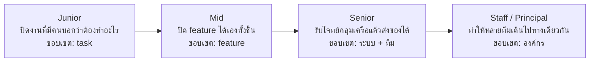
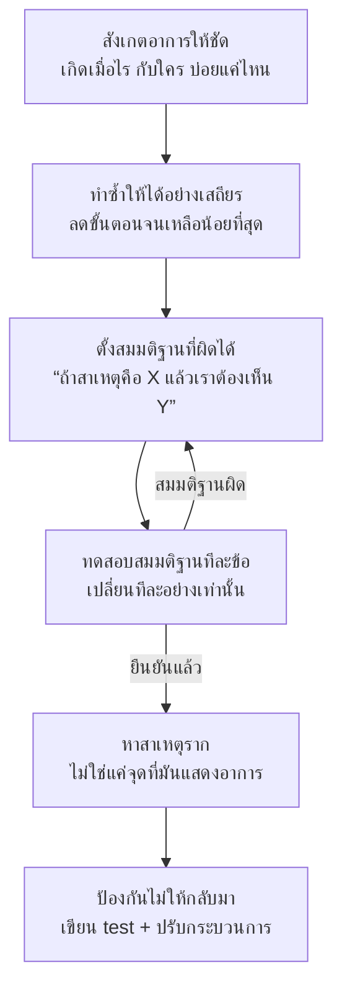
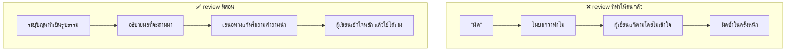
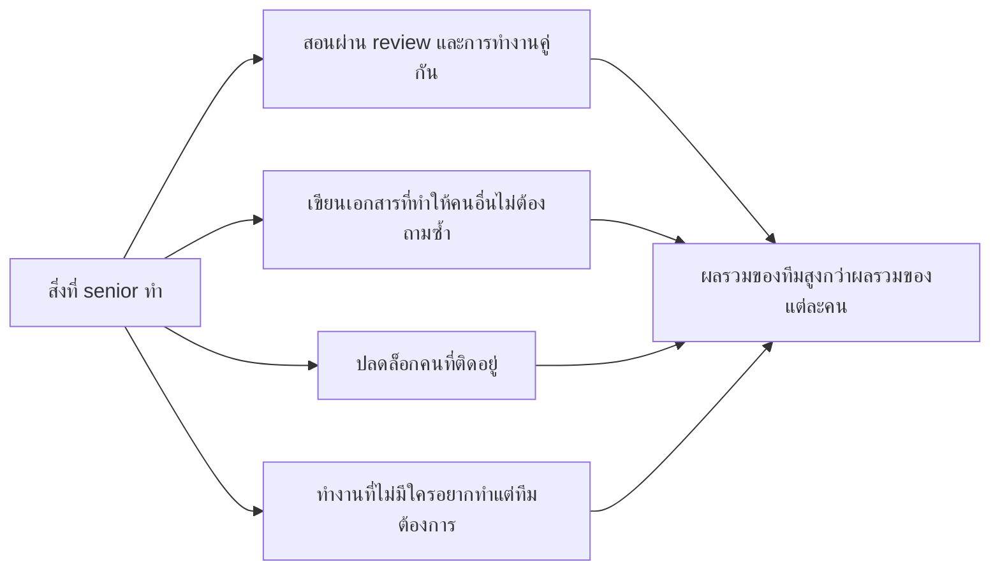
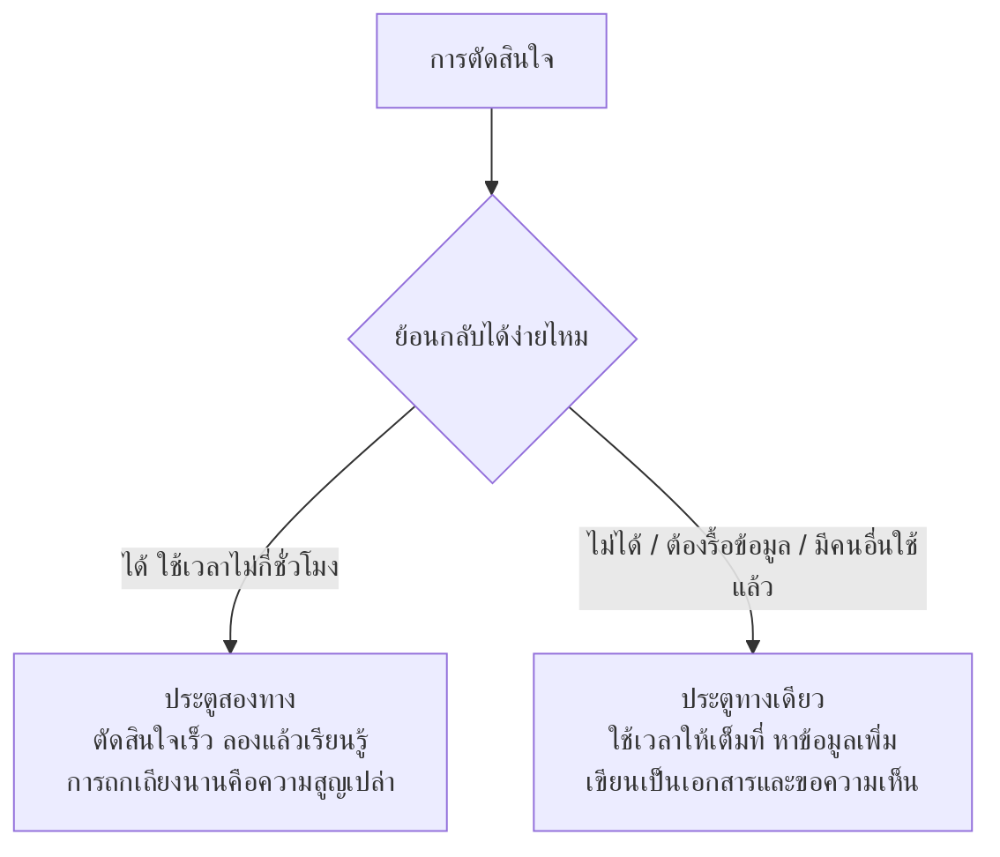
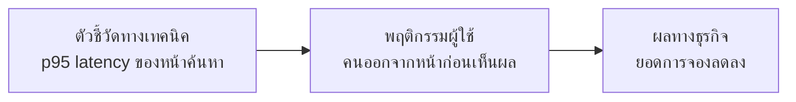
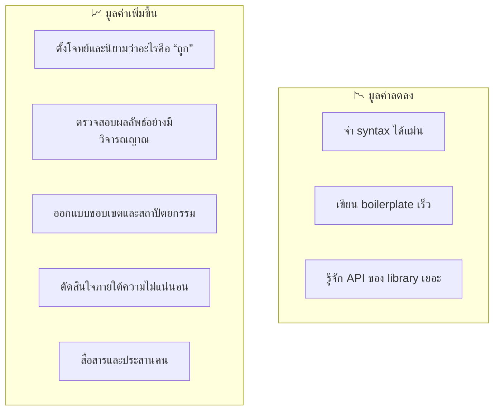
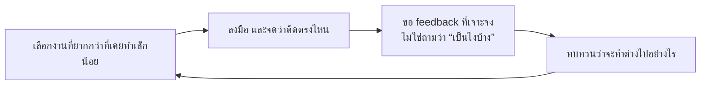

# How to be a Senior Software Engineer

> ⚠️ **หมายเหตุก่อนอ่าน:** เอกสารฉบับนี้สร้างขึ้นโดย **Claude Opus 5** จึงอาจมีเนื้อหาที่คลาดเคลื่อน
> ตกหล่น หรือล้าสมัยได้ ให้ใช้วิจารณญาณในการอ่าน ตรวจสอบย้อนกลับไปยังเอกสารอ้างอิงท้ายบท
> และเปรียบเทียบกับแหล่งข้อมูลอื่นประกอบเสมอ — การตั้งคำถามกับสิ่งที่อ่าน
> คือส่วนหนึ่งของการฝึก **critical thinking** ในวิชานี้

> **เชื่อมกับ loop ของวิชา:** ความเป็น senior วัดกันที่ **ขนาดของ loop ที่คุณรับผิดชอบได้เอง**
> junior ปิด loop ของ task, senior ปิด loop ของทั้งระบบ ตั้งแต่โจทย์จนถึงของที่ผู้ใช้ใช้จริง

---

## 🎯 อ่านจบแล้วจะได้อะไร

| สิ่งที่จะทำได้ | ใช้ในงานจริงอย่างไร |
|---|---|
| บอกได้ว่า senior วัดกันที่อะไรจริง ๆ ไม่ใช่ที่จำนวนปี | ทำให้วางแผนพัฒนาตัวเองได้ตรงจุดตั้งแต่ปีแรกของการทำงาน |
| แปลงโจทย์ที่คลุมเครือให้กลายเป็นงานที่ทำได้ | เป็นทักษะที่แยก senior ออกจาก mid ได้ชัดที่สุด |
| เขียนเอกสารออกแบบและอธิบาย trade-off ให้คนอื่นตัดสินใจได้ | อิทธิพลของวิศวกรระดับสูงมาจากงานเขียน มากกว่าจาก code ที่เขียนเอง |
| ทำ code review ที่ยกระดับคนอื่นแทนที่จะทำให้คนกลัว | review คือช่องทางการสอนที่มีต้นทุนต่ำที่สุดในทีม |
| รับผิดชอบระบบตอนมันพัง ไม่ใช่แค่ตอนมันทำงานได้ | องค์กรวัดความไว้วางใจจากพฤติกรรมในวันที่แย่ที่สุด |
| ทำงานกับ AI โดยที่ความเข้าใจของตัวเองไม่ลดลง | เป็นเงื่อนไขที่จะกำหนดว่าใครโตต่อได้ในอีก 5 ปีข้างหน้า |

---

## 📖 ศัพท์ที่ต้องรู้ก่อนเริ่ม

| ศัพท์ | ความหมายในบริบทของวิชานี้ |
|---|---|
| **Scope** | ขนาดของสิ่งที่คุณรับผิดชอบได้โดยไม่ต้องมีคนคอยกำกับ |
| **Impact** | ผลลัพธ์ที่เกิดกับผู้ใช้หรือธุรกิจ ไม่ใช่ปริมาณงานที่ทำ |
| **IC track** | เส้นทางเติบโตแบบ Individual Contributor — โตโดยไม่ต้องเป็นหัวหน้าคน |
| **Staff / Principal** | ระดับเหนือ senior บนเส้นทาง IC ที่ขอบเขตกว้างระดับหลายทีมขึ้นไป |
| **Design doc / RFC** | เอกสารที่เสนอแนวทางแก้ปัญหาเพื่อให้คนอื่นตรวจสอบก่อนลงมือ |
| **Glue work** | งานที่ทำให้ทีมเดินได้ แต่ไม่ปรากฏเป็น feature เช่น ประสานงาน เขียนเอกสาร แก้ของเสีย |
| **Disagree and commit** | ไม่เห็นด้วยแต่เมื่อทีมตัดสินใจแล้วก็ทุ่มเทให้เต็มที่ |
| **Bus factor** | จำนวนคนที่ถ้าหายไปพร้อมกันแล้วงานเดินต่อไม่ได้ |
| **Yak shaving** | การไล่แก้ปัญหาย่อยซ้อนกันไปเรื่อย ๆ จนลืมเป้าหมายเดิม |
| **Bikeshedding** | การถกเถียงยืดยาวกับเรื่องเล็กที่ทุกคนมีความเห็น แทนที่จะคุยเรื่องใหญ่ที่ยาก |
| **Blast radius** | ขอบเขตความเสียหายถ้าสิ่งที่กำลังทำผิดพลาด |
| **Deliberate practice** | การฝึกที่ตั้งใจฝึกจุดอ่อนโดยเฉพาะ พร้อมมี feedback ทันที |

---

## 1. Senior ไม่ได้วัดที่จำนวนปี

ความเข้าใจผิดที่พบบ่อยที่สุดคือคิดว่า senior = ทำงานมานาน หรือ = เขียน code เก่ง
ทั้งสองอย่างไม่ผิดทั้งหมด แต่ไม่ใช่สิ่งที่องค์กรวัด



**เกณฑ์ที่ใช้จริงในการเลื่อนระดับ** สรุปได้เป็น 3 แกน

| แกน | Junior | Mid | Senior |
|---|---|---|---|
| **ความคลุมเครือที่รับได้** | ต้องมีคนบอกว่าทำอะไรและทำอย่างไร | บอกว่าทำอะไร แล้วหาวิธีเองได้ | รับปัญหาที่ยังไม่มีใครนิยาม แล้วแปลงเป็นงานได้ |
| **ขอบเขตผลกระทบ** | งานของตัวเอง | feature ของทีม | ระบบ, กระบวนการ และคนรอบตัว |
| **สิ่งที่ต้องมีคนตรวจ** | เกือบทุกอย่าง | การตัดสินใจใหญ่ | เฉพาะเรื่องที่กระทบข้ามทีม |

**คำจำกัดความที่ใช้ได้ในทางปฏิบัติ:**
senior คือคนที่ *หัวหน้าไม่ต้องกังวลว่างานจะออกมาเป็นอย่างไร* —
ไม่ใช่เพราะเขาทำเองทั้งหมด แต่เพราะเขาจะยกมือถามให้ทันเวลาเมื่อมีเรื่องต้องตัดสินใจ

> 💼 **จากหน้างานจริง**
> มีคนทำงาน 10 ปีที่ยังเป็น mid และมีคนทำงาน 3 ปีที่เป็น senior แล้ว
> ความต่างมักไม่ได้อยู่ที่ความสามารถ แต่อยู่ที่ **ประเภทของงานที่เคยเจอ** —
> คนที่ทำ feature เดิม ๆ ซ้ำ 10 ปี ได้ประสบการณ์ 1 ปี คูณ 10
> การเลือกงานที่ยังไม่เคยทำจึงเป็นการลงทุนกับตัวเอง

---

## 2. ทักษะทางเทคนิคที่เปลี่ยนไปเมื่อขึ้นระดับ

### 2.1 อ่าน code สำคัญกว่าเขียน code

วิศวกรใช้เวลาอ่าน code มากกว่าเขียนหลายเท่า และยิ่งอาวุโสยิ่งอ่านมาก
ทักษะที่ควรฝึกโดยตรง:

- เข้าไปใน repo ที่ไม่เคยเห็น แล้วหา "ทางเข้า" ของระบบให้เจอภายใน 30 นาที
- ไล่เส้นทางของ 1 คำขอตั้งแต่ HTTP เข้ามาจนถึง database
- อ่าน commit history เพื่อเข้าใจว่า *ทำไม* code ถึงเป็นแบบนี้ ไม่ใช่แค่ว่ามันเป็นอะไร

**เทคนิคที่ใช้ได้ทันที:** เมื่อเข้า repo ใหม่ ให้เริ่มจาก 3 ไฟล์เสมอ —
`README`, ไฟล์ที่กำหนดเส้นทาง (route/urls) และไฟล์ที่กำหนด schema ของข้อมูล
สามอย่างนี้ตอบได้ว่า "ระบบนี้ทำอะไร รับอะไรเข้ามา และเก็บอะไรไว้"

### 2.2 ดีบักอย่างเป็นระบบ ไม่ใช่ด้วยการเดา



สิ่งที่ทำให้ต่างจาก junior ไม่ใช่ความเร็ว แต่คือ **การไม่ข้ามขั้น**
junior มักกระโดดจาก "เห็นอาการ" ไป "แก้ตรงที่เดาว่าเป็น" ซึ่งบางครั้งก็ถูก
แต่เมื่อผิดจะเสียเวลามหาศาลและมักทิ้งของเสียไว้ใน code

**คำถามที่ต้องตอบได้ก่อนปิดงาน:** *"ทำไมมันถึงเพิ่งพังตอนนี้"*
ถ้าตอบไม่ได้ แปลว่ายังไม่เจอสาเหตุราก แค่ทำให้อาการหายไปเท่านั้น

### 2.3 ออกแบบเผื่อการเปลี่ยนแปลง ไม่ใช่เผื่อทุกกรณี

junior มักออกแบบเผื่อทุกความเป็นไปได้ ทำให้ระบบยืดหยุ่นจนไม่มีใครเข้าใจ
senior ออกแบบให้ **เปลี่ยนตรงที่มีแนวโน้มจะเปลี่ยนได้ง่าย** และยอมให้ส่วนที่เหลือแข็งไว้

หลักที่ใช้ตัดสิน:

| คำถาม | ถ้าตอบว่า "ใช่" |
|---|---|
| มีคนขอเปลี่ยนเรื่องนี้มาแล้วอย่างน้อย 2 ครั้งไหม | คุ้มที่จะทำให้ยืดหยุ่น |
| เปลี่ยนทีหลังแล้วต้องรื้อข้อมูลไหม | ต้องคิดให้ดีตั้งแต่แรก |
| ยังไม่มีใครขอ แต่เราคิดว่าน่าจะมีวันนั้น | อย่าเพิ่งทำ — จดไว้ใน backlog |

### 2.4 รับผิดชอบระบบตอนมันอยู่บน production

เส้นแบ่งที่ชัดที่สุดเส้นหนึ่งคือ **คุณสนใจ code ของตัวเองหลังจาก merge แล้วหรือเปล่า**

สิ่งที่ senior ทำโดยอัตโนมัติ:

- ก่อนปล่อยของ: รู้ว่าถ้าพังจะย้อนกลับอย่างไร และใช้เวลาเท่าไร
- หลังปล่อยของ: เปิดดู log และ metric ว่าของใหม่ทำงานอย่างที่คิดไหม
- เมื่อมีเหตุ: สื่อสารสถานะให้คนอื่นรู้ระหว่างแก้ ไม่ใช่เงียบแล้วโผล่มาตอนแก้เสร็จ
- หลังเหตุการณ์: เขียนบันทึกที่หาสาเหตุเชิงระบบ ไม่ใช่หาคนผิด

---

## 3. ทักษะที่ไม่ใช่เทคนิค — และเป็นตัวตัดสินจริง

### 3.1 การเขียน คือเครื่องมือขยายอิทธิพลที่สำคัญที่สุด

code ที่คุณเขียนส่งผลกับระบบเดียว แต่เอกสารที่คุณเขียนส่งผลกับทุกคนที่อ่าน
และยังส่งผลต่อไปแม้คุณย้ายทีมไปแล้ว

**โครงสร้าง design doc ที่ใช้ได้ทันที**

```markdown
## ปัญหา
[อธิบายปัญหาโดยไม่พูดถึงทางแก้เลย — ถ้าเขียนส่วนนี้ไม่ได้ แปลว่ายังไม่เข้าใจปัญหา]

## ทำไมต้องแก้ตอนนี้
[ต้นทุนของการไม่ทำอะไร]

## ข้อจำกัด
[เวลา คน ระบบเดิม ข้อกำหนดทางกฎหมาย]

## ทางเลือกที่พิจารณา
| ทางเลือก | ได้อะไร | เสียอะไร | ประเมินความพยายาม |
|---|---|---|---|

## ข้อเสนอ
[เลือกอันไหน และเพราะอะไร]

## สิ่งที่ยังไม่รู้ และจะรู้ได้อย่างไร
[คำถามเปิดที่ต้องการความเห็น — ส่วนนี้ทำให้คนอยาก review]

## แผนย้อนกลับ
[ถ้าทำแล้วผิด จะถอยอย่างไร]
```

หัวข้อ **"สิ่งที่ยังไม่รู้"** เป็นตัวแยกเอกสารของ senior ออกจากเอกสารทั่วไป
เพราะการยอมรับว่าไม่รู้อะไรบ้างคือสิ่งที่ทำให้คนอื่นช่วยได้ถูกจุด

### 3.2 Code review ที่ยกระดับคน



**หลักที่ใช้ได้จริง**

- แยกให้ชัดว่าอันไหนคือ *ต้องแก้* อันไหนคือ *ความชอบส่วนตัว* — ใส่คำว่า "nit:" นำหน้าเรื่องเล็ก
- comment ที่ปัญหา ไม่ใช่ที่คน: "ตรงนี้จะพังเมื่อ list ว่าง" ไม่ใช่ "คุณลืมเช็ค"
- ถ้าจะปฏิเสธแนวทางทั้งหมด ให้คุยด้วยเสียงแทนการเขียนยาว — ข้อความยาวในหน้า review อ่านเหมือนการโจมตี
- ชมของที่ดีด้วย ไม่ใช่ชี้แต่ข้อผิด
- อย่าปล่อย PR ค้าง — การ review ช้าเป็นการเพิ่ม latency ให้ loop ของทั้งทีม

### 3.3 พูดว่า "ไม่" อย่างมืออาชีพ

การรับทุกอย่างที่ถูกขอไม่ใช่ความขยัน แต่คือการทำให้ทีมทำทุกอย่างได้ไม่ดีสักอย่าง

> ❌ "ทำไม่ได้ครับ ไม่มีเวลา"
> ✅ "รับได้ครับ ถ้าเลื่อนงาน A ไปสัปดาห์หน้า — หรือถ้า A สำคัญกว่า
>   ผมทำเวอร์ชันย่อของสิ่งนี้ให้ก่อนได้ภายในวันศุกร์ อยากให้เลือกทางไหนครับ"

รูปแบบคือ **ไม่ปฏิเสธงาน แต่ทำให้ต้นทุนปรากฏ แล้วให้คนที่มีอำนาจเป็นคนเลือก**

### 3.4 ทำให้คนรอบตัวเก่งขึ้น

ตัวคูณที่แท้จริงของ senior ไม่ได้อยู่ที่ผลงานของตัวเอง



**ข้อควรระวังเรื่อง glue work:** งานประสาน งานเอกสาร งานแก้ของเสีย
เป็นงานที่จำเป็นแต่มักไม่ปรากฏในการประเมิน
ถ้าคุณทำงานประเภทนี้เยอะ ต้อง **ทำให้มันมองเห็นได้** —
บันทึกไว้ พูดถึงในการประเมิน และตรวจว่ามันไม่ได้กินเวลาจนคุณไม่ได้ทำงานเชิงเทคนิคเลย
เพราะนั่นจะทำให้ติดอยู่ที่ระดับเดิมทั้งที่ทำงานหนักมาก

---

## 4. การตัดสินใจ — หัวใจของความอาวุโส

### 4.1 แยกประตูทางเดียวออกจากประตูสองทาง



ความผิดพลาดที่พบบ่อยในทีมคือ **สลับกัน** — ใช้เวลาสองชั่วโมงเถียงเรื่องชื่อตัวแปร
แล้วเลือกฐานข้อมูลในสิบนาที

### 4.2 ตอบ "แล้วแต่กรณี" อย่างมีประโยชน์

คำตอบว่า "it depends" ไม่ผิด แต่จะไร้ประโยชน์ถ้าหยุดแค่นั้น
คำตอบของ senior ต้องระบุว่า **ขึ้นกับตัวแปรอะไร**

> ❌ "ใช้ SQL หรือ NoSQL ดี" → "แล้วแต่กรณี"
> ✅ "ขึ้นกับ 3 อย่าง: ข้อมูลต้อง join ข้ามหลายตารางบ่อยไหม, schema จะเปลี่ยนบ่อยแค่ไหน,
>   และทีมเราคุ้นกับอะไร — ถ้าตอบสามข้อนี้ได้ ผมตอบได้ทันที"

### 4.3 คิดถึง blast radius ก่อนลงมือเสมอ

ก่อนแตะอะไรที่อยู่บน production ให้ตอบ 3 คำถามนี้ให้ได้:

1. ถ้าสิ่งนี้ผิด ใครได้รับผลกระทบและกี่คน
2. เราจะรู้ได้เร็วแค่ไหนว่ามันผิด
3. ย้อนกลับใช้เวลาเท่าไร และเคยซ้อมหรือยัง

ถ้าข้อ 2 ตอบว่า "รอผู้ใช้แจ้ง" แปลว่ายังไม่ควรทำจนกว่าจะมีสัญญาณที่ดีกว่านั้น

---

## 5. ความเข้าใจธุรกิจ — สิ่งที่นักศึกษามักข้าม

วิศวกรที่ไม่รู้ว่าองค์กรหาเงินอย่างไร จะจัดลำดับความสำคัญผิดโดยไม่รู้ตัว

**คำถามที่ควรตอบได้ภายในเดือนแรกของการทำงาน**

- องค์กรนี้หารายได้จากอะไร และส่วนไหนของระบบเกี่ยวข้องกับรายได้โดยตรง
- ใครคือผู้ใช้จริง และตอนนี้เขาเจ็บปวดกับอะไรมากที่สุด
- ตัวเลขไหนที่ผู้บริหารดูทุกสัปดาห์
- ถ้าระบบส่วนที่ฉันดูแลล่ม 1 ชั่วโมง เกิดอะไรขึ้นกับธุรกิจ



**ทักษะที่ต้องฝึกคือการเชื่อมสามกล่องนี้ให้ได้** — เพราะข้อเสนอทางเทคนิคที่เชื่อมถึงกล่องขวาสุดได้
จะได้รับอนุมัติ ส่วนข้อเสนอที่หยุดอยู่ที่กล่องซ้ายมักถูกเลื่อนออกไปเรื่อย ๆ

> 💼 **จากหน้างานจริง**
> ประโยคที่ทำให้ข้อเสนอเรื่องการจ่ายหนี้ทางเทคนิคผ่านง่ายที่สุดไม่ใช่
> "code มันแย่มาก" แต่คือ *"ตอนนี้ทุก feature ในส่วนนี้ใช้เวลามากกว่าที่ควร 40%
> ถ้าลงทุน 5 วันแก้ตอนนี้ จะได้คืนภายในสองเดือน"*

---

## 6. เป็น senior ในยุคที่ AI เขียน code ได้

### 6.1 อะไรที่ค่าลดลง และอะไรที่ค่าเพิ่มขึ้น



สิ่งที่มูลค่าลดลงล้วนเป็น *accidental complexity* ส่วนที่มูลค่าเพิ่มขึ้นล้วนเป็น *essence*

### 6.2 กติกาการทำงานกับ AI ที่ไม่ทำให้ตัวเองแย่ลง

| กติกา | เหตุผล |
|---|---|
| **อ่านทุกบรรทัดที่จะ commit และอธิบายได้** | ถ้าอธิบายไม่ได้ วันที่มันพังคุณจะแก้ไม่ได้ |
| **กำหนดเกณฑ์ว่าอะไรคือ "ถูก" ก่อนเริ่มถาม** | ไม่งั้นคุณจะรับคำตอบแรกที่ดูสมเหตุสมผล |
| **ให้ AI เสนอทางเลือกหลายทาง แทนที่จะขอคำตอบเดียว** | ทำให้เห็น trade-off แทนที่จะเห็นแค่ข้อสรุป |
| **ห้ามให้มันแก้ test เพื่อให้ผ่าน** | เป็นการทำลายสัญญาณที่เราสร้างไว้ |
| **ในเรื่องที่ยังไม่เก่ง ให้ลองเองก่อนแล้วค่อยเทียบ** | การข้ามขั้นการดิ้นรนทำให้ทักษะไม่ก่อตัว |
| **ไม่วางข้อมูลลับหรือข้อมูลผู้ใช้ลงในเครื่องมือภายนอก** | เป็นเรื่องกฎหมาย ไม่ใช่เรื่องความสะดวก |

**ประเด็นที่สำคัญที่สุดสำหรับคนที่กำลังเริ่มต้น:** ทางลัดที่ AI ให้
มีประโยชน์มากกับคนที่รู้อยู่แล้วว่าคำตอบที่ดีหน้าตาเป็นอย่างไร
และอันตรายกับคนที่ยังไม่รู้ เพราะเขาจะไม่มีวันรู้ว่าคำตอบนั้นแย่

วิธีใช้ให้ปลอดภัยคือ **สลับโหมด** — งานที่ต้องส่งใช้ AI ช่วยได้เต็มที่
แต่ต้องกันเวลาส่วนหนึ่งไว้ทำเองล้วน ๆ เพื่อให้ทักษะยังโต

### 6.3 หน้าที่ใหม่ของ senior ในทีมที่ใช้ AI

- ออกแบบ **บริบท** ที่ทีมและ agent ใช้ร่วมกัน เช่น มาตรฐาน กฎการออกแบบ ตัวอย่างที่ดี
- ขยายความจุของขั้น **ตรวจสอบ** ให้ทันกับปริมาณ code ที่เพิ่มขึ้น
- ปกป้องไม่ให้ junior ในทีมข้ามขั้นการเรียนรู้จนไม่โต
- ตั้งเส้นว่าอะไรที่ agent ทำเองได้ และอะไรต้องมีคนอนุมัติก่อน

---

## 7. Anti-pattern ที่ทำให้ติดอยู่ที่เดิม

| Anti-pattern | อาการ | ทำไมถึงเป็นปัญหา |
|---|---|---|
| **ฮีโร่** | แก้ทุกวิกฤตด้วยตัวคนเดียวตอนตีสาม | องค์กรจะพึ่งคุณแทนที่จะแก้ระบบ และคุณจะหมดไฟ |
| **ฉลาดเกินจำเป็น** | เขียน code ที่หรูหราแต่ไม่มีใครอ่านออก | code ถูกอ่านมากกว่าถูกเขียนหลายเท่า |
| **ผู้เฝ้าประตู** | ทุกอย่างต้องผ่านฉันก่อน | ตัวเองกลายเป็นคอขวดของทีม |
| **ถกเรื่องเล็กจนลืมเรื่องใหญ่** | ใช้เวลากับรูปแบบการจัดโค้ดมากกว่าการออกแบบข้อมูล | เวลาไปหมดกับเรื่องที่ผลกระทบน้อย |
| **เงียบทั้งที่ไม่เห็นด้วย** | ไม่พูดในห้องประชุม แล้วบ่นทีหลัง | ทีมตัดสินใจโดยขาดข้อมูลที่คุณมี |
| **สมบูรณ์แบบนิยม** | ไม่ยอมปล่อยของจนกว่าจะไร้ที่ติ | ของที่ไม่ถึงมือผู้ใช้ มีมูลค่าเป็นศูนย์ |
| **ไม่ได้คิดเองไม่เอา** | เขียนทุกอย่างเองแทนที่จะใช้ของสำเร็จ | ใช้เวลากับปัญหาที่คนแก้ไปแล้ว |

---

## 8. แผนพัฒนาตัวเองที่ทำได้จริง

### 8.1 วงจรการเติบโต



**วิธีขอ feedback ที่ได้ผล:** อย่าถามว่า "ผมทำเป็นอย่างไรบ้างครับ"
แต่ถามว่า *"ถ้าให้ผมทำงานนี้ใหม่อีกครั้ง มีอะไรที่พี่จะทำต่างจากผม 1 อย่าง"*
คำถามที่เจาะจงได้คำตอบที่ใช้ได้

### 8.2 สิ่งที่ทำได้ตั้งแต่ยังเรียนอยู่

- [ ] เข้าไปอ่าน code ของโครงการ open source ที่ใช้จริง แล้วไล่ให้ได้ว่า 1 คำขอเดินอย่างไร
- [ ] เขียนเอกสารออกแบบก่อนลงมือทำ feature ที่ใหญ่กว่าปกติ 1 ชิ้น
- [ ] ทำ code review ให้เพื่อนในกลุ่มโดยใช้หลักในหัวข้อ 3.2
- [ ] เป็นคนที่ deploy และเฝ้าดูผลหลัง deploy อย่างน้อย 1 ครั้ง
- [ ] ทำ postmortem ของเหตุการณ์ที่ทีมพลาด โดยไม่ระบุตัวคน
- [ ] อธิบาย trade-off ของการตัดสินใจหนึ่งเรื่องให้คนนอกกลุ่มฟังจนเขาเข้าใจ
- [ ] จดเวลาจริงเทียบกับที่ประมาณไว้ ต่อเนื่อง 1 เทอม
- [ ] สอนเรื่องที่ตัวเองเพิ่งเรียนให้เพื่อน — เป็นวิธีตรวจความเข้าใจที่โหดที่สุด

### 8.3 สัญญาณที่บอกว่ากำลังไปถูกทาง

| สัญญาณ | ความหมาย |
|---|---|
| มีคนมาถามความเห็นก่อนตัดสินใจ | คนเชื่อในวิจารณญาณของคุณ |
| งานที่ได้รับเริ่มคลุมเครือขึ้น | หัวหน้าเชื่อว่าคุณนิยามงานเองได้ |
| คุณเริ่มกังวลเรื่องผลกระทบมากกว่าเรื่อง code | มุมมองขยับจาก task ไปสู่ระบบ |
| คนอื่นใช้เอกสารหรือเครื่องมือที่คุณทำไว้ | ผลงานเริ่มขยายเกินตัวคุณเอง |
| คุณพูดว่า "ไม่" ได้โดยไม่รู้สึกผิด | เข้าใจแล้วว่าลำดับความสำคัญคือหน้าที่ |

---

## 📚 เอกสารอ้างอิง

**เส้นทางอาชีพและระดับ**
- Will Larson — *StaffEng* รวมเรื่องเล่าและกรอบของเส้นทาง IC ระดับ staff ขึ้นไป
  (https://staffeng.com/)
- Will Larson — *An Elegant Puzzle: Systems of Engineering Management*
- Camille Fournier — *The Manager's Path* — มีบทที่อธิบายบทบาท tech lead อย่างละเอียด
- Progression.fyi — รวม career ladder ที่บริษัทจริงเปิดเผยต่อสาธารณะ
  (https://www.progression.fyi/)
- Dropbox — Engineering Career Framework (https://dropbox.github.io/dbx-career-framework/)

**การทำงานร่วมกันและอิทธิพล**
- Tanya Reilly — *Being Glue* (https://noidea.dog/glue)
- Google — *Engineering Practices: Code Review Developer Guide*
  (https://google.github.io/eng-practices/review/)
- Google — *re:Work* งานวิจัยเรื่องปัจจัยที่ทำให้ทีมทำงานได้ดี
  (https://rework.withgoogle.com/)
- Amazon — แนวคิด two-way door และ disagree and commit ใน Shareholder Letter ปี 2015–2016
  (https://www.aboutamazon.com/news/company-news/2016-letter-to-shareholders)

**การทำงานกับระบบจริง**
- Google — *Site Reliability Engineering* (https://sre.google/books/)
- Google — *Software Engineering at Google* (https://abseil.io/resources/swe-book)
- Michael Feathers — *Working Effectively with Legacy Code*
- Titus Winters, Tom Manshreck, Hyrum Wright — บทว่าด้วยความต่างระหว่าง
  *programming* กับ *software engineering* ในหนังสือข้างต้น

**หลักฐานเรื่องผลของ AI ต่อการทำงานของวิศวกร**
- METR — *Measuring the Impact of Early-2025 AI on Experienced Open-Source Developer
  Productivity* (https://metr.org/blog/2025-07-10-early-2025-ai-experienced-os-dev-study/)
- DORA — *Accelerate State of DevOps Report* (https://dora.dev/)
