# วิศวกรซอฟต์แวร์ยุคใหม่ — 4 คุณสมบัติที่องค์กรมองหา

> ⚠️ **หมายเหตุก่อนอ่าน:** เอกสารฉบับนี้สร้างขึ้นโดย **Claude Opus 5** จึงอาจมีเนื้อหาที่คลาดเคลื่อน
> ตกหล่น หรือล้าสมัยได้ ให้ใช้วิจารณญาณในการอ่าน ตรวจสอบย้อนกลับไปยังเอกสารอ้างอิงท้ายบท
> และเปรียบเทียบกับแหล่งข้อมูลอื่นประกอบเสมอ — การตั้งคำถามกับสิ่งที่อ่าน
> คือส่วนหนึ่งของการฝึก **critical thinking** ในวิชานี้

> **เชื่อมกับ loop ของวิชา:** ทั้งสี่คุณสมบัตินี้คือคำอธิบายว่า **loop ที่ดีให้ผลอะไรกับองค์กร** —
> พร้อมรับของใหม่ได้เร็ว, ทำในสิ่งที่มีคุณค่าจริง, ไม่เผาทรัพยากรทิ้ง และไม่ล้มเมื่อเจอแรงกระแทก

---

## 🎯 อ่านจบแล้วจะได้อะไร

| สิ่งที่จะทำได้ | ใช้ในงานจริงอย่างไร |
|---|---|
| อธิบายได้ว่าองค์กรวัดคุณค่าของวิศวกรจากอะไรในปี 2026 | ทำให้เลือกลงแรงกับสิ่งที่ถูกตั้งแต่ต้น แทนที่จะเก่งในเรื่องที่ไม่มีใครวัด |
| เรียนเทคโนโลยีใหม่ได้เร็วโดยไม่ต้องรอให้มีคนสอน | เทคโนโลยีที่คุณใช้ตอนจบ จะไม่ใช่ตัวที่คุณใช้ในอีก 5 ปี |
| เชื่อมงานเทคนิคเข้ากับตัวเลขทางธุรกิจได้ | ข้อเสนอที่เชื่อมถึงธุรกิจได้จะถูกอนุมัติ ที่เหลือจะถูกเลื่อน |
| ประเมินต้นทุนรวมของทางเลือกทางเทคนิค | องค์กรจ่ายค่าคนแพงกว่าค่าเครื่อง — การประหยัดผิดที่ทำให้แพงกว่าเดิม |
| ออกแบบระบบให้เสียหายเป็นวงจำกัดเมื่อมีอะไรพัง | ไม่มีระบบไหนไม่พัง มีแต่ระบบที่พังแล้วฟื้นเร็วกับพังแล้วจบกัน |

---

## 📖 ศัพท์ที่ต้องรู้ก่อนเริ่ม

| ศัพท์ | ความหมายในบริบทของวิชานี้ |
|---|---|
| **Challenge-ready** | พร้อมรับโจทย์ที่ไม่เคยเจอ โดยไม่ต้องรอให้มีคนมาสอนก่อน |
| **Business-centric** | ตัดสินใจโดยอ้างอิงคุณค่าที่เกิดกับผู้ใช้และธุรกิจ ไม่ใช่ความชอบทางเทคนิค |
| **Cost-effective** | ได้ผลลัพธ์ที่ต้องการด้วยต้นทุนรวมที่ต่ำที่สุดเท่าที่ยอมรับได้ |
| **Resilience** | ความสามารถของระบบในการทำงานต่อได้และฟื้นตัวได้เมื่อมีบางส่วนล้มเหลว |
| **TCO** | Total Cost of Ownership — ต้นทุนตลอดอายุ ไม่ใช่แค่ต้นทุนตอนสร้าง |
| **Unit economics** | ต้นทุนและรายได้ต่อหนึ่งหน่วยการใช้งาน เช่น ต่อ 1 คำขอ ต่อ 1 ผู้ใช้ |
| **FinOps** | การบริหารต้นทุนคลาวด์ให้เป็นความรับผิดชอบร่วมของทีมวิศวกรรม |
| **Blast radius** | ขอบเขตความเสียหายเมื่อบางอย่างล้มเหลว |
| **Graceful degradation** | ระบบยอมลดความสามารถบางส่วนเพื่อรักษาส่วนสำคัญไว้ |
| **SLI / SLO** | ตัวชี้วัดระดับบริการ และเป้าหมายที่ตกลงกันไว้ |
| **Error budget** | ปริมาณความล้มเหลวที่ยอมรับได้ในช่วงเวลาหนึ่ง ตามที่ SLO กำหนด |
| **MTTR** | เวลาเฉลี่ยที่ใช้ในการกู้คืนบริการหลังเกิดเหตุ |
| **Chaos engineering** | การจงใจสร้างความล้มเหลวในสภาพควบคุมได้ เพื่อพิสูจน์ว่าระบบทนได้จริง |
| **Complexity budget** | งบความซับซ้อนที่ทีมรับไหว — ใช้หมดแล้วทุกอย่างจะช้าลง |

---

## 1. ทำไมนิยามของ "วิศวกรที่เก่ง" ถึงเปลี่ยน

ในยุคที่การเขียน code ต้องใช้ความพยายามสูง คนที่เขียนได้เร็วและถูกคือคนที่มีค่าที่สุด
แต่เมื่อขั้นตอนนั้นถูกลงเรื่อย ๆ ด้วยเครื่องมือ คลาวด์ open source และ AI
**คอขวดขององค์กรย้ายไปอยู่ที่อื่น**

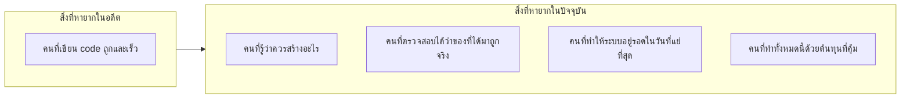

สี่คุณสมบัติที่จะพูดถึงต่อไปนี้ ไม่ใช่คำสวยหรูในประกาศรับสมัครงาน
แต่คือสี่คำถามที่ผู้บริหารถามจริงเมื่อประเมินทีมวิศวกรรม

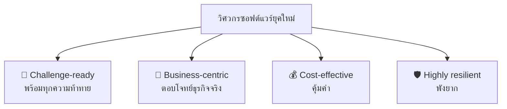

---

## 2. 🧗 Challenge-ready — พร้อมทุกความท้าทาย

### 2.1 ความหมายที่แท้จริง

ไม่ได้แปลว่า "รู้ทุกเทคโนโลยี" ซึ่งเป็นไปไม่ได้
แต่แปลว่า **เจอของที่ไม่เคยเห็น แล้วยังทำงานให้เสร็จได้ในเวลาที่ยอมรับได้**

องค์กรวัดสิ่งนี้จากพฤติกรรม 3 อย่าง

| พฤติกรรม | คนที่ยังไม่พร้อม | คนที่พร้อม |
|---|---|---|
| เจอ error ที่ไม่เคยเห็น | รอถามคนอื่นทันที | อ่าน error ให้จบก่อน แล้วตั้งสมมติฐาน 2–3 ข้อ ทดสอบเอง แล้วค่อยถามพร้อมข้อมูลที่ลองมาแล้ว |
| ได้รับโจทย์ที่ไม่ชัด | รอให้มีคนทำให้ชัด | ไปคุยกับคนที่รู้ แล้วเขียนความเข้าใจของตัวเองกลับไปให้ยืนยัน |
| ต้องใช้ technology ที่ไม่เคยใช้ | คิดว่าต้องเรียนให้ครบก่อนถึงจะเริ่มได้ | หาส่วนที่จำเป็นต่อโจทย์ตอนนี้ ทำ spike สั้น ๆ แล้วขยายทีหลัง |

### 2.2 ฐานที่ไม่เปลี่ยน กับเปลือกที่เปลี่ยนตลอด

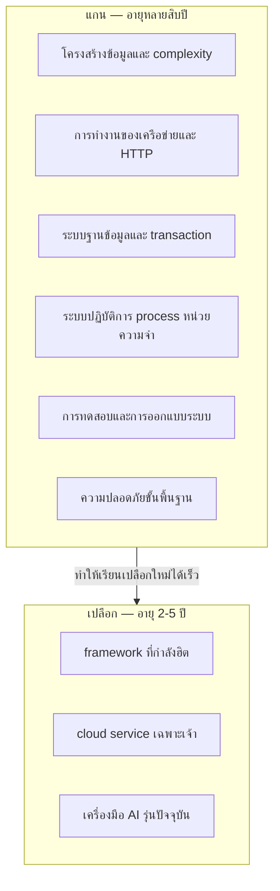

คนที่เข้าใจว่า HTTP ทำงานอย่างไร เรียน framework ตัวใหม่ได้ในสัปดาห์เดียว
คนที่รู้แค่วิธีใช้ framework ตัวเดิม ต้องเริ่มนับหนึ่งใหม่ทุกครั้งที่กระแสเปลี่ยน

**สัดส่วนการลงเวลาที่แนะนำสำหรับนักศึกษา:** ให้เวลากับแกนอย่างน้อยครึ่งหนึ่ง
แม้ว่าเปลือกจะเป็นสิ่งที่ทำให้ได้งานแรก แต่แกนคือสิ่งที่ทำให้ยังมีงานทำในอีก 10 ปี

### 2.3 T-shaped และวิธีสร้าง

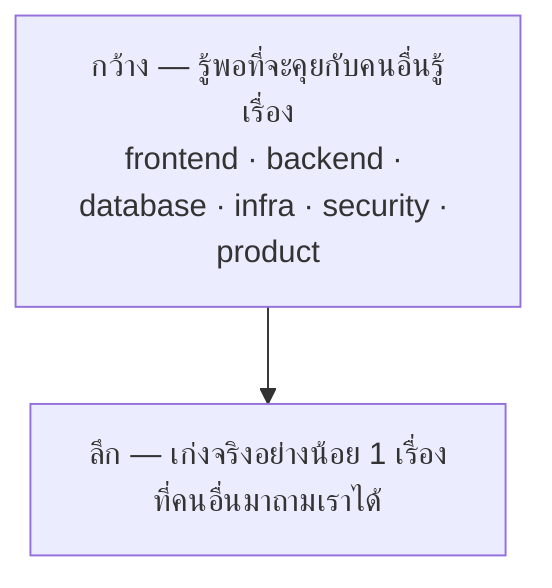

ความกว้างทำให้คุณ *มองเห็นปัญหาที่คนอื่นมองไม่เห็น* เพราะปัญหาที่แพงที่สุดมักอยู่ที่รอยต่อ
ความลึกทำให้คุณ *ได้รับความไว้วางใจ* เพราะทีมต้องการคนที่รับผิดชอบเรื่องนั้นได้จริง

### 2.4 วิธีเรียนที่ได้ผลจริง

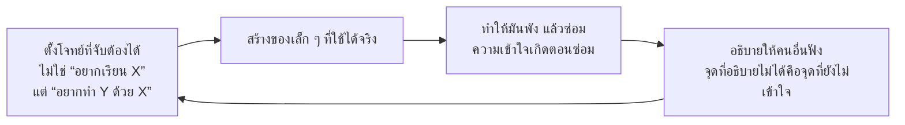

> 💼 **จากหน้างานจริง**
> คำถามยอดนิยมในการสัมภาษณ์คือ *"เล่าเรื่องที่คุณต้องเรียนอะไรใหม่เร็ว ๆ เพื่อแก้ปัญหาให้ฟังหน่อย"*
> สิ่งที่ผู้สัมภาษณ์ฟังไม่ใช่ว่าคุณเรียนอะไร แต่คือ **วิธีที่คุณตัดสินใจว่าจะเรียนแค่ไหนถึงพอ**
> คนที่ตอบว่า "อ่านเอกสารทั้งหมดให้จบก่อน" กับคนที่ตอบว่า
> "หาส่วนที่จำเป็นก่อน ทำต้นแบบ 2 ชั่วโมง แล้วค่อยขยาย" ให้สัญญาณต่างกันมาก

---

## 3. 💼 Business-centric — ตอบโจทย์ธุรกิจจริง

### 3.1 Output ไม่เท่ากับ Outcome

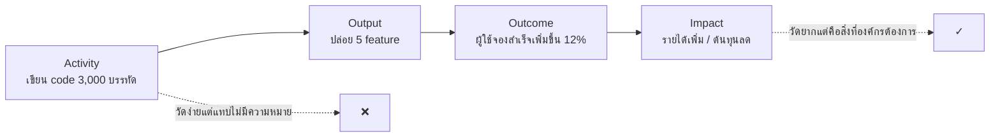

ทีมจำนวนมากวัดตัวเองที่กล่องซ้าย เพราะมันวัดง่าย
ผลคือ "ทำงานหนักมากแต่ไม่มีอะไรดีขึ้น" ซึ่งเป็นอาการที่พบบ่อยที่สุดในองค์กรขนาดกลาง

**คำถามที่ควรถามก่อนเริ่มทุก feature:**
*"ถ้า feature นี้สำเร็จ ตัวเลขไหนจะขยับ และเราจะรู้ได้อย่างไรว่ามันขยับเพราะสิ่งนี้"*
ถ้าตอบไม่ได้ แปลว่ายังไม่มีใครรู้ว่าทำไปทำไม

### 3.2 เข้าใจว่าองค์กรหาเงินอย่างไร

| ประเภทธุรกิจ | อะไรคือสิ่งสำคัญที่สุดทางเทคนิค |
|---|---|
| อีคอมเมิร์ซ | หน้าสินค้าและขั้นตอนชำระเงินต้องเร็วและห้ามล่ม |
| SaaS แบบสมัครสมาชิก | ความเสถียรและการรักษาผู้ใช้เดิม สำคัญกว่าฟีเจอร์ใหม่ |
| ระบบภายในองค์กร | ความถูกต้องของข้อมูลและการตรวจสอบย้อนหลัง |
| แพลตฟอร์มโฆษณา | ปริมาณการประมวลผลต่อต้นทุน |
| ระบบราชการ / มหาวิทยาลัย | ความน่าเชื่อถือในช่วงพีค เช่น วันลงทะเบียน |

สังเกตว่า *ข้อกำหนดทางเทคนิคที่ถูกต้อง ขึ้นกับรูปแบบธุรกิจทั้งหมด*
ไม่มีคำตอบสากลว่า "ต้องเร็ว" หรือ "ต้องขยายได้"

### 3.3 จัดลำดับความสำคัญเป็น

เครื่องมือที่ใช้ได้ทันทีและไม่ต้องมีข้อมูลมาก:

| วิธี | ใช้อย่างไร |
|---|---|
| **Cost of Delay** | ถามว่า "ถ้าเลื่อนสิ่งนี้ออกไป 1 เดือน เสียอะไร" — งานที่เสียมากที่สุดทำก่อน |
| **RICE** | Reach × Impact × Confidence ÷ Effort — บังคับให้เขียนความมั่นใจออกมาเป็นตัวเลข |
| **MoSCoW** | Must / Should / Could / Won't — เหมาะกับการล็อกขอบเขตของโครงการเรียน |
| **Opportunity cost** | ทุกครั้งที่ตอบตกลงกับงานหนึ่ง คือการตอบปฏิเสธกับงานอื่นเสมอ |

**สิ่งที่ต้องระวังที่สุดคือ "ทำทุกอย่างที่ถูกขอ"** —
ทีมที่ไม่เคยปฏิเสธอะไรเลยคือทีมที่ให้คนอื่นเป็นคนกำหนดลำดับความสำคัญแทน

### 3.4 พูดภาษาที่ผู้ฟังใช้

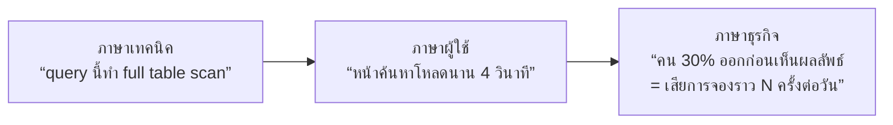

ทักษะนี้ไม่ใช่การ "ขายของ" แต่คือการทำให้คนที่มีอำนาจตัดสินใจ
มีข้อมูลพอที่จะตัดสินใจได้ถูก — ซึ่งเป็นหน้าที่ของวิศวกร ไม่ใช่ของฝ่ายอื่น

> 💼 **จากหน้างานจริง**
> วิศวกรที่โตเร็วที่สุดในองค์กรมักไม่ใช่คนที่เขียน code เก่งที่สุด
> แต่คือคนที่ **ผู้บริหารเรียกไปนั่งด้วยตอนตัดสินใจเรื่องใหญ่**
> เพราะเขาอธิบายทางเลือกทางเทคนิคเป็นผลลัพธ์ทางธุรกิจได้ โดยไม่ต้องให้ใครแปลให้

---

## 4. 💰 Cost-effective — คุ้มค่า

### 4.1 ต้นทุนที่มองไม่เห็นคือต้นทุนที่ใหญ่ที่สุด

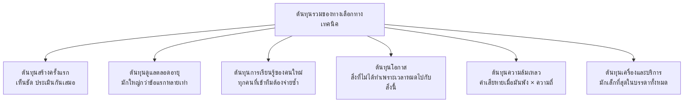

ข้อผิดพลาดที่พบบ่อยที่สุดคือ **ประหยัดที่กล่องล่างสุด แล้วจ่ายเพิ่มมหาศาลที่กล่องอื่น** —
เช่น เลือกเครื่องมือฟรีที่ไม่มีเอกสาร แล้วเสียเวลาทีมไปหลายสัปดาห์
ในองค์กรส่วนใหญ่ **เวลาของคนแพงกว่าค่าเครื่องมาก**

### 4.2 งบความซับซ้อน

ทุกทีมมี **complexity budget** ที่จำกัด ทุกครั้งที่เพิ่มบริการใหม่ ภาษาใหม่
หรือรูปแบบสถาปัตยกรรมใหม่ คุณกำลังใช้งบก้อนนี้

| สิ่งที่เพิ่มเข้ามา | ค่าใช้จ่ายที่ตามมาซึ่งมักไม่ถูกนับ |
|---|---|
| ภาษาใหม่ 1 ภาษา | ต้องมีคนดูแล, ต้องตั้ง CI ใหม่, ต้องมี linter/test ชุดใหม่, คนใหม่ต้องเรียนเพิ่ม |
| บริการใหม่ 1 ตัว | deploy, monitoring, alert, on-call, การจัดการเวอร์ชัน, การไล่ปัญหาข้ามระบบ |
| dependency ใหม่ 1 ตัว | ต้องอัปเดตตามเมื่อมีช่องโหว่, อาจถูกทิ้งร้าง, เพิ่มพื้นที่โจมตี |
| abstraction ใหม่ 1 ชั้น | ทุกคนที่อ่าน code ต้องเข้าใจมันก่อนถึงจะแก้อะไรได้ |

**หลักที่ใช้ตัดสิน:** เพิ่มความซับซ้อนได้ ถ้ามันแก้ปัญหาที่ *มีอยู่จริงตอนนี้*
ไม่ใช่ปัญหาที่คาดว่าจะมีในอนาคต

### 4.3 รู้ต้นทุนของสิ่งที่ตัวเองสร้าง

ทักษะที่กำลังกลายเป็นข้อกำหนดพื้นฐาน — วงการเรียกว่า **FinOps**

**สิ่งที่ควรตอบได้เกี่ยวกับระบบที่ตัวเองดูแล**

- ต้นทุนต่อเดือนของระบบนี้ประมาณเท่าไร และอะไรกินมากที่สุด
- ต้นทุนต่อ 1 คำขอ หรือต่อ 1 ผู้ใช้ ประมาณเท่าไร
- ถ้าผู้ใช้เพิ่มเป็น 10 เท่า ต้นทุนจะเพิ่มเป็นกี่เท่า — เชิงเส้นหรือแย่กว่านั้น
- มีทรัพยากรอะไรที่เปิดค้างไว้โดยไม่มีใครใช้บ้าง

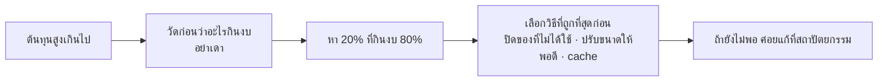

**กับดักในยุค AI:** ต้นทุนต่อคำขอของระบบที่เรียก LLM ไม่คงที่และสูงกว่าที่คิดมาก
ระบบที่ปล่อยให้ผู้ใช้ยิงได้ไม่จำกัดโดยไม่มีเพดาน อาจได้บิลที่ไม่คาดคิด
การนับ token และตั้งเพดานจึงเป็นงานวิศวกรรม ไม่ใช่งานบัญชี

### 4.4 คุ้มค่าไม่เท่ากับถูกที่สุด

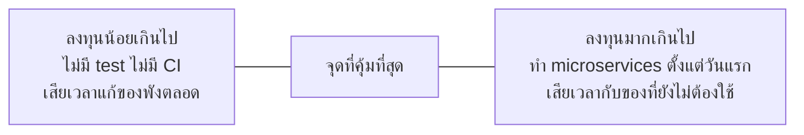

ทั้งสองด้านคือความสิ้นเปลืองเหมือนกัน
**การเขียน test คือตัวอย่างคลาสสิกของการลงทุนที่คุ้ม** เพราะมันลดต้นทุนกล่อง
"ค่าเสียหายเมื่อพัง" และ "ต้นทุนดูแลตลอดอายุ" ซึ่งเป็นสองกล่องที่ใหญ่ที่สุด

**หนี้ทางเทคนิคก็เป็นเครื่องมือทางการเงินอย่างหนึ่ง** —
การกู้มาเพื่อส่งของทันเป็นการตัดสินใจที่ถูกต้องได้ ถ้ารู้ตัวว่ากู้ และมีแผนจ่ายคืน
สิ่งที่อันตรายคือหนี้ที่ไม่มีใครรู้ว่ามีอยู่

---

## 5. 🛡️ Highly Resilient — พังยาก

### 5.1 เปลี่ยนคำถามจาก "จะไม่ให้พัง" เป็น "พังแล้วจะเป็นอย่างไร"

ระบบที่ทำงานตลอดเวลา 100% ไม่มีอยู่จริง
วิศวกรรมความน่าเชื่อถือจึงไม่ได้พยายามกำจัดความล้มเหลว แต่พยายาม **จำกัดผลของมัน**

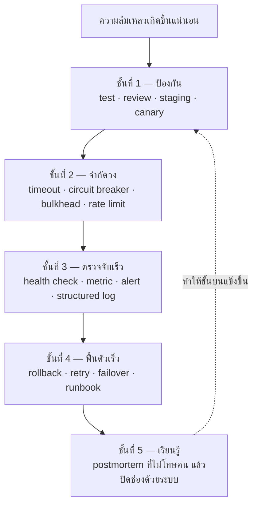

**ตัวชี้วัดที่บอกความจริงมากที่สุดคือ MTTR ไม่ใช่จำนวนครั้งที่ล่ม**
เพราะระบบที่ล่มบ่อยแต่ฟื้นใน 2 นาที สร้างความเสียหายน้อยกว่าระบบที่ล่มปีละครั้งแต่ล่มทั้งวัน

### 5.2 Resilience ในระดับ code

| สิ่งที่ต้องมี | ถ้าไม่มีจะเกิดอะไร |
|---|---|
| **Timeout ทุกการเรียกข้ามเครือข่าย** | ปลายทางช้า → connection ค้าง → ระบบเราล่มตามทั้งที่ตัวเองไม่ผิด |
| **Retry เฉพาะที่ปลอดภัย พร้อม backoff** | retry รัวใส่ระบบที่กำลังพัง = ซ้ำเติมให้พังหนักกว่าเดิม |
| **Idempotency** | ผู้ใช้กดซ้ำ หรือ retry อัตโนมัติ แล้วได้ข้อมูลซ้ำซ้อน |
| **การตรวจ input ที่ขอบระบบ** | ข้อมูลผิดรูปแบบไหลลึกเข้าไปจนเสียหายที่ฐานข้อมูล |
| **Fallback ที่มีความหมาย** | ฟีเจอร์รองล่ม แล้วลากทั้งหน้าจอล่มตาม |
| **การจัดการ error ที่ไม่กลืนความผิดพลาด** | ระบบพังเงียบ ๆ ไม่มีใครรู้จนผู้ใช้แจ้ง |

**Graceful degradation คือหัวใจ** — ต้องแยกให้ออกว่าอะไรคือแกนที่ห้ามล้ม
และอะไรคือส่วนเสริมที่ยอมปิดชั่วคราวได้ ระบบจองที่ส่งอีเมลไม่ได้ ยังต้องจองได้

### 5.3 Resilience ในระดับกระบวนการ

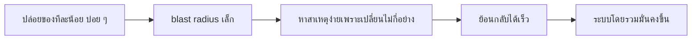

นี่คือข้อค้นพบที่ขัดสัญชาตญาณของงานวิจัย DORA — **ความเร็วกับความมั่นคงไปด้วยกัน ไม่ได้แลกกัน**
ทีมที่ปล่อยของบ่อยกว่ามักพังน้อยกว่าและฟื้นเร็วกว่า
เพราะการปล่อยทีละก้อนใหญ่นาน ๆ ครั้ง คือการสะสมความเสี่ยงไว้ปล่อยพร้อมกัน

**Chaos engineering** คือการต่อยอดจากหลักนี้ — แทนที่จะรอให้ความล้มเหลวมาเอง
ให้จงใจสร้างมันขึ้นในสภาพที่ควบคุมได้ เช่น ปิด instance หนึ่งตัวในเวลาทำการ
เพื่อพิสูจน์ว่าสิ่งที่เราออกแบบไว้ทำงานจริง ไม่ใช่แค่ทำงานในเอกสาร

### 5.4 SLO และ error budget — ทำให้ "เสถียรพอ" เป็นตัวเลข

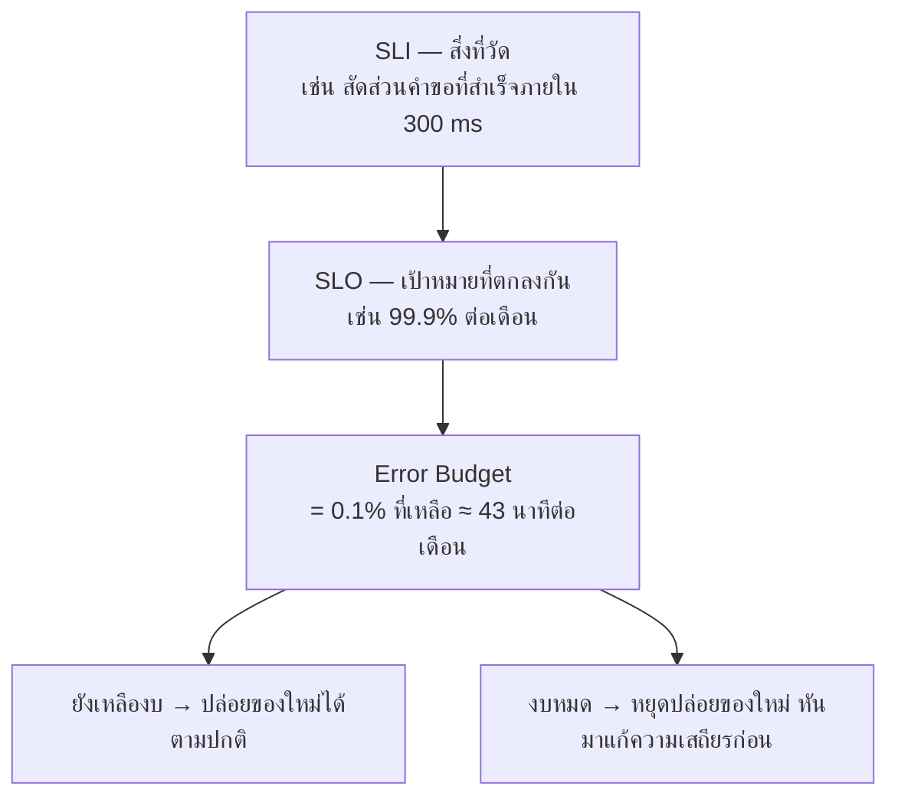

ประโยชน์ที่แท้จริงของ error budget คือ **มันยุติการเถียงกันระหว่างทีมพัฒนากับทีมดูแลระบบ**
ด้วยกติกาที่ตกลงไว้ล่วงหน้า แทนที่จะเถียงกันด้วยความรู้สึกทุกครั้งที่มีเหตุ

### 5.5 ความยืดหยุ่นของ "คน" ก็เป็นส่วนหนึ่งของระบบ

ระบบที่ทนทานแต่ต้องพึ่งคนเดียวที่รู้เรื่องทั้งหมด คือระบบที่เปราะบางที่สุด

| ความเสี่ยงด้านคน | มาตรการ |
|---|---|
| **Bus factor = 1** | หมุนเวียนงาน, เขียน runbook, ทำให้ทุกอย่างที่ทำด้วยมือเป็น script |
| ความรู้อยู่ในหัวคนเดียว | เอกสารที่อยู่ใน repo และถูกใช้จริง ไม่ใช่ wiki ที่ไม่มีใครเปิด |
| on-call ที่ทรมาน | ลด alert ที่ไม่ต้องลงมือทำอะไร, ตั้งเป้าลด alert ทุกไตรมาส |
| กลัวถูกตำหนิเมื่อทำพลาด | postmortem ที่ไม่โทษคน — ถ้าคนกลัว จะไม่มีใครรายงานเหตุตั้งแต่เนิ่น ๆ |

> 💼 **จากหน้างานจริง**
> ทีมที่มีวัฒนธรรมตำหนิคน จะได้เวลารู้ปัญหาช้ากว่าเสมอ
> เพราะคนจะพยายามแก้เงียบ ๆ ก่อนที่ใครจะรู้ ซึ่งเป็นพฤติกรรมที่เข้าใจได้
> แต่ทำให้ latency ของ loop ทั้งองค์กรยาวขึ้น — **ความปลอดภัยทางจิตใจจึงเป็นเรื่องวิศวกรรม**

---

## 6. สี่ด้านนี้ขัดกันเอง — และนั่นคือประเด็น

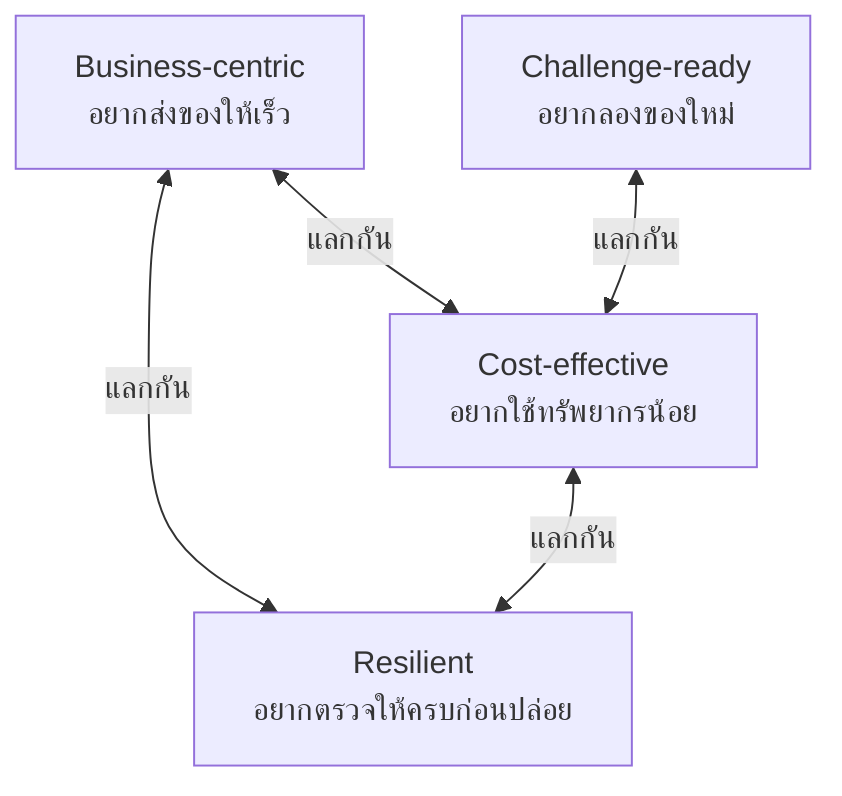

**งานของวิศวกรไม่ใช่การทำให้ทั้งสี่ด้านเต็มร้อย** ซึ่งเป็นไปไม่ได้
แต่คือการ **เลือกจุดสมดุลให้เหมาะกับบริบท และอธิบายเหตุผลของการเลือกนั้นได้**

| สถานการณ์ | ควรเอนไปทางไหน |
|---|---|
| ต้นแบบเพื่อพิสูจน์ไอเดีย ยังไม่มีผู้ใช้จริง | ธุรกิจและความเร็ว — resilience ไว้ทีหลัง |
| ระบบชำระเงินที่มีคนใช้อยู่แล้ว | resilience มาก่อนเสมอ |
| สตาร์ตอัพที่เงินใกล้หมด | ต้นทุนและความเร็ว |
| ระบบภายในที่ใช้ปีละครั้งตอนลงทะเบียน | resilience เฉพาะช่วงพีค, ต้นทุนต่ำในช่วงที่เหลือ |
| โครงการเรียนที่มีเวลา 8 สัปดาห์ | ส่งของให้ครบวงจรก่อน แล้วค่อยเพิ่มความแข็งแรง |

**คำตอบที่ผิดคือการไม่เลือกเลย** — ทีมที่พยายามทำทุกด้านให้ดีที่สุดพร้อมกัน
จะได้ของที่ช้า แพง และยังไม่แข็งแรงจริง

---

## 7. ประเมินตัวเอง

ให้คะแนนตัวเอง 1–5 ในแต่ละข้อ แล้วเลือก **ข้อที่ต่ำที่สุด 2 ข้อ** มาทำงานกับมันในเทอมนี้

**🧗 Challenge-ready**
- [ ] เจอ error ที่ไม่เคยเห็น แล้วหาทางแก้เองได้ก่อนถามคนอื่น
- [ ] เรียนเครื่องมือใหม่จนใช้ทำงานจริงได้ภายในไม่กี่วัน
- [ ] รับโจทย์คลุมเครือแล้วเปลี่ยนเป็นแผนที่ลงมือได้
- [ ] อธิบายพื้นฐานอย่าง HTTP, transaction, index ได้โดยไม่ต้องเปิดดู

**💼 Business-centric**
- [ ] บอกได้ว่าระบบที่ทำอยู่สร้างคุณค่าให้ใคร และวัดอย่างไร
- [ ] จัดลำดับงานโดยอ้างผลกระทบ ไม่ใช่ความชอบส่วนตัว
- [ ] ปฏิเสธหรือเลื่อนงานได้โดยเสนอทางเลือกกลับไป
- [ ] แปลปัญหาทางเทคนิคเป็นผลทางธุรกิจได้

**💰 Cost-effective**
- [ ] ประเมินต้นทุนรวมของทางเลือก ไม่ใช่แค่ต้นทุนตอนเริ่ม
- [ ] เลือกใช้ของสำเร็จแทนการเขียนเอง เมื่อมันคุ้มกว่า
- [ ] รู้ว่าระบบของตัวเองกินทรัพยากรตรงไหนมากที่สุด
- [ ] ไม่เพิ่มความซับซ้อนสำหรับปัญหาที่ยังไม่เกิด

**🛡️ Highly resilient**
- [ ] ทุกการเรียกข้ามเครือข่ายในงานของฉันมี timeout
- [ ] ตอบได้ว่าถ้าส่วนนี้ล่ม ผู้ใช้จะเจออะไร และระบบจะทำอย่างไร
- [ ] มีวิธีย้อนกลับที่เคยทดสอบแล้ว ไม่ใช่แค่เขียนไว้
- [ ] เมื่อมีเหตุ ฉันหาสาเหตุเชิงระบบ ไม่ใช่หาว่าใครทำ

---

## 📚 เอกสารอ้างอิง

**ความน่าเชื่อถือและ resilience**
- Google — *Site Reliability Engineering* (https://sre.google/books/)
- Google SRE — *Embracing Risk* และ *Service Level Objectives*
  (https://sre.google/sre-book/embracing-risk/)
- Principles of Chaos Engineering (https://principlesofchaos.org/)
- Microsoft — *Cloud Design Patterns* รวม Circuit Breaker, Bulkhead, Retry
  (https://learn.microsoft.com/en-us/azure/architecture/patterns/)
- AWS — Well-Architected Framework เสาหลักด้าน Reliability และ Cost Optimization
  (https://aws.amazon.com/architecture/well-architected/)

**ประสิทธิภาพของทีมและการส่งมอบ**
- DORA — *Accelerate State of DevOps Report* (https://dora.dev/)
- Nicole Forsgren, Jez Humble, Gene Kim — *Accelerate: The Science of Lean Software
  and DevOps*
- Matthew Skelton & Manuel Pais — *Team Topologies* (https://teamtopologies.com/)

**คุณค่าทางธุรกิจและการจัดลำดับความสำคัญ**
- Marty Cagan — *Inspired: How to Create Tech Products Customers Love*
- Marty Cagan, Silicon Valley Product Group — *Product vs. IT Mindset*
  ความต่างระหว่างทีมที่วัดผลลัพธ์ กับทีมที่รับคำสั่งมาทำตาม
  (https://www.svpg.com/product-vs-it-mindset/)
- Intercom — *Intercom on Product Management* แนวคิด RICE
  (https://www.intercom.com/blog/rice-simple-prioritization-for-product-managers/)

**ต้นทุนและความซับซ้อน**
- FinOps Foundation — FinOps Framework (https://www.finops.org/framework/)
- Martin Fowler — *TechnicalDebt* (https://martinfowler.com/bliki/TechnicalDebt.html)
- Martin Fowler — *Yagni* (https://martinfowler.com/bliki/Yagni.html)
- Ben Moseley & Peter Marks — *Out of the Tar Pit* ว่าด้วยความซับซ้อนที่หลีกเลี่ยงได้
  (https://curtclifton.net/papers/MoseleyMarks06a.pdf)

**การเรียนรู้และการปรับตัว**
- Google — *re:Work* งานวิจัยเรื่องความปลอดภัยทางจิตใจในทีม
  (https://rework.withgoogle.com/)
- Amy Edmondson — งานวิจัยว่าด้วย psychological safety
  (https://www.hbs.edu/faculty/Pages/profile.aspx?facId=6451)
