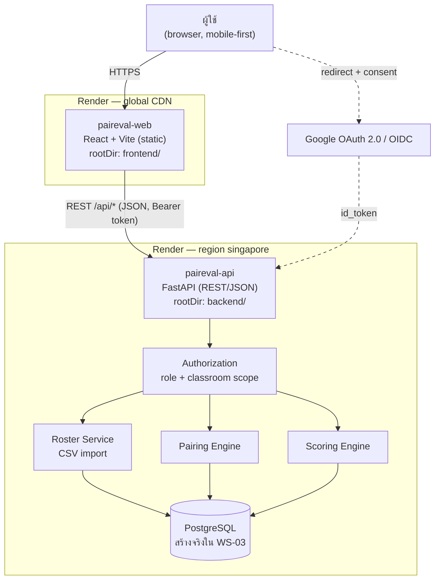

# Architecture — PairEval

> ขอบเขตของเอกสารนี้คือ **M1 Walking Skeleton** ตาม PRD §19
> ส่วนที่ยังไม่ทำใน M1 วาดไว้เป็นเส้นประเพื่อให้เห็นว่าจะต่อตรงไหน

## Component Diagram

## หลักการที่ยึดจาก PRD

| ID | หลักการ | ผลต่อการออกแบบ |
|---|---|---|
| AR-01 | Scoring Engine ต้องเป็น **pure function** ของข้อมูลใน database ไม่มี state ภายใน | คำนวณซ้ำได้ผลเดิมเสมอ · เขียน unit test ได้โดยไม่ต้องมี DB จริง (สำคัญมากใน WS-03) |
| AR-02 | ทุกการอ่านข้อมูลที่ระบุตัวตนผู้ประเมิน ต้องผ่าน authorization layer เดียวกัน | ห้ามให้ route handler ตรวจสิทธิ์เองแบบกระจัดกระจาย |
| AR-03 | Audit log ต้อง append-only และแยก storage จาก operational data | ไม่มี UPDATE/DELETE บนตาราง `audit_event` |
| FR-AUTHZ-01 | ตรวจสิทธิ์ที่ **server เสมอ** ห้ามพึ่ง UI ในการซ่อน | ทุก endpoint ต้องมี test ของ 403 ไม่ใช่แค่ happy path |

## ทำไมแยก frontend กับ backend

| เหตุผล | รายละเอียด |
|---|---|
| ภาษาเหมาะกับงานคนละแบบ | Pairing/Scoring Engine ต้องมี property-based test (NFR-MAINT-02) ซึ่ง Python + Hypothesis ทำได้ดีกว่า TS |
| deploy คนละจังหวะ | แก้ UI ไม่ควรทำให้ API restart — Render กรอง build ตาม `rootDir` ให้อยู่แล้ว |
| ขอบเขตความปลอดภัยชัด | FE เป็น static asset ที่ใครก็โหลดได้ ความลับทั้งหมดอยู่ฝั่ง API เท่านั้น |

## สถานะปัจจุบัน (จบ WS-01)

| Component | สถานะ |
|---|---|
| `paireval-web` | ✅ deploy แล้ว — landing page |
| `paireval-api` | ✅ deploy แล้ว — มีแค่ `GET /api/health` |
| PostgreSQL | ⬜ ยังไม่สร้าง — WS-03 |
| Google OAuth | ⬜ ยังไม่ทำ |
| Pairing / Scoring Engine | ⬜ ยังไม่ทำ |
