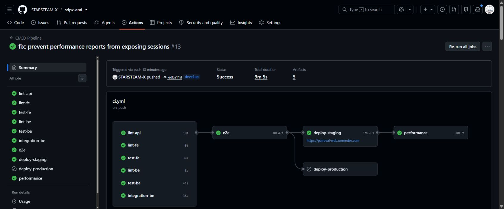
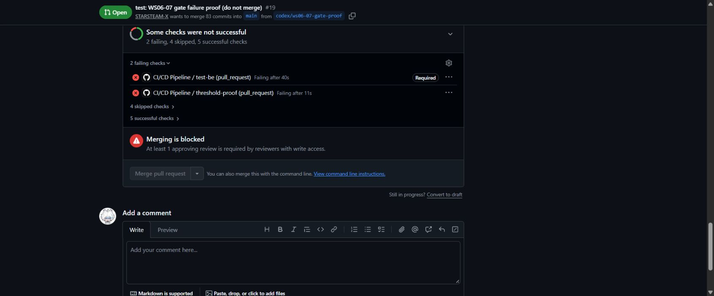

# ชุดส่งและนำเสนอ WS-06 / WS-07 — PairEval

ผลอ้างอิงที่บันทึก: **edba11d, 2026-10-05 08:11:48–08:20:53 Asia/Bangkok**.
CI ผ่านทั้ง 7 test/lint gates, staging deploy และ performance; production skipped ตาม branch policy.
หลักฐานรอบผ่านอยู่ใน commit `89213fb`; สรุปผลล่าสุดแยกจากประวัติในเอกสารที่ลิงก์ด้านล่าง.
**สถานะ LMS: ยังไม่ยืนยันการส่ง** — ยังไม่มีหลักฐาน submission ID หรือใบรับการส่งจาก LMS.

## เปิดหลักฐานตามลำดับนี้

| ใช้แสดง | หลักฐาน |
|---|---|
| CI ที่ผ่านครบ | [Run 37250469594 — edba11d](https://github.com/STARSTEAM-X/sdpx-arai/actions/runs/37250469594) / [ภาพ](screenshots/staging-ci-safe-edba11d.png) |
| Job ที่ช้าที่สุด | [E2E 3m47s](https://github.com/STARSTEAM-X/sdpx-arai/actions/runs/37250469594/job/111577014172); เวลารวม setup/report/teardown |
| Merge ถูกบล็อก | [PR #19](https://github.com/STARSTEAM-X/sdpx-arai/pull/19) / [ภาพ](screenshots/merge-blocked.png); ปิดโดยไม่ merge |
| Threshold fail ทำให้ CI แดง | [รอบแรก 90fe6d9, attempt 1](https://github.com/STARSTEAM-X/sdpx-arai/actions/runs/37247458310/attempts/1); autosave p95 317.95ms, exit 99 |
| ก่อน/หลังของ pipeline | [loop-metrics.md](loop-metrics.md) — ตารางผลอ้างอิงล่าสุดเทียบประวัติ |
| สองรอบ performance | [performance-report.md](performance-report.md) — 317.95→270.40ms; ไม่อ้างว่าเป็นผล optimization |
| Latest journey / smoke / checksums | [journey JSON](../performance/runs/staging-baseline-edba11d.json) / [smoke JSON](../performance/runs/staging-smoke-edba11d.json) / [provenance](../performance/runs/staging-provenance-edba11d.json) |
| เดโม JSON log | [คำสั่งสร้าง log](../scripts/demo/health_log.py) / [log ที่ซ้อมจริงบนเครื่อง](examples/health-log-local-20261005.jsonl) |





ภาพ merge มีทั้ง required test-be ที่แดงและ approval ที่ยังขาด; อธิบาย blocker ทั้งสองอย่าง.
GitHub API ยืนยัน main ต้องมี 1 approval, checks ทั้ง 7, up-to-date branch และ enforce admins.
เปิด [branch settings](https://github.com/STARSTEAM-X/sdpx-arai/settings/branches) และ
[production environment](https://github.com/STARSTEAM-X/sdpx-arai/settings/environments) เพื่อดู gate;
production resources ยังเป็น template แยก workspace ตาม [cicd.md](cicd.md).

## ตรวจรายการส่งตาม lab

| Workshop | Artifact ที่ต้องอยู่ใน GitHub | สถานะเตรียม |
|---|---|---|
| WS-06 | [workflow](../.github/workflows/ci.yml), [ภาพ merge blocked](screenshots/merge-blocked.png), [loop metrics](loop-metrics.md) | มีไฟล์และลิงก์หลักฐาน |
| WS-06 | Successful pipeline run URL สำหรับ LMS | พร้อมคัดลอก; ยังไม่ยืนยันการส่ง |
| WS-07 | [load-test.js](../performance/load-test.js), [baseline.json](../performance/baseline.json), [performance report](performance-report.md) | มีผลรอบแรกและรอบยืนยันแยกกัน |
| WS-07 | [structured logging](../backend/app/observability.py), [request middleware](../backend/app/main.py), job performance ใน workflow | มีหลักฐาน log และ gate ผ่าน/ไม่ผ่าน |

รายการนี้อ้าง [WS-06 lab](../Sources/SDPX-AI-main/WS-06-RUN-cicd/lab.md) และ
[WS-07 lab](../Sources/SDPX-AI-main/WS-07-RUN-perf/lab.md); ส่วนคำถามนำเสนออ้าง present.md ของแต่ละ workshop.

## ข้อความพร้อมคัดลอกลง LMS

```text
PairEval — WS-06 CI/CD และ WS-07 Performance & Observability
Repository: https://github.com/STARSTEAM-X/sdpx-arai/tree/develop
Successful CI: https://github.com/STARSTEAM-X/sdpx-arai/actions/runs/37250469594
Reference commit: edba11daa41bf30d1d9a29b84992773c334a9ef4
Evidence commit: 89213fb
Merge blocked: https://github.com/STARSTEAM-X/sdpx-arai/blob/develop/docs/screenshots/merge-blocked.png
Loop metrics: https://github.com/STARSTEAM-X/sdpx-arai/blob/develop/docs/loop-metrics.md
Performance report: https://github.com/STARSTEAM-X/sdpx-arai/blob/develop/docs/performance-report.md
Latest journey: https://github.com/STARSTEAM-X/sdpx-arai/blob/develop/performance/runs/staging-baseline-edba11d.json

รอบอ้างอิงผ่านทั้ง test gates, staging deploy และ performance: 319 requests, errors 0%,
autosave p95 270.40ms (เกณฑ์ ≤300ms), submit p95 351.71ms (เกณฑ์ ≤800ms).
เก็บรอบแรกที่ autosave 317.95ms ไม่ผ่านไว้เป็นประวัติ; ไม่เปลี่ยน thresholds หรือ optimize handler.
ทดสอบสูงสุด 10 student VUs + 1 instructor; ยังไม่ยืนยัน NFR 200 users หรือความเสถียรหลายรอบ.
```

หลังส่ง LMS ให้เก็บเวลาส่ง, submission ID/ใบรับ และภาพสถานะ submitted ที่เห็นงานตรงชื่อ.
การมีไฟล์ใน GitHub หรือเปิดหน้า LMS ได้อย่างเดียวไม่ยืนยันว่าการส่งเสร็จแล้ว.

## WS-06: เดโม 5 นาที แล้วตอบคำถาม 5 นาที

| เวลา | เปิดอะไร / ประเด็นที่พูด |
|---|---|
| 0:00–1:00 | เปิด successful run: หกด่านแรกขนานกัน → E2E → staging deploy → performance; push main ต้องรอ production reviewer |
| 1:00–2:00 | เปิด E2E job 3m47s ซึ่งนานที่สุด; 118 tests คงเดิม. แผนลดเวลา: วัด cache-hit/build/test แยกก่อนปรับ cache หรือ shard โดยคงทุก test |
| 2:00–3:00 | เปิด main protection และ production environment; 7 required checks, 1 approval และ production ต้อง approve |
| 3:00–4:00 | เปิดภาพ PR #19: health implementation ผิดทำให้ backend 1 failed และ compose exit 1; merge ถูกบล็อก, ปิดโดยไม่ merge |
| 4:00–5:00 | เปิดตาราง loop metrics: unit loop 5.86s บนเครื่อง, pipeline รอบยืนยัน 9m05s รวม deploy/load; manual 690.2s กับ automatic 359.7s เป็นคนละวิธีวัด |

คำตอบสั้นที่เตรียมไว้:

- E2E fail แม้ unit ผ่าน: gate ไม่ผ่านและ deploy ไม่เริ่ม.
- `npm ci`: ใช้ lockfile ให้ environment ตรงกัน; ไม่ปรับ dependency ระหว่าง CI.
- Secrets: อยู่ใน GitHub environment และ Render; อธิบายชื่อ key จาก cicd.md โดยไม่เปิดค่า.
  ถ้าหลุดต้อง revoke/rotate ก่อน แล้วแก้เส้นทางรั่วและทดสอบหลัง deploy.
- `contents: read`: token อ่าน repo เป็นค่าเริ่มต้น; reporters ขอ `checks: write` เฉพาะที่ต้องใช้.
- `concurrency`: แยกกลุ่มตาม workflow/ref และยกเลิกรอบเดิมเมื่อมี commit ใหม่บน ref เดียวกัน.
  ปัจจุบัน `cancel-in-progress: true` ใช้ทั้ง PR และ branch; จึงอาจตัดรอบที่กำลัง deploy ได้ ควรรอรอบนั้นจบก่อน push ซ้อน.
- รอบ candidate push แก้ Docker CI 1 ครั้งหลัง push แรก เพราะ coverage mount EBUSY;
  เก็บการแก้ session export เป็นประวัติอีกเรื่อง ไม่ปนกับจำนวนรอบนั้น.

## WS-07: เดโม 5 นาที แล้วตอบคำถาม 5 นาที

ก่อนเริ่ม เปิด successful run, รอบแดง, performance report และ terminal ไว้.
ใช้ health smoke สำหรับเดโมสดประมาณ 30 วินาที; เปิด CI journey 0→5→10→0 VUs ประกอบ.
Smoke ยิง health อย่างเดียว จึงไม่ใช้ยืนยัน autosave/submit หรือ NFR 200 users.

คำสั่ง PowerShell จาก repo root สำหรับเครื่องนี้ (ใช้ k6 ที่มีอยู่แล้ว):

```powershell
& .local/bin/k6/k6-v2.3.0-windows-amd64/k6.exe run -e BASE_URL=https://paireval-api.onrender.com -e VUS=3 -e DURATION=30s -e P95_MS=500 performance/smoke.js
$LASTEXITCODE
```

เครื่องที่มี `k6` ใน PATH ใช้ `k6 run -e BASE_URL=https://paireval-api.onrender.com performance/smoke.js`.
ถ้า API เพิ่งตื่นหรือเครือข่ายช้า ให้แสดงผลจริงและเทียบกับรอบอ้างอิงโดยระบุตำแหน่ง runner.
Threshold fail คืน exit 99; ไม่ลด threshold เพื่อให้เดโมผ่าน.

ซ้อมจริง 2026-10-05 **08:42:19–08:42:51 Asia/Bangkok** จาก Windows ในไทย:
87 requests, errors 0%, p95 **61.35ms** (ปัดจาก JSON), 2.83 req/s, exit 0.
API/เว็บก่อนและหลังซ้อมตรง edba11d; health smoke ไม่ใช่ journey baseline.
เก็บ [ผลเดโม](../performance/runs/staging-smoke-demo-20261005.json) และ
[provenance](../performance/runs/staging-smoke-demo-provenance-20261005.json) แยกจากผล CI.

JSON log หนึ่งบรรทัดจาก request ผ่าน middleware ของแอปบนเครื่อง:

```powershell
& backend/.venv/Scripts/python.exe scripts/demo/health_log.py
```

ถ้ามี `jq` ใช้ `python scripts/demo/health_log.py | jq '{event,requestId,duration_ms,route,statusCode}'`.
บนเครื่องนี้ใช้ PowerShell ดู field จาก log ที่ซ้อมไว้แทนได้โดยไม่ติดตั้งเพิ่ม:

```powershell
Get-Content docs/examples/health-log-local-20261005.jsonl | ConvertFrom-Json | Select-Object event,requestId,duration_ms,route,statusCode | ConvertTo-Json
```

Log นี้สร้างจริงผ่าน FastAPI TestClient; ไม่เริ่ม DB/daily scheduler และไม่ใช้ staging credentials.
`requestId` ตรง response header, `duration_ms` วัด handler ของ request นี้,
`route` เป็น pattern และ request health มี `user: null`.
ตัวอย่างนี้เป็น log บนเครื่อง; log staging ที่วิเคราะห์อยู่ใน report และไฟล์ aggregate แยก.

| เวลา | ประเด็นที่พูด |
|---|---|
| 0:00–1:00 | รัน smoke ให้เห็น terminal/exit code; p95 คือเวลาที่ 95% ของ requests ไม่เกิน, errors คือสัดส่วน request ล้มเหลว, req/s คือ throughput ของ profile ที่มี think time |
| 1:00–2:00 | เปิดตารางสองรอบ: autosave 317.95ms ไม่ผ่าน → 270.40ms ผ่าน. HTTP รวม p95 337.99→340.15ms; จึงไม่อ้างว่าระบบเร็วขึ้นทุกส่วน |
| 2:00–3:00 | เทียบ hypothesis: staging ช้ากว่า localจริง; scores ไม่ใช่หลักฐาน bottleneck เดียว. Client health median 239.80ms แต่ handler 0.80ms สนับสนุนเวลานอก handler |
| 3:00–4:00 | แสดง JSON log หนึ่งบรรทัด; ชี้ requestId/duration_ms และ formatter redact. ห้ามลบ p95 สอง series แล้วอ้างว่าเป็น network p95 |
| 4:00–5:00 | เปิดรอบแรกที่ exit 99 ทำ CI แดง และรอบผ่าน; แผนต่อไปจับคู่ client/server timings, แยก pool/SQL/commit แล้ววัดซ้ำ profile เดิม |

คำตอบสำคัญ: autosave p95 500ms เกิน PRD ≤300ms แม้ HTTP รวมมีเกณฑ์ <500ms.
AI เสนอเพิ่ม index/pool แต่ยังไม่รับเพราะไม่มี timings ของ SQL/pool ที่ยืนยัน;
sampling CPU 30s ไม่เห็น steady saturation และยังตัด burst สั้น ๆ ไม่ได้.
รอบผ่านแก้ export/session safety ไม่ใช่ handler optimization; NFR 200 users ยังต้องวัดเพิ่ม.

## ตรวจชุดส่งบนเครื่อง — 2026-10-05

- Backend 404 passed / 29 integration deselected ใน 3.19s; frontend 21 passed ใน 0.237s.
  Unit loop ตั้งแต่เริ่มสองคำสั่งจนจบ **5.42s** เมื่อไม่มี lint/typecheck รันพร้อมกัน.
  รอบที่รันพร้อมงานตรวจอื่นใช้ 13.66s; แยกการวัดซ้ำเพื่อไม่ปน resource contention.
- Ruff, deployment/export safety tests 4 tests, frontend lint/typecheck และ OpenAPI lint ผ่าน.
  Frontend lint ยังมี warnings เดิม; OpenAPI ไม่มี error/warning.
- คำสั่ง health-log และ smoke demo รันจริงแล้ว; log JSON parse ได้และ requestId ตรง response header.
- ตรวจลิงก์ไฟล์, checksums ผล CI และตัวกรอง public metrics ก่อน commit.
  ไม่รัน integration/E2E ซ้ำบนเครื่องสำหรับการเกลาเอกสาร; อ้างหลักฐาน Docker CI ตาม run/SHA ที่ระบุ.
